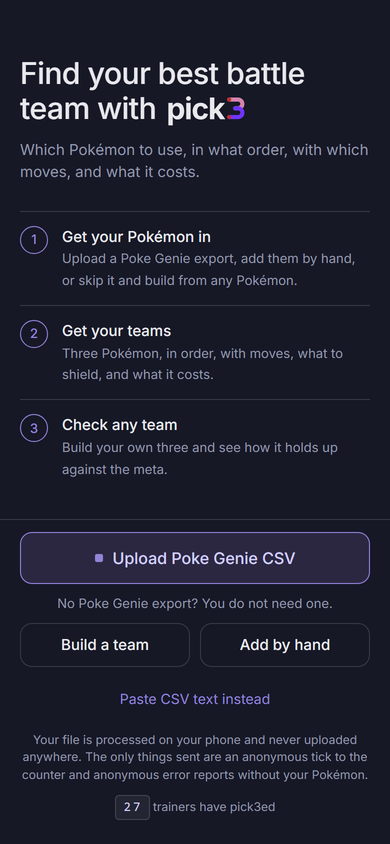
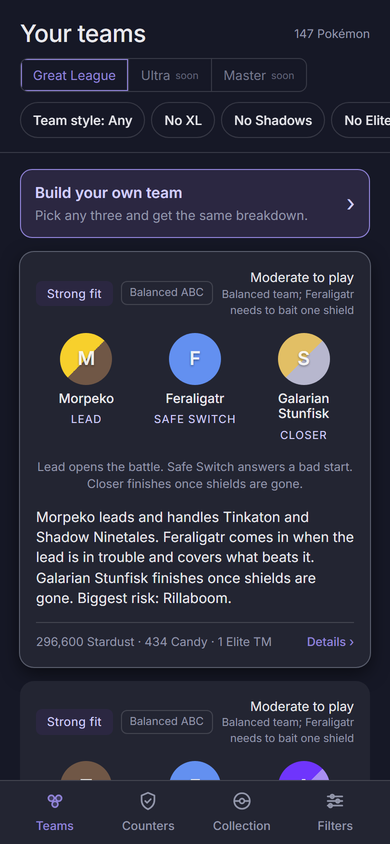
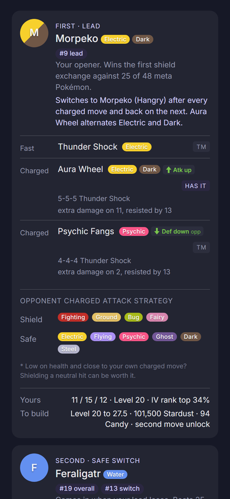
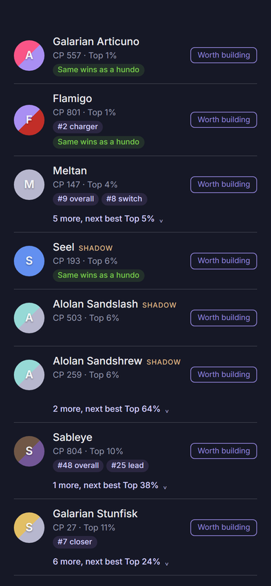
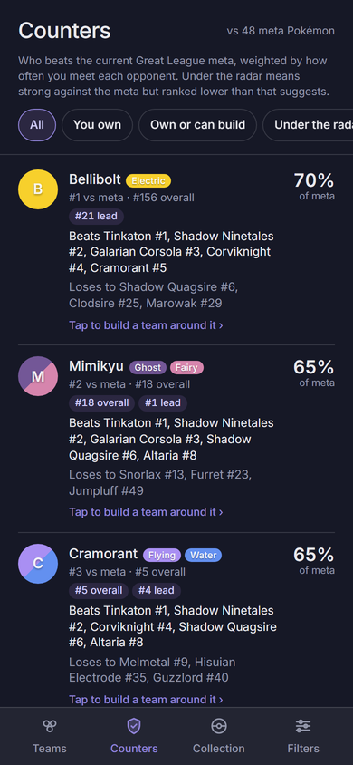
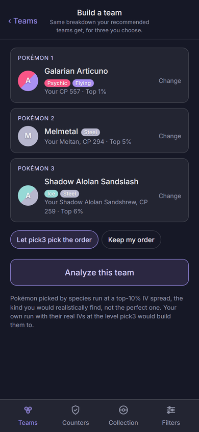

<p align="center"></p>

# pick3

Find your best Pokémon GO battle team. Which Pokémon to use, in what order, with which moves, and
what it costs.

Live at **[pick3.demome.com](https://pick3.demome.com)**. Free, no account, nothing uploaded.

pick3 takes the Pokémon you own and, using [PvPoke](https://github.com/pvpoke/pvpoke)'s game data,
rankings and battle simulator, tells you which three to run for Great League, what order to run
them in, which moves to teach, what to shield, what the build costs in Stardust and Candy, what it
beats, what beats it, and why. Every number is simulated with your actual IVs against the current
meta.

Everything runs in your browser. Your collection is stored on your device and never leaves it.

## Three ways in

|                                   |                                                                                                                                                                              |
| --------------------------------- | ---------------------------------------------------------------------------------------------------------------------------------------------------------------------------- |
| **Add Pokémon by hand**           | Species, the three IV bars from the appraisal screen, and the CP on the card. pick3 works out the level. Three or more and it builds teams.                                  |
| **Build a team from any Pokémon** | Pick any three and get the full breakdown at realistic top-10% IVs. Nothing to enter, nothing to own.                                                                        |
| **Import a Poke Genie export**    | If you have the CSV (a paid Poke Genie feature), upload it and every scan comes in at once. On Android with pick3 installed you can share the file straight from Poke Genie. |

<p align="center">



</p>

## What you get

**Teams.** Ranked trios from your collection, each with a lead, safe switch and closer, a fit
rating, and whether it plays as an ABB line or a balanced ABC. Filters for no XL, no shadows, no
Elite TM, and a Stardust budget.

**Team detail.** For every slot: recommended moves with move counts in the "4-4-3" format, TM and
Elite TM flags, what the move hits for extra damage across the meta, which opponent charged moves
to shield and which are safe, whether the closer wants a shield saved, and the exact Stardust,
Candy and XL Candy to get there. Then a switch plan (what beats your lead and who answers it),
key wins and threats ordered by how often you meet each opponent, alternatives you already own, and
a full matchup grid.

**Collection.** Every Pokémon judged: Great League ready, worth building, wait for better IVs, or
not eligible, with its IV rank and where the species sits in the meta. A "Same wins as a hundo"
pill when a perfect-IV twin would win nothing extra, which is most of the time. Same species fold
together behind your best one.

**Counters.** Every species scored by how much of the current meta it beats, weighted by how often
you actually face each opponent. "Under the radar" surfaces the picks that punish today's meta
without being on anyone's top-ten list. Tap one to build a team around it.

**Build a team.** Hand-pick three, from your collection or any species, and get the same breakdown.
pick3 tries all six orders and tells you which is strongest.

**What to scan first.** A Pokémon GO search string covering the top picks, the counters, and
everything that evolves into one, so you appraise a few hundred instead of thousands.

<p align="center">



</p>

## Privacy

The CSV and anything you add by hand stay in your browser's storage on your device. Two things
leave it, both anonymous: a single tick to the trainer counter the first time you build teams, and
error reports (build id, what failed, the message) that never include your Pokémon and can be
turned off in the Filters sheet. The full log of what the app recorded is on the same sheet with a
Copy button, so a bug report can carry evidence.

## How it works

1. **`packages/data`** pins a PvPoke commit, normalizes its game master and Great League rankings,
   and precomputes a matchup matrix of every ranked species against PvPoke's meta group with the
   vendored simulator (about a minute; 274 KB gzipped). A weekly workflow opens a PR when PvPoke
   moves.
2. **`packages/sim-pvpoke`** vendors PvPoke's battle simulator byte for byte behind a small shim. A
   golden test reproduces PvPoke's published matchup ratings exactly, 600 battles, zero misses.
3. **`packages/engine`** is pure TypeScript with no browser dependency: CSV parsing, species and
   form mapping, eligibility across evolution stages, IV rank against all 4096 spreads, movesets and
   costs, the candidate pool, trio scoring on the matrix (ABB and ABC structures), finalist
   simulation with your exact IVs, the five-factor team score, explanations, verdicts, meta rank,
   counters, hand-built team analysis, and the scan list. A sweep test runs every released species
   through the verdict path and expects zero throws.
4. **`apps/web`** runs the engine in a Web Worker, keeps the collection in IndexedDB, and renders
   the decisions. Installable as a PWA with offline game data, a Web Share Target for the CSV on
   Android, in-app update prompts, and on-device diagnostics.
5. **`workers/counter`** is a Cloudflare Worker with one Durable Object: the trainer counter and the
   anonymous error log.

## Development

```
fnm use 24
npm install
npm run data:build      # once; clones the pinned PvPoke commit and builds apps/web/public/data
npm run dev             # Vite dev server for apps/web
npm test
npm run web:screens     # screenshots every screen at phone size (needs `npx vite preview` in apps/web)
```

Node 24, exact pinned versions everywhere, warnings are errors. See `docs/setup.md`. Game data
comes from PvPoke at the commit pinned in `packages/data/pvpoke.lock.json`. Design spec and plans
live under `docs/superpowers/`.

## License

MIT. PvPoke data and simulator code are used under the MIT license, copyright 2019 pvpoke. See
`packages/sim-pvpoke/LICENSE-pvpoke`.

pick3 is not affiliated with Niantic, Nintendo, The Pokémon Company, Poke Genie, or PvPoke.
