# Audit: achievements

A new page and its announcements. Spec:
`docs/superpowers/specs/2026-10-07-achievements-design.md`. Plan:
`docs/superpowers/plans/2026-10-07-achievements.md`. Mockups: branch `mock/achievements` (four
rounds, last commit 07b4080, approved in chat, never merged). Branch `achievements`.

The page (`#/achievements`): a sub header (Back, Share); the progress card ("Earned N / 11", its
bar, the shiny count and the nudge line); Your Kanto dex (151 slots in dex order, earned ones as
the reward's sprite on its type disc, a sparkle on a shiny, the rest as silhouettes); the tier
groups (Easy, Mid, Hard, Elite), earned rows with the Pokémon and the date, locked rows with a "?"
token, the how-to line and the progress count with its bar; the closing line.

The announcements: the earn toast (one new achievement: its Pokémon, "See it" and "Not now") and
the welcome reveal (several at once: a sheet with the rolled Pokémon in a three column grid and
"See your achievements"). The ways in: a row on the Settings hub between Community and
Appearance, a button at the top of Your battles with the nudge, and an Achievements card on the
Meta landing after Your meta.

## Screenshots

Dark and light at 390px, from the 2026-10-07 `npm run web:audit` run on the branch at `81468d9`
plus the capture script of this record's commit, converted to WebP (600px wide, quality 72). All
numbers come from the synthetic sample collection, the synthetic sample battle log and the
synthetic community fixture. Each earn rolls its Pokémon at random, so the Pokémon (and which one
is shiny) differ from run to run; the achievements earned do not.

| State | Dark | Light |
| --- | --- | --- |
| `25-achievements`: the page, full length. 5 of 11 earned (Trainer, First battle, Full set, Team builder, Meta player), none shiny this run; Cup runner, Ten days, Your meta, Back again, Still reading and Three-peat locked with their progress | 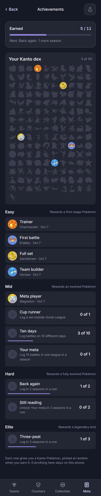 | 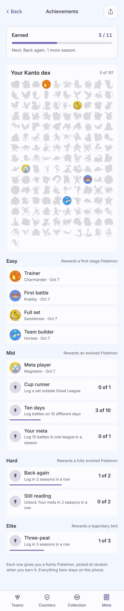 |
| `25b-achievements-toast`: First battle earned again on load ("First battle. You got Krabby." in light; each theme reloads and rolls again) with See it and Not now, at the foot above the tab bar, over Your battles | 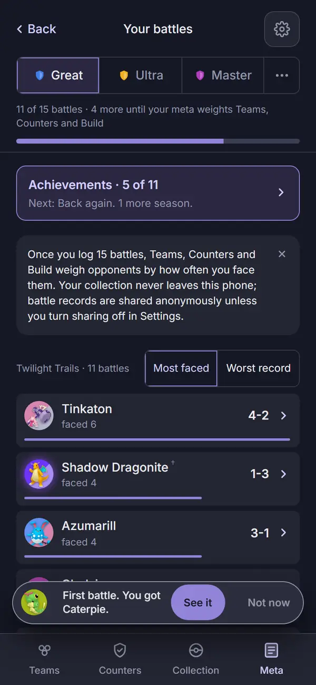 | 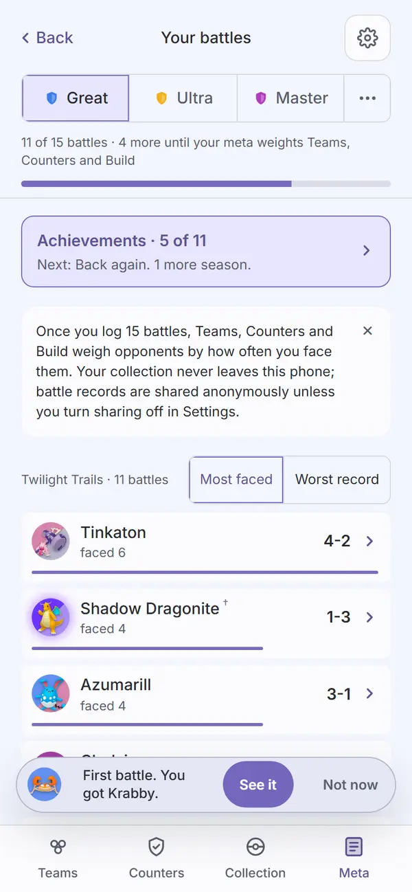 |
| `25c-achievements-reveal`: nothing earned yet over an existing log: "You have earned 5 already", "Your battle log counts from the start. Each one gave you a Kanto Pokémon.", five Pokémon (one shiny) with their achievement names, See your achievements | 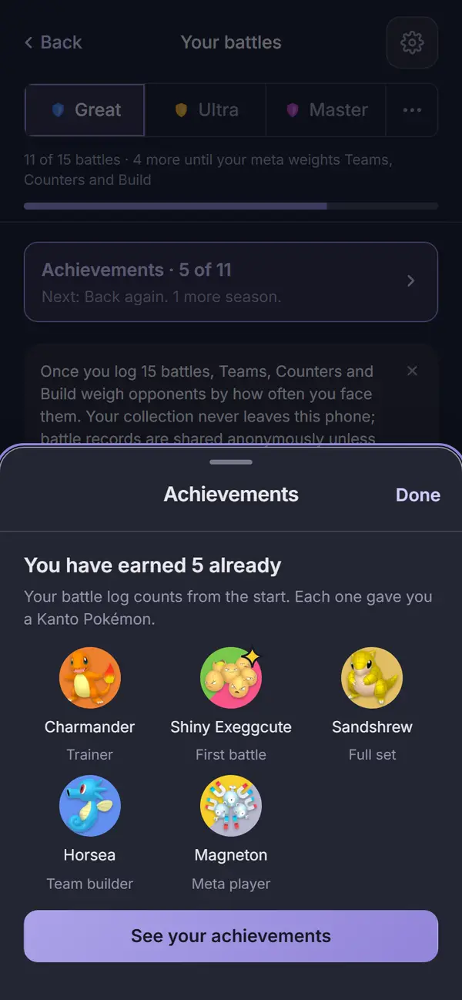 | 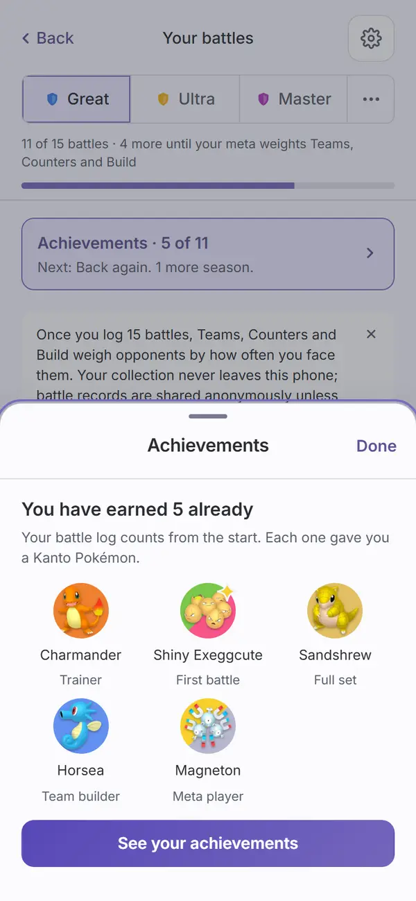 |
| `meta-home-log` (way in): the Achievements card after Your meta, with the count, the last sprites earned, the nudge and See your achievements | 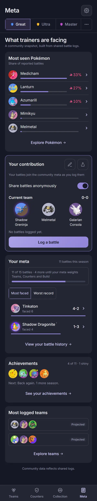 | 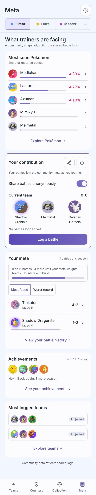 |
| `your-battles` (way in): "Achievements · 4 of 11" with the nudge, at the top of the page | 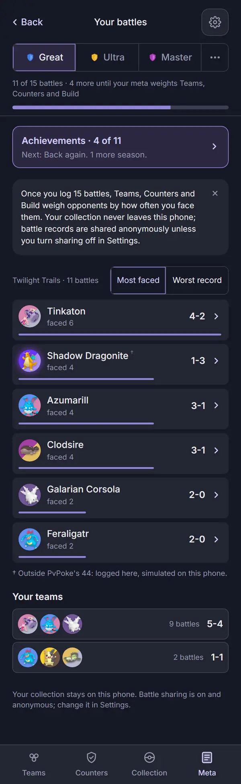 | 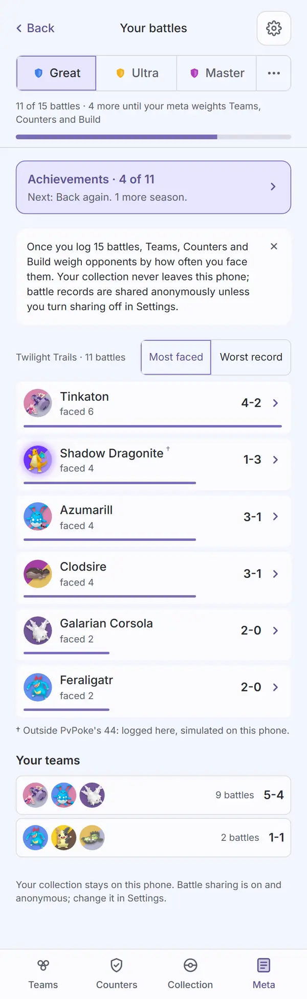 |
| `settings-hub` (way in): the Achievements row with its star glyph and count | 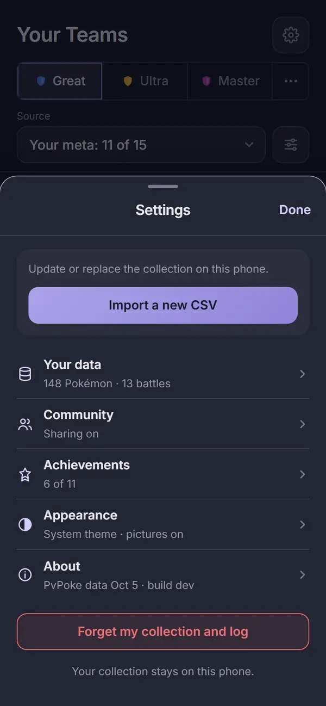 | 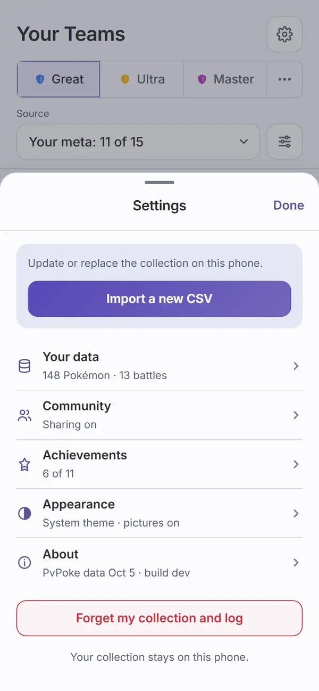 |

`npm run web:screens` also writes `25-achievements-light.png`, the page in the light theme
without an audit run, as it does `07-teams-light.png`.

Not captured, covered by tests (`achievementsScreen.test.tsx`, `achievementPieces.test.tsx`,
`achievementsProvider.test.tsx`, `shareImage.test.ts`): sprites off (numbered blanks in the dex,
the type-colored token on earned rows); the nudge toast after a set closes (the capture run meets
it after Take to battle and closes it); a toast opening the page scrolled to its row; "N new
achievements" after an update; the share image, with sprites on and off.

How the run meets them: the sample import earns several at once from its log (the reveal) and
then Trainer from its collection (a toast); Take to battle closes the running set (the nudge);
the 15 battle step earns Your meta; the first Analyze earns Team builder. The capture script
closes each where it arrives and checks every other capture has none on it, so the captures of
other screens look as they did before achievements. The two announcement captures are made by
rewriting the stored record and reloading: everything cleared for the reveal, First battle taken
out for the toast (once per theme, since the toast clears itself after eight seconds).

## Automated checks

- [x] `npm run web:audit`: exit 0. Zero findings on every enforced screen in both themes, the 3
      new ones included (`25-achievements`, `25b-achievements-toast`, `25c-achievements-reveal`)
      and the enforced screens that now carry a way in (`meta-home-first`, `meta-home-log`,
      `meta-home-active`, `meta-home-error`, `your-battles`, `your-battles-active`,
      `settings-hub`, `settings-hub-no-collection`). 107 findings remain on screens not yet
      redesigned, none failing; no NEVER line.
- [x] no console errors: neither the `web:screens` nor the `web:audit` run printed a "Browser
      errors" section.
- [x] `npm run lint`, `npm run typecheck`, `npm run check-tokens`, `npm run check-colors`: all
      exit 0. The new colors are tokens (`--silhouette`, `--silhouette-opacity`), no new literal.
- [x] `npm test`: 193 files, 1963 tests pass (1 skipped).

## Aesthetics

- [ ] colors from tokens, in their roles (violet interaction, pink measured with its mark,
      outcome colors, red only for destroying data)
- [ ] at most four text levels, one page title
- [ ] one filled primary button
- [ ] chips tapped, tags read
- [ ] the right header variant
- [ ] rows align; gutters and the 8px base hold
- [ ] sprites unchanged
- [ ] at most one line of text before the first result
- [ ] light as readable as dark

## Functionality

- [ ] every item of the spec's Screens section, item by item: the page top to bottom, the four
      ways in, the toast, the welcome reveal, the nudge, the share image
- [ ] every control does what its label says
- [ ] back returns to the origin with filters and scroll
- [ ] input layout rule (no input on these screens)
- [ ] icon buttons named; focus visible
- [ ] product rules: everything stays on the phone (no achievement data in the community
      records), `connect-src` unchanged, sharing copy accurate
- [ ] tests cover the new behavior

## Findings and fixes

| Finding | Fix | Commit |
| --- | --- | --- |
| `web:audit`: "Pokemon" without the accent on the page (the tier lines, the closing line), the reveal and the how-to line under Trainer. | The copy reads Pokémon, as on every other screen. | `81468d9` |
| `web:audit`, first run: a reveal shot over the Achievements page failed "the marked overhang token-shiny-badge lies over" the reveal's text. The badge was a shiny dex slot on the page under the sheet, where the roll happened to put it, not anything in the sheet. | Both announcements are captured over Your battles, where a player logging battles meets them and which shows no reward token, so the capture no longer depends on the roll. The audit is unchanged. A forced all-shiny run (every roll shiny) of the Meta landing, Your battles and the page audited clean in both themes. | this record's commit |

## New parts

As the spec's New parts lists, and nothing else:

- Tokens in `tokens.css`, dark and light: `--silhouette` and `--silhouette-opacity`; a silhouette
  is a CSS mask of the sprite filled with `--silhouette`.
- The shiny sparkle, badged top right of a token like the Mega badge, in `--type-electric`.
- The `.ach-dex` grid (10 columns of 28px tokens) and the "?" blank token (`.ach-blank`).
- A star glyph for the Settings row.
- A token slot in the notice toast (`.ach-toast-token`).

## Notes for the review (choices made, not in the mocks)

- **The announcements are shot over Your battles, not the Achievements page** as in the mocks.
  See Findings.
- **The run's page shows 5 of 11, not the mocks' 9 of 11.** The synthetic log covers a few days
  in one season, and Your meta, earned at the 15 battle step, does not come back once the script
  puts those battles back and clears the record for the reveal.
- **The toast's line wraps to two lines** at 390px with See it and Not now beside it, as in the
  mock.

## Sign-off

- [ ] Travis, <date>
