# Audit: Team Analysis

Piece: 2 (last page). Inventory entry: `docs/design/inventory/2026-09-22-inventory.md`, "Page 3
of 10: Team Analysis". Intake entry: `docs/design/inventory/2026-09-23-design-intake.md`, "Page 3:
Team Analysis, first pass (progressive disclosure)" and the "Decision (Travis, 2026-09-23)" and
"Headline score (Travis, 2026-09-23)" under it (score.battle as the headline, not score.total).

A note on sprites: this worktree's game data was built with `PICKTHREE_SKIP_SPRITES=1` (no network
access to PokeAPI during this task), so every capture below shows the type-colored token-letter
fallback instead of a sprite, exactly as on the Teams and Build records. That is a real, shipped
state (Settings > Pokémon pictures off, or a sprite that fails to load), and it is the worst case
for contrast: single letters on Steel-gray Melmetal, split-color Corsola, Tinkaton and Galarian
Stunfisk, and the Shadow-marked Greninja disc. The live site at pick3.gg builds with sprites and
shows those instead; nothing on this branch touched sprite rendering itself.

## Screenshots

Dark and light at 390px, one pair per state, converted to WebP (600px wide, quality 72) the same
way the Teams and Build images were, from `apps/web/screenshots/<name>-{dark,light}.png` (fresh
`npm run web:audit` run, 2026-09-25, at commit `4cf5108`, the final review's fix wave). The four
full-page pairs changed in that wave and were re-converted; `analysis-confirm` and
`analysis-not-found` re-converted byte for byte identical to the earlier images. `03-team-detail`,
`14-custom-team`, `14b-custom-unranked` and `14c-shared-team` are full-page shots
(`captureBeyondViewport: false`, the same rule Teams and Build use so the fixed tab bar lands at
the true bottom); `analysis-confirm` and `analysis-not-found` are viewport shots (a sheet over the
score card; a short Empty state).

| State | Dark | Light |
| --- | --- | --- |
| `03-team-detail`: a recommended team (no rating card), battle score 88 "Strong fit," battle plan, matchups ("Key win" and "Key threat"), the three "Pokémon details" rows with the lead expanded and its "+1 more" text button, Team structure tiles, the score breakdown, Alternatives, Assumptions open with the matchup grid (full page) | 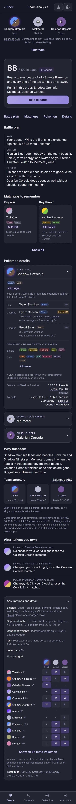 | 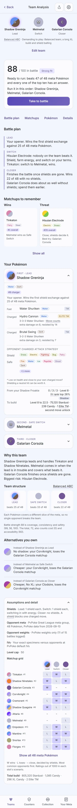 |
| `14-custom-team`: a hand-built team of species you don't own, rating card with the hypothetical-IV note, the best-recommended-team note, the chosen-moves note and "Run it in this order" once (full page) | 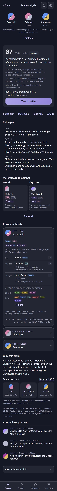 | 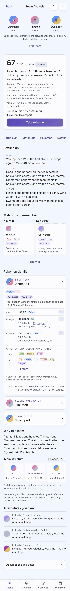 |
| `14b-custom-unranked`: a custom team led by Magikarp, the PvPoke-unranked note ("PvPoke does not rank Magikarp in Great League...") added to the same rating card (full page) | 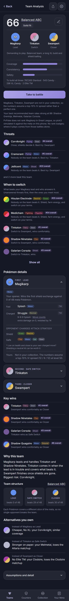 | 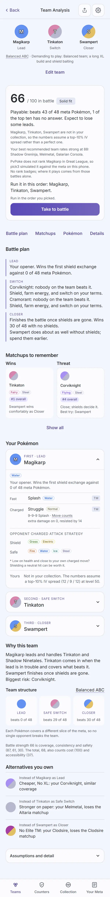 |
| `14c-shared-team`: a team opened from a link, "Shared team link. IVs assumed for Azumarill, Tinkaton; the rest are yours." (full page) | 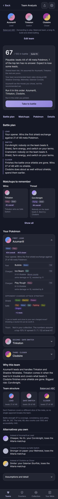 | 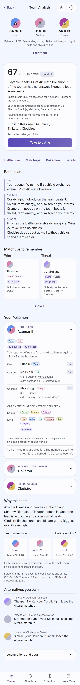 |
| `analysis-confirm`: Take to battle while Feraligatr, Morpeko, Galarian Stunfisk (3 logged) is running; the `ConfirmSheet` "Switch teams?" over the score card, Keep it and Switch | 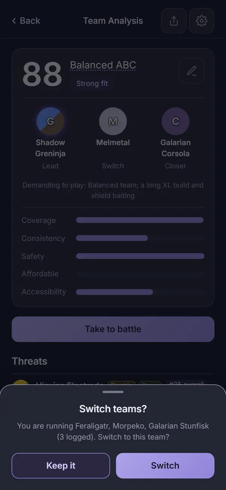 | 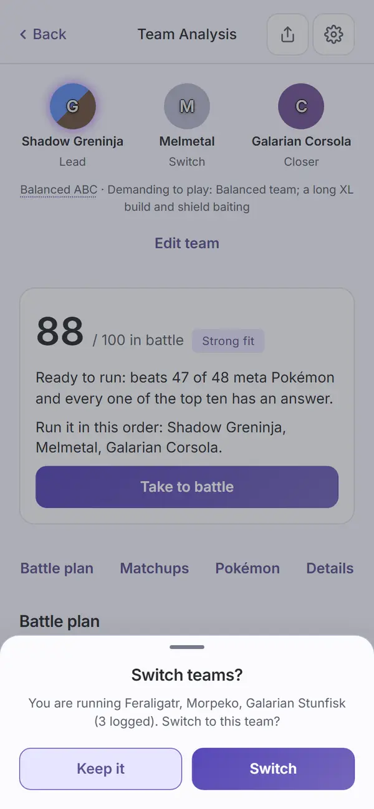 |
| `analysis-not-found`: "This team is not in the current results. Filters may have changed." with a "Back to teams" button | 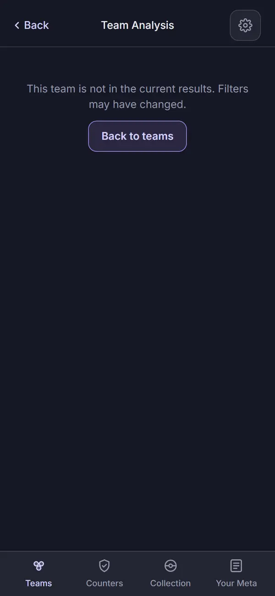 | 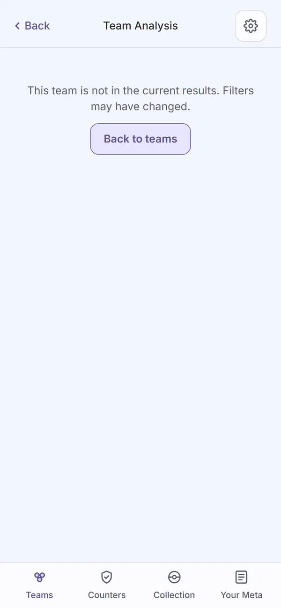 |

Not captured: the "No hand-built team yet" flavor of not-found (same `Empty` component, a
different first line and button, both string-driven, not a layout difference); the ABB line team
structure (this branch's fixtures and the two enforced custom teams all land as Balanced ABC; the
ABB block is unchanged markup carried over from before this task, per Task 3's report); the
strip tap's landing (not a picture, a measured browser check: `web:audit` taps the second strip
member from the top of the page and requires `#pokemon-1` to land 0 to 24px under the header and
open, see Automated checks; `teamDetail.test.tsx` checks which rows open); the Loading state
(shared `Loading`, via `Progress`) and the recommendation error with Try again, which a reload or
a pasted `#/teams/<id>` passes through while pick3 runs the recommendation: covered by
`teamDetail.test.tsx` (Loading then the team, never the not-found line; a failed run shows the
error once with Try again) and by `web:audit`'s real-reload check, but not captured, since the
state lasts only as long as the run; the "pick3 tried all six orders" line, which appears only
after Build's Find best order (every captured custom team was analyzed in the order picked).

## Automated checks

- [x] `npm run web:audit` clean for this page's screens (listed in `AUDIT_ENFORCED`), re-run
      2026-09-25 against `4cf5108` (the final review's fix wave): exit 0. Zero findings on all six
      enforced Team Analysis screens (`03-team-detail`, `14-custom-team`, `14b-custom-unranked`,
      `14c-shared-team`, `analysis-confirm`, `analysis-not-found`), in both themes. 838 findings
      remain on screens not yet redesigned (the same count as before the wave), none failing the
      run.
- [x] the run's own guards, all passed in this run:
  - `assertTitleCentred('team analysis')` holds on the Team Analysis header;
  - every jump button (Battle plan, Matchups, Pokémon, Details) lands its section's heading 0 to
    24px under the sticky header, starting from more than 24px under it, measured after waiting
    for the smooth scroll (or the instant jump under reduced motion) to stop moving (Task 5's
    Minor 1 fix; the run emulates `prefers-reduced-motion: reduce`, so it exercises the instant
    path); this run: 8.0, 8.1, 7.6 and 7.7px;
  - a tap on the second strip member, from the top of the page, lands `#pokemon-1` 0 to 24px
    under the sticky header (from 2028px below it to 7.9px under it in this run) and opens it
    (`aria-expanded="true"`); against the old markup, with no scroll margin on the row, the same
    check failed at -0.1px, under the header (final review I1);
  - a real `page.reload()` of the recommended team's analysis renders the score card, not the
    not-found state; against the old screen it failed with "This team is not in the current
    results" (final review I2);
  - `analysis-confirm` throws if `.ui-confirm` never opens; Keep it leaves the running set alone
    and the analysis open, Switch closes it and lands on Log a battle's `.team-strip` (Task 4's
    behavior, Task 5's capture);
  - the shared-link step throws "shared team failed: <reason>" on a real failure (waits for
    `.custom-note, .ui-error, .scroll .error` and reads `.ui-error, .scroll .error`, Task 5's I4
    fix) rather than a silent 120s timeout;
  - `analysis-not-found`'s `.ui-empty` includes "not in the current results" (Task 5's Minor 2
    fix), not just any `Empty`;
  - the "+N more" toggle, found by its text among the `.safe-types` buttons, is topmost at both
    its top and bottom edges by `elementFromPoint`, and the Safe chips end at or above its top
    (Task 5's I2 fix: the toggle left the chip flow).
- [x] no console errors: the run printed no "Browser errors" section.
- [x] `npm run lint`, `npm run typecheck`, `npm test`, `npm run check-colors`, `npm run
      check-tokens`, all run 2026-09-25 at `4cf5108`: lint exit 0; typecheck exit 0 across all
      seven workspaces; `npm test` 133 files, 1,173 tests passed; `check-colors` exit 0 (baseline
      untouched); `check-tokens`: ok.
- [x] `npm run ui:audit` re-run 2026-09-25 at `4cf5108`: exit 0, "gallery audit: clean in dark
      and light", its three self-checks passing (they exit 1 on failure). `npm run meta:screens`:
      not re-run; nothing under `packages/ui` or `apps/meta` changed in the fix wave (`Button`'s
      `ariaExpanded` prop, the one `packages/ui` change on this branch, predates Task 5's passing
      `meta:screens` run).

## Aesthetics

- [x] colors from tokens, in their roles (violet interaction, pink measured with its mark, outcome
      colors, red only for destroying data): `check-colors` is clean and `web:audit` finds zero
      contrast findings on the six enforced screens in either theme. Task 5's source fixes
      (`.strategy-note`, `.ogrid-rank` to `--muted`; `.ogrid .cell.w` to `--text`) and the
      sprite-less token-letter pair (`--token-letter`/`--token-halo`, carried over from Teams and
      Build) hold on every disc shown, including Melmetal's single-type steel disc, Galarian
      Corsola's and Clodsire's split discs, and the Shadow-marked Greninja disc in `03-team-detail`.
      No pink appears: Team Analysis has no measured community data of its own, only PvPoke-ranked
      and your-collection numbers. Those two checks cannot see roles, so by eye (final review M7):
      violet marks what you tap (Edit team, the jump row, Show all, "+N more", Take to battle, the
      Term underlines, the header buttons). The fix wave took violet off three read-only things
      new or moved on this page: the battle plan's rail is `--divider`, its step titles
      (Lead, Switch, Closer) `--muted`, and the keep-shield line plain `--text`. Three read-only
      violet uses remain, all carried over unchanged from before this branch and named here for
      Travis as precedent rather than fixed: the rank tags (`.mtag`, "#1 overall," "#9 charger"),
      the role eyebrow (`.role`, "FIRST · LEAD," the Team structure tiles; signed Build uses the
      same violet eyebrow), and the matchup grid's win cells (`.cell.w`, `--accent-tint2`).
      Moving the first two reaches other pages (the rank tags also render on Collection,
      Counters, Specimen and Add Pokémon; `.role` on Teams' open rows and Specimen), so each is
      an app-wide call. The win cells are this page's own (the Assumptions grid is their only
      user), left as they were because the fix wave had no ruling on them; recoloring them to an
      outcome color is a one-rule change if Travis wants it.
- [x] at most four text levels, one page title, **with one display exception for Travis to
      accept or refuse, and the 12px `.meta` size deferred (see Open items)**: one "Team
      Analysis" title in every capture (`Header variant="sub"`, 15px/500). The levels, by size,
      as the CSS sets them and the captures show them:
  - heads: section heads ("Battle plan," "Matchups to remember," "Pokémon details," "Why this
    team," "Alternatives you own") at `--fs-section` (17px)/600, the size Build's sections use;
    a Pokémon row's name (`.pd-summary-name`) is the same `--fs-section` at 500;
  - body at `--fs-body` (15px): the battle-plan lines, the score card's sentences, the Why this
    team paragraph; sub-headings inside a section ("Key win"/"Key threat," "Key wins"/"Key
    threats," "When to switch," "Team structure") are the same 15px at 600
    (`h4.analysis-sub`), a weight step, not a size step. Three carried 14px texts sit just under
    it: the move names (`.move-name`), Alternatives' main lines and the "Assumptions and detail"
    head, the same shared markup as before this branch;
  - supporting text at two sizes that sit side by side: 13px (`.small`: a row's role job, the
    keep-shield line, the empty lines such as "No other Pokémon in your collection fits these
    slots yet"; `.assump-body`: the Assumptions lines) and 12px (`.meta`: the score card's
    notes, the strip's supporting line, the score breakdown, Alternatives' "Instead of" lines,
    the grid legend; also the move counts and reads, `.move-sub`, the move kind, the fit tag and
    "Opponent charged attack strategy"). That 12/13px pair is the class Build's final review
    raised as M10; it is not fixed page by page, and it is carried to Open items in Build's own
    words;
  - labels at 11px (`--fs-label` or a literal 11px): the plan step titles, the role eyebrows,
    the type chips, the rank tags, and the shield note under the Safe types ("* Low on health
    and close to your own charged move? ...").
      So the page reads as four levels (heads, body, supporting, labels), but the sizes are
      more than four: 17, 15, 14, 13, 12 and 11px, the 14/13/12px spread being carried shared
      markup that the app-wide `.meta` pass should settle. The exception: the battle score
      itself, "88" in `03-team-detail`, is 40px/700 (`.score-num`), the page's one display
      number, bigger than any heading on purpose because it is the headline Travis asked for
      (score.battle, 2026-09-23). It is a level the four-level rule does not allow, named here for
      Travis to keep or cut the way Build's 19px card name was.
- [x] one filled primary button: every capture shows exactly one `Button variant="primary"`
      ("Take to battle") inside the score card, whether the team is recommended (`03-team-detail`)
      or custom (`14-custom-team`, `14b-custom-unranked`, `14c-shared-team`); `analysis-confirm`
      adds the sheet's own primary ("Switch") and secondary ("Keep it"), a `ConfirmSheet` pattern
      already audited elsewhere, not a second page-level primary. `analysis-not-found`'s "Back to
      teams" is an outlined button, not filled.
- [x] chips tapped, tags read: type chips, meta-rank tags, the "TM"/"Elite TM" badges, the fit
      tag and the Term-underlined words (Elite TM, XL Candy, IV rank, Move counts, ABB line,
      Balanced ABC) are read-only labels or definition popovers, never a pressable filter, and
      nothing on the page is a chip you tap. "+N more" among the Safe types used to be a bare
      button wrapping the rank-tag pill (`.mtag`), so a control looked exactly like "#9 charger"
      (final review I3). It is now the ui `Button`, variant text, with `aria-expanded` and the
      labels "+N more" / "Show fewer", the same control as Matchups' "Show all": violet
      15px/600 text, no pill, on its own line under the chips with its full 44px height
      (`03-team-detail`, `14-custom-team`, `14c-shared-team`: "+1 more" under the Safe chips).
- [x] the right header variant: every capture uses `Header variant="sub"`, Back on the left,
      Share (`ShareGlyph`, only when a team exists) and Settings `IconButton`s on the right, as on
      Build; `assertTitleCentred` confirms the title stays centred after Task 4's `.hdr-actions`
      inheritance from Build's own fix.
- [x] rows align; gutters and the 8px base hold: the strip, the score card, the jump row, every
      section head and each `ExpandRow` share the 20px gutter and the `--divider`/`--r-card`
      pattern carried over from Teams and Build. Task 5's fix gives an open Pokémon row's body 12px
      of top padding so its type chips no longer touch the row's own divider (visible in
      `03-team-detail`'s open Shadow Greninja row). The Assumptions card now has the same
      `--divider` border and `--r-card` radius as the `ExpandRow`s above it (Task 5), so it reads
      as one more card in the stack rather than a flush block.
- [ ] sprites unchanged: cannot confirm from these captures, for the same reason as the Teams and
      Build records: this worktree has no sprite build (`PICKTHREE_SKIP_SPRITES=1`), so every
      Pokémon here is a lettered token disc, never a sprite image. The fallback renders correctly:
      Task 5's `.token-wrap { display: inline-flex; flex: none }` fix (this branch's one change
      that reaches the token wrapper itself, not just its colors) removes a 3.5px vertical
      misalignment between a Shadow disc and its plain neighbours, checked by eye against the
      signed Teams and Build captures (matching page heights, per Task 5's report) and by
      `shadowToken.test.tsx`'s 23 cases (3 + 2 + 18: the audit marker and the wrapper box, the glow
      layers, 18 types x contrast). No CSS or component that draws a sprite changed on this branch.
- [x] at most one line of text before the first result: under the strip, one line (structure `Term`
      + "Demanding to play: why") sits above "Edit team," then the score card is the first result.
      "Battle plan," "Matchups to remember" and "Pokémon details" each open directly on their
      content (the collapsed Key win/Key threat pair; the first `ExpandRow`), with no extra
      sentence above it. `analysis-not-found` has exactly the one line the state needs.
- [x] light as readable as dark: every state above is a matched dark/light pair; `web:audit`'s
      per-theme contrast pass is clean on all six in both themes; the `ConfirmSheet` and `Empty`
      states read the same way in both (checked by eye in `analysis-confirm` and
      `analysis-not-found`).

## Functionality

- [x] every "must keep" from the inventory entry, item by item:
  - Per-Pokemon detail (role and order, types, meta rank tags, form notes, moves with counts and
    extra-damage/resisted reads, TM/Elite TM badges, shield and safe types, keep-shield advice,
    your IVs, level, IV rank, cost to build): all present in `03-team-detail`'s open Shadow
    Greninja row and reachable on the other two rows.
  - Custom team rating card (fit and battle score, why, comparison with the best recommended team,
    the order result, chosen moves, assumed IVs, the PvPoke-unranked note): between them
    `14-custom-team`, `14b-custom-unranked` and `14c-shared-team` show every note but one, in the
    order `ScoreCard.tsx` composes them (Task 2's report); `14-custom-team` has no unranked note
    and `14b-custom-unranked` no chosen-moves note. The one not captured is the orders-tried
    line ("pick3 tried all six orders. Best: ... Weakest: ..."), which appears only after Build's
    Find best order; the ScoreCard test covers it, and (Ruling 3, as changed) a card with only
    the picked order tried says the order once, in "Run it in this order: ..."
  - Two team shapes (Balanced ABC tiles, ABB line panel): `WhyThisTeam.tsx` renders both branches
    unchanged from today's markup (Task 3); every capture here happens to land on Balanced ABC,
    since none of the enforced teams' fixtures produce an ABB line.
  - When to switch, Key wins, Key threats, Why this team plus the score breakdown, Alternatives you
    own: all present, folded into "Matchups to remember" (collapsed pair plus "Show all") and "Why
    this team" (Task 3's `Matchups`/`WhyThisTeam` components), matching the intake's locked-in
    split.
  - The Assumptions block (product rule: every result carries its assumptions): open in
    `03-team-detail`, showing Shields, Opponent meta, Opponent weights, IVs, Level cap, the
    matchup grid and "Show all 46 meta Pokémon," and the Total build line.
  - Share sends species and moves only: unchanged `ShareGlyph`/share logic (Task 4); no CSP or
    payload change on this branch.
- [x] every control does what its label says: the strip opens a row and scrolls to it without
      closing another (`teamDetail.test.tsx`'s strip test, five assertions: row 2 opens, row 1 and
      3 keep their state, `scrollIntoView` ran on `#pokemon-1`, a second tap keeps it open; and
      the browser check above, which measures the opened row landing 7.9px under the header);
      "+N more" / "Show fewer" opens one row's Safe list only (`analysisComponents.test.tsx`); the
      jump row scrolls its own section under the header (the browser check above); "Show all"
      expands Matchups' full lists and toggles its own `aria-expanded` without affecting the other
      sections; "Edit team" loads the three picks into Build (`teamDetail.test.tsx`'s "Edit team
      loads the three into Build"); Take to battle starts, joins or asks to switch a set correctly
      in all three cases (Task 4's tests 6-8, plus the same-team-running case Task 4's fix round
      added).
- [x] back returns to the origin with filters and scroll, for Team Analysis: `back(fallback)`
      with Teams as the fallback for a recommended team or a team-link analysis, Build for a
      hand-built one (Ruling 2), landing on real history when something sits behind the screen. A
      team link's own landing entry now replaces itself (`navigate(route, { replace: true })` via
      `history.ts`'s `replaceEntry`) instead of staying in history, which closed the back-gesture
      loop through `#/t/...` that Task 4's first pass introduced and its fix round removed at the
      root. `teamDetail.test.tsx`'s main block (seventeen cases after the fix wave) plus the
      "Team Analysis from a team link" describe block (three cases: the landing replaces itself
      and stays first, Back lands on Teams, Edit team then Analyze again lets Back return to
      Build) and `history.test.ts`'s `replaceEntry` case all cover it.
- [ ] input layout rule: not applicable. Team Analysis has no text input.
- [x] icon buttons named; focus visible: Share carries the label "Share this team," Settings
      "Settings" (the `IconButton`s in `TeamDetail.tsx`'s own header); the jump row is a `nav`
      labeled "Jump to" with four named text `Button`s; the strip members and the "+N more"
      toggle are named buttons, not bare icons; the shared `Button`/`IconButton` focus-visible
      outline is the one audited on other pages (gallery record), unchanged here.
- [x] product rules: assumptions shown (the Assumptions block; the rating card's hypothetical-IV,
      unranked and shared-link notes); collection stays on the device (Team Analysis makes no
      request that carries collection data; Share sends species and moves only, unchanged CSP);
      sharing copy not applicable (no sharing toggle lives on this screen; the "shared" word here
      means a team link, not the battle-log sharing setting).
- [x] tests cover the new behavior: `apps/web/test/analysisComponents.test.tsx` (ScoreCard with
      one order line or the tried-orders line, BattlePlan, Matchups with its "Key win"/"Key
      threat" heads and the no-wins line, PokemonDetails with "+N more" as a text Button,
      WhyThisTeam's higher-is-better breakdown), `apps/web/test/teamDetail.test.tsx` (the
      screen: not-found after a run, Loading then the team on a fresh load, the failed run with
      Try again and no loop, headline, jumps, strip, Take to battle in all three running-set
      cases, Edit team, Back with and without history, the team-link describe block, the rounded
      score breakdown, the reduced-motion jump), `apps/web/test/history.test.ts` (`replaceEntry`),
      `apps/web/test/format.test.ts` (`costParts`), `apps/web/test/shadowToken.test.tsx` (the
      token-wrapper alignment fix), `packages/engine/test/analyze.test.ts` (Ruling 1's
      battle-first order sort).

## The plan's rulings, with their costs

1. **Tried orders sort by battle strength**, ties by total (`compareTeamScores`), so "pick3 tried
   all six orders. Best: ..." and Build's Find best order pick the strongest order, matching the
   Teams list and the battle headline. [Cost if wrong: one sort line and a field.] Landed in Task
   1 (`18ce875`); `OrderTried` gained `battle`; `analyze.test.ts` pins the battle-first order.
   "Run it in this order" is not what this ruling moves: Analyze runs `order: 'given'`, so that
   line prints the order the team is in, the picked order for a custom team (final review M6).
2. **Back:** a custom team falls back to Build, a recommended team to Teams; a shared link opened
   fresh falls back to Teams. Edit team is a separate labeled text action under the strip. [Cost if
   wrong: fallback routes.] Landed across Task 4's two commits: the first pass special-cased a
   team-link flag that could go stale (Edit team, re-Analyze, Back skipped Build); the fix replaced
   the link's own history entry at the root (`replaceEntry`), so plain `back(fallback)` works for
   every path and the ruling holds without a special case.
3. **"Run it in this order: A, B, C."** shows on every score card; custom teams add today's
   orders-tried line under it. [Cost if wrong: one line.] `ScoreCard.tsx` (Task 2); visible on all
   four score cards captured. **Changed by the controller after the final review flagged it:** a
   custom card with only the picked order tried read "Run it in this order: A, B, C." and then
   "Run in the order you picked.", the same thing twice. The second line is dropped; the
   tried-orders line stays when more than one order was tried (`a3636e6`; the ScoreCard tests
   pin both cases). `14-custom-team`, `14b-custom-unranked` and `14c-shared-team` now say the
   order once.
4. **The strip keeps one supporting line**: structure as a `Term` and "Demanding to play: why," as
   on Teams' open row. [Cost if wrong: one line.] Visible under the strip on every capture.
5. **Jump buttons are text `Button`s** in one row (Battle plan, Matchups, Pokémon, Details); each
   scrolls its section into view. "Details" is the Why this team section, followed by Alternatives
   and Assumptions. [Cost if wrong: a different control.] Landed in Task 4; the browser check
   (Task 5) proves each button moves the right heading under the header.
6. **The score breakdown line** reads: "Battle strength N is coverage, consistency and safety. The
   total, T, also counts cost (C) and accessibility (A)." with the factor numbers. [Cost if wrong:
   copy.] `WhyThisTeam.tsx` (Task 3); Task 5's review found the factors and total printed as raw
   decimals ("56.3," "71.7") beside a rounded headline, fixed by rounding every number in the line
   the same way the headline is rounded. **Changed by the controller after the final review
   flagged it:** "cost (0)" meant the most expensive build but read as "costs nothing". In
   `score.ts` cost is 100 for the cheapest of the finalists and 0 for the most expensive, and
   accessibility falls with the power-up steps left, so both now say which way is better:
   `03-team-detail` reads "The total, 72, also counts cost (0 of 100, higher is cheaper) and
   accessibility (60 of 100, higher needs fewer power-ups)." (`a3636e6`; the WhyThisTeam and
   TeamDetail tests pin the sentence).
7. **`StructureTag` and `GLOSSARY['line']` are removed** once TeamDetail stops using them; the
   structure is a `Term` like Teams. [Cost if wrong: none.] `StructureTag` deleted in Task 4 (no
   remaining user); `GLOSSARY['line']` did not exist at HEAD, so there was nothing to delete.
8. **Take to battle stays on shared teams** (today's behavior) and asks through `ConfirmSheet` only
   when a different set is running. [Cost if wrong: none.] `analysis-confirm` shows the sheet
   naming the running team and its logged count; `14c-shared-team`'s score card carries the same
   primary button as every other kind of team.

## Findings and fixes

| Finding | Fix | Commit |
| --- | --- | --- |
| Task 2 review: `.score-line` had no CSS rule (rendered correctly only by coincidence, matching `--fs-body`'s default); `BattlePlan`'s lines were keyed by their own text, a latent duplicate-key risk if two switch lines ever matched. | `.score-line { font-size: var(--fs-body) }`; `BattlePlan` keys each line by index within its step. | `b2f0bb8` |
| Task 3 review I1: the move-count `Term` glued straight onto its count text ("4-4-3Move counts") with no separator. | `MoveRows`' `countNote` renders with a literal non-breaking space before the `Term`. | `2a90e2a` |
| Task 3 review I2: `PokemonDetails`' `CostBreakdown` hand-duplicated `costLine`'s Stardust/Candy/XL Candy/Elite TM ordering and zero-checks, untested. | Extracted `costParts(c: Cost): CostPart[]` in `format.ts`; `costLine` and `CostBreakdown` both consume it, so the two can no longer drift; a never-drift test and a rendered-cost-text test added. | `2a90e2a` |
| Task 3 review minors: the "Move counts" term body was hardcoded inline instead of living in `GLOSSARY`; `.matchup-cols`' two `.mini` cards kept their `.hscroll`-era fixed 150px/170px widths inside a 1fr/1fr grid. | Moved into `GLOSSARY['Move counts']`; scoped `.matchup-cols .mini { width: auto }` and `.matchup-grid .mini { width: auto; min-width: 0; flex: 1 1 140px }`, leaving the shared rules `TeamDetail.tsx` still used untouched. | `2a90e2a` |
| Task 4 review, Important: the "came from a link" Back rule read a picks flag (`sharedTeam`) that outlives the link visit, so Edit team, re-Analyze, Back skipped Build and pushed Teams instead. | Fixed at the root instead of in `TeamDetail.tsx`: the link's own landing entry now replaces itself (`history.ts`'s `replaceEntry`, `store.tsx`'s `navigate(route, { replace: true })`, used only while `analyze()` hands off from the `shared` route), so it never sits behind the analysis in history. `TeamDetail.tsx`'s special case is gone; plain `back(fallback)` handles every path, and the system back-gesture loop through `#/t/...` goes with it. Three new tests, including the exact Edit-team/re-Analyze/Back path the finding named. | `7492e5a` |
| Task 4 review minors: the same-team-running branch of Take to battle had no test; a negative assertion depended on a 50ms sleep; the header-offset constant was a bare 76px; a stale comment still named the deleted `ShareButton`; two glyph literals were rewritten with no behavior change. | Added the missing test; replaced the sleep with `act(async () => {})`; derived `--hdr-box` from `.hdr`'s own padding/border/`--tap` tokens with a comment tying it to `.hdr`; fixed the comment; the glyph literals were left as the coordinator waived that one. | `7492e5a` |
| Task 5 review, Important 1: the score breakdown printed raw decimals ("56.3," "71.7") beside a rounded headline. | Every factor and the total are rounded the same way the headline is (`Math.round`); a test feeds fractional factors and asserts the whole-number sentence. | `5ca9c4d` |
| Task 5 review, Important 2: the "+N more" toggle reached back into the chip row above it with a negative `margin-block`, so a tap on the lower edge of certain chips landed on the chip instead of the button; the trick also hid the overlap from the audit's own touch-target check. | The toggle moved out of the chip flow entirely, into its own row under a new `.safe-types` column; the `margin-block` hack and `.strategy-row .tchip { position: relative }` are deleted; a browser check confirms the button is topmost at both its top and bottom edges. | `5ca9c4d` |
| Task 5 review, Important 3: the audit's own fix for "partially obscured" text (letting it re-measure a stack whose upper layers are flat, opaque and free of blend/opacity effects) could also pass a real contrast failure sitting over an image or inline SVG, since a graphic node has no CSS background for the transparent-layer skip to catch. | `cutAtOpaque` returns null (stays unverified) for any `SVGElement`, `IMG`, `CANVAS`, `VIDEO`, `OBJECT`, `IFRAME`, `EMBED` or `PICTURE` in the stack, checked before the transparent-layer skip; two new `ui:audit` self-checks ("graphics," "page edge") prove both directions can only tighten the audit, never loosen it. | `5ca9c4d` |
| Task 5 review, Important 4: the shared-link failure check was rewritten to a selector (`.ui-error`) that `SharedTeam.tsx` never renders (it still renders `.scroll .error`), so a real failure surfaced only as a silent 120s timeout instead of a thrown message. | The wait and the read both cover `.custom-note, .ui-error, .scroll .error`, matching what `SharedTeam.tsx` actually renders. | `5ca9c4d` |
| Task 5 review minors: the jump check could pass with no button ever found or with an overshoot; the not-found check only looked for `.ui-empty`, not its line; the SEP regression test skipped "Opponent weights"; two pre-existing polish items were noted for the record (see Open items). | The jump check throws when no button matches the label, and asserts the heading starts more than 24px under the header and lands 0-24px under it after motion stops (this caught a real bug, see the next row); the not-found check requires the "not in the current results" text; "Opponent weights" added to the SEP test loop. | `5ca9c4d` |
| Seen only by the stricter jump check above: every jump always scrolled `smooth`, so a long jump (Details, 205px still moving after 500ms) could still be in flight when a screenshot or a fast check ran next. | `scrollToId` uses `auto` under `prefers-reduced-motion: reduce` and `smooth` otherwise; a new test exercises the reduced-motion path; `web:audit` emulates the reduced-motion media query, so the enforced run takes the instant path. | `5ca9c4d` |
| Seen in the captures, not caught by axe (Task 5): `.strategy-note`/`.ogrid-rank` on `--faint` and `.ogrid .cell.w` failed contrast; the jump row wrapped to two lines at 390px; section heads and their sub-headings shared one size; an open row's body sat flush against its own top divider; a Shadow token sat 3.5px off its plain neighbours; the Wins/Threat cards had uneven heights; the Assumptions card had no border; the switch sheet's "(3 logged)" broke across two lines. | `.strategy-note`/`.ogrid-rank` to `--muted`, `.ogrid .cell.w` to `--text`; the jump row's buttons lost their side padding so all four fit on the gutter; sections at `--fs-section`/600, sub-headings at a new `h4.analysis-sub` (15px/600); 12px of top padding on an open row's body; every `PokemonToken` wrapper is now `.token-wrap { display: inline-flex; flex: none }` (reaches Teams and Build too, see below); `.matchup-cols .mini { flex: 1 }`; the Assumptions card gets the `ExpandRow`s' own border and radius; the count and "logged" joined by a non-breaking space. | `01ff080` |
| Final review I1: a strip tap scrolled its Pokémon row under the sticky header (the row wrapper had no scroll margin), and this record credited a browser check that only covered the jump buttons. | The wrapper is `.pd-row` and shares the jump headings' derived `scroll-margin-top` (`.analysis-section, .pd-row`); `screens.mjs` taps the second strip member and requires `#pokemon-1` 0 to 24px under the header and open (it failed at -0.1px before the fix, lands 7.9px after). | `2bbd3ba` |
| Final review I2: a reload or pasted `#/teams/<id>` showed a false "not in the current results" that never cleared; only Teams ran the recommendation, and the spec's shared Loading state was not built. | TeamDetail runs the recommendation with Teams' own guard and shows the shared `Loading` (through `Progress`) while game data, the saved collection or the run is pending, or a custom analysis is running; a failed run shows `ErrorState` with Try again and never reruns by itself. `Progress` gains a "boot" label. Tests: Loading then the team with no not-found in between, not-found after a run, the error once and Try again; `screens.mjs` reloads the analysis for real and requires the score card (it failed with the not-found line before the fix). | `07c3f91` |
| Final review I3: "+N more" was the read-only rank-tag pill (`.mtag`) inside a bare button, so a control looked like a label. | The ui `Button`, variant text, `aria-expanded`, "+N more" / "Show fewer", like Matchups' "Show all"; `.more-chip` rules deleted; `.safe-types` keeps it on its own line with no side padding. Test asserts the text-button class, no `.mtag`, `aria-expanded` both ways; `screens.mjs` finds it by text. | `ba5894e` |
| Final review I4 and M6, record claims: the text-levels tick left out the 40px score and the 12/13/11px sizes; the strip-tap claim, the chips/tags tick, Ruling 1's wording, the shadowToken count (23, not 22), where the Share and Settings labels live, "every one of these notes at once", and the missing `Button` `ariaExpanded` and closed Build open item under visible changes. | The text-levels tick names every size and the 40px score as a display exception for Travis; the `.meta` 12px deferral is carried to Open items in Build's words; every other claim corrected in place. | this record's commit |
| Final review flags, ruled by the controller: Ruling 3 ("Run in the order you picked." repeated the order line) and Ruling 6 ("cost (0)" read as free). | See Rulings 3 and 6 above. | `a3636e6` |
| Final review M1, M2, M3, M4, M5, M7. M1: `.custom-note`'s left bar never drew (overridden by `.score-card`'s border). M2: "Wins" (plural) over one card, "Threat" (singular), and nothing under "Wins"/"Key wins" when the engine returns no key wins. M3: "Your Pokémon" over rows that say "Not in your collection". M4: 17px and 11px literals where tokens exist. M5: `.mini`'s fixed widths from the retired scroll rows and a stale comment. M7: violet on read-only things. | M1: rule deleted, class kept as a hook. M2: "Key win"/"Key threat" and a muted no-wins line, collapsed and expanded (two tests). M3: "Pokémon details". M4: `--fs-section`, `--fs-label`. M5: widths removed from `.mini` and `.mini.threat`, the overrides' width lines and the comment gone. M7: plan rail `--divider`, plan titles `--muted`, keep-shield line plain text; the carried violet rank tags, role eyebrow and win cells are named in the colors tick. | `4cf5108` |

## Visible changes outside Team Analysis

- **Build's Find best order picks the strongest-in-battle order.** Ruling 1's `compareTeamScores`
  sort (`packages/engine/src/analyze.ts`) reaches Build's own "Find best order" the same way it
  reaches the score card here, since both call `analyzeTeam` and read `orders[0]`. This was
  recorded as intended in Task 1's pre-flight scan, not a surprise found late.
- **Every `PokemonToken` wrapper is `inline-flex`, not a bare inline ``.** Task 5's fix
  (`app.css`'s `.token-wrap`) removes a line-box strut that made a Shadow token sit 3.5px higher
  than a plain token beside it. This reaches every current caller across `apps/web` (21 files, per
  Task 5's review grep), including the signed Teams and Build pages; both keep their signed page
  heights (checked in Task 5's review: `02-teams` and `13-build` measure the same CSS pixel height
  before and after) and were compared by eye. `apps/meta` imports neither `PokemonToken` nor
  `apps/web/src/app.css`, so meta.pick3.gg is unaffected.
- **A team link's landing now replaces its own history entry** (`history.ts`'s `replaceEntry`,
  `store.tsx`'s `navigate(route, { replace: true })`), used only while `analyze()` hands off from
  the `shared` route. This closes the system back-gesture loop through `#/t/...` for every shared
  link, not just the ones that reach Team Analysis through this task's own Back button.
- **Jump scrolls are instant under `prefers-reduced-motion: reduce`.** `scrollToId`'s new branch is
  a general helper, not Team Analysis-specific; nothing else on this branch calls it yet, but any
  future caller inherits the reduced-motion behavior for free.
- **`scripts/audit.mjs`'s layer comparison and its new self-checks.** The "partially obscured" fix
  (comparing only the layers that actually paint) and the graphics/page-edge tightening
  (`cutAtOpaque` refusing to skip past an image or SVG) apply to every future audited page on both
  sites, not just this one; `ui:audit`'s self-check gained two fixture pages ("graphics," "page
  edge") that assert both directions can only tighten the audit.
- **`costParts` in `format.ts`.** The extraction Task 3's review asked for reaches every existing
  `costLine` caller (Build's cost box, `TeamCardBody` on Teams, and this screen's own To-build
  lines and Assumptions total) with byte-identical output, confirmed by the pre-existing
  `costLine` assertions in `format.test.ts` staying green through the rewrite.
- **`ShareButton` is gone; `ShareGlyph` plus the shared `IconButton` renders Share everywhere it
  used to.** A repo-wide grep in Task 4 found no other caller before it was deleted.
- **`Button` in `packages/ui` gained an optional `ariaExpanded` prop** (Task 3, for Matchups'
  "Show all"; now also the Assumptions grid's "Show all 46 meta Pokémon" and "+N more"). It only
  adds `aria-expanded` when a caller passes it, and only Team Analysis's three toggles do;
  `apps/meta`, which imports `Button`, passes it nowhere, so no other page or site changes.
- **`Progress` has a label for the "boot" stage, "Loading game data".** Teams already passed
  `stage="boot"` while game data loads and printed the raw word "boot"; the fix wave's Team
  Analysis Loading state reuses the same call, so both now read "Loading game data".
- **Build's carried-forward open item is closed.** Build's record left "`TeamDetail`'s own ' · '
  spacing" (a dot that could start a line in the hand-written cost wrapper) for this plan;
  `PokemonDetails`' To-build line now joins with `SEP` from `format.ts`, which keeps each dot
  with the word before it, and the Assumptions lines do the same (the SEP test in
  `teamDetail.test.tsx`).
- **`.mini` lost its fixed 150px/170px widths** (final review M5). Its only remaining user is
  this page's Matchups, whose overrides already set the width, so nothing outside Team Analysis
  moves.

## Open items for Travis (not fixed on this branch)

- **The Shadow glow (`.token-shadow-wrap::before`) is still not visible.** Pre-existing, unchanged
  by this branch (the same open item recorded on Build); `shadowToken.test.tsx`'s glow assertion
  remains a documented smoke check, not proof the glow renders.
- **Task 5's minor 4, pre-existing, noted for the record (not fixed here):**
  - The Assumptions block says "48 Pokémon" (`a.metaSize`) a few lines above "Show all 46 meta
    Pokémon" (the deduplicated count); both numbers are real, just two different counts of the
    same meta group.
  - On `14c-shared-team`, the score card reads "Azumarill ran the moves you chose," but the
    sender of the link chose them, not the person viewing this capture. ("Run in the order you
    picked," the other half of this note, is gone with Ruling 3's change.)
- **The battle score's 40px size (final review I4)**: the one display exception on this page,
  see the text-levels tick under Aesthetics. Keep it, or bring it down to a heading size.
- **Team Analysis's supporting text stays at 12px (final review I4, as Build's M10), deferred.**
  The foundation spec ("Type") moves `.meta` from 12px to `--fs-support` (13px) when its page is
  redesigned. Team Analysis's score card notes, strip line, score breakdown, Alternatives'
  "Instead of" lines and grid legend are all still `.meta` at 12px, the same as on the signed
  Teams and Build pages. The 13px supporting size lands in one app-wide pass later, not page by
  page, so Teams, Build and Team Analysis move together.
- **The violet read-only elements carried over** (rank tags, the role eyebrow, the matchup grid's
  win cells), named in the colors tick: an app-wide call for the first two, a one-rule change
  for the third.

The spacing around "+N more" that Task 5's review left open here is settled: the toggle is now
the standard text `Button`, the same 44px control as "Show all", so the air around it is that
control's own, not a pill centred in a bigger box.

## Sign-off

- [ ] Travis, <date>
