# Audit: Build Your Team

Piece: 2. Inventory entry: `docs/design/inventory/2026-09-22-inventory.md`, "Page 2 of 10: Build
Your Team". Intake entry: `docs/design/inventory/2026-09-23-design-intake.md`, "Page 2: Build Your
Team, first pass ('Battle Workbench')", "Page 2: Build Your Team, second idea (picking a slot)"
and the "Combining the two passes" decision under it ("Superseded ... keep the current Build
page ... Find best order moves to the top", plus the "Taken" list: "Choosing <slot>" with the
role's job, total team cost, suggestions running on their own with an explicit "+ Add").

A note on sprites: this worktree's game data was built with `PICKTHREE_SKIP_SPRITES=1` (no network
access to PokeAPI during this task), so every capture below shows the type-colored token-letter
fallback instead of a sprite, exactly as on the Teams record. That is a real, shipped state
(Settings > Pokémon pictures off, or a sprite that fails to load), and it is the worst case for
contrast, which is why the letters below read clearly against Steel-gray Melmetal, split-color
Corsola and Clodsire, and the Shadow-marked discs. The live site at pick3.gg builds with sprites
and shows those instead; nothing on this branch touched sprite rendering itself.

## Screenshots

Dark and light at 390px, one pair per state, converted to WebP (600px wide, quality 72) the same
way the Teams images were, from `apps/web/screenshots/<name>-{dark,light}.png` (2026-09-25 run).
`build-empty`, `13-build` and `build-cost` are full-page; `build-choosing`, `build-suggestions` and
`13b-build-moves` are viewport shots (the last two mid-flow, where a full-page shot would include
nothing new below the fold).

| State | Dark | Light |
| --- | --- | --- |
| `build-empty`: three dashed empty slots, Find best order and Analyze both disabled | 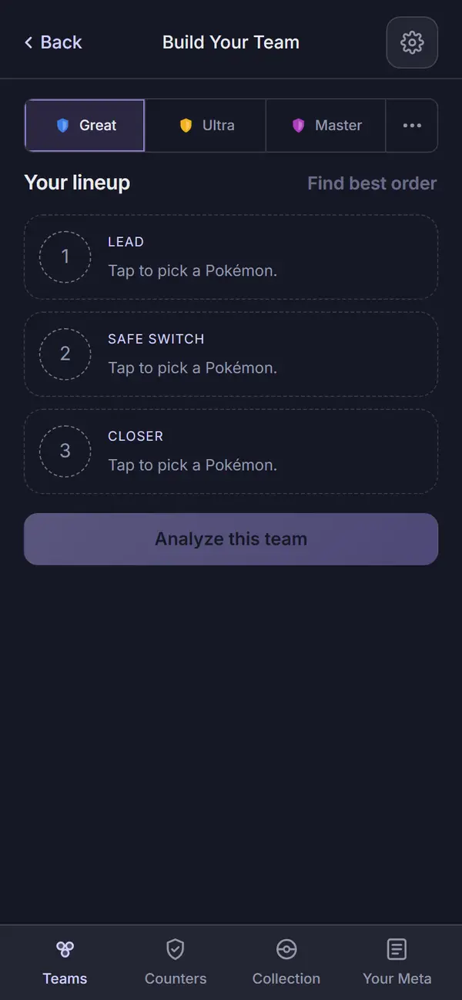 | 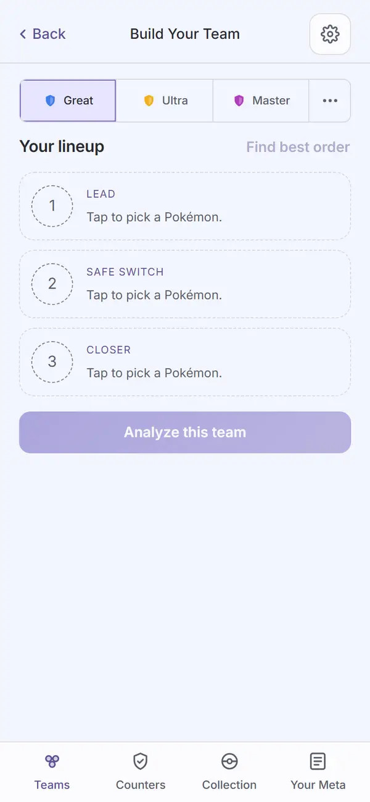 |
| `build-choosing`: the Lead slot's search open, "Choosing Lead" with the role's job above it, the Suggested grid ("yours" tags on owned species) | 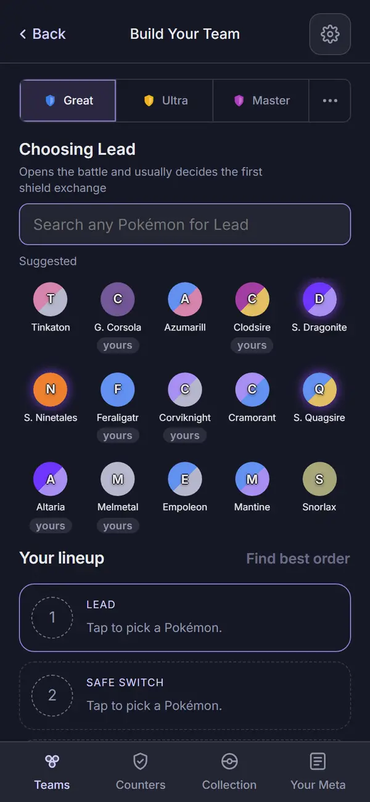 | 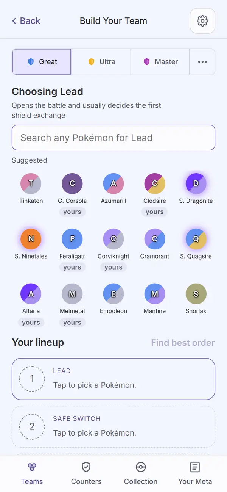 |
| `build-suggestions`: one pick made (Skarmory), "Best with your first pick" with two + Add rows, each a reason against the pin alone | 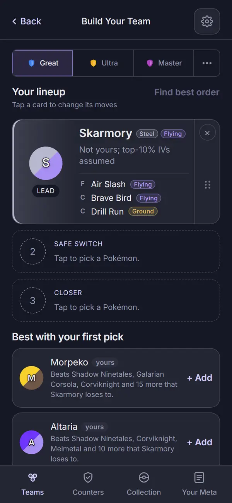 | 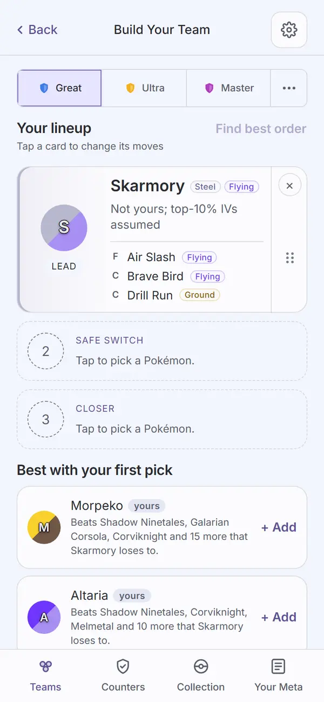 |
| `13-build`: all three slots filled with species picks (none owned), "None of these are yours yet, so there is nothing to price.", Analyze enabled (full page) | 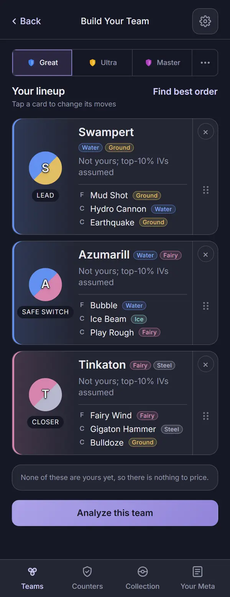 | 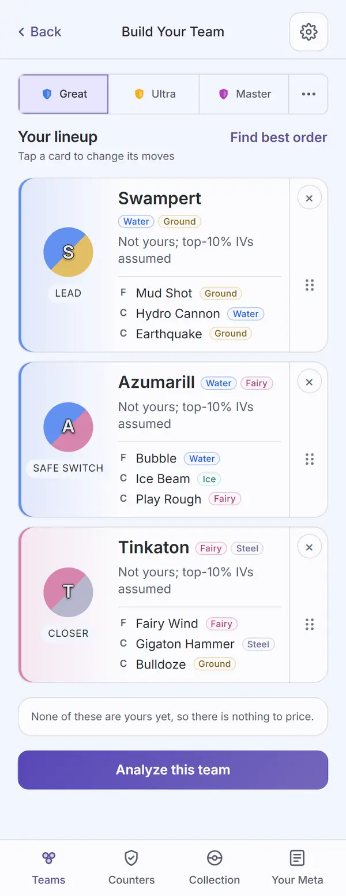 |
| `13b-build-moves`: the move sheet open on Azumarill, two charged moves ticked, the third disabled with "Untick one to pick another" and a "Changed" tag on the swapped move | 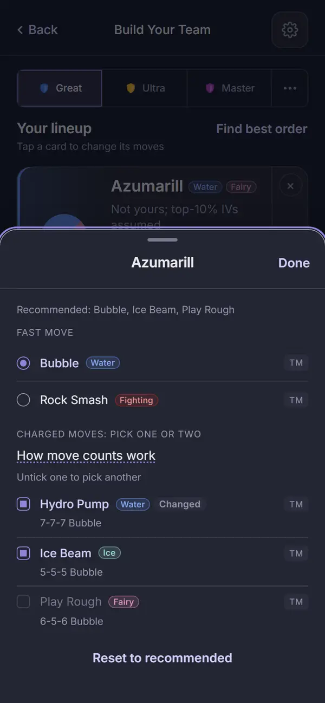 | 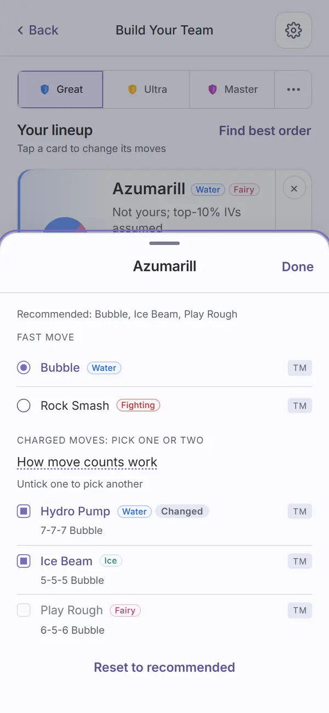 |
| `build-cost`: all three slots filled with owned specimens (Galarian Corsola, Clodsire, Feraligatr), "Total to build" with a real Stardust/Candy/XL Candy/Elite TM total (full page) | 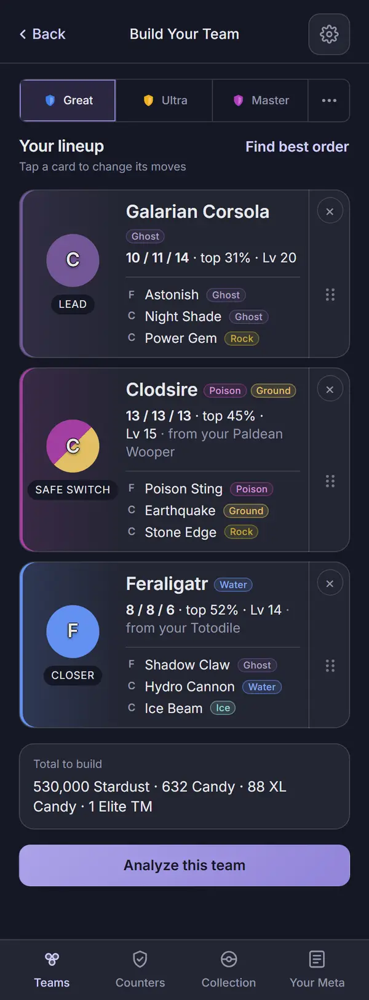 | 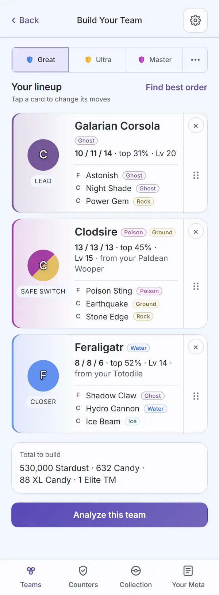 |

Not captured: the analyze error state (`ErrorState` on a failed `analyze()`), the "Finding the best
order..." transient, the verdicts-loading progress bar under the grid, and dragging a card. None of
these are new UI: `ErrorState` and `Progress` are the same shared components audited on Teams and
in the gallery, and the drag interaction is unchanged from before this branch (Task 4's report
confirms the grip and drag effect were kept, not rebuilt).

## Automated checks

- [x] `npm run web:audit` clean for this page's screens (listed in `AUDIT_ENFORCED`), run
      2026-09-25 against commit `976a834`: exit 0. Zero findings on all six enforced Build screens
      (`build-empty`, `build-choosing`, `build-suggestions`, `13-build`, `13b-build-moves`,
      `build-cost`), in both themes. 978 findings remain on screens not yet redesigned, none
      failing the run.
- [x] the run's own guards, all passed in this run (per Task 5's fixes):
  - the header's title left edge and last icon-button's right edge sit within the tolerance of the
    league row's edges (`build-empty`: `{"left":2,"right":0}`);
  - `assertTitleCentred()` holds on Build (checked on `21-log-battle` too, since the fix moved the
    offset from `.hdr` to `.hdr-actions`, which every sub header shares);
  - the three role pills (LEAD, SAFE SWITCH, CLOSER) are each one line and at least 4px clear of
    the text column (`13-build`: "Lead 46px, Safe Switch 96px, Closer 62px");
  - suggestions never fill a slot on their own (`build-suggestions`: exactly one `.pick-card.filled`
    after Skarmory is picked and `.mate-row` appears);
  - `build-cost`'s `.build-cost` box contains a real "Total to build" line, not a placeholder.
- [x] no console errors: the run printed no "Browser errors" section.
- [x] `npm run ui:audit` re-run 2026-09-25: "gallery audit: clean in dark and light" (unaffected by
      this task; run as the standing smoke check).
- [x] `npm run meta:screens` re-run 2026-09-25: exit 0, a smoke check for `packages/ui/base.css`'s
      `.pick-move-k` color change, which also reaches meta.pick3.gg's Species page.
- [x] `npm run lint`, `npm run typecheck`, `npm test`, `npm run check-colors`, `npm run
      check-tokens`, all re-run 2026-09-25 at `976a834`: lint exit 0; typecheck exit 0 across all
      workspaces; `npm test` 131 files, 1,131 tests passed; `check-colors` exit 0 (baseline
      untouched); `check-tokens`: ok.

## Aesthetics

- [x] colors from tokens, in their roles (violet interaction, pink measured with its mark, outcome
      colors, red only for destroying data): `check-colors` is clean and `web:audit` finds zero
      contrast findings on the six enforced screens in either theme. Task 5's fixes draw the F/C
      move letters and empty-slot numbers from `--muted` instead of `--faint`, and the sprite-less
      token letters from the `--token-letter`/`--token-halo` pair carried over from the Teams
      branch (visible and legible on Melmetal's steel disc, Corsola's and Clodsire's split discs,
      and Skarmory's Steel/Flying disc, in both themes). No pink appears on this page: Build has no
      measured data of its own, only PvPoke-assumed IVs and your own specimen stats.
- [x] at most four text levels, one page title: one page title, "Build Your Team", in every
      capture (`Header variant="sub"`). Levels visible across the captures: the page title;
      section heads and card/species names (both bold, unified at `--fs-section`/600 for the
      section heads per Task 5's fix, and 19px/700 for a card's own species name); body and
      explanation text (the role's job line, the move lines, the IV/level line); and small muted
      text (the role pill, "yours" and "Changed" tags, the "TM" badge, the hint lines). No fifth
      level found in any capture.
- [x] one filled primary button: `Build.tsx` renders exactly one `Button variant="primary"`
      ("Analyze this team", disabled until all three slots are filled) and exactly one other named
      `Button`, `variant="text"` ("Find best order", also disabled until full); the move sheet's
      "Reset to recommended" is the same text variant. "+ Add" on a suggestion row is a plain
      text-style link (`.mate-add`: `color: var(--accent-text)`, no background), not a button
      variant. Confirmed in every capture that shows one of these: `build-empty` (both disabled),
      `13-build` and `build-cost` (both enabled).
- [x] chips tapped, tags read: the type chips (Water, Ground, Fairy, Steel, and so on) are
      read-only labels on every card and offer row, never pressable. The "yours" and "Changed"
      tags are the neutral `ui` `Tag` (global constraint 7; the grid's "yours" was a raw
      `` until the Task 4 review's I2, fixed in `4020159`). The role pill
      (LEAD / SAFE SWITCH / CLOSER) is a read-only label on the card, not a control. No pressable
      chip row exists on Build; "+ Add" is the only tap target inside a suggestion row, and it
      fills the slot rather than toggling a chip.
- [x] the right header variant: every capture uses `Header variant="sub"` (a labeled back link,
      centered title, and a `Settings` `IconButton` on the right), matching Build's own row in the
      inventory ("Available actions": "Back", "Cog: Settings sheet"). The title's left edge and
      the settings button's right edge sit within the header-edge guard's tolerance of the league
      row's edges in `build-empty`, and `assertTitleCentred()` confirms the title is centered
      after the `.hdr-actions` fix (I1 in the findings table).
- [x] rows align; gutters and the 8px base hold: filled cards, empty slots, the suggestion rows and
      `.build-cost` all share one 1px `--divider` border and `--r-card` radius on the 20px gutter
      (Task 5's fix; before it, filled cards and the cost box had no border, most visible in
      light). "Find best order" sits on the same right gutter as the cards below it, not 8px
      inside it (Task 5's `.build-lineup-head .ui-btn-text` fix). Section heads share one size and
      weight (`--fs-section`/600) instead of "Choosing Lead" being bold 700 against "Your lineup"
      at 500.
- [ ] sprites unchanged: cannot confirm from these captures, for the same reason as the Teams
      record: this worktree has no sprite build (`PICKTHREE_SKIP_SPRITES=1`), so every Pokémon
      here is a lettered token disc, never a sprite image. The fallback renders correctly with
      Task 5's contrast fix: single-character letters clear 4.5:1 on every disc shown, including
      the two-type gradient discs and the Shadow-marked case (`apps/web/test/shadowToken.test.tsx`,
      18 types x both themes). No CSS or component that draws a sprite changed on this branch.
- [x] at most one line of text before the first result: in `build-choosing`, after the "Choosing
      Lead" head and its job line and the search input, only the category label "Suggested" sits
      before the token grid, no body copy. In `build-suggestions`, the section head "Best with your
      first pick" sits directly above the offer rows, with nothing between. `build-empty`'s three
      slots are the "first result" for that state, and nothing else sits above them but "Your
      lineup" and "Find best order".
- [x] light as readable as dark: every state above is a matched dark/light pair; `web:audit`'s
      per-theme contrast pass is clean on all six in both themes.

## Functionality

- [x] every "must keep" from the inventory entry, item by item:
  - Three ordered slots with fixed roles (Lead, Safe Switch, Closer): every capture shows all
    three, numbered and labeled.
  - Mix of your specimens (real IVs, built to pick3's recommended level) and any species
    (top-10% IVs assumed, stated on the card): "Not yours; top-10% IVs assumed" on every species
    pick (`build-choosing`, `build-suggestions`, `13-build`); "10 / 11 / 14 · top 31% · Lv 20" and
    "13 / 13 / 13 · top 45% · Lv 15 · from your Paldean Wooper" on owned specimens (`build-cost`).
  - Card content: token/sprite, role, name, types, IVs, IV-rank percent, level, "from your X" for
    an evolved specimen, and the three moves with F or C and a type chip each: all present in
    `13-build` and `build-cost`.
  - Per-team move overrides that do not touch the collection: the "Changed" tag on Hydro Pump in
    `13b-build-moves`, tested by `MovePicker.test.tsx`'s "shows the recommended set and tags what
    differs from it" and `build.test.tsx`'s "shows the move pool once it arrives, and each move
    change at once".
  - Search input at the top, results under it, slots under that (the mobile input rule): see the
    dedicated line below.
  - Suggested picks when the search is empty (recent opponents plus top meta, your own specimen
    where you have one): the "Suggested" grid in `build-choosing`, with "yours" tags on the
    specimens you hold.
  - Suggest teammates is reason-only, no score: `build-suggestions`'s two rows each carry a
    one-line reason ("Beats Shadow Ninetales, Galarian Corsola, Corviknight and 15 more that
    Skarmory loses to.") and no numeric score; the verdict belongs to Analyze, unchanged.
- [x] every control does what its label says: league tabs switch league and move pools (unchanged
      code, not re-tested here); an empty slot opens its search (`build-choosing`); a filled card
      opens the move sheet (`13b-build-moves`; `build.test.tsx`'s "opens and closes the moves sheet
      for a filled slot" and "opens the move sheet from a card, with Analyze as the one primary
      button"); "+ Add" fills the first empty slot without opening a search
      (`build.test.tsx`'s "+ Add fills the first empty slot and the list goes once all three are
      in"); Find best order and Analyze are disabled until the team is full
      (`build-empty`) and enabled once it is (`13-build`, `build-cost`).
- [x] back returns to the origin with filters and scroll, for the flows this task touched: the
      inventory's original rule ("Back '<Teams>': always goes to Teams") is superseded by Ruling 5
      (back is labeled "Back" and the origin varies): `history.ts`'s `markEntry`/`canGoBack` track
      how many pick3 screens sit behind the current one in this tab, and `Actions.back(fallback)`
      uses real browser back when there is somewhere to go, falling back to Teams only when there
      is not. `build.test.tsx`'s "Back returns to Teams when Build was the first screen" and
      `history.test.ts`'s four tests (including "keeps a marked entry's pick3Depth through
      clearShareMarker", the Task 1 review's fix) cover it. Build carries no filters or scroll
      position of its own to preserve.
- [x] input layout rule: applicable here (Build has a text input, unlike Teams). `build-choosing`
      shows the input at the top of its section (under the "Choosing Lead" head and job line),
      the Suggested/Matches grid directly under it, and the lineup slots under that. Suggestions
      (`TeammateSuggestions`) are the shortcut content and are hidden whenever a slot's search is
      open (`Build.tsx`: `{target === null && (pinned === 1 || pinned === 2) ? <TeammateSuggestions
      .../> : null}`, with the comment "Shortcuts last, and hidden while a slot's search is open:
      the keyboard covers them.") per Ruling 3. This gating has no capture or unit test of its own;
      it is confirmed by reading the code, not by a passing assertion, so it is ticked on the
      strength of the `must keep` line ("Search input at the top... the mobile input rule") that
      the same code satisfies elsewhere, not on a dedicated check. Flagged again under Findings.
- [x] icon buttons named; focus visible: the header's `Settings` `IconButton` carries the label
      "Settings" (`Header.tsx`, unchanged); the X on a filled card empties the slot (unchanged,
      pre-existing `aria-label`); "+ Add" carries `aria-label="Add <name>"` (Task 3's report and
      review, confirmed by an accessibility check in the review); the shared `Button`/`IconButton`
      focus-visible outline is the one audited on other pages (gallery record), unchanged here.
- [x] product rules: assumptions shown ("Not yours; top-10% IVs assumed", "from your X",
      "None of these are yours yet, so there is nothing to price." and the unbuildable-count line
      added in `4020159`); collection stays on the device (Build makes no request that carries
      collection data; the one network call this screen can trigger, `suggestTeammates`'s
      community read, is the same league-only board fetch used on Teams, gated the same way);
      `connect-src` unchanged (no CSP edit on this branch); sharing copy is not applicable to
      Build (no sharing toggle lives on this screen).
- [x] tests cover the new behavior: `apps/web/test/build.test.tsx` (15 cases),
      `apps/web/test/lineupCost.test.ts` (4), `apps/web/test/MovePicker.test.tsx` (9),
      `apps/web/test/teammateSuggestions.test.tsx` (3), `apps/web/test/history.test.ts` (4),
      `apps/web/test/shadowToken.test.tsx` (5) and `packages/ui/test/Sheet.test.tsx` (8, one new
      for this branch).
- [x] the new behaviors (this plan's Rulings, see below for the rulings themselves):
  - Ruling 1 (suggestions list = each offer's first fill): `teammateOffers` dedupes by species and
    excludes anything already on the board, tested by all three cases in
    `teammateSuggestions.test.tsx`; visible in `build-suggestions` (Morpeko and Altaria, one row
    each, neither already picked).
  - Ruling 2 (heading text by fill count): `filled === 1 ? 'Best with your first pick' :
    'Best with your first two'` (`TeammateSuggestions.tsx`). The one-fill heading is captured
    (`build-suggestions`); the two-fill heading has no capture and no test of its own (none of the
    six enforced screens reaches two pins before the third fills the board). Traced in code only;
    flagged under Findings.
  - Ruling 3 (suggestions hidden while a slot's search is open; + Add opens no search): the
    `target === null` gate above; `build.test.tsx`'s "+ Add fills the first empty slot and the
    list goes once all three are in" confirms + Add does not open a search, but no test asserts
    the list disappears while a search is open. Traced in code only; flagged under Findings.
  - Ruling 4 (total cost counts your own Pokémon only): `build-cost` shows a real total for three
    owned picks; `13-build` shows "None of these are yours yet, so there is nothing to price." for
    zero; `lineupCost.test.ts`'s four cases (including the mixed priced/unbuildable/unpriced case
    added in `4020159`) cover the split and the "Not counting N that cannot be built here" line,
    which none of the six captures happens to show.
  - Ruling 5 (Back labeled "Back", cog stays right): every capture's header reads "‹ Back" on the
    left and the Settings cog on the right, as on Teams.
  - Ruling 6 (the only ticked charged move stays enabled and ignores the tap; "Pick one or two"
    explains why): `13b-build-moves` shows "CHARGED MOVES: PICK ONE OR TWO" and Play Rough
    disabled (unticked, faint) while Hydro Pump and Ice Beam are ticked; `MovePicker.test.tsx`'s
    "never bumps..." and "keeps the last charged move ticked" cover it.

## Findings and fixes

| Finding | Fix | Commit |
| --- | --- | --- |
| `history.ts`'s `markEntry` assumed `window.history.state` is `null` before any `pushState`; jsdom (and real browsers, before any push on the tab) can return `undefined` instead, throwing inside the boot effect. | Widened the checked type to `{ pick3Depth?: unknown } \| null \| undefined` and guarded both `null` and `undefined` explicitly (`eqeqeq` forbids `!=`). | `0b701a8` |
| Review: `share.ts`'s `clearShareMarker` called `replaceState(null, ...)`, discarding whatever `pick3Depth` `markEntry` had just stamped on the share-landing entry; the loss is latent (only surfaces on a fresh JS context revisiting that exact entry) but real, and biases `back()` toward the safe direction (its Teams fallback) rather than losing the invariant. | `clearShareMarker` passes `window.history.state` through instead of `null`; a regression test marks two entries, clears the marker, and asserts `pick3Depth` and `canGoBack()` survive. | `fac20db` |
| Move picker: no findings. Two deferred, non-blocking notes only (a test line over the 100-col print width; a redundant but harmless clause in the `disabled` expression, since the caller invariant already implies it). | Not fixed: both are cosmetic/harmless per the review's own trace; left for a future touch of the file. | `eada499` |
| Teammate list: no findings. `teammateOffers`'s dedupe and the ruling's `takeSuggestion`/`withFills` deletions were verified repo-wide (no dangling references, no orphaned chip UI). | N/A: approved as written. | `fd5e183` |
| Build's move sheet content was rendered through a `useRef` workaround, because the ui `Sheet` froze its `root` prop at the first render: a move pool that arrived after the sheet opened, or a move tap, never showed. Caught by the implementer's own test before review. | Fixed at the source instead of in Build: `packages/ui/Sheet.tsx` now holds only pushed pages in state; the root page always follows the current `root` prop, and a pushed page keeps the object it was pushed with. Build passes the plain inline `root` the brief specified. New `Sheet.test.tsx` case: the root body, its title, and focus all follow a live prop without remounting; a pushed page still behaves as before. | `4020159` |
| The auto-suggest effect could permanently stop asking again after a moves-only change or a remove-then-re-pick, because the store cleared `suggestion` on every `pick` action while `suggestKey` ignores moves and order, so the list vanished with no way back. | The `pick` reducer now compares `suggestKey` before and after: it keeps `suggestion`/`suggestError` when the board key is unchanged and clears both only when it changes; Build's `answered` gate (added with the initial implementation, `b8c4a47`) still covers the remove-then-re-pick case. Three tests: a moves-only change keeps the list without a new ask, an error is retried once the board changes back, and a zero-offer answer is asked for exactly once. | `4020159` |
| The search grid's "yours" marker was a raw ``, not the neutral `ui` `Tag` global constraint 7 requires. | `{p.mine ? <Tag>yours</Tag> : null}`; `.recent-token .tag` is kept for `NewSet.tsx`'s own marker, which still uses it. | `4020159` |
| `lineupCost`'s "not priced yet" line read the same for a verdict that had not arrived and a verdict that arrived with `cost: null` (an unbuildable pick), which can under-report why a total is missing. | `costOf` now distinguishes `undefined` ("no verdict yet", counted as unpriced) from `null` ("verdict, no cost", counted as unbuildable); a new line reads "Not counting N that cannot be built here". | `4020159` |
| Audit: the type-colored fade was a `background-image` on the whole filled card, so axe could not measure any text on it ("contrast unverified"). | Moved the fade onto the stretched `.pick-token` instead of the card, so every line of card text sits on a flat, measurable surface; the role pill is opaque and measures too. | `366a2a5` |
| Audit: F/C move letters and empty-slot numbers, on `--faint`, failed contrast at single-character size (axe reports single characters as "too short" rather than passing them). | `.pick-move-k` (`packages/ui/base.css`, also used by meta's Species page) and `.opp-slot-empty` moved to `--muted`; the dashed ring keeps `--faint`. | `366a2a5` |
| Audit: `.pick-x` (28x28), `.drag-grip` (32px wide) and one-line `.move-opt` rows were under the 44px touch-target rule. | `.pick-x` is now a 44x44 target drawn as the same 28px ring (transparent border, padding-box background); `.drag-grip` widened to 44px; `.move-opt` gets `min-height: 44px` with `align-content: center`. | `366a2a5` |
| Audit (carried forward from Teams): sprite-less Shadow token letters could measure as low as 2.51:1 against a Shadow backdrop; axe left them "unverified" because a single letter "reads as too short". | `PokemonToken` marks `.token-shadow-wrap` with `data-audit-contrast="static"` (never muting a real violation elsewhere in the wrapper); `apps/web/test/shadowToken.test.tsx` composites the letter over its halo over the Shadow backdrop for all 18 types in both themes, plus a marker-presence check. Put in `apps/web`, not `packages/ui`, because the wrapper and its glow CSS live in `apps/web`. | `366a2a5` |
| Audit: one line of text straddling the true bottom of a full-page capture, under the fixed tab bar, reported "partially obscured" rather than measured. | `measureBelowOpaque` in `scripts/audit.mjs` also re-measures `elmPartiallyObscured` nodes, and treats body's own background as the canvas when the root element has none of its own (the CSS background-propagation rule); every other opaque layer keeps the strict "box contains every line" test. | `366a2a5` |
| Seen in the captures, not caught by axe: the sub header sat off the gutter; "Find best order" sat 8px inside the gutter and its 44px target pushed the hint line down; filled cards and the cost box had no border (most visible in light); the three section heads did not share one size and weight. | `.hdr` padding-right (later replaced, see the next row); `margin-block: -12px` and no right padding on the "Find best order" button; a 1px `--divider` border and `--r-card` radius on filled/empty cards and `.build-cost`; section heads unified at `--fs-section`/600. | `366a2a5` |
| Coordinator's look at the first captures: the "SAFE SWITCH" role pill wrapped to two lines in the 88px sprite column; `13-build`'s picks were unchanged species with nothing to price, so no total was captured; `13-build` was a viewport shot with text under the sticky header. | Pill set `white-space: nowrap` (later revised, see below); a new enforced `build-cost` capture fills three slots from owned specimens and asserts a real "Total to build" line; `13-build` shot full page from the top instead of scrolled/cropped. | `9385554` |
| Review round 2: the `.hdr` padding-right fix moved every sub header's title 4px off centre (equal `1fr` side columns, unequal padding); a "·" separator could start a line in the cost box and the card's IV line; the role pill had no wrap fallback for a wider font; the Shadow glow contrast loop composited layers in the wrong order and could not fail. | The offset moved from `.hdr` to `.hdr-actions { margin-right: calc(var(--gutter) - 12px) }`, keeping the grid symmetric; a new `assertTitleCentred()` guards Build and `21-log-battle`. `format.ts` exports `SEP` (a non-breaking space plus "· "); `costLine`'s default join uses it, reaching Teams, Team Analysis and Build; Build's card line applies the same non-breaking space before "top", "Lv" and "from your". The pill becomes `width: max-content; max-width: 104px` (drops `nowrap`), one line today, wrapping instead of overlapping at a larger size. The glow layers are composited in true CSS paint order (first-listed layer on top), with a comment noting the halo dominates and the loop is a smoke check, not the real guard (the marker test and the halo/letter tokens are). | `976a834` |

Not fixed, still open (Ruling 2's two-fill heading text, Ruling 3's hide-while-searching gate): both
read correctly in the source and neither is contradicted by any test, but neither has a capture or
a dedicated assertion of its own. See the two matching lines under Functionality above.

## Rulings applied on this piece (from the plan, costs as written)

1. **Suggestions list = each offer's first fill**, one row per species, none already on the board;
   + Add re-runs suggestions against the new board. [Cost if wrong: an engine change to show
   second fills with a rewritten line.]
2. **Heading text by fill count**: "Best with your first pick" (one slot filled), "Best with your
   first two" (two). [Cost if wrong: one string.]
3. **Suggestions hide while a slot's search is open**, per the mobile input rule; + Add fills the
   first empty slot and opens no search. [Cost if wrong: show them under an open search, one
   condition.]
4. **Total cost counts your own Pokémon only**; a species pick has no build cost, and the line
   under the total says how many are not counted. [Cost if wrong: a stand-in cost estimate, an
   engine call.]
5. **Back is labeled "Back"** (the origin varies, per Task 1's history depth tracking rather than
   the inventory's hard-coded "always Teams"), and the settings cog stays on the right as an
   `IconButton`, as on Teams. [Cost if wrong: one label.]
6. **The only ticked charged move stays enabled and ignores the tap**; the "Pick one or two" label
   says why, rather than disabling it and greying out a ticked row. [Cost if wrong: a disabled
   style instead.]

Visible changes outside Build, from this branch:
- The ui `Sheet`'s root page now follows its `root` prop on every render instead of freezing at the
  first one, and a pushed page keeps the page object it was pushed with. This reaches every current
  caller of the shared component: Build's own move sheet and the league list opened from the "..."
  overflow (`apps/web/src/components/LeagueSwitcher.tsx`), plus the gallery's demo sheets. Settings
  and Filters render the app's own `.sheet` markup, not the ui `Sheet` (confirmed by grep in the
  Task 4 review), so they are unaffected by this fix even though they were named as in scope when
  the plan was written.
- Every sub header's title is centred and its trailing icon button sits on the gutter: the fix
  landed on `.hdr-actions` rather than `.hdr` itself (after a first attempt there moved every title
  off centre), so it reaches every screen using `Header variant="sub"`: AddPokemon, Build, Import,
  LogBattle, NewSet, SharedTeam, Specimen and TeamDetail. `screens.mjs`'s `assertTitleCentred()`
  now runs on Build and on `21-log-battle` as a standing guard.
- "·" separators keep to the word before them in every cost line: `format.ts`'s `SEP` and
  `costLine`'s default join reach `TeamCardBody` and `TeamDetail` as well as Build, so a dot no
  longer starts a line on Teams or Team Analysis either. Carried forward, not fixed here:
  `TeamDetail`'s own hand-written `'Level X to Y · '` wrapper text around `costLine`, and
  `TeamRowSummary`/`Specimen`/`Teams`'s own `' · '` joins, still use plain spaces and can still
  break a line on a dot; open for the Analysis plan.
- F/C move letters and empty-slot numbers move from `--faint` to `--muted`; `.pick-move-k`'s color
  reaches meta.pick3.gg's Species page (a byte-for-byte port of the same class), checked clean by
  `meta:screens`.
- Sprite-less Shadow tokens carry a `data-audit-contrast="static"` marker for the audit tool, and a
  new composite test in `apps/web/test/shadowToken.test.tsx` backs it for all 18 types in both
  themes.
- `scripts/audit.mjs`'s `measureBelowOpaque` now also re-measures partially-obscured text and
  treats a background-less root's own body background as the canvas underneath it; this reaches
  every future audited page, not just Build.

Open items for Travis (not fixed on this branch):
- **The Shadow glow (`.token-shadow-wrap::before`) is not visible.** Both the glow and the token
  paint without a `z-index`, so the disc always paints over the glow; only the outer violet halo
  shows. Pre-existing, unchanged by this branch. `shadowToken.test.tsx`'s glow assertion is
  documented as a smoke check, not proof the glow renders, so a later fix that makes it visible
  will need to revisit the test and the model together.
- **`TeamDetail`'s own " · " spacing** still uses plain spaces around its hand-written cost-line
  wrapper text, so a dot can start a line there even though `costLine` itself now keeps its dots
  with their words. Left for the Analysis plan.

## Sign-off

- [ ] Travis, <date>
