# Audit: Collection

Piece: 4, round 2 (Collection, with the Pokémon detail page in `pokemon-detail.md`). Inventory
entry: `docs/design/inventory/2026-09-22-inventory.md`, page 8 (Collection and Pokémon detail).
No intake entry; the approved renders are the ones from chat on 2026-09-26 (option B, the verdict
tags). Spec: `docs/superpowers/specs/2026-09-26-design-rest-of-app-design.md`, "Decisions" and
"Collection". Plan: `docs/superpowers/plans/2026-09-27-collection.md`. Branch `rest-of-app`,
commits `7f0713b` to `b3c5c12`.

Collection now has option B: one cog (Settings) in the header, a filter icon with a count beside
the search, and "Sort: Verdict ▾" always in view. "Built" replaces "Ready to use". Verdicts are
read-only tags, one color each.

A note on sprites: this worktree's game data has no sprites, so every Pokémon is a type-colored
initial, as on every signed record.

## Screenshots

Dark and light at 390px, one pair per state. Ten come from the Task 6 `npm run web:audit` run
on 2026-09-27 (the code committed as `101e59f`, `PICK3_BUILD=874d675`); the `collection-empty`
pair comes from the final review run on `b3c5c12` (same build id), the one capture whose page
changed. `collection-excluded` comes from the 2026-09-27 run for exclusion by species (the code
committed as `c6b4819`, same build id). All are WebP (600px wide, quality 72). `04-collection` is
the whole page, top to bottom.

| State | Dark | Light |
| --- | --- | --- |
| `collection-judging`: Loading ("Judging each Pokémon", a partial bar) under the count line; the rows already judged carry their tags | 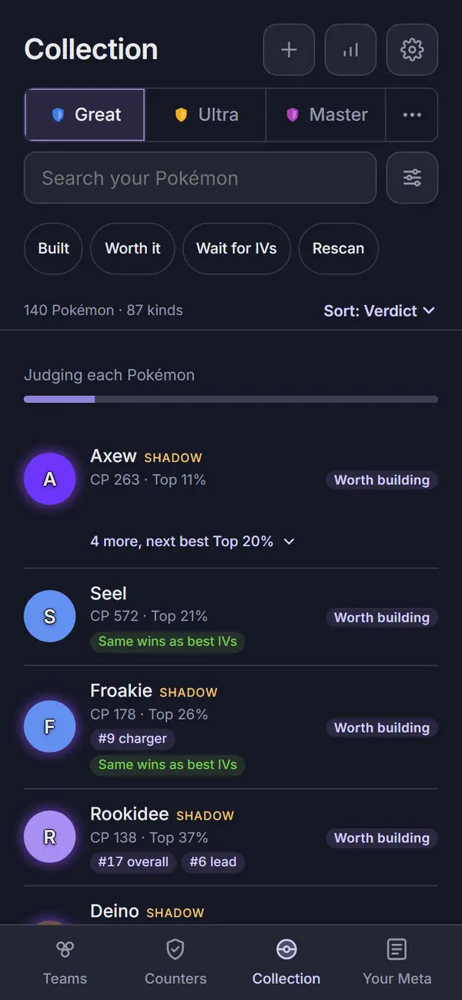 | 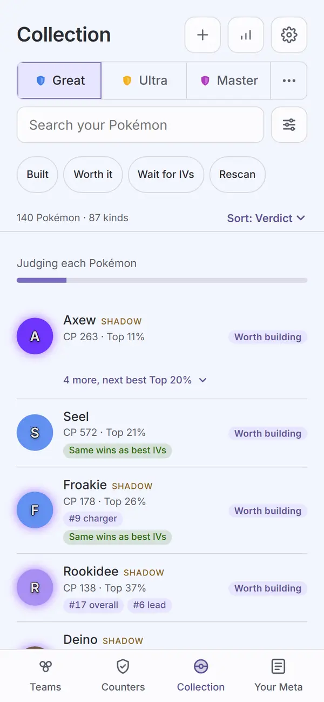 |
| `04-collection`: judged and grouped, full page. The header (plus, meta.pick3.gg, cog), the full league switcher, search and the filter icon, the four chips, "111 Pokémon · 65 kinds" and "Sort: Verdict", then Worth building, Wait for better IVs and Needs rescan rows, the last row clear of the tab bar | 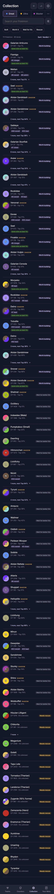 | 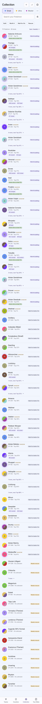 |
| `11-collection-group`: Meltan's group open under the pinned search bar, "Hide the others" with the chevron up, five sub-rows with their own tags | 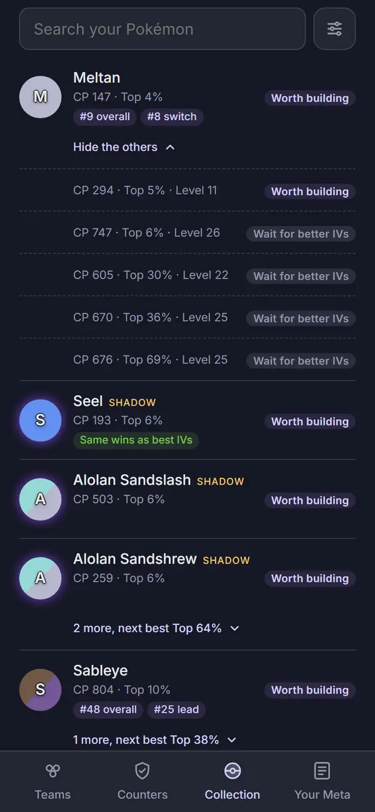 | 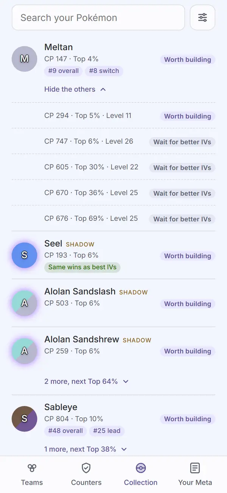 |
| `collection-flat`: Group same Pokémon off, the filter icon reads 1, the count reads "111 shown", Meltan twice | 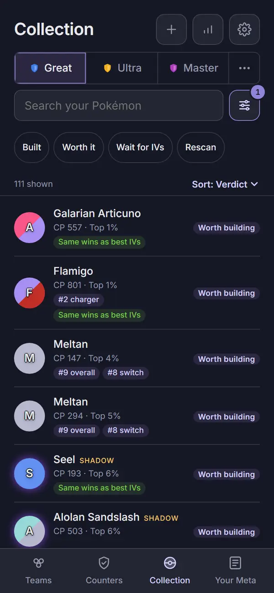 | 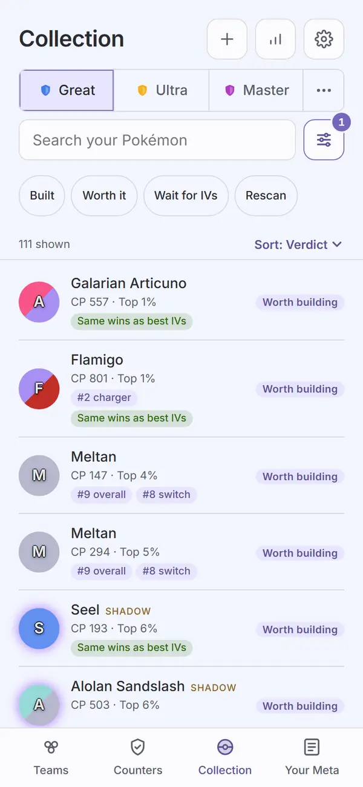 |
| `collection-filters-sheet`: the ui `Sheet` "Filters" with Done, five switches, "Scanned in the last two weeks" with no second line | 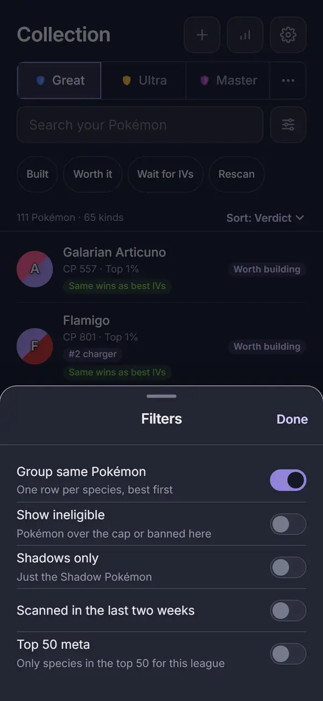 | 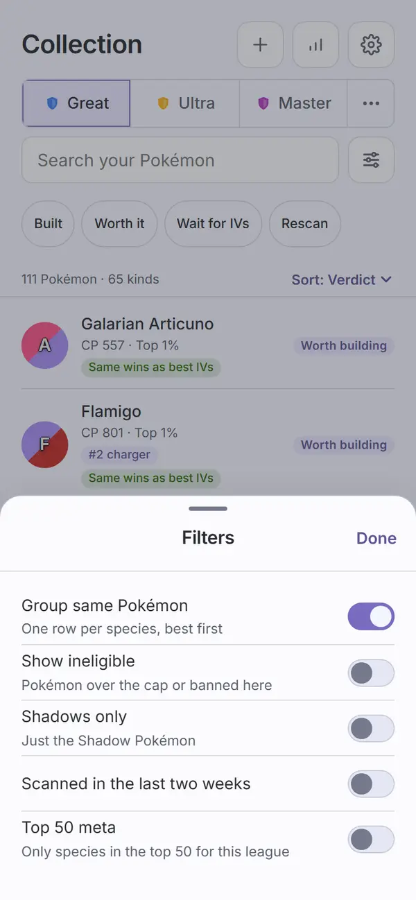 |
| `collection-empty`: "zzzz" in the search with its Clear control, no count over the empty state, "Sort: Verdict" still in place, "Nothing matches. Try another name or clear a filter." | 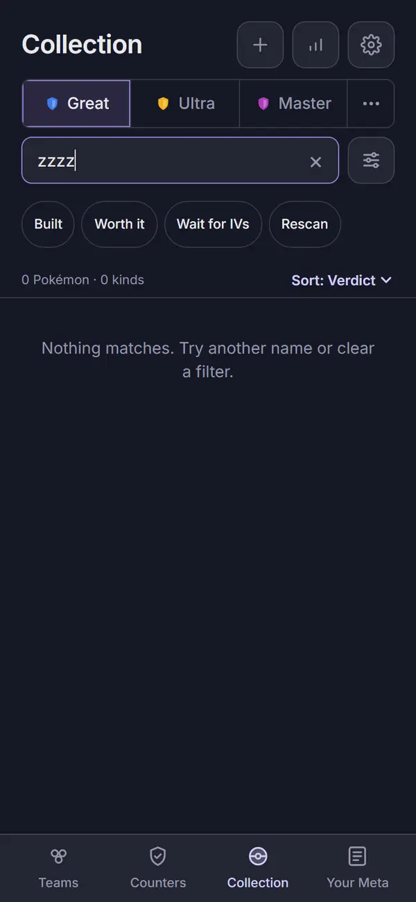 | 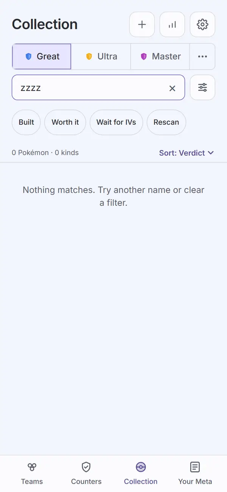 |
| `collection-excluded`: while `specimen-excluded` has Galarian Articuno switched off, its row (scrolled into view) carries a grey "Excluded" tag in its tag line, under "Same wins as best IVs", beside the unchanged Worth building tag; no other row has one | 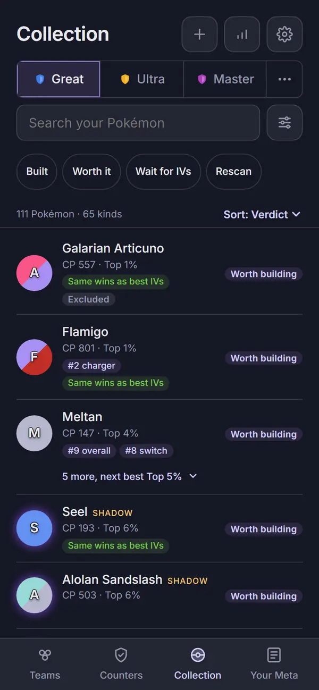 | 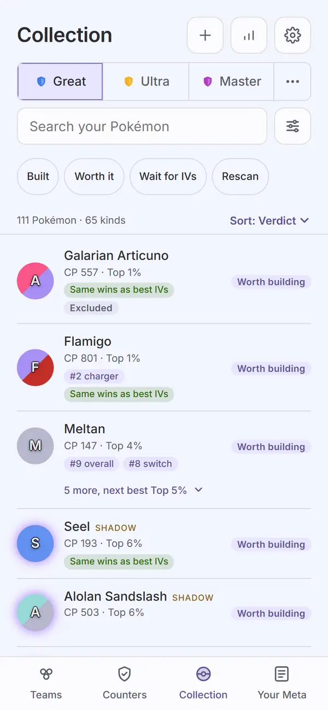 |

The script checks as it shoots: before `04-collection` it measures the Sort control against the
chips and fails on an overlap (the log reads "sort target 44px tall, 4px under the chips");
`collection-flat` must read "N shown"; Group is switched back on after the shot.

Not captured, covered by `apps/web/test/collection.test.tsx`: the sort dropdown open (a native
picker the page cannot draw; plan ruling 6); no collection (`NoCollection` under the same
header); the verdicts error (`ErrorState` with today's copy). Not captured and not tested here:
the Banned, Lucky and over-the-cap row variants (the sample shows none with Show ineligible off).

## Automated checks

- [x] `npm run web:audit` clean for this page's screens (all seven names above in `AUDIT_ENFORCED`,
      `collection-excluded` since the 2026-09-27 run, exit 0, zero enforced findings, no NEVER line):
      the Task 6 run on the `101e59f` code with `PICK3_BUILD=874d675` exited 0 with zero findings
      on every enforced name in both themes. No NEVER line; the only "Not on screen, unmeasured"
      lines are the known `settings-about-leaves` ones, each measured in `settings-about`.
      Re-run for this record on `101e59f`, same build id: exit 0, zero findings on every enforced
      name, the same eight `settings-about-leaves` lines, no NEVER line. 433 findings remain on
      screens not yet redesigned, none failing (618 at the Settings record, when Collection and
      the detail page were not yet enforced). The images above are from the Task 6 run; the re-run used
      the same code. Final review run on `b3c5c12` (`PICK3_BUILD=874d675 npm run web:audit`):
      exit 0, zero findings on every enforced name in both themes, the same eight
      `settings-about-leaves` lines, no NEVER line, 433 findings on screens not yet redesigned.
- [x] no console errors: neither run printed a "Browser errors" section.
- [x] `npm run lint`, `npm run typecheck`, `npm test`, `npm run check-colors`, `npm run
      check-tokens`: re-run for this record on 2026-09-27 on `101e59f`. lint exit 0; typecheck
      exit 0; 143 files, 1358 tests passed; check-colors exit 0; "check-tokens: ok". `npm run
      ui:audit` (`InlineSelect` and the title-less sub header in the gallery): "gallery audit:
      clean in dark and light", in Task 1 and again in Task 6. Final review, on `b3c5c12`: lint
      exit 0; typecheck exit 0; 143 files, 1363 tests passed; the settings, collection and
      specimen test files 10 times in a row, 54 of 54 each time; check-colors exit 0;
      "check-tokens: ok"; ui:audit "gallery audit: clean in dark and light".

## Aesthetics

- [x] colors from tokens, in their roles: violet on what you tap (the header icons, the filter
      icon and its count, "Sort: Verdict", the "N more" toggles, the selected league); the
      verdict tags in their spec tones (Worth building violet, Wait for better IVs neutral, Needs
      rescan warn; `04-collection`, `11-collection-group`); no red and no pink anywhere on the
      page (all captures). `check-colors` clean. Exceptions under Open items: the light Built
      tag and the "Same wins as best IVs" pill.
- [x] at most four text levels, one page title: "Collection"; row names; the stats line and the
      count line; tags and flags. The Filters sheet has its own title (`collection-filters-sheet`).
- [x] one filled primary button: none on the list, which is right, since every action is per
      row or a control (all captures). `NoCollection` keeps its one filled "Import a CSV"
      (tested, not captured).
- [x] chips tapped, tags read: the four verdict chips are the only chips and they filter (tested:
      Built shows only Built rows); every verdict is a `Tag` in a `.verdict-tag` span with no
      button around or inside it (tested). The rank and "Same wins as best IVs" pills are read
      only, but they are not the ui `Tag` (Open items).
- [x] the right header variant: `Header variant="top"`, "Collection", with plus, meta.pick3.gg
      and the cog as 44px `IconButton`s; the full league switcher under it, as on Teams (all
      captures but the pinned `11-collection-group`).
- [x] rows align; gutters and the 8px base hold: one gutter from the header to the last row; the
      tags right-aligned and centered on their row, none cut (`04-collection`, both themes); the
      sub-rows line up under the name column (`11-collection-group`).
- [ ] sprites unchanged: cannot confirm (no sprite build, see the top). No sprite code changed.
- [x] at most one line of text before the first result: the count and Sort line is the only line
      between the chips and the rows (`04-collection`, `collection-flat`).
- [x] light as readable as dark: six matched pairs, and the audit's contrast pass is clean in both
      themes. One tag reads weaker in light (Open items).

## Functionality

- [x] every "must keep" from inventory page 8 (the Collection half): verdicts per league with
      Not eligible hidden unless asked (Show ineligible in the sheet); per row the token, name,
      Shadow flag, CP, IV rank, meta rank tags, "Same wins as best IVs" and the verdict
      (`04-collection`; the Banned flag is in the code, not captured); grouping with best first
      and "N more, next best Top X%" (`04-collection`, `11-collection-group`); search, filters
      and sort, remembered (tested). Add Pokémon, meta.pick3.gg, the cog and the league switcher
      stay in the header.
- [x] every control does what its label says (tests): plus goes to `#/add`; the cog opens
      Settings; the filter icon opens the sheet, and its count is every switch off its default,
      Group same Pokémon included ("Filters, 1 on", with "N shown" when Group is off, Review
      Focus 4); a switch in the sheet changes the list behind it at once; the chips filter and
      read Built, Worth it, Wait for IVs, Rescan; Sort is a combobox with Verdict, IV rank, Meta
      rank and Name, and Name orders rows by the name shown; no match shows `Empty`; judging
      shows `Loading`; a failure shows `ErrorState`.
- [ ] back returns to the origin with filters and scroll: search, chips, filters and sort survive
      a trip to a Pokémon and back (tested). Open groups and the scroll position still use
      `useSticky` and `useScrollMemory`, but no test or capture covers them (Open items).
- [x] input layout rule: the search is the list's input, first under the header and pinned while
      the list scrolls (`11-collection-group`); the chips and the count line sit between it and
      the rows, as in the approved render; nothing you need sits below the rows.
- [x] icon buttons named; focus visible: "Add a Pokémon", "meta.pick3.gg, the community meta",
      "Settings", "Filters" or "Filters, N on", "Clear search", and the Sort combobox named
      "Sort" (tests); the app-wide `:focus-visible` ring, and `InlineSelect` draws its own ring
      when its hidden select has focus.
- [x] product rules: no new outbound call; `index.html` and `connect-src` unchanged; the
      collection stays in IndexedDB. Assumptions: the verdict sentences are on the detail page,
      as before.
- [x] tests cover the new behavior: `apps/web/test/collection.test.tsx` (10 tests: the header,
      the filter count, the chips, the sort, read-only tags, a round trip, Empty, Loading and
      ErrorState, nothing left of the popover, sort cycle or hint, `NoCollection`);
      `packages/ui/test/Controls.test.tsx` (`InlineSelect`); `apps/web/test/components.test.tsx`
      (`VerdictTag` tones); `packages/engine/test/verdicts/worth.test.ts` (Built).

## Findings and fixes

| Finding | Fix | Commit |
| --- | --- | --- |
| Task 4: the Filters sheet and the list each held their own copy of a `useSticky` value, so a switch in the sheet did not change the list behind it until it remounted. | `useSticky` keeps one shared value per key (see Visible changes). | `0927343` |
| Task 4: Name sort put Shadow Dragonite under S, while the row reads "Dragonite" with a Shadow flag. | Name sorts by the name the row shows. | `0927343` |
| Task 4: the grouped count fell back to "N shown" when every row was its own kind. | Grouped always reads "N Pokémon · M kinds", as the spec says. | `0927343` |
| Task 4 review: the sheet label was the plan's "Scanned recently" / "Last two weeks of scans"; the spec says "Scanned in the last two weeks". | The spec's label, with no second line (Ruling 8). | `101e59f` |
| Audit: the "N more" toggle was a 28px target (36 findings per capture). | 44px, pulled up 10px so the line sits where it did. | `101e59f` |
| Audit: the toggle's text carets (⌃ ⌄) came back "contrast unverified, non-text". | The ui `Chevron`, 14px. | `101e59f` |
| Audit: Clear search was 36x36. | 44px; the input's right padding follows. | `101e59f` |
| Task 4 review, for the captures: the full league switcher's height above the search, and the Sort target overhanging the chips by 6px. | Checked in `04-collection`: the switcher matches Teams; the Sort target is 44px and 4px under the chips. The script now fails if they overlap. | `101e59f` |
| Task 2 review, for the captures: no `.verdict-tag` CSS was added. | Checked in `04-collection` and `11-collection-group`: tags right-aligned, centered, none cut. No change. | none |
| Final review: `collection-empty` read "0 Pokémon · 0 kinds" above "Nothing matches." | The count text hides when no row matches (Sort stays, on the right); while judging the count shows as before. Tested in the Empty test; `collection-empty` retaken. | `b3c5c12` |
| Final review: the title-less `Header` test could not fail, and `title` had become optional on `top` too. | `Header`'s props are a union: `top` requires `title`, `sub` does not. The test asserts the title element is absent, beside a new test that finds it when a title is given. | `b3c5c12` |
| Final review: the detail page's error copy. | The "Could not judge this collection" line is one function (`judgeFailedLine` in `format.ts`), shared with the detail page; Collection's text is unchanged. | `b3c5c12` |
| Exclusion by the Pokémon as it battles (Travis, 2026-09-27; `pokemon-detail.md`): a Pokémon left out of teams was only visible on its own page. | A row whose verdict build's species is excluded (or, until old per-copy ids convert, that very copy) shows a grey `Tag` "Excluded" (tone `neutral`) in its tag line; a sub-row gets it on its own line. The tag line rather than beside the verdict tag, so the right column stays one tag wide at 390px. `collection.test.tsx` pins it; `collection-excluded` shows it, enforced, audited clean in both themes (2026-09-27 run, exit 0, no NEVER line). | `c6b4819`, and the commit adding this row |

## Rulings

From the plan:

1. **`InlineSelect` is a ui component**, a native `<select>` over the "Sort: Verdict ▾" text,
   named "Sort"; Counters reuses it in round 3. [If wrong: a shared component one page uses.]
2. **`VerdictTag`** is a ui `Tag` in ``: Built `win`,
   Worth building `accent`, Wait for better IVs `neutral`, Needs rescan `warn`, Not eligible
   `neutral`. [If wrong: markup and five tones.]
3. **The Filters sheet is the ui `Sheet`** with ui `Switch` rows; the icon's count is the number
   of the five switches off their default (Group same Pokémon on, the rest off). [If wrong: the
   count's definition.]
4. **Capture names** as listed above; the sort dropdown has no capture (native picker), a test
   covers it. [If wrong: names.]
5. **Every `VerdictLabel` consumer follows the rename,** Build's verdict order included; verdicts
   are computed, never stored, so there is no migration. [If wrong: none; nothing stored.]

Made while building:

6. **`useSticky` shares one value per key** across mounted components (`useSyncExternalStore`).
   No other key is read by two components today. [If wrong: a shared hook to put back.]
7. **Name sort uses the shown name** (without "Shadow"). [If wrong: Shadows sort under S again.]
8. **"Scanned in the last two weeks", no second line** (controller). The spec is binding over the
   plan's "today's labels", and a line would only repeat the label. [If wrong: one label.]
9. **The full league switcher,** as on Teams and Your Meta, not the old compact one. [If wrong:
   the switcher's size above the search.]
10. **No collection keeps `NoCollection` under the same Collection header,** as Teams does, so the
    page still has its one cog. [If wrong: where the choice cards sit.]
11. **The Filters sheet's open state is plain component state, not remembered.** [If wrong: the
    sheet reopens after a trip away.]
12. **The light-theme Built tag is parked for Travis** (controller). The tone is the foundation's
    shared `Tag`, used on signed pages, so changing it is a design call. [If wrong: one tag reads
    faint in light until you rule.]

## Visible changes outside Collection

- **`InlineSelect` in `packages/ui`**, with a gallery section, and **`Header variant="sub"` with no
  title**, with a second gallery example (a back control and actions, no title). The detail page
  uses the second.
- **"Built" in the engine:** `VerdictLabel`'s "Ready to use" is "Built" and its sentence drops
  "Use it." ("Top N% IVs for <league>, already at level L." plus the meta note). **Build's verdict
  order** follows (Built first). Nothing is stored, so no migration.
- **`useSticky` is shared across components** (`apps/web/src/components.tsx`). Every screen's
  remembered state goes through it; the full web suite passes.
- **`screens.mjs`:** the three Collection captures became six, all enforced; `collection-excluded`
  (2026-09-27) makes seven.
- The moves card changes (the badge column, the Team Analysis hairline, the effect-icon colors on
  Build and Team Analysis) are listed in `pokemon-detail.md`.
- **`Header`'s props are a union** (final review): `variant="top"` requires a `title`, `sub` does
  not. Every caller already passed one; typecheck is the proof. `HeaderProps` is exported.

## Open items for Travis

- **Resolved (Travis, 2026-09-27): the Built tag has a real green pill.** "Built tag on light needs better background." The ui `win` tag now uses two tokens, `--win-tint` (the pill) and `--win-ink` (its text, darkened in light to 4.5:1 on the pill); `specimen-built` re-captured in both themes, audit exit 0.
- **"Same wins as best IVs" and the rank pills are still the app's `.mtag` pills,** not the ui
  `Tag` the app-wide rule names; the green one carries the last baselined `#7ac74c`. The spec says
  "as today" for them, so they stayed. Keep or move them to `Tag`.
- **A group sits where its best verdict sorts, but its top row is its best IV rank,** so a "Wait
  for better IVs" row can sit among Worth building ones (Galarian Corsola in `04-collection`).
  This rule is unchanged from before this round.
- **The count moves while judging:** "140 Pokémon · 87 kinds" in `collection-judging` becomes
  "111 Pokémon · 65 kinds" once every verdict is in (Pokémon not yet judged cannot be sorted out
  as ineligible). I did not check whether the old page did the same.
- **Resolved in the final review:** `collection-empty` no longer shows "0 Pokémon · 0 kinds"
  above "Nothing matches." (Findings).
- **The Sort target clears the chips by 4px.** It does not overlap them.
- **Smaller, deferred during the build:**
  - No test covers open groups or scroll across a round trip; `resetStickyForTests` leaves empty
    listener sets behind (test only).
  - The "N more" toggle's -10px top margin overlaps the row's bottom padding.
  - `InlineSelect`'s `useId` id is unused (the select is named by `aria-label`). (The title-less
    Header test is fixed; see Findings.)
  - CI robustness, not the page: `collection-judging` can race the last verdict chunk (it fails
    loudly if so).

## Sign-off

- [ ] Travis, <date>
