# Audit: Counters

Piece: 4, round 3 (Counters, with Who Beats X). Inventory entries:
`docs/design/inventory/2026-09-22-inventory.md`, page 6 (Who Beats X) and page 7 (Counters, whole
meta). Intake entry: `docs/design/inventory/2026-09-23-design-intake.md`, "Design 4: Common
components, Navigation tab" (back and jumps); the approved renders are the ones from chat on
2026-09-26 (Counters as one page with an Against picker, the full shield grid on its rows). Spec:
`docs/superpowers/specs/2026-09-26-design-rest-of-app-design.md`, "Decisions" and "Counters (and
Who Beats X)". Plan: `docs/superpowers/plans/2026-09-28-counters.md`. Branch `rest-of-app`,
commits `fc35884` to `aedfd95`.

Counters and Who Beats X are now one page. An Against picker chooses the whole meta or one
Pokémon. Against one Pokémon, each row shows all nine shield pairings. Rows are not links; each
row has labeled links. Opened from Your Meta, the page has a real Back.

Your decisions for this page (spec, "Decisions", 2026-09-26):

- **One page with an Against picker** in place of two pages that looked like two versions.
- **The full nine-cell shield grid against one opponent** ("I like the full shield matchup. That
  is what people are coming for that pvpoke doesn't provide"), not a percentage and not the
  equal-shields row alone.
- **Rows stop being links;** each row carries labeled links that say where they go ("That works").

A note on sprites: this worktree's game data has no sprites, so Pokémon show type-colored
initials, as on every signed record. In the full-page `08-counters`, rows far down the page show a
broken-image icon in the dark capture (their sprite requests were still pending when the shot was
taken). No sprite code changed.

## Screenshots

Dark and light at 390px, one pair per state, all from the Task 6 fix round's `npm run web:audit`
run on 2026-09-28 (the code committed as `aedfd95`, `PICK3_BUILD=874d675`), converted to WebP
(600px wide, quality 72). `08-counters` is the whole page, 80 rows; at 600px it is 26732px tall,
past WebP's limit, so it is two images split at a row divider (rows 1 to 40, then 41 to 80).

| State | Dark | Light |
| --- | --- | --- |
| `08-counters`, rows 1 to 40: the top header (meta.pick3.gg, cog), the league switcher, "Against: The whole meta (48)" with the filter icon, "PvPoke weights only (11 of 15 battles logged)" with "Sort: Best" on one line, then rows: token, name and types, "#1 vs meta · #156 overall", role tag, Beats and Loses, "70%" over "of the meta", "Build a team around it ›" |  |  |
| `08-counters`, rows 41 to 80: "View yours ›" beside Build on Flamigo; the last row, Charizard #80, ends above the tab bar |  |  |
| `counters-filters`: the Filters sheet, "Own or can build" chosen, the filter icon reads 1, rows behind filtered (11 of 80), "Build a team around it ›  View your Meltan ›" on one line | 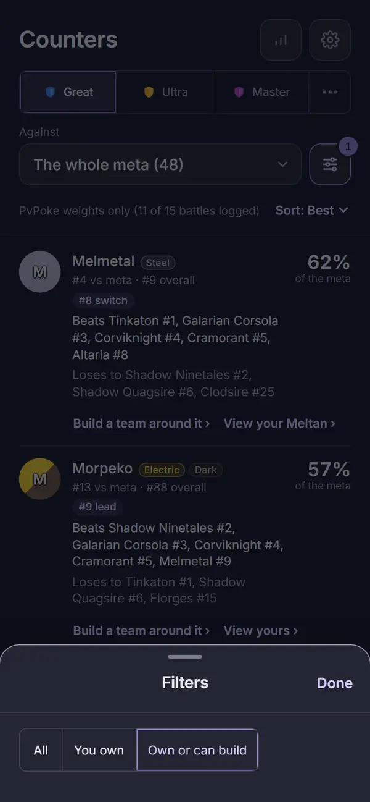 | 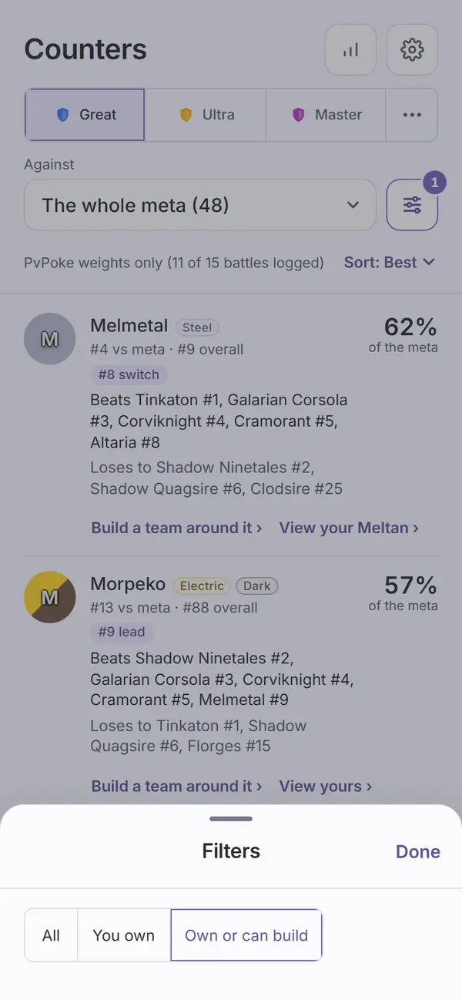 |
| `18b-counters-no-collection`: no filter icon, "Sort: Best" beside the picker, "Import your collection to mark the ones you own." on one line, rows with only "Build a team around it ›" | 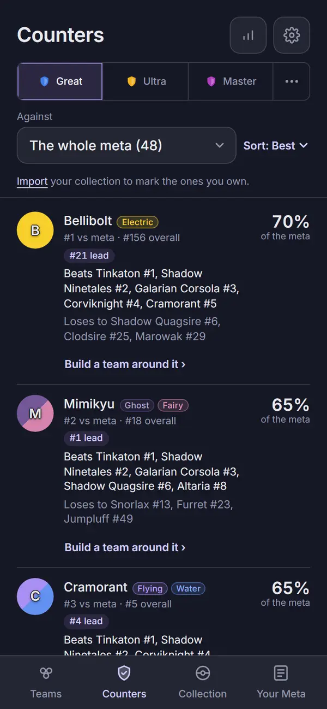 | 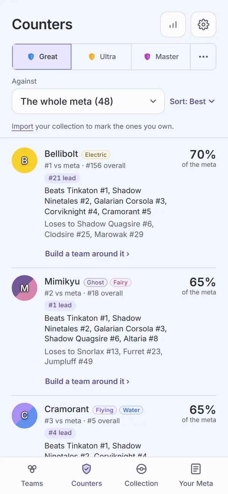 |
| `settings-hub-no-collection`: the Settings hub opened from the Counters cog (see Visible changes) | 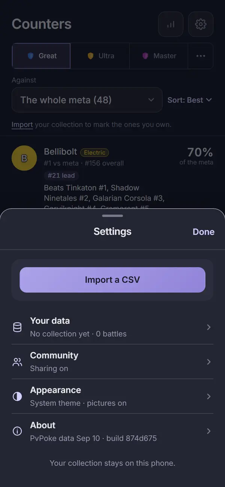 | 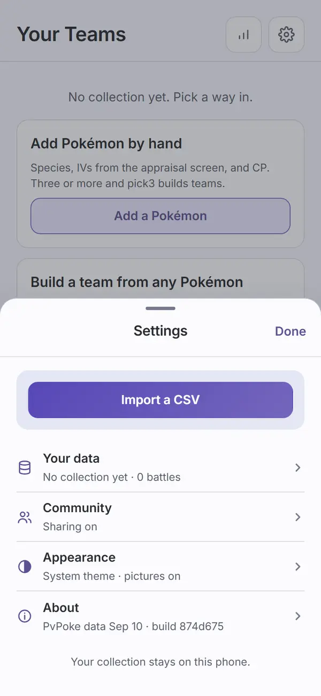 |
| `23-counters-vs`: from Your Meta, "‹ Back", "Counters" centred, the cog; "Tinkaton" in the picker; "PvPoke's movesets; your log doesn't apply"; each row's shield grid with "shields" under it; Seismitoad (9 of 9) at #1, Charizard (8 of 9) at #2 | 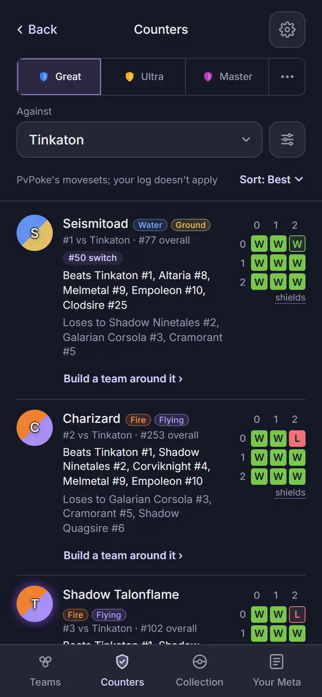 | 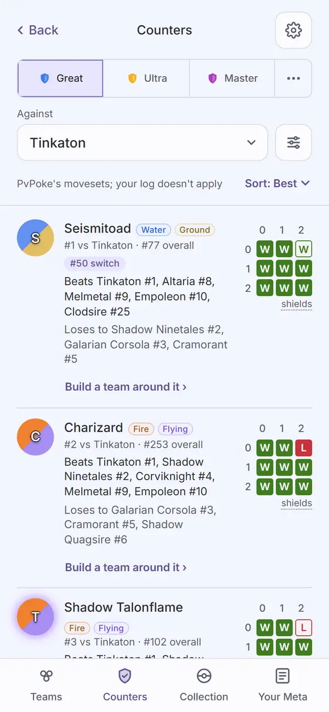 |
| `counters-vs-filling`: the same page mid-fill (the worker held at a debugger pause), scrolled to where filled grids end: one filled grid, then Shadow Milotic and Shadow Charjabug with empty cells, still in the incoming order (#31, #32) | 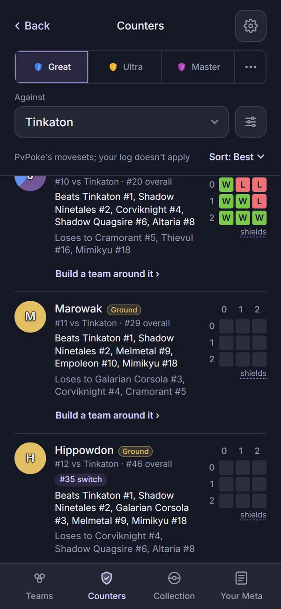 | 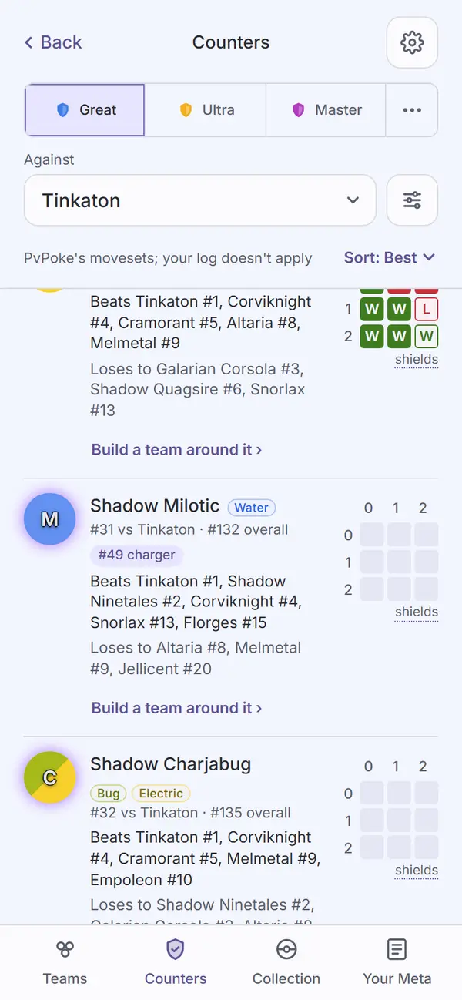 |
| `24-counters-vs-outsider`: against Shadow Dragonite (not in PvPoke's meta group, 300 species simulated on the device), grids filled, "#1 vs Shadow Dragonite ·" then "#63 overall" kept together | 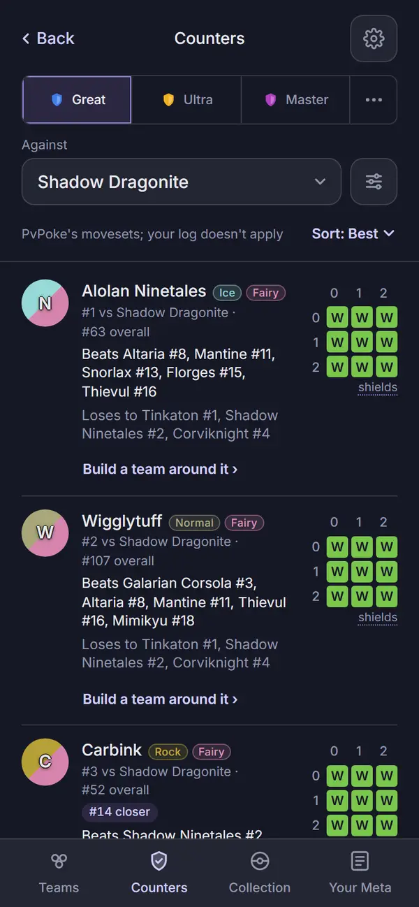 | 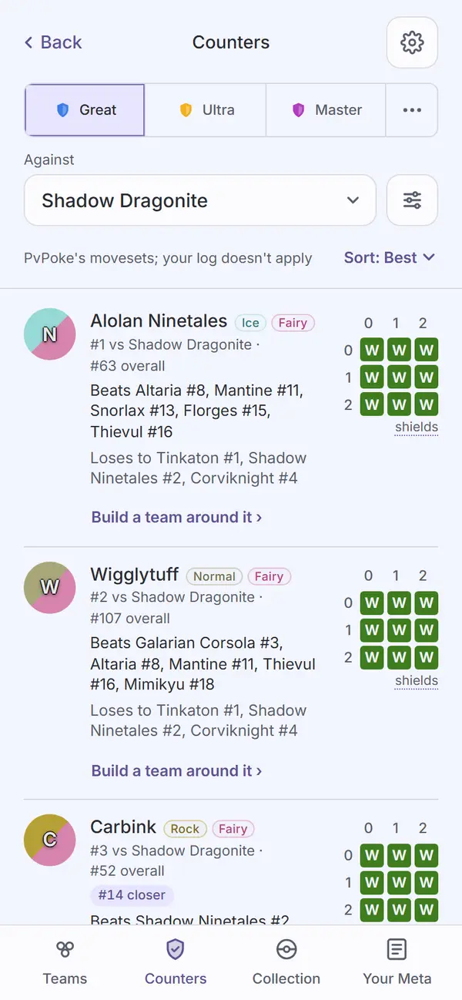 |
| `counters-against`: the Against sheet idle: the search at the top, focused, and "The whole meta ›" under it | 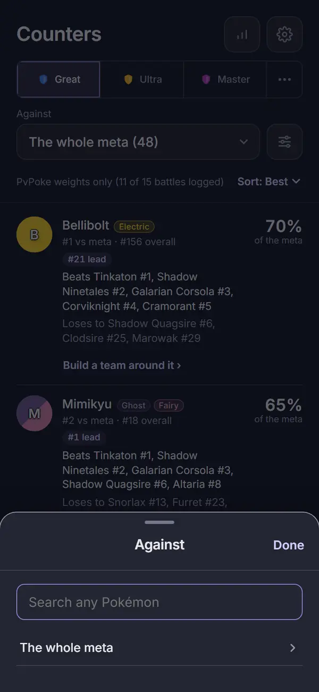 | 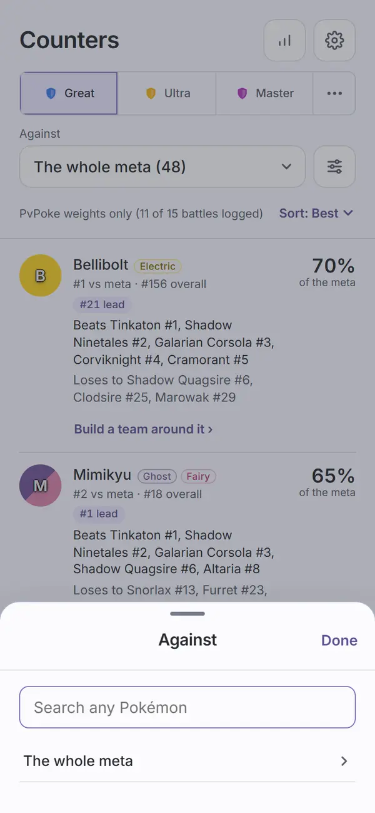 |
| `counters-against-search`: "mar" typed, 15 matches in the compact token grid, The whole meta hidden | 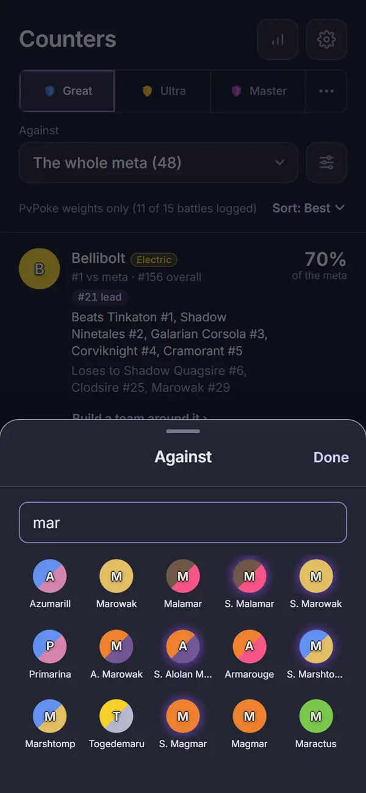 | 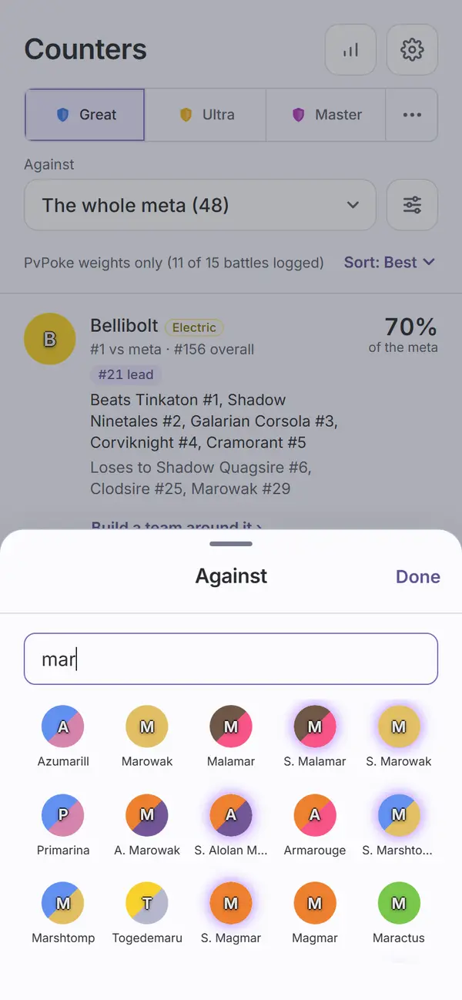 |
| `counters-against-scrolled`: the same matches box scrolled to its end (Mareanie to S. Mareep) | 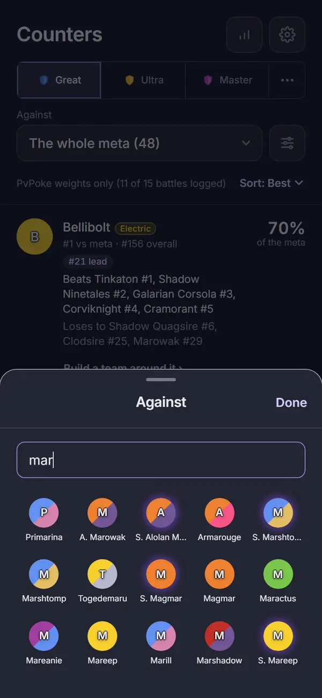 | 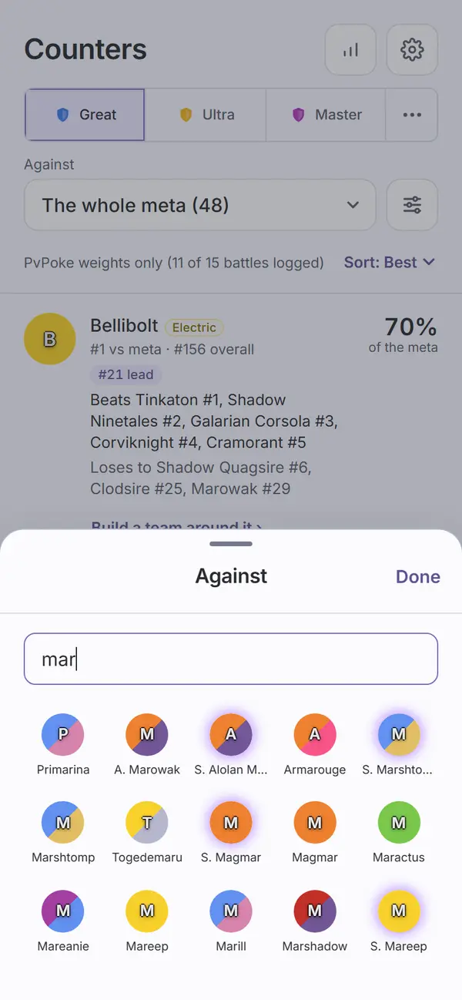 |
| `counters-unranked`: `#/counters?vs=magikarp`: "Magikarp" in the picker, the filter icon, no line and no Sort, then "PvPoke does not rank Magikarp in Great League, so pick3 has no moveset to simulate it with." | 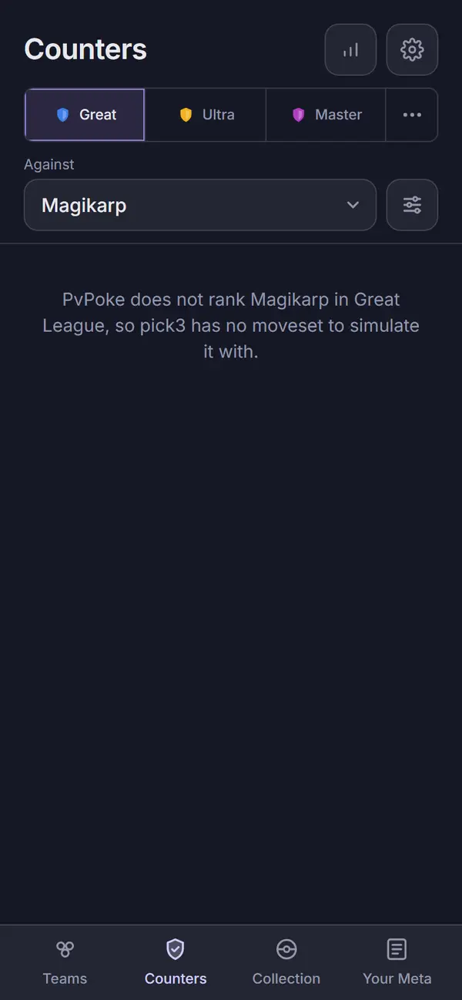 | 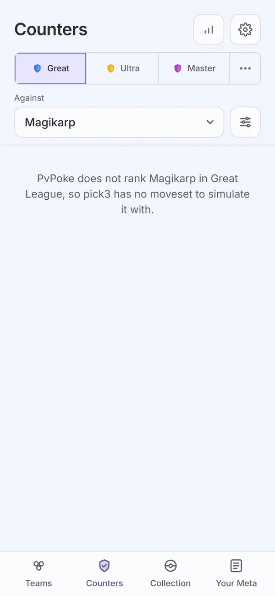 |

The script checks as it shoots: the sub header's title is centred (it logged "-0.0px") and Back
reads "Back" and lands on `#/meta`; the row link text starts on the name column ("0.0px"; fails
past 1px); `counters-filters` fails if the first row with two links wraps them; the no-collection
page has no filter icon and the exact Import line; `counters-unranked` has no line and no Sort;
`counters-vs-filling` waits for a filled cell, an empty cell and the loading bar;
`counters-against-scrolled` fails if "mar" stops filling the box.

Not captured, covered by `apps/web/test/counters.test.tsx`: the loading bar and its grid stage
("Playing every shield pairing on this phone"; in `counters-vs-filling` it is above, scrolled away);
the "shields" `Term` open; the Sort dropdown open (a native picker); "Nothing here yet. Try another
filter."

## Grid time

The spec's estimate was about 0.5 s for 720 battles (80 rows, nine each) in Node.

- **Node, desktop (Task 1):** 280 to 430 ms for 720 battles, two runs each against Altaria,
  Charjabug and Quagsire (an outsider).
- **The built app, desktop (Task 6):** the outsider run, Shadow Dragonite, took 160 to 181 ms for
  its grids across runs (165 ms in the run these images come from, after simulating 300 species;
  the whole result at 516 ms). The Tinkaton run logged 4321 ms, but that number includes the
  deliberate debugger pause that holds the worker for `counters-vs-filling`, so it is not a grid
  time. An earlier unheld probe of Tinkaton: 10 batches of 8 rows in about 210 ms.

Not measured on a phone (see Open items).

## Automated checks

- [x] `npm run web:audit` clean for this page's screens (all ten names above in `AUDIT_ENFORCED`,
      plus `settings-hub-no-collection`): the Task 6 fix round's run on the `aedfd95` code with
      `PICK3_BUILD=874d675` exited 0 with zero findings on every enforced name in both themes and
      every enforced name captured. No NEVER line; the only "Not on screen, unmeasured" lines are
      the known eight `settings-about-leaves` ones, each measured in `settings-about`. 67 findings
      remain on screens not yet redesigned (Welcome, Import, Scan list, Report, Add Pokémon), none
      failing. I did not re-run it for this record. The audit does not check text scrolled out of
      a fixed-height list (Open items); `counters-against-scrolled` covers Counters' one such list.
- [x] no console errors: the run printed no "Browser errors" section.
- [x] `npm run lint`, `npm run typecheck`, `npm test`, `npm run check-colors`, `npm run
      check-tokens`: re-run for this record on 2026-09-28 on `aedfd95`. lint exit 0; typecheck
      exit 0; 147 files, 1426 tests passed; check-colors exit 0; "check-tokens: ok". `npm run
      ui:audit` (the ui Select rule now shared with the Against picker): "gallery audit: clean in
      dark and light" in Task 6, not re-run here.

## Aesthetics

- [x] colors from tokens, in their roles: violet on what you tap (the header icons, "Sort: Best",
      the filter icon and its badge, the row links, the selected league); green and red only as
      the W and L cells of the grid, the outcome colors, as on Log a Battle (`23-counters-vs`); no
      pink (the grid is a simulation, not measured data) and no destroying
      red anywhere (all captures). `check-colors` clean.
- [x] at most four text levels, one page title: "Counters"; the row name and the score; the rank,
      Beats and Loses lines; tags, "of the meta" and the grid's axis and caption (`08-counters`,
      `23-counters-vs`). Each sheet has its own title ("Filters", "Against").
- [x] one filled primary button: none on the page, which is right, since every action is a row
      link or a control (all captures). Settings' "Import a CSV" is the sheet's own
      (`settings-hub-no-collection`).
- [x] chips tapped, tags read: the old chips are gone; the ownership choice is a `Seg` in the
      Filters sheet (`counters-filters`); types and role tags are read-only, and the overall-rank
      tag is gone from the role tags, since the rank line already has it (`08-counters`; tested).
- [x] the right header variant: `Header variant="top"` "Counters" with meta.pick3.gg and the cog
      on the tab (`08-counters`, `18b-counters-no-collection`, `counters-unranked`);
      `Header variant="sub"` with "Back", the title centred and the cog when jumped to from Your
      Meta (`23-counters-vs`, `counters-vs-filling`, `24-counters-vs-outsider`).
- [x] rows align; gutters and the 8px base hold: one gutter from the header to the last row; link
      text on the name column (measured, 0.0px); grids beside the text with room, none crowding it
      (`23-counters-vs`). Exception under Open items: a long "View your Shadow Rookidee ›" wraps to
      its own line, about 2px left of the link above it (`08-counters`, row 40).
- [ ] sprites unchanged: cannot confirm (no sprite build, see the top). No sprite code changed.
- [x] at most one line of text before the first result: the facing line, the one-opponent line or
      the Import line, each one line with Sort beside it or above it (`08-counters`,
      `23-counters-vs`, `18b-counters-no-collection`); none under an unranked opponent
      (`counters-unranked`). The two description paragraphs are gone.
- [x] light as readable as dark: eleven matched pairs, and the audit's contrast pass is clean in
      both themes.

## Functionality

- [x] every "must keep" from inventory pages 6 and 7: a counter list for any one opponent,
      simulated on the device, the top 300 for an outsider (`24-counters-vs-outsider`); per row
      the rank against this opponent, the overall rank, types, role tags, Beats and Loses with
      ranks (`08-counters`, `23-counters-vs`), ownership as "View yours ›" or "View your Meltan ›"
      (`counters-filters`), and the percentage on the whole meta (against one opponent the grid
      replaces it, your decision); the ownership filter and the paths to your Pokémon and to Build
      (tested); the honesty lines, now "PvPoke's movesets; your log doesn't apply" and the
      unranked empty state (`23-counters-vs`, `counters-unranked`); a meta.pick3.gg link lands in
      its league (tested); the facing weight line on the whole meta (`08-counters`).
- [x] every control does what its label says (tests): the cog opens Settings (and the capture now
      opens it from this cog); the picker reads "The whole meta (48)" or the opponent and opens
      Against; typing filters species, The whole meta shows only with an empty search; choosing
      replaces the history entry and keeps the back mark; Sort offers Best and Under the radar;
      the Filters `Seg` filters rows and the icon reads "Filters, 1 on"; "Build a team around it ›"
      sets Build's lead and goes to Build; the View links open the Pokémon's page.
- [x] back returns to the origin with filters and scroll: Back from a jump returns to Your Meta,
      even after trying several opponents (tested; the script checks it lands on `#/meta`); Back
      from a Pokémon's page returns with the filter, the sort and the scroll (tested,
      `scrollTo(0, 240)`); each list keeps its own scroll (tested). One gap by ruling 11.
- [x] input layout rule: the Against sheet puts the search first, the matches directly under it
      in a fixed-height box that scrolls on its own, and The whole meta last, hidden while
      searching (`counters-against`, `counters-against-search`, `counters-against-scrolled`).
- [x] icon buttons named; focus visible: "Settings", "meta.pick3.gg, the community meta",
      "Filters" or "Filters, 1 on", the picker named by its label and value ("Against Tinkaton"),
      the Sort combobox named "Sort", the grid read as "Wins N of 9 shield pairings" (tests); the
      picker shares the ui Select's focus ring.
- [x] product rules: everything runs on the device; no new outbound call; `index.html` and
      `connect-src` unchanged; the collection stays in IndexedDB. Assumptions: the one-opponent
      line and the "shields" `Term` say what each cell is (PvPoke's movesets and default IVs).
- [x] tests cover the new behavior: `apps/web/test/counters.test.tsx` (23 tests: headers and
      Back, the picker and the Against sheet, replace-navigation, the line and Sort, the Filters
      sheet, no collection, rows not links, the grid and its `Term`, the links, the round trip,
      loading and empty cells, per-list scroll, re-sort in place, both empty messages);
      `countersGrid.test.tsx` (5: the stream, drops on a league or opponent change, grids keep
      filling off the page, the WorkerHost routing); `shieldGrid.test.tsx` (6);
      `packages/engine/test/counters/counters.test.ts` (the grid, its order, batches, the
      movesets); `store.test.tsx` and `yourMetaScreen.test.tsx` (the back mark).

## Findings and fixes

| Finding | Fix | Commit |
| --- | --- | --- |
| Task 1: an opponent in PvPoke's meta group battled at its rankings moveset in the grid, but at its meta-group moveset in the matrix that chose the 80, so equal-shield cells could disagree with the list for 3 Great League species (Shadow Forretress, Shadow Sableye, Talonflame). | The meta group's moveset (ruling 9). | `929a4b3` |
| Task 1 review, Important: an outsider's grid moveset differed from the one its simulated column used, for 18 species in Ultra and Master. | One helper for both. | `b1014b6` |
| Task 1 review: a species the meta group lists twice (Shadow Forretress) took its last listing. | Its first listing, the matrix's first column. | `b1014b6` |
| Task 2: a dropped run's half-filled rows could show later, looking finished with empty cells. | A drop also clears them. | `c82d74c` |
| Task 5 review, Important: one shared scroll key restored the whole meta's offset onto an opponent's list. | One key per list. | `1d43539` |
| Task 5 review: the Against search did not take focus (the sheet took it back). | The search takes focus after the sheet's own. | `1d43539` |
| Task 5, looking: "Sort: Best" wrapped under a long line; two row links wrapped onto two 44px lines. | Sort does not wrap; the links row spans the row. | `a15920f` |
| Task 6: without a collection the Import line wrapped, leaving "own." alone beside Sort. | Copy kept; Sort moves beside the picker (ruling 16). | `f694bb7` |
| Task 5 review: the picker copied the ui Select's CSS. | The ui rule covers both (Visible changes). | `f694bb7` |
| Task 6: "#1 vs Shadow Dragonite · #63 overall" broke before "overall". | A no-break space keeps "#63 overall" together. | `f694bb7` |
| Audit: the Filters `Seg`'s "All" was 39x44. | 44px wide. | `f694bb7` |
| Task 6: the audit did not report Against matches scrolled out of the box. | `counters-against-scrolled` (ruling 18); the tool fix is ruling 12. | `f694bb7` |
| Controller, on `23-counters-vs`: the row links started at the row's left edge, under the token. | They start on the name column; the script measures it. | `aedfd95` |
| Task 6 review: under an unranked opponent, the one-opponent line and Sort sat over nothing. | Both hidden there (ruling 17). | `aedfd95` |

## Rulings

From the plan:

1. **The grid uses the matrix's inputs:** PvPoke default IVs, the rankings' movesets, the league's
   CP cap, the same battle settings; each cell is the simulator's rating. Ruling 9 refines the
   opponent's moveset. [If wrong: the grid disagrees with the list it sits in.]
2. **Order against one opponent:** cells won out of nine, then the mean rating, then PvPoke's
   overall rank. While grids fill, rows keep their first order; the list re-sorts once at the end.
   [If wrong: one sort.]
3. **Streaming:** rows first with empty grids, then a batch of 10 grids at a time, then the sorted
   result with the grid time; anything from a run whose league or opponent changed is dropped.
   [If wrong: rows wait for all 80 grids.]
4. **The back mark is `from=1` on the link.** Your Meta's "Who beats it" adds it; the Against
   picker keeps it. [If wrong: one link parameter.]
5. **The Against sheet searches Log a Battle's species list**, in the same compact token grid and
   cap; "The whole meta" is last, hidden while searching. [If wrong: the sheet's source.]
6. **Filters is a `Seg` in a sheet; Sort is an inline dropdown;** the filter count is 1 when the
   filter is not All. [If wrong: two controls.]
7. **Capture names** as listed above; `09-counters-own` is gone with the chips. [If wrong: names.]

From the controller during the build:

8. **Dead components go with their tests:** `MetaButton` is removed with its test; `HeadCog` stays,
   since the older header (Import, Shared team, Add Pokémon) still uses it. [If wrong: re-add one
   small component.]
9. **A meta-group opponent battles at the meta group's moveset** (the one that chose the 80); an
   outsider at its rankings moveset (the one its simulated column used). [If wrong: a one-line
   swap; 3 Great League species show different equal-shield cells.]
10. **The grid's "Wins N of 9 shield pairings" label stays on Log a Battle's card too.** It adds
    the count the one-word verdict lacks. [If wrong: one extra announcement per member for
    screen-reader users.]
11. **Going back to an opponent already visited in the Against sheet keeps the current scroll,**
    not that list's saved one. Nothing wrong lands. [If wrong: a scroll, on a rare path.]
12. **The audit's scroll-clip gap is fixed in this branch's final fix wave,** with a full
    `web:audit` re-run. [If wrong: a bigger final wave, possibly new findings on signed pages.]

Made while building:

13. **The host's `counters` call gained `league?` before `onPartial?`,** to match the worker host.
    [If wrong: a parameter order.]
14. **Grids keep filling when you step off Counters** (to a Pokémon's page); only a league,
    source, window or opponent change drops a run. [If wrong: compute spent off the page.]
15. **A dropped run clears its half-filled rows** (see Findings). [If wrong: a moment of Loading
    on return.]
16. **Without a collection, Sort sits beside the Against picker** (there is no filter icon then),
    so the spec's Import line fits one line. [If wrong: Sort's place (Open items).]
17. **An unranked opponent shows no line and no Sort;** the empty message explains it. The spec
    lists the line for both modes. [If wrong: one line back.]
18. **`counters-against-scrolled` is a tenth enforced capture,** for the rule that a scrolling
    sheet list needs a scrolled capture. [If wrong: one capture.]

## Visible changes outside Counters

- **The shield grid is shared** (`apps/web/src/components/ShieldGrid.tsx`, moved from Log a
  Battle's `OpponentCard`). Log a Battle looks the same: `21-log-battle` and `log-battle-card`
  match their signed images (compared in Task 6; I compared `log-battle-card` side by side
  again). For screen readers its grid is no longer hidden: it reads "Wins N of 9 shield
  pairings" (ruling 10). New: empty cells while a row fills, and a larger row size.
- **The route's back mark:** `#/counters?vs=<id>&from=1`. Your Meta's "Who beats it" links carry
  it; meta.pick3.gg links never do, so they get the top header.
- **The grid in the engine and the worker:** `counterGrids` and `CounterEntry.grid` in the engine;
  the worker streams rows, then grids, then the result with `gridMs`; a new progress stage. The
  engine's `specFor` is now exported. Whole-meta Counters is unchanged.
- **The ui Select's rule is shared with the Against picker** (`packages/ui/base.css`,
  `.select-wrap > button`): same look and focus ring, no change to any Select (`ui:audit` clean).
- **`MetaButton` is removed,** with its test and CSS; `.head-link`, `.counter-own` and the old
  row-link CSS went too. `MetaTags` can leave out the overall-rank tag.
- **The Settings no-collection shot is back on the Counters cog,** restoring the check that
  Counters' cog opens Settings (Settings' round-3 open item). `settings.md` has an after sign-off
  note; its image pair is replaced (the page behind the sheet is now Counters).
- **`screens.mjs`:** ten Counters captures, all enforced; it logs the grid time through a Worker
  wrapper (automation only; the app has no hook).

## Open items for Travis

- **Sort moves when there is no collection:** beside the Against picker
  (`18b-counters-no-collection`) instead of on the line (`08-counters`), so the Import line fits
  one line (ruling 16). Keep, or shorten the Import line and keep Sort in one place.
- **Two row links share a line only for short names.** "Build a team around it ›  View your
  Meltan ›" fits; "View your Shadow Rookidee ›" wraps to its own line, about 2px left of the link
  above it (`08-counters`, Shadow Corviknight, row 40). Keep the wrap, or stack the links always.
- **The sub header carries only Settings,** not the meta.pick3.gg link, as on the Pokémon page
  (`23-counters-vs`). Say if it should carry both.
- **The audit tool does not check text scrolled out of a fixed-height list** (it trusts axe, which
  skips clipped text). Being fixed in this branch's final fix wave (ruling 12), with a full
  re-run; until then `counters-against-scrolled` covers Counters. Log a Battle's and New set's
  token boxes may hide the same.
- **The Teams Filters sheet's title is left-aligned;** Counters' sheets and Settings centre theirs.
  Not changed here.
- **A failure is said only on the whole meta with a collection.** When counters cannot be computed,
  the page gets no rows and the reason "Counters could not be computed" in the facing line. The old
  page always showed that line; now it shows only on the whole meta with a collection. Against one
  opponent, or without a collection, a failure reads "Nothing here yet. Try another filter."
  Not tested, not captured.
- **Grid time on a phone:** measured only on a desktop (Grid time). `gridMs` is in the result but
  shown nowhere, so a phone check needs the dev tools.
- **Smaller, deferred during the build:**
  - An import while grids are filling can re-land rows with the old owned marks.
  - The last batch posts one extra unsorted partial before the result; the host's comment says
    partials always come with an opponent (not for an unranked one); no unit test for the
    worker's no-grid branch.
  - The engine test's 2-shields-against-0 check holds for the fixture's pairs only; `gridMs` also
    times the final sort.
  - No test for `from=1` without an opponent.
  - `counters-vs-filling` can race on a fast machine (it fails loudly if so).
  - Long names in the Against grid are cut ("S. Alolan M...", "S. Marshto..."), as in Log a
    Battle's grid (`counters-against-search`).

## Sign-off

- [ ] Travis, <date>
