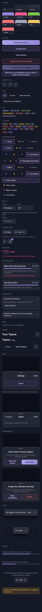
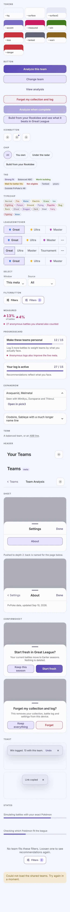

# Audit: component gallery

Piece: 1. Inventory entry: none: the gallery is the foundation's own page.
Intake entry: none: the gallery is the foundation's own page.

## Screenshots

Dark and light at 390px, every foundation component in every state, one page per theme.

| State | Dark | Light |
| --- | --- | --- |
| gallery |  |  |

## Automated checks

- [x] `npm run ui:audit` clean for the gallery, 2026-09-24: `gallery audit: clean in dark and
      light` (0 findings, exit 0), re-run after the final fix wave with the two checks it added:
      clipped content inside an element, and axe's undecided (`incomplete`) contrast nodes
      reported as "contrast unverified"
- [x] no console errors (the gallery's own favicon 404 was fixed in Task 12; `ui:audit` fails on
      any console error and passed)
- [x] `npm run lint`, `npm run typecheck`, `npm test`, `npm run check-colors`, `npm run
      check-tokens` all clean, 2026-09-24

## Aesthetics

- [x] colors from tokens, in their roles (violet interaction, pink measured with its mark,
      outcome colors, red only for destroying data): the gallery's own sections (Button, Chip,
      Tag, TypeChip, Toast, ConfirmSheet, Header, Sheet, etc.) draw every color from
      `packages/ui/tokens.css`; `check-colors` enforces no literal outside it
- [x] at most four text levels, one page title: the gallery has no page title of its own, only
      per-section `<h2>` labels at label size; each example carries its own label, not a
      competing title
- [x] one filled primary button: `Button` section shows one enabled filled `variant="primary"`
      example (plus its disabled state) among the secondary, text and danger variants. Its white
      or dark text sits on a gradient axe cannot measure, so `packages/ui/test/contrast.test.ts`
      checks `--on-accent` against both gradient stops in dark and light (all clear 4.5:1), and
      the button carries `data-audit-contrast="static"` so the audit leaves it to that test
- [x] chips tapped, tags read: `Chip` section demonstrates the pressable chip (selected,
      unselected, a long label), `Tag`/`TypeChip` sections demonstrate the read-only label, kept
      visually distinct
- [x] the right header variant: `Header` section shows both variants (top-level and `sub`, with
      its back control) side by side
- [x] rows align; gutters and the 8px base hold: gallery sections use the shared `base.css`
      spacing scale, checked visually against both screenshots
- [x] sprites unchanged: the gallery does not render Pokémon sprites (props-only components, no
      game data), so nothing to regress here
- [x] at most one line of text before the first result: the gallery page opens directly on the
      first component section, no preamble copy
- [x] light as readable as dark: this is what `ui:audit`'s per-theme `color-contrast` pass
      checks; clean in both themes as of the 2026-09-24 run

## Functionality

- [x] every component in every state is present: Button (primary/secondary/text/danger,
      default and disabled, a long label; pressed is the `:active` press-in shared with chips,
      live on tap and not in a static capture), Chip (unselected/selected, a long label; chips
      have no disabled state), Tag (every `tone`), TypeChip (all 18 types, plus the small size),
      LeagueSwitcher (three leagues, with the overflow, the current cup in the overflow slot, a
      current cup with a long name that collapses the leagues to shields-only, compact, compact
      with the current cup, and a `LeagueList` sheet page),
      Header (both variants), Sheet (root page, and a second frame pushed to depth 2 with its
      back control), ConfirmSheet (default and danger), Toast (one with its once-only action,
      one without), loading/empty/error states, at 390px, in both themes
- [x] every control does what its label says: exercised through the `ui` vitest project
      (component behavior tests) plus the visual pass in both screenshots
- [x] tests cover each component: `npx vitest run --project ui` covers every component shown in
      the gallery (12 files, 67 tests as of fix round 1)
- [x] icon buttons named: every IconButton in the gallery is rendered with a `label` (Settings,
      Filters on, Open meta.pick3.gg, Share this team), which is its accessible name
- back returns to the origin, input layout rule, product rules: not applicable, the gallery is
  a props-only showcase with no navigation, inputs, or app data

## Findings and fixes

| Finding | Fix | Commit |
| --- | --- | --- |
| Gallery's own favicon request 404'd, failing the audit's console-error check | Added `packages/ui/gallery/favicon.svg` and a `<link rel="icon">` in `packages/ui/gallery/index.html` | f3cac98 |
| `.back` rendered as a plain `<button>` with no CSS reset, so Chrome's native dark-mode button fill painted behind the accent text (1.65:1 contrast) | Added `border: 0; background: transparent; font: inherit; cursor: pointer;` to `.back` in `packages/ui/base.css` | f3cac98 |
| `.back` text used `--accent`, short of 4.5:1 on `--bg` in light (4.09:1) | Swapped `.back`'s color to `--accent-text` (6.23:1 in light) | f3cac98 |
| `.league-switcher button` idle segments used `--faint`, short of 4.5:1 in both themes (4.08:1 dark, 3.96:1 light) | Swapped idle segment color to `--muted` (6.08:1 dark, 6.02:1 light); updated the stale comment in `apps/meta/src/app.css` | f3cac98 |
| `.ui-btn-danger` background tint gave 4.18:1 (dark) / 4.28:1 (light), short of 4.5:1 | Reduced `--danger-tint` alpha (dark 0.16 to 0.08, light 0.12 to 0.04) in `packages/ui/tokens.css` | f3cac98 |
| `.tchip` type-chip fill failed 4.5:1 for 8 of 18 type colors in light mode | Introduced a `--tchip-fill` token (16% dark, 4% light) so `.tchip`'s background reads `var(--tchip-fill)`, fixing light without changing dark's already-passing contrast | 4c18df2 |
| `.ui-tag-win` / `.ui-tag-loss` fill gave 3.78:1 / 3.84:1 in light against an unpredictable ground | Anchored the tint to `--surface` at a fixed 5% instead of `transparent` at 16% (light win 4.59:1, loss 4.75:1) | f3cac98 |
| Toast was at most half the viewport wide (`left: 50%` with a translate): 195px at 390px, the message on three or four lines, Undo out of view | Centered between the gutters with auto margins and `width: fit-content`; "Win logged. 13 with this team." plus Undo is one line, 309px wide at 390px. Gallery frames are tall enough, and a second toast shows the no-action form | 874887f |
| A ConfirmSheet inside a Sheet page: Escape cancelled the confirm and then closed the whole Sheet; Tab ran both focus traps | Sheet and ConfirmSheet stop Escape and Tab after handling them; tests for the nested Escape and the Sheet's Tab wrap-around | 874887f |
| Four leagues plus the overflow did not fit at 390px: 339px of content in a 306px box, "Tournament" cut under the "..." button, and the audit passed because the overflow stayed inside `.league-row` | Segments may shrink and size by their names when there are four or more; the shields step aside only below the width four leagues need (360px, 300px compact), and a name ellipsizes only as a last resort. Three leagues unchanged. The audit now reports clipped content inside any element | 874887f, 8702511, 668fcc2 |
| axe's undecided contrast nodes counted as passes; the primary button's white on the `#796cbf` gradient end was 4.46:1 in light | The audit reports them as "contrast unverified". New `--accent-lo` token for the gradient's second stop (dark unchanged at `#9184d9`, light `#7466bc`, 4.81:1); a unit test checks both stops in both themes, and the primary button is marked `data-audit-contrast="static"` | 874887f, 668fcc2 |
| The shared Select was unstyled outside meta: its label, box and chevron rules lived only in meta's app.css | Moved into `packages/ui/base.css`, tokens only; meta renders the same | 874887f |
| ConfirmSheet: a fast double tap could run `onConfirm` twice before the parent unmounted it | `onConfirm` runs at most once per mount, with a test | 874887f |
| The gallery measured in the fallback font and without the apps' `box-sizing: border-box` (a full-width control measured 2px wider than in the apps) | Inter loaded as in apps/web; border-box sizing in `gallery.css` | 874887f |
| Tap-target check flagged visually hidden inputs behind a styled label and skipped `summary`, switches and checkboxes | Skips 1 by 1 or clipped elements and inputs inside a label of at least 44 by 44; `summary`, `[role="switch"]` and `[role="checkbox"]` added | 668fcc2 |
| The four-leagues-drop-shields fix (previous row) still cut it close, and does not generalize past a single extra cup: the league row now shows only the open leagues (Great, Ultra, Master, always with shields and names) plus a "..." overflow that opens a `LeagueList` sheet of every league and cup; the current cup shows in the overflow slot instead of "...". At a 350px row (gallery, 390px viewport) even one cup's name next to three full league names does not fit, so `LeagueSwitcher` measures the fit in a layout effect and, when clipped, hides the open leagues' names (shields only, kept in the accessibility tree) to free the room; only if the cup's name still does not fit does it ellipsize in its own slot | New `LeagueList` component; `LeagueSwitcher`'s `more.current`; `packages/ui/base.css`'s league-row/league-more rules rebuilt as a content-driven grid so the three leagues never lose a letter to an even flex split; `apps/web/src/components/LeagueSwitcher.tsx` filters to `kind === 'standard'` for the row and opens a `Sheet` with every league for the overflow | 826095f, 6d7e22b, a91f826 |
| Fix round 1 (review of the row above): the Leagues sheet rendered inline inside `.page-head`'s own stacking context, so the app's fixed tab bar (a later sibling, lower z-index) still painted over it and the Tournament row could not be tapped; collapsed shield-only radios measured 29x44, under the 44px rule; the collapse decision went stale once the web font replaced the fallback font's (narrower) metrics, only re-measuring on a row resize the font swap never causes; the row left empty space trailing the cup once collapsed instead of filling its width; the plain three-leagues-plus-"..." row, now floored at each league's max-content width, overflowed at 320px; `.league-more` rendered the cup's name in the platform's default button font, not the app's; the original "about 381px" figure in this file's own previous row was never measured in a real browser | `Sheet` and `ConfirmSheet` render through `createPortal` (to `document.body` by default, or an explicit `container` prop for the gallery's own mock phone frames, which rely on a CSS descendant selector to keep several open at once without covering each other); `.league-row.collapsed .league-switcher button` gets `min-width: var(--tap)`; the layout effect now observes the radiogroup and the cup slot (not only the row, which does not resize on its own) with a `ResizeObserver`, and also re-measures on `document.fonts`' `loadingdone` and `ready`, both guarded for environments without `document.fonts`; the radiogroup's grid columns float to `minmax(max-content, 1fr)` (protecting every league's full name) only once a cup is current, `minmax(0, 1fr)` otherwise (the original, always-shrinkable behavior); the radiogroup keeps `flex-grow: 1` with a cup current so the row still fills its width; `.league-more`'s cup slot gets `font: inherit; font-size: 13px; font-weight: 500`, matched in `apps/web/src/app.css`'s compact rule; measured with the reviewer's own puppeteer scripts against the real app and gallery (table in the report's "Fix round 1" section) | (this change) |
| After sign-off, from the Your Teams final review (I2): the top header (`Header variant="top"`, `.ui-top`) padded itself (safe-area inset plus 20px, a gutter each side) inside `.g-page`, which already pads, so the gallery's two top headers sat one gutter in from the section and counted the top inset twice | `.ui-top` has no padding of its own; the head container (the gallery's `.g-page`, web's `.page-head`) owns the gutter and the inset. `ui:audit` re-run 2026-09-25: clean in dark and light; both gallery images recaptured, the top headers now sit on the section's gutter (the sub header keeps its own padding, as before) | 59ac5d2 |

## Visible changes in the live apps

These are the changes from Piece 1 (Foundation) that are now visible in `apps/web` and
`apps/meta`, beyond the gallery and its tooling, for sign-off:

- Sub-page back links move from `--accent` to `--accent-text` in both apps (paler in dark).
- League switcher idle labels move from `--faint` to `--muted`.
- Type chips get a lighter fill in the light theme only (dark unchanged).
- The danger button and win/loss tags get lighter fill changes.
- Chips and league segments grow to 44px.
- Meta's Window and Source selects now print their labels.
- Buttons and chips press in slightly (`scale(0.97)`) while held.
- Cups (Tournament) move behind a "..." button; the league row always shows its shields.
- Every Sheet and ConfirmSheet (Settings, Leagues, the log-a-battle and new-set confirms, and
  everywhere else either appears) now renders through a portal to `document.body`, fixing a real
  bug: opened from inside the sticky page header, the Leagues sheet's last row sat under the fixed
  tab bar and could not be tapped.

## Sign-off

- [x] Travis, 2026-09-25 (reviewed the pushed build and this record on GitHub: "Looks good.")
