# Audit: Log a Battle

Piece: 3. Inventory entry: `docs/design/inventory/2026-09-22-inventory.md`, page 5 (Log a Battle).
Intake entry: `docs/design/inventory/2026-09-23-design-intake.md`, "Log a Battle (2026-09-24)",
design 5 ("Feedback: result colors, saved feedback") and the confirm sheet notes. Spec:
`docs/superpowers/specs/2026-09-26-design-play-design.md`, "Log a Battle" section, and "Editing a
logged battle: data and the counter worker".

A note on sprites: this worktree's game data was built with `PICKTHREE_SKIP_SPRITES=1` (no network
access to PokeAPI during this task), so every capture below shows the type-colored token-letter
fallback instead of a sprite, exactly as on the signed Teams, Build and Team Analysis records. The
live site at pick3.gg builds with sprites and shows those instead; nothing on this branch touched
sprite rendering itself.

## Screenshots

Dark and light at 390px, one pair per state, converted to WebP (600px wide, quality 72), from
`apps/web/screenshots/<name>-{dark,light}.png` (`npm run web:audit` run, 2026-09-26, on
`7a40b6a`; re-run for the final fix wave on `e80cc9c`, where `log-battle-likely`,
`log-battle-saved` and `log-battle-edit` changed and were re-converted, and the other three
converted byte for byte identical). `21-log-battle`, `log-battle-card` and `log-battle-edit` are
full-page; `log-battle-likely`, `log-battle-saved` and `log-battle-wide` are viewport shots (the
first two mid-flow, where a full-page shot would add nothing new below the fold; the wide shot is
1280×900, the width and height alone, not a phone viewport).

| State | Dark | Light |
| --- | --- | --- |
| `21-log-battle`: empty. `Header variant="sub"` "Log a Battle" / "0 logged with this team", Back; the team strip (Shadow Greninja, Melmetal, Galarian Corsola); the search "Search any Pokémon"; "Add all three opponents when you can. One or two still helps."; three dashed empty slots; Win/Loss/Tanked at the foot with "What is Tanked?" under them | 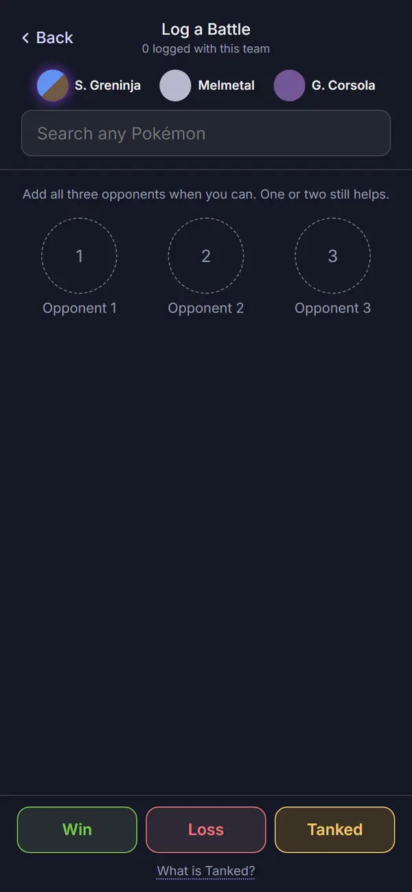 | 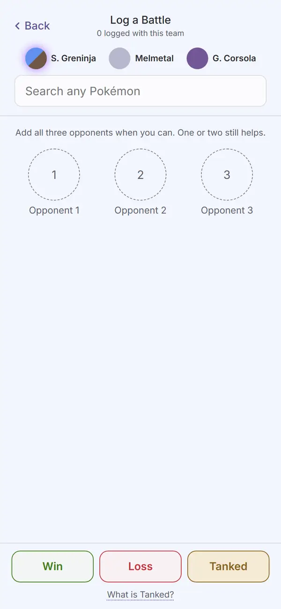 |
| `log-battle-card`: two opponents slotted (Tinkaton, Galarian Corsola), the grid folded, the in-battle card open on Galarian Corsola: moves with counts and effectiveness (1/2, 1x, 2x), the shield grid (Wins / Mixed / Mixed; row = your shields, column = theirs; six close cells, outlined rather than filled: S. Greninja 0/0 W and 1/2 L, Melmetal 0/0 W and 2/2 W, G. Corsola 0/0 L and 2/2 L; the other 21 solid), the reads line (full page) | 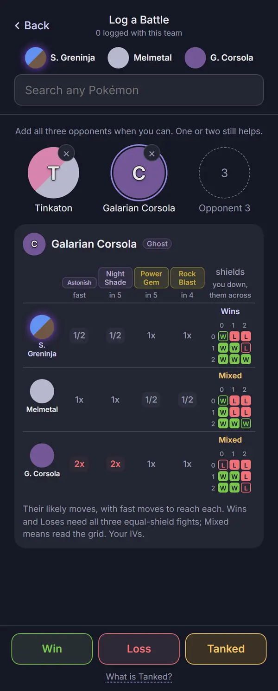 | 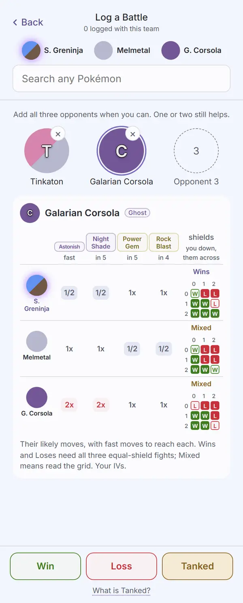 |
| `log-battle-likely`: one opponent slotted (Medicham), the search still focused and open, "Often with Medicham" leading the panel with six ranked names (Azumarill, Clodsire, Lanturn, Registeel, S. Dragonite, S. Swampert), Recent under it with those six left out | 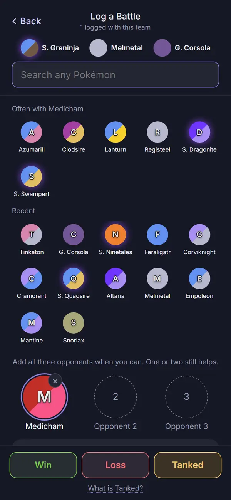 | 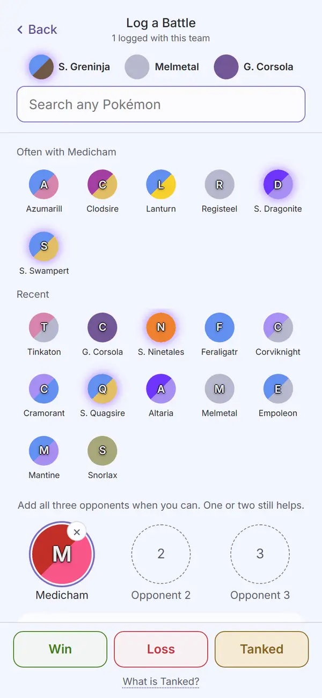 |
| `log-battle-saved`: after a Win is logged, the neutral info notice sitting at the foot just above the Win/Loss/Tanked bar, the slots cleared back to empty. Each theme's shot taps the last notice away and logs its own Win for a fresh one (final review M2), so dark reads "Win logged · 2 with this team" and light "Win logged · 3 with this team", the sub-line "2 logged" and "3 logged" to match; the set is put back as it was after the step | 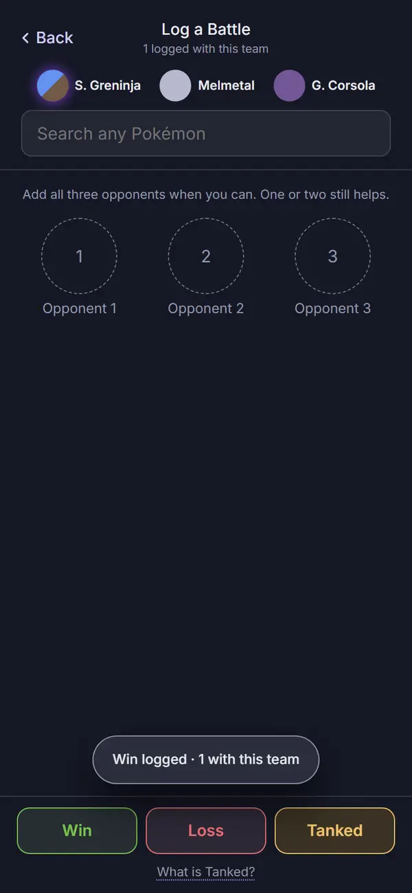 | 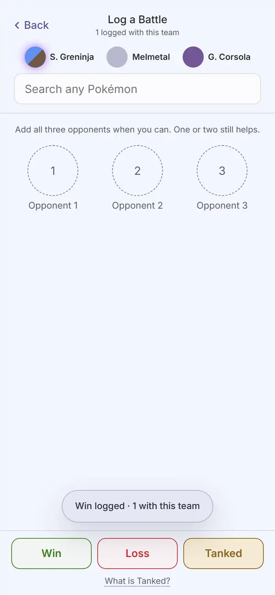 |
| `log-battle-edit`: opened from a "Loss against ..." result chip on Your Meta. "Edit battle" / "Logged Sep 26, 1:00 PM" (the seeded battle's time follows the run's clock); the battle's three opponents fill the slots (Azumarill, Clodsire, Shadow Dragonite, the last wrapping to two lines with no ellipsis); Loss is pressed (filled); the primary reads "Save changes" | 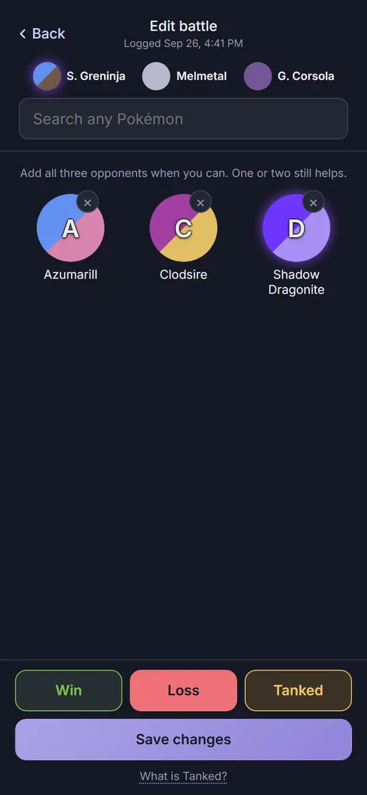 | 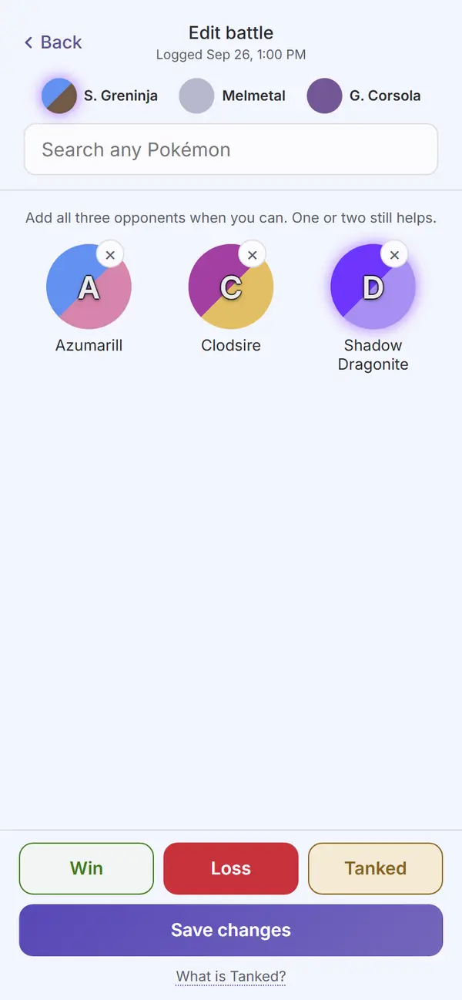 |
| `log-battle-wide`: 1280×900. Header and team strip span the full width; search, the hint line and the three slots sit in the left column; the in-battle card sits beside them in a right column; Win/Loss/Tanked span the width at the foot | 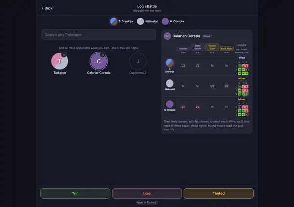 | 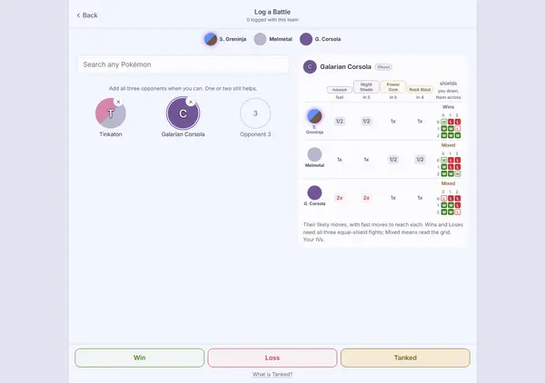 |

Not captured, all string- or timing-driven states rather than layout differences: the no-open-set
redirect to New Set (a defensive path, covered by `apps/web/test/newSet.test.tsx`'s "Cancel escapes
Log a Battle's own no-set redirect" describe block, which drives the real router from Log a Battle
with nothing running to New Set and checks the redirect replaces its history entry); the
in-battle card's loading state (shared `Loading`, the same component audited elsewhere); the
transient "saving" moment between a result tap and the toast landing; a slot's remove (×) mid-tap.

**The likely-teammates capture is a test harness, not a shipped capability shown live.** The board
read (`communityCores`) is gated on `shareEligible()`, which returns false under Puppeteer's
`navigator.webdriver` flag. To shoot `log-battle-likely`, the capture script (a) answers
`/api/v1/teams` with a synthetic fixture (`fixtures/community-teams-sample.json`, three invented
Medicham cores, never real community data) the same way `communitySample` already answers
`/api/v1/meta` elsewhere in the script, and (b) for that one step only, redefines
`Navigator.prototype.webdriver` to `false` and sets the `pickthree.shareDev` localStorage key,
which lifts the automation gate without touching any app file. The script removes the key and
reloads immediately afterward and asserts `navigator.webdriver` is `true` again, and it refuses
every non-GET request to the worker origin with a synthetic 503 for the whole run, so the lifted
gate cannot post a real battle, hit or error while it's open. No app code changed to make this
capture possible.

## Automated checks

- [x] `npm run web:audit` clean for this page's screens (listed in `AUDIT_ENFORCED`), run
      2026-09-26 on `7a40b6a`, and again for the final fix wave on `e80cc9c`: exit 0 both times.
      Zero findings on `21-log-battle`, `log-battle-card`, `log-battle-likely`, `log-battle-saved`,
      `log-battle-edit` and `log-battle-wide`, in both themes. 693 findings remain on screens not
      yet redesigned, none failing the run.
- [x] no console errors: the run printed no "Browser errors" section.
- [x] the run's own guards, all passed:
  - `assertTitleCentred` holds on both "Log a Battle" and "Edit battle" (printed offsets of
    `-0.0px` in this run, within tolerance);
  - the seeded/likely-teammates fixture answers `/api/v1/teams` with a URL that never names the
    opponent (the same privacy property the app's own gate enforces);
  - the likely-teammates automation lift is undone and asserted reversed
    (`navigator.webdriver === true` again) before the run continues;
  - every non-GET request to the worker origin is refused for the whole run, so the lift cannot
    send a real battle, hit or error;
  - the edit-mode step opens from a real result chip tap, waits for "Edit battle", and confirms
    three filled slots and a pressed result before shooting;
  - `log-battle-card` fails the run if any `.opp-slot .small` name overflows or ellipsizes (it
    passed: "Galarian Corsola" is whole on one line in both themes);
  - `log-battle-saved` fails the run if the notice sits outside 4-24px above the result bar, or
    below the sticky head; it passed in both themes;
  - the restore steps confirm no state leaked between steps: the running set is put back after
    Your Meta's seeded capture and again after `log-battle-saved`, so `21-log-battle` and
    `log-battle-likely` both read "0 logged with this team" against Your Meta's seeded "3-2" (on
    `7a40b6a`, before the second restore, `log-battle-likely` inherited the saved step's Win and
    read "1 logged").
- [x] `npm run lint`, `npm run typecheck`, `npm test`, `npm run check-colors`, `npm run
      check-tokens`, all re-run 2026-09-26 on `7a40b6a` and again on `e80cc9c` for the final fix
      wave: lint exit 0; typecheck exit 0 across every workspace; `npm test` 140 files, 1291 tests
      passed on `e80cc9c` (1287 on `7a40b6a`); `check-colors` exit 0 (the color-literal
      baseline shrank by one `#fff`, removed from the shield grid and the toast, never grew);
      `check-tokens`: ok. `npm run ui:audit`: "gallery audit: clean in dark and light" (the `Button`
      win/loss/warn variants and `pressed` prop this page added both show in the gallery).

## Aesthetics

- [x] colors from tokens, in their roles: violet marks what you tap (the search's focus ring,
      "Save changes", the "Often with" panel's own accent, the header's Back); outcome colors are
      the Win/Loss/Tanked buttons and the shield grid's letters (`--win` green, `--loss` red-pink,
      an amber `--warn` for Tanked, all through the shared ui `Button`'s `win`/`loss`/`warn`
      variants and its `pressed` prop for the selected result in edit mode); nothing on the page is
      red as a destructive action (Tanked's amber is an outcome color, not a danger button, and
      there is no delete on this page). No pink: Log a Battle reads and writes the log, it does not
      display a measured community number itself.
- [x] at most four text levels, one page title, with the same 12px `.meta` supporting-text
      deferral other signed pages carry (see Open items): "Log a Battle" / "Edit battle" is the one
      title (`Header variant="sub"`); "Often with Medicham" / "Recent" are the panel's own small
      headings; species names, move names and the primary buttons are body text; the sub-line ("N
      logged with this team" / "Logged <time>"), the hint line, the shield grid's axis numbers and
      the reads line are supporting text at 12px; "What is Tanked?" and the type/move-count chips
      inside the in-battle card are the smallest, label-level text.
- [x] one filled primary button: "Save changes" is the only `.ui-btn-primary` in edit mode
      (`log-battle-edit`); outside edit mode the page's actions are Win/Loss/Tanked, three equally
      weighted outcome buttons, not a single primary against two secondaries, matching the spec
      ("Result buttons: Win, Loss, Tanked, each labeled, colors that support the labels").
- [x] chips tapped, tags read: the shield-grid's per-cell effectiveness labels (1x, 2x, 1/2) and
      the move type/count chips inside the in-battle card are read-only, unchanged content from
      before this branch; the only tappable, chip-shaped controls on the page are the recent/likely
      opponent tokens and the Win/Loss/Tanked buttons, all named.
- [x] the right header variant: `Header variant="sub"` with Back on the left, in every capture.
- [x] rows align; gutters and the 8px base hold: the search, slots and in-battle card share the
      page's 20px gutter; the three slots sit in one row with equal columns; the shield grid's rows
      align to one 32px token / label pattern, checked by eye in all six captures across both
      themes; the wide layout's two columns (`log-battle-wide`) keep the same gutter on both sides.
- [ ] sprites unchanged: cannot confirm from these captures, for the same reason as the signed
      Teams, Build and Team Analysis records (`PICKTHREE_SKIP_SPRITES=1`). The fallback token
      renders correctly, including the halo/glow styling those pages already carry (see Open
      items).
- [x] at most one line of text before the first result: the search sits directly under the header
      and strip with no line above it; the one hint line ("Add all three opponents when you can.
      One or two still helps.") sits between the search's results panel and the slots, matching the
      input rule below, not stacked ahead of it.
- [x] light as readable as dark: all six states are matched dark/light pairs; `web:audit`'s
      per-theme contrast pass is clean on every one in both themes; `apps/web/test/contrast.test.ts`
      checks the shield grid's decisive and close-margin fills (`w`, `l`, `w.close`, `l.close`) and
      the outcome buttons' fills and pressed states at 4.5:1 in dark, light (system) and light
      (picked); `apps/web/test/opponentCard.test.tsx` covers the long-move-name shrink rule.

## Functionality

- [x] every "must keep" from the inventory/spec entry, item by item: the header and team strip
      (unchanged); input first (search, then results, then slots); "Often with <name>" leading the
      panel once a slot holds an opponent, ranked by the community-board pairing/thirds math,
      skipping already-slotted species; the in-battle card's full content (moves, counts,
      effectiveness, shield grid, verdicts, the unranked note) unchanged, only moved onto tokens and
      shared parts; the three result buttons with the Tanked `Term` ("They quit or threw. It stays
      in the log but counts for nothing.") replacing the always-visible line; the saved toast text
      per Ruling 6; edit mode (opponents and result preselected, "Save changes", the id/time kept,
      the share stamp cleared); the wide layout at and above 900px; the no-open-set redirect to New
      Set.
- [x] every control does what its label says: the search filters and the results panel shows
      "Often with" before Recent once a slot fills (tested, including the privacy property that the
      board fetch's URL never names the opponent); a Win/Loss/Tanked tap in edit mode only selects
      until "Save changes" is pressed (nothing is written before that, tested); Save changes calls
      `editBattle(set, battle, { opponents, result, tanked })` and returns to `#/meta`; a normal Win
      save clears the slots and raises the toast with the count; the Tanked `Term` reveals its
      definition on tap.
- [x] back returns to the origin: Back calls `back({ screen: 'meta' })`, landing on Your Meta
      whether there is real history behind the page or not; edit mode's Save changes and the
      ordinary flow's Back both resolve to the same fallback, tested directly.
- [x] input layout rule: input first, holds. The search sits at the top of a sticky head (with the
      header and team strip); results ("Often with" / Recent / Matches) sit directly under it, the
      three slots those results fill sit under that, and the search results are the page's only
      "shortcut" content, since there is no separate optional-shortcut row here. Confirmed by
      `apps/web/test/logBattle.test.tsx`'s DOM-order assertion and by every capture (search, then
      results, then slots).
- [x] icon buttons named; focus visible: the header's Back is a labeled text control, not a bare
      icon; each result button and the recent/likely tokens are named; a slot's remove (×) is a
      44×44 target with a 24px visible circle (fixed this task, see Findings); the shared
      `Button`/`IconButton` focus-visible outline is unchanged.
- [x] product rules: assumptions shown (unchanged: the in-battle card's own IV/level assumptions
      and the unranked note); collection stays on the device (the likely-teammates read is the
      existing `communityCores` board fetch, whole board, never naming the opponent, gated on the
      sharing switch, cached, failing silent; the capture's automation lift is confined to one
      script step and does not touch the app's gate); sharing copy is not applicable to this page's
      own text (Ruling 5's explainer lives on Your Meta) but the privacy property above holds.
- [x] tests cover the new behavior: `apps/web/test/logBattle.test.tsx` (search-first DOM order and
      sticky head; result-button classes, the Tanked `Term`, the old always-visible line gone; the
      saved notice text with the count; the likely-teammates row present with a board and absent
      with none or with sharing off, and the privacy property on the fetch URL; edit mode filling,
      selecting without writing, saving, and the closed-set/running-team-untouched case; an unknown
      battle id opening the page normally), `apps/web/test/noticeToast.test.tsx` (info at the foot
      with no OK, clearing at 3 seconds; warning unchanged), `apps/web/test/opponentCard.test.tsx`
      (the shield grid's close-margin cells and the long-move-name shrink rule),
      `packages/ui`'s `Button.test.tsx` and `apps/web/test/contrast.test.ts` (the win/loss/warn
      variants, `pressed`, and their contrast in every theme block), `apps/web/src/community.ts`'s
      own `apps/web/test/community.test.ts` (`likelyTeammates`' ranking, exclusion and cap), and
      `apps/web/test/store.test.tsx` (`editBattle`'s field replacement, the forced
      `result: null` under `tanked`, the closed-set case, the unknown-id case, and the share-sync
      resend).

## Findings and fixes

| Finding | Fix | Commit |
| --- | --- | --- |
| Task 4 review, Important 1 (controller ruling): the saved notice looked and announced like a warning (`notify(...)` rendered `role="alert"` on an amber `--warn-tint` background). | `notify(message, tone = 'warn')`; the saved notice passes `'info'`. `NoticeToast` renders `notice-info`/`role="status"` for info and keeps `notice-warn`/`role="alert"` for warnings. | `852dc3e` |
| Task 4 review, Important 2 (controller ruling): every pick folded the grid and, on touch, blurred the search, so "Often with" needed an extra tap to see. | `add` computes the next slot count first; under three, the search stays focused and the panel stays open; the third pick folds as before. | `852dc3e` |
| Task 4 review, Important 3: result buttons were raw `<button className="ui-btn ...">` instead of the ui `Button` the brief named. | `packages/ui`'s `Button` gained `'win' \| 'loss' \| 'warn'` variants and a `pressed` prop (`aria-pressed`); the fills moved into `packages/ui/base.css`; Log a Battle renders `<Button variant pressed>`. `contrast.test.ts` gained outcome-button contrast coverage and caught a real failure (light Win at 4.41:1 on the 8% tint); the tint moved to 5%. | `852dc3e` |
| Task 4 review, Minors: `boardWindow`'s memo deps listed two fields but read all of `s`; edit state could survive a route change to a different battle id; two absent-row tests used a 20ms sleep instead of flushing on the actual fetch. | `boardWindow(Pick<AppState, 'data' \| 'settings'>, league)`; `<LogBattle key={r.edit ? ... : 'new'}>` remounts on a different edit id; the tests flush with `act(async () => {})` after waiting for the real fetch. | `852dc3e` |
| Task 7, first audit pass (380 enforced findings, all here): the shield grid faded close results with inline `opacity`, taking the letters under 4.5:1; the slot remove (×) was 24×24; the notice/update toast's OK button was 43×30 at 3.22:1 in dark. | A result within 100 of 500 is now a `.close` cell (the outcome tint with an inset outline and a colored letter, `data-audit-contrast="static"` since axe cannot judge a one-letter cell); the (×) is a 44px transparent button around the same 24px circle as a child ``; the OK button is at least 44×44 on `--accent-lo`/`--on-accent` (shared with `UpdateToast`'s Reload). | `307f405` |
| Task 7, seen in the captures (not caught by axe): "Astonish" broke mid-word ("Astonis / h"); the saved toast wrapped at half the viewport ("Win logged · 1 / with this team"). | The long-move-name shrink now keys on the longest word exceeding 7 characters, not just a single-word name; `.notice-toast` is `width: max-content` (still bounded by `max-width: calc(100vw - 32px)`). | `307f405` |
| Task 7 round 2: the saved notice still sat at the top with an OK button for 8 seconds, and slot names ellipsized instead of wrapping (a shared review finding with New Set, whose slots use the same rule). | Info notices move to the page's foot (measured against the highest fixed foot bar, here the result bar), one `.notice-tap` to dismiss, no OK, 3 seconds; `.opp-slot .small` wraps on word breaks with no ellipsis, and the remove (×) re-centers from the slot's own center so it stays on the token's upper right. Seen in `log-battle-saved` (the pill above the result bar) and `log-battle-edit` ("Shadow Dragonite" wraps to two lines). | `7a40b6a` |
| Final review I3: this record said no capture shows a close shield-grid cell (the `log-battle-card` row, the open decision, the open item), though `log-battle-card` shows six in both themes. | The row, the open decision and the open item name the six cells (S. Greninja 0/0 W and 1/2 L, Melmetal 0/0 W and 2/2 W, Galarian Corsola 0/0 L and 2/2 L) and point Travis at `log-battle-card` as the look to judge; checked by eye in the fix wave's capture. | this record's commit |
| Final review M1: `NoticeToast` measured the foot once, so a confirmation raised on Your Meta (Share this team) and carried into Log a Battle within 3 seconds sat over Win/Loss/Tanked, where a tap dismissed it instead of logging. This record called that unreachable from this page's flow. | The measurement re-runs on a route change; `noticeToast.test.tsx` stubs the bars' boxes and checks the notice moves from above the tab bar to above the result bar (it failed before the fix: 68px against 132px). The open item is dropped. | `75c5fce` |
| Final review M2: the `log-battle-saved` capture's re-raise returned early when a notice was up (which could clear before `mustShow` read it) and logged real Wins that later steps inherited (`log-battle-likely` read "1 logged"). | Each shot taps any notice away, waits for it to go and logs one Win for a fresh notice; the running set is put back after the step. `log-battle-likely` now reads "0 logged"; `log-battle-saved` reads 2 (dark) and 3 (light). web:audit exit 0 on `e80cc9c`. | `75c5fce`, `e80cc9c` |
| Final review M3 and M4: `.slot-wrap`'s new rules also matched Build's wrap; `CLOSE_MARGIN` was a second meaning of "close" with no word on why. | Log a Battle's stretch and `min-width` are scoped to `.opp-slots > .slot-wrap`. The first pass also scoped `position: relative`, which Build's `.pick-side` needs (pre-branch, shared): Build's remove button drew off its card and web:audit hung in the build step; `e80cc9c` puts that one declaration back on the shared rule, Build's captures convert identical to its signed record, and the capture script now fails after three remove taps that leave a pick. `CLOSE_MARGIN` carries a comment on the wider, visual band; the open item stays for Travis. | `75c5fce`, `e80cc9c` |
| Final review M5: Review focus 3 said an edit with sharing off does not send, "both tested", with no such test; the redirect was credited to a Log a Battle test that does not exist. | `store.test.tsx` "with sharing off, an edit does not try to send" (device mocked eligible, no `/battles` call after `editBattle`; it fails with the sharing check removed from `shareSync`: 2 calls). The redirect cites `newSet.test.tsx`'s "Cancel escapes Log a Battle's own no-set redirect" describe block. | this record's commit |

## Decisions and rulings (plan `2026-09-26-play.md`, `global-constraints.md`)

1. **Edit route (Ruling 1):** `#/meta/log/<setId>/<battleId>` parses to
   `{ screen: 'meta-log', edit: { set, battle } }`; a missing or unknown battle opens Log a Battle
   normally. [Cost if wrong: route shape.] Tested for both the round-trip and the unknown-id case.
2. **Wide screens (Ruling 2):** the in-battle card moves beside the list at `min-width: 900px`,
   with a 960px `.app` override and a 420px card column. [Cost if wrong: one number, several rules
   to reach it.] Seen in `log-battle-wide`.
3. **Likely teammates ranking (Ruling 3):** for the first slotted opponent X, score each other
   species by the sightings of cores pairing it with X (summed thirds sightings) plus the
   sightings of thirds on cores that contain X; top six not already slotted. [Cost if wrong:
   weights.] `log-battle-likely`'s six names come out in that order against the fixture.
4. **Contribution count (Ruling 4):** owned by Your Meta's record; this page's edit path is what
   clears `sharedAt` so the next sync resends a corrected battle.
5. **Saved toast copy (Ruling 6):** "Win logged · N with this team" (Loss, Tanked likewise), N the
   set's count after the save. [Cost if wrong: copy.] Seen in `log-battle-saved`.
6. **Review focus 1 (a battle that was already sent):** editing it resends and the worker updates
   the same row once, per Task 1's upsert; the community meta counts it once, with the new result.
7. **Review focus 2 (tanked to a win, or back):** `result` and `tanked` stay consistent
   (`result: null` exactly when tanked), tested for both directions in `store.test.tsx`.
8. **Review focus 3 (sharing off):** no board read, and an edit does not try to send; both tested
   (`logBattle.test.tsx`'s "does not read the board with sharing off"; `store.test.tsx`'s "with
   sharing off, an edit does not try to send", which mocks the device as eligible and finds no
   `/battles` call after `editBattle`, the same setup that sends with sharing on).
9. **Review focus 5 (the search with the card open on a phone):** the input stays visible below the
   sticky header rather than sliding under it once the card opens, per the spec's own fix.

**Open decision for Travis: the shield grid's close-margin rule reads by outline now, not by
fade.** Before this task, a result's letter faded in proportion to its margin from 500 (a
continuous read Travis said he liked: "he said he liked the margin shading"). The redesign needed a
contrast fix (the faded letters fell under 4.5:1), and the fix the controller chose is a two-step
rule instead: a result within 100 points of 500 is a `.close` cell (tinted, outlined, still a
colored letter), everything else renders fully solid. `log-battle-card` (both themes) is the look
to judge: six of its 27 cells are close and outlined (S. Greninja 0/0 W and 1/2 L, Melmetal 0/0 W
and 2/2 W, Galarian Corsola 0/0 L and 2/2 L, row = your shields, column = theirs) beside the solid
rest; `log-battle-wide` shows the same grid. The rule is `OpponentCard.tsx`'s `CLOSE_MARGIN = 100`,
and `apps/web/test/contrast.test.ts`'s `w.close`/`l.close` cases hold the letters at 4.5:1. The
two-step read keeps the margin information Travis liked in coarser form; whether that's the right
trade against the old continuous fade is this record's one open call for sign-off.

## Visible changes outside Log a Battle

- **The counter worker's `ingest` now upserts a resent battle** by its `device:id` key
  (`workers/counter/src/index.ts:171`), instead of dropping it with `INSERT OR IGNORE`. This is
  what makes every edit this page saves actually correct itself in the community meta rather than
  silently failing to resend. (Task 1, `3abf7b3`.)
- **`notify`'s two tones, introduced here, reach every caller:** info at the foot, `role="status"`,
  a single tap to dismiss, 3 seconds; warning unchanged (top, OK, `role="alert"`, 8 seconds). Team
  Analysis's and Your Meta's own "Link copied" notices are info calls now too.
- **The shared `.seg > .on` pressed color** moved from `--accent` to `--accent-text`, fixed at its
  one source rule during Your Meta's own review round, reaching the Settings sheet's Segs as well.
  This page has no `Seg` of its own.
- **`packages/ui`'s `Button` gained `'win' \| 'loss' \| 'warn'` variants and a `pressed` prop.**
  Introduced for this page's result buttons; the gallery now shows all three plus a pressed row.
- **The win/loss tint step moved from 8% to 5%** for light-theme contrast, fixed here first; the
  same tint colors Your Meta's result-strip chips.
- **`boardWindow`**, the season/window helper Build already computed inline, is now a shared
  function (`store.tsx:614`) both Build and this page call; no behavior change for Build.
- **This page's own no-open-set redirect now replaces its history entry**
  (`navigate({ screen: 'meta-new' }, { replace: true })`) instead of pushing one, closing a
  navigation loop New Set's own review found: without it, Cancel on New Set could bounce back
  through this redirect instead of reaching Your Meta, in the narrow case of a stale `#/meta/log`
  history entry.

## Open items for Travis (not fixed on this branch)

- **The shield grid's close-margin rule (outlined) replaces the old continuous fade by margin.**
  See the open decision above; `log-battle-card` shows six close cells, solid beside outlined.
- **The Shadow glow (`.token-shadow-wrap::before`) is still not visible.** Pre-existing, unchanged
  by this branch, the same open item recorded on Team Analysis and Build.
- **Log a Battle's supporting text stays at 12px** (the `.meta` class: the sub-line, the hint line,
  the shield grid's axis numbers, the reads line), the same deferred app-wide 13px pass other signed
  pages carry.
- **`CLOSE_MARGIN` (`OpponentCard.tsx`, 100) is a second, separate definition of "close"** from the
  engine's own `CLOSE_RATING` (`packages/engine/src/explain/explain.ts`, 450, a 50-point margin)
  that feeds Team Analysis's "Close; shields decide it." The two are not tied together in code or
  comment; worth a look if the two readings should ever agree exactly.
- **Two of the six "Often with Medicham" names (Lanturn, Registeel) are outside PvPoke's ranked
  group for this league in the pinned data.** That's a fact about the synthetic fixture, not
  something Log a Battle's own suggestion grid marks (it has no outsider dagger the way Your Meta's
  faced list does); noted here for the record since the dispatch called it out.
- **The shared confirmation-toast change (info at the foot, no OK, 3 seconds) is a behavior change
  on the signed Team Analysis page.** Its record never described its "Link copied" notice, so it
  does not record the change; see its "After sign-off" row (and Teams' for the update toast's
  button). Both keep their signatures.

## Sign-off

- [ ] Travis, <date>
