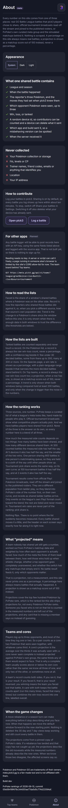
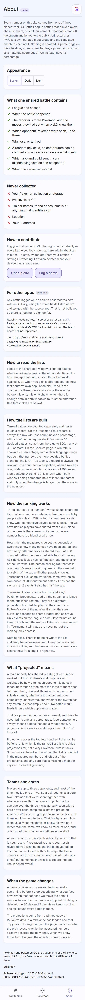

# Audit: About (meta.pick3.gg)

Piece: 5 (meta.pick3.gg). Spec: `docs/superpowers/specs/2026-09-28-design-meta-design.md`. Plan:
`docs/superpowers/plans/2026-09-28-meta.md`, rulings in
`.superpowers/sdd/2026-09-28-meta/rulings.md`. Branch `meta-design` from `dda9103` (= `main`).
About's theme move is Task 5 (`a7d3aa9..7c4327e`, ruling 10); its Appearance `Seg` and copy fixes
are in the Task 9 audit wave (`333e0b3..1ef56ba`). Ledger:
`.superpowers/sdd/2026-09-28-meta/progress.md`.

About is meta.pick3.gg's one static page: what a shared battle contains, what is never collected,
how to contribute, other apps that can post records, how to read and how the lists and the
ranking are built, what "projected" means, teams and cores, and when the game changes. `App.tsx`
now keeps the theme state and passes it down, so About's own "Appearance" card (System, Dark,
Light) is the page's theme control, not a header button.

## Screenshots

Dark and light at 390px, one pair, full page. From the 2026-09-28 `npm run meta:audit` run on
`1ef56ba`, the `thick` fixture (the page's content does not depend on the fixture's battle
volume), converted to WebP (600px wide, quality 72).

| State | Dark | Light |
| --- | --- | --- |
| `about`: sub header, Back, "About" with the meta tag and the pick3 mark; the lead paragraph (real GO Battle League ratings, three sources, no accounts, never a measured record shown as a projection); "Appearance" card with a `Seg` (System pressed, Dark, Light), each option 44px; "What one shared battle contains" (a checklist); "Never collected" (a crossed-out list); "How to contribute" with "Open pick3" and "Log a battle"; "For other apps" with a "Planned" `Tag` (2026-09-28 fix wave: the ui `Tag`, no longer forced upper-case by an inline `text-transform`, so it now reads "Planned" rather than "PLANNED") with the API call and a `curl` example; "How to read the lists"; "How the lists are built"; "How the ranking works"; "What 'projected' means"; "Teams and cores"; "When the game changes"; the trademark note and the build id/rankings line |  |  |

Not captured, covered by `apps/meta/test/about.test.tsx` and `theme.test.ts`: choosing Dark or
Light and reloading (the choice survives via `storedTheme`, Review Focus 5); the page on a build
with no tournament data (the "How the ranking works" section's tournament paragraph is
unconditional copy, not fixture-dependent, so nothing to differ here).

## Automated checks

- [x] `npm run meta:audit` clean for this page's screen (`about`, in `AUDIT_ENFORCED`): re-run for
      this record on `1ef56ba` exited 0, 55 captures, zero findings on `about` in either theme, no
      NEVER line, no "never captured" line.
- [x] no console errors: the run printed no "Browser errors" section.
- [x] `npm run lint`, `npm run typecheck`, `npm test`, `npm run check-colors`, `npm run
      check-tokens`: re-run on 2026-09-28 on `1ef56ba`. lint exit 0; typecheck exit 0;
      `npx vitest run --project meta --project web --project ui`: 78 files, 1064 tests passed;
      check-colors exit 0; "check-tokens: ok". `npm run ui:audit` ("gallery audit: clean in dark
      and light", exercising the Seg rules now in `packages/ui/base.css`) and
      `PICK3_BUILD=874d675 npm run web:audit` (exit 0, no enforced findings) are carried from
      Task 9's run on this same, unchanged code, not re-run for this record.
- [x] **2026-09-28 fix wave re-run:** the "Planned" pill is now the ui `Tag` (see Findings and
      fixes). `npm run meta:audit` exited 0 after the change: 55 captures, zero findings on `about`
      in either theme, no NEVER line. `npx vitest run --project meta --project web --project ui`
      (1070 tests, including `about.test.tsx`'s existing `findByText('Planned')`), `npm run lint`,
      `npm run typecheck` and `npm run check-colors` all clean. `about`'s WebPs were regenerated:
      the pill now reads "Planned" in sentence case (the ui `Tag` sets no `text-transform`), where
      the old inline-styled span forced it to "PLANNED".

## Aesthetics

- [x] colors from tokens, in their roles: violet on the pressed Seg option and the two "How to
      contribute" links; no pink (nothing measured on this page) and no red anywhere (both
      themes). `check-colors` clean.
- [x] at most four text levels, one page title: "About"; each card's own heading; body text;
      the fine trademark and build-id print at the foot.
- [x] one filled primary button: none; "Open pick3" and "Log a battle" are outline buttons, as
      every other list action on this site.
- [x] chips tapped, tags read: the Appearance `Seg` is the page's only chip-like control and it
      acts (System/Dark/Light, one pressed); no read-only tags on this page.
- [x] the right header variant: `Header variant="sub"`, Back, "About" title, the pick3 mark.
- [x] rows align; gutters and the 8px base hold: one gutter down every card; the Seg's three
      options sit flush against each other at the card's full width.
- [x] sprites unchanged: no sprites on this page (nothing to check).
- [x] at most one line of text before the first result: the lead paragraph is the one line before
      the first card (Appearance).
- [x] light as readable as dark: one matched pair, and the audit's contrast pass is clean in both
      themes (the Seg fix below was exactly this page, previously bare and unstyled).

## Functionality

- [x] every "must keep": the honesty paragraph (real ratings, three blended sources, never a
      projection shown as measured); the full "what is shared" and "never collected" lists; the
      contribute card; the read-the-lists and how-it-is-built explainers; the "projected" meaning;
      teams-and-cores; and the game-changes note, all present in the capture and pinned by
      `about.test.tsx`'s needle-style assertions.
- [x] every control does what its label says (tests): the Seg sets the theme at once
      (`onTheme`), "Open pick3" and "Log a battle" are the plain external/internal links their
      labels say.
- [x] back returns to the origin: Back is a real history pop, tested.
- [x] input layout rule: not an input screen.
- [x] icon buttons named; focus visible: Back named "Back", the pick3 `SiteLink` mark named; the
      Seg's three options are real buttons with `aria-pressed`, each a 44px target (Task 9 fix);
      app-wide `:focus-visible`.
- [x] product rules: no new outbound call; the API example under "For other apps" documents an
      existing, unchanged endpoint; the page states plainly that pick3 has no accounts and the
      collection never leaves the device.
- [x] tests cover the new behavior: `apps/meta/test/about.test.tsx` (27 tests: the lead copy, the
      Appearance `Seg` and its three values, every section's presence, the no-em-dash rule
      inherited from the retired ASCII test); `apps/meta/test/theme.test.ts` (4: `storedTheme`
      persistence); `apps/web/test/contrast.test.ts` (reads the Seg's pressed-label rule from
      `packages/ui/base.css` now, so pick3's own Appearance page is proof the shared rule still
      holds there).

## Findings and fixes

| Finding | Fix | Commit |
| --- | --- | --- |
| Task 5 review, Important: About's copy read "Pokemon" unaccented. | "Pokémon" throughout, with the accent, as pick3's own copy. | in `1e8ea85..7c4327e` |
| Task 5, minor folded into fix round 1: two headings ("Top teams" in the header and "Teams" in the body) sat on the same page until Task 6. | Not About's own issue; resolved when Task 6 shipped. | (Task 6) |
| Task 9 audit: the Appearance Seg's 60x21 targets, and it was visibly unstyled (bare grey buttons), since `.seg` rules lived only in `apps/web/src/app.css` and meta never had them. | Moved verbatim to `packages/ui/base.css` (both apps import base.css before app.css, so pick3's cascade is unchanged); About's card gets `.appearance .seg > * { min-height: var(--tap) }`. | `ac8dfec` |
| Task 9, by eye: About said "The team board behind Teams" and "On Teams, ...". | Both now say "Top teams", the page's real name. | `ac8dfec` |
| 2026-09-28 whole-branch review, minor: the "Planned" pill on "For other apps" was a one-off inline-styled `` (its own copy of a rounded-pill look, `text-transform: uppercase` included), not a shared component. | It is now the ui `Tag` (`About.tsx`); same look and position, one fewer bespoke style, and it drops the forced upper-case, so it reads "Planned" rather than "PLANNED". | `b92781d` |

## Rulings

From the plan (`rulings.md`):

10. **Theme on About**: `App.tsx` keeps the theme state, passes `theme` and `onTheme` to `About`,
    which renders "Appearance" first with a `Seg` (System, Dark, Light) using `ThemeChoice`
    values; `ThemeIcon`, `appearanceLabel` and the header's old theme button are gone. [Theme.]

From the ledger:

- Task 9, controller ruling (carried from Task 5): `App.tsx` intercepts plain clicks on
  same-origin anchors that parse to a site view and sends them through `go()`, so in-site links
  push `{ meta: 1 }` history state; About's "Open pick3" is an external link and is not affected
  by this (it is a real navigation, not intercepted).

## Visible changes outside About

- **The Seg CSS move** (Task 9): `.seg` rules moved from `apps/web/src/app.css` to
  `packages/ui/base.css`, byte-identical for pick3 (both apps import base.css before app.css).
  `apps/web/test/contrast.test.ts` now reads the pressed-label rule from base.css. pick3's own
  Settings > Appearance page uses the same rule and was not visually affected (checked by eye in
  the Task 9 web audit run).
- **`SiteLink`** (Task 1, see `meta-teams.md`): About's pick3 mark in its sub header is the same
  component pick3's own headers use in reverse.
- **The retired ASCII rule** (Task 3): About's no-em-dash test replaced its old ASCII test; the
  page's copy (already plain language) needed no rewording.

## Open items for Travis

From the 2026-09-28 whole-branch review fix wave (final fix pass, `.superpowers/sdd/2026-09-28-meta/final-fix-report.md`):

- **The "Planned" pill is now the ui `Tag`** (`About.tsx`'s "For other apps" card), not a
  one-off inline-styled ``; same look, one fewer bespoke style to keep in sync with the
  token set.
- **`SiteLink` keeps both labels symmetric and descriptive** ("pick3, the team builder" on this
  page's sub header), not the spec's literal "Open pick3" aria-label this record's own Rulings
  section names above; see `meta-teams.md` for the full note. Not new to this wave, carried here
  for Travis's sign-off since this page's Rulings entry is the one that names it "Open pick3".
- **The PvPoke `100 - t - l` rounding and the "players went ... against it" / "it went ..."
  wording** (see `meta-teams.md` and `meta-pokemon.md`) do not touch About: it carries no blend
  line and no species record.
- **`spelledName` keeps a non-regional, non-Shadow parenthetical** ("Morpeko (Full Belly)") while
  pick3 shows "Morpeko" (see `meta-teams.md`); About names no species itself, so this does not
  show here either, noted for completeness across the three records.

- **The "For other apps" section is PLANNED**, not live: its `curl` example documents an endpoint
  that does not accept public callers yet. Confirm the "PLANNED" tag reads clearly enough that a
  reader will not try the call and be surprised.
- **In-site links keep history** via the delegated click handler (App.tsx's `onPageClick`); About
  has no in-site links itself (Open pick3 and Log a battle both leave the site), so this page
  cannot demonstrate the behavior; noted here since it is a site-wide navigation change that
  touches every page's Back.

## Sign-off

- [ ] Travis, <date>
