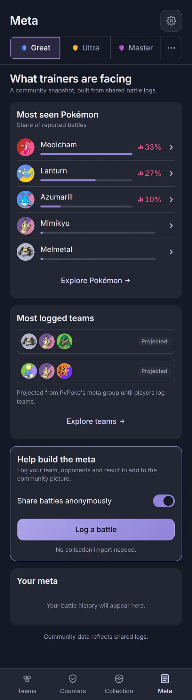
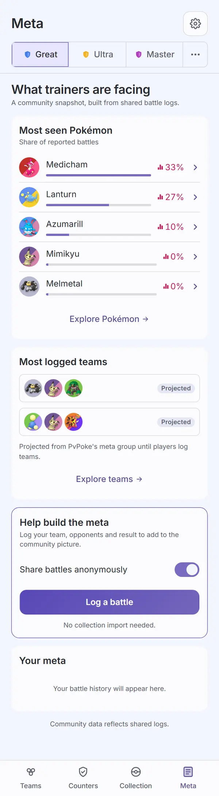
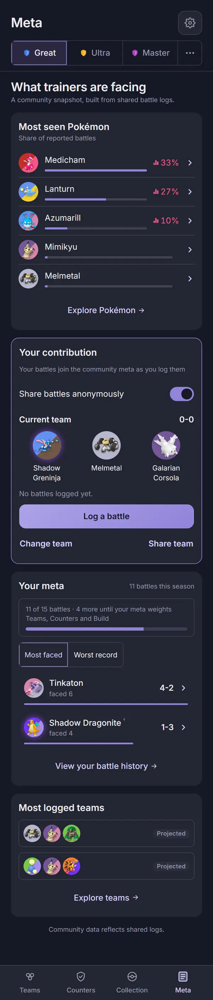
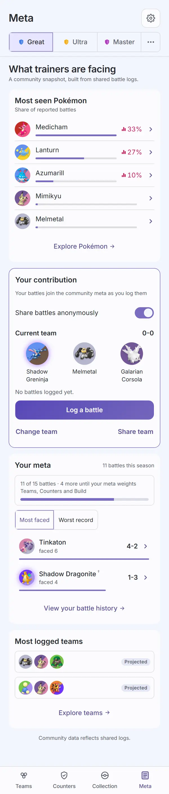
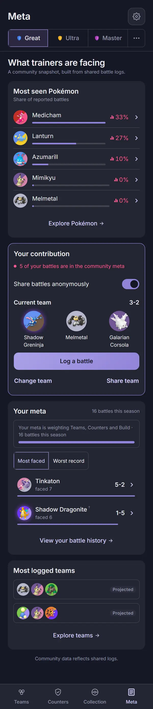
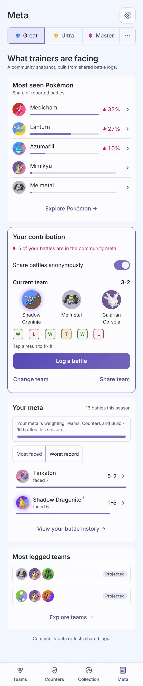
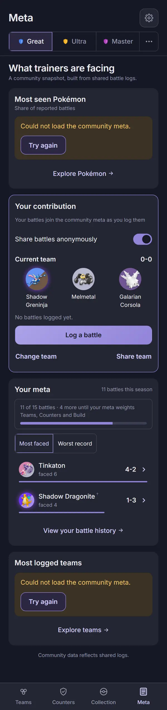
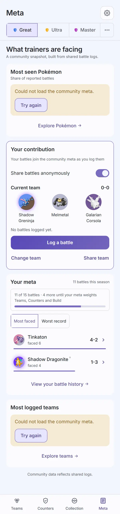

# Audit: Meta landing

Piece: meta in pick3 (meta.pick3.gg folded into the app). No inventory entry: the page is new.
Spec: `docs/superpowers/specs/2026-09-30-meta-in-pick3-design.md`, "Meta landing (`#/meta`)".
Plan: `docs/superpowers/plans/2026-09-30-meta-in-pick3.md`, Task 8 (the landing) and Task 15 (this
audit). Mockup: `mock/meta-in-pick3`, views `meta` and `metalog`. Branch `meta-in-pick3`.

The landing is the Meta tab's root: "What trainers are facing", Most seen Pokémon (the top five by
blended share), then either a first visit's Most logged teams, Help build the meta and an empty
Your meta, or, with a battle log, Your contribution, Your meta and Most logged teams. The two
community cards read `/api/v1/meta` and `/api/v1/teams` because the player opened the tab; the
personal cards come from this phone.

Sprites are on in this worktree's game data, so every Pokémon shows its real sprite.

## Screenshots

Dark and light at 390px, one pair per state, full page, from the 2026-10-01 `npm run web:audit`
run on the code committed as `eb56ca0` (with this record's `screens.mjs`), converted to WebP (600px
wide, quality 72). The community numbers are the synthetic fixtures
`fixtures/community-meta-sample.json` (1,240 battles from 18 devices, Medicham, Lanturn and
Azumarill sighted) and `fixtures/community-teams-sample.json` (three cores, no complete team), so
both Most logged teams rows are the baked generated teams, marked Projected.

| State | Dark | Light |
| --- | --- | --- |
| `meta-home-first`: reached from Welcome's "Start without a collection", no collection and no battle log. Most seen Pokémon "Share of reported battles": Medicham 33%, Lanturn 27%, Azumarill 10%, Mimikyu 0%, Melmetal 0%, each share pink with its bar mark; "Explore Pokémon"; Most logged teams with two Projected rows and the caption "Projected from PvPoke's meta group until players log teams."; "Explore teams"; Help build the meta (accent outline) with the share switch on, "Log a battle" and "No collection import needed."; the empty Your meta card; the footer |  |  |
| `meta-home-log`: after the sample import (11 battles this season). Your contribution: "Your battles join the community meta as you log them" (nothing sent yet, plain text), the share switch, Current team "0-0" with Shadow Greninja, Melmetal and Galarian Corsola, "Log a battle", "Change team" and "Share team"; Your meta: "11 battles this season", the progress box "11 of 15 battles · 4 more until your meta weights Teams, Counters and Build" with its bar, Most faced / Worst record, Tinkaton and Shadow Dragonite (with the outsider dagger), "View your battle history"; Most logged teams without the caption |  |  |
| `meta-home-active`: six battles seeded into the running set, five sent (one tanked), 16 this season. The pink `MeasuredLine` "5 of your battles are in the community meta"; Current team "3-2"; the progress box "Your meta is weighting Teams, Counters and Build" with a full bar |  |  |
| `meta-home-error`: every community read answers 503 (`localStorage` `pick3.failMeta`, automation only). Most seen and Most logged each show the shared `ErrorState` "Could not load the community meta." with "Try again"; Your contribution and Your meta still draw from this phone |  |  |

The script checks as it shoots: the first visit has Help build the meta and no Your contribution,
the log state the reverse; the error state has exactly two `ErrorState`s and the accent card still
on the page; `meta-home-active` waits for the measured line.

Not captured: the Stop sharing `ConfirmSheet` from the landing's switch, a league with no shared
battles (Most seen titled "PvPoke's meta group. No battles shared yet." with no pink), sharing off
("Sharing is off" with Settings), and no running team ("No team picked" with "Pick your team");
covered by `apps/web/test/metaHome.test.tsx` (the confirm, the no-battles league, a league with sets only elsewhere) and `apps/web/test/logPieces.test.tsx` (the contribution line's three variants, no team).

## Automated checks

- [x] `npm run web:audit` clean for this page's screens (`meta-home-first`, `meta-home-log`,
      `meta-home-active`, `meta-home-error`, all in `AUDIT_ENFORCED`): the 2026-10-01 run on
      `eb56ca0` exited 0 with zero findings on every enforced name in both themes. The first run
      found 32px "Explore Pokémon", "Explore teams" and "View your battle history" links and a
      33px Most faced / Worst record switch (see Findings); fixed in `eb56ca0`. 117 findings remain
      on screens not yet redesigned, none failing; no NEVER line (the 24 unmeasured lines are the
      known `teams-filters-excluded`, `counters-against-scrolled` and `settings-about-leaves` ones,
      each measured in another capture of its page).
- [x] no console errors: the run printed no "Browser errors" section.
- [x] `npm run lint`, `npm run typecheck`, `npx vitest run --project web`, `npm run check-colors`:
      lint exit 0, typecheck exit 0, web 59 files and 748 tests passed, check-colors exit 0.

## Aesthetics

Awaiting Travis's review.

- [ ] colors from tokens, in their roles (violet interaction, pink measured with its mark,
      outcome colors, red only for destroying data)
- [ ] at most four text levels, one page title
- [ ] one filled primary button
- [ ] chips tapped, tags read
- [ ] the right header variant
- [ ] rows align; gutters and the 8px base hold
- [ ] sprites unchanged
- [ ] at most one line of text before the first result
- [ ] light as readable as dark

## Functionality

Awaiting Travis's review.

- [ ] every "must keep" from the spec's landing section, item by item
- [ ] every control does what its label says
- [ ] back returns to the origin with filters and scroll
- [ ] input layout rule (input screens only): not applicable, no text input
- [ ] icon buttons named; focus visible
- [ ] product rules: assumptions shown, collection stays on the device, `connect-src` unchanged,
      sharing copy accurate
- [ ] tests cover the new behavior

## Findings and fixes

| Finding | Fix | Commit |
| --- | --- | --- |
| Audit: "Explore Pokémon", "Explore teams" and "View your battle history" were 32px tall tap targets (10 findings per theme on the log states). | `.mh-more` is `min-height: var(--tap)` with no padding, so the card's gap spaces it. | `eb56ca0` |
| Audit: the Your meta card's Most faced / Worst record switch was 33px tall. | The Your battles page's 44px `Seg` sizing rule now covers `.mh-card .seg` too. | `eb56ca0` |

## Notes for the review (seen in the captures, not changed)

- **A sighted-never species reads a pink "0%"** (Mimikyu and Melmetal in Most seen): the blend
  puts PvPoke's group into the top five, and the measured share of a species nobody reported is a
  real 0. Say if those rows should drop the share instead.
- **The weight bar's track is wider when the share is shorter** ("0%" against "33%"), since the
  bar fills the name column; the bars still compare by fill, not by track length.
- **The outsider dagger shows on the landing's faced rows with no legend line**; the legend
  ("Outside PvPoke's 44: logged here, simulated on this phone.") is on Your battles only.
- **The landing has no result strip.** The signed Your Meta's "Tap a result to fix it" chips
  (`ResultStrip`, `CurrentTeam` in `components/meta/LogPieces.tsx`) are not rendered anywhere on
  the new pages, so a logged battle can only be edited by its `#/meta/log/<set>/<battle>` link.
  The spec's landing does not list the strip; the signed Your Meta record lists it as a must
  keep. `log-battle-edit` is now captured through the route directly.
- **Most logged teams shows tokens with no names** on a Projected row, so the row says only
  "Projected"; its accessible name carries the three names.

## Sign-off

- [ ] Travis, awaiting review
