# Audit: Pokémon and Species (meta.pick3.gg)

Piece: 5 (meta.pick3.gg). Spec: `docs/superpowers/specs/2026-09-28-design-meta-design.md`. Plan:
`docs/superpowers/plans/2026-09-28-meta.md`, rulings in
`.superpowers/sdd/2026-09-28-meta/rulings.md`. Branch `meta-design` from `dda9103` (= `main`); the
Pokémon list is Task 7 (`79a1d15..de852db`), the Species page is Task 8 (`de852db..333e0b3`), both
on the Task 3 foundation (blend line, `spelledName`, ASCII retirement, `f150ec8..5fa98d1`) and
Task 5 (headers, back, theme, `a7d3aa9..7c4327e`), with fixes from the Task 9 audit wave
(`333e0b3..1ef56ba`). Ledger: `.superpowers/sdd/2026-09-28-meta/progress.md`.

The Pokémon page ranks every species PvPoke tracks for a league against the same blend line as
Top teams, with a per-row `MeasuredValue` (a pink share, its mark is bars, never a dot) or, when
there is nothing to divide by, a plain muted line ("Not faced in this window", "Banned at
tournaments", "No tournament battles in this window"). A trend `Tag` (green up, red down) sits
beside a name only under Source "All" or "GBL", since the trend is the ladder share's own change
and would misstate a Tournaments-only or PvPoke-only row. The Species page is one Pokemon's own
page: a hero (sprite, types, one `MeasuredLine`, its PvPoke rank), a weekly chart when there are
three or more weeks of data, its overall record, who it is seen next to, the moves reporters ran
and at tournaments (PvPoke's own recommended set flagged with a `Tag`), and two action links,
"Who beats it" and "Build a team around it".

Sprites are on in this worktree's game data, so every Pokemon in the captures below shows its
real sprite.

## Screenshots

Dark and light at 390px, one pair per state, full page. All from the 2026-09-28
`npm run meta:audit` run on `1ef56ba`, converted to WebP (600px wide, quality 72). `pokemon`,
`pokemon-tournaments`, `pokemon-gbl`, `pokemon-pvpoke`, `pokemon-ranked`, `species-tinkaton`,
`species-thin` and `species-missing` are the `thick` fixture (5,000 battles, 30 devices, 600
tournament battles, and the one run with a `previous` window, so its top two picks show trend
tags); `pokemon-error` only exists on the `thin` run (`/api/v1/meta` answers 503).

### Pokémon

| State | Dark | Light |
| --- | --- | --- |
| `pokemon`: header "Pokémon", league tabs, Window/Source ("All"); "PvPoke 5% · Tournaments 10% · GBL 86% · How it is ranked"; rows 1-6 measured (pink share, bars mark, "N of 5,000 battles", "went W-L", a confidence `Tag`, PvPoke's own rank), Tinkaton and Shadow Ninetales carrying trend tags (this run's swapped `previous` window); rows 7-46 "Not faced in this window" with only the PvPoke rank; the Contribute card at the foot | 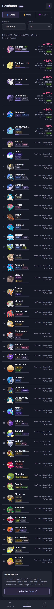 | 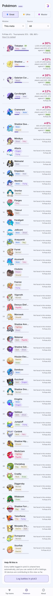 |
| `pokemon-tournaments`: Source "Tournaments"; "PvPoke 33% · Tournaments 67% · How it is ranked"; the same measured rows now read tournament pick share ("N of 600 battles" from picks); Mimikyu reads "Banned at tournaments" in place of a share; no trend tags (trend is ladder-only, ruling) | 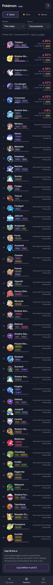 | 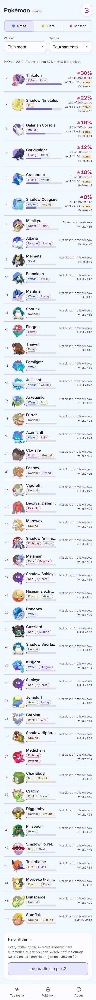 |
| `pokemon-gbl`: Source "GBL"; "PvPoke 14% · GBL 86% · How it is ranked"; the ladder-only figure, trend tags present (a ladder source) | 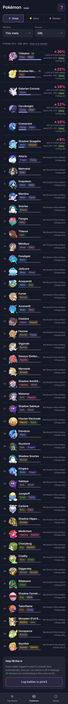 | 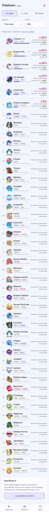 |
| `pokemon-pvpoke`: Source "PvPoke"; "PvPoke 100% · How it is ranked"; every row reads "Nothing measured.", rank order only, no bars, no trend | 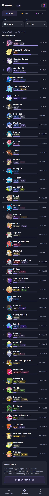 | 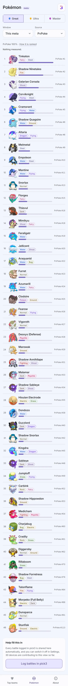 |
| `pokemon-ranked`: "How it is ranked" open as a `Term` over the "All" list: "PvPoke 5%, tournaments 10%, GBL 86%. From 5,000 shared battles by 30 devices and 600 tournament battles from 4 events." plus the blend and "New" explainers | 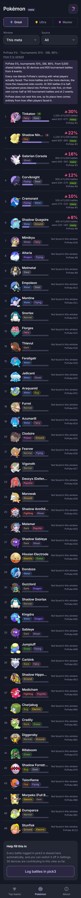 | 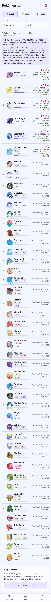 |
| `pokemon-error`: the thin run with `/api/v1/meta` answering 503; header and selects render, then "Could not load the shared battles." with "Try again" | 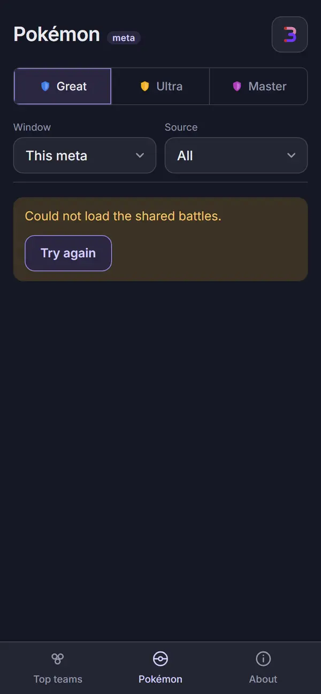 | 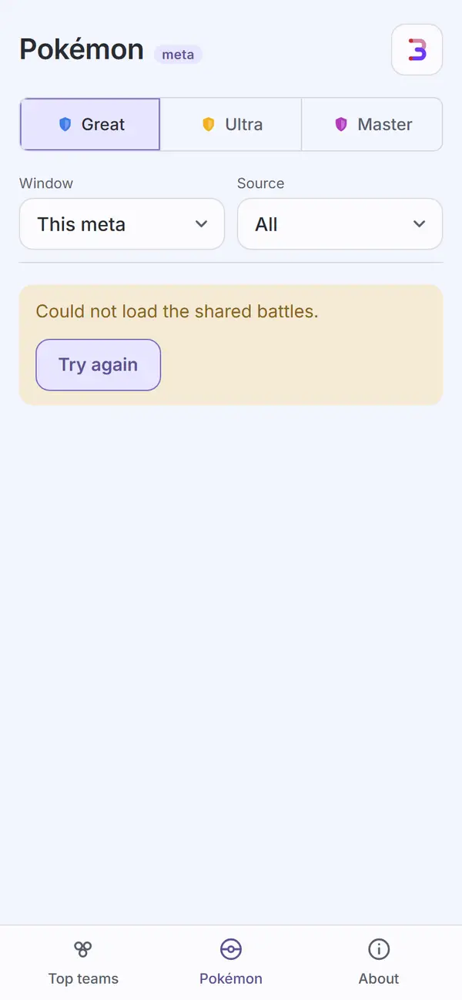 |

### Species

| State | Dark | Light |
| --- | --- | --- |
| `species-tinkaton`: sub header, Back, league tabs; hero (h2 "Tinkaton", 96px sprite, Fairy/Steel `TypeChips`, pink `MeasuredLine` "30% of what players face · 1,500 of 5,000 battles", "PvPoke #1"); "Faced, week by week" (a three-week chart, "32% latest", "+5 pts since the first week"); "Reporters' record against it" (55%, 825 wins 675 losses, the margin-of-error line); "Seen next to" (three opponents with shares); "Moves reporters ran" ("Moves known in 360 of 600 battles", four moves with shares); "Moves at tournaments" ("From 8 known sets of 9 roster entries", two sets, one tagged `PvPoke's set`); "PvPoke's set" card (its own recommendation, score, "Not measured play."); "Who beats it" and "Build a team around it" on one row | 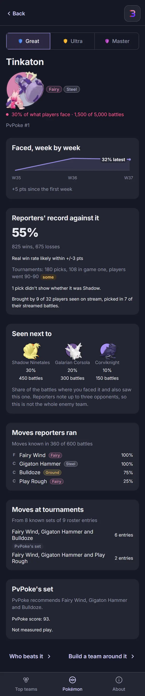 | 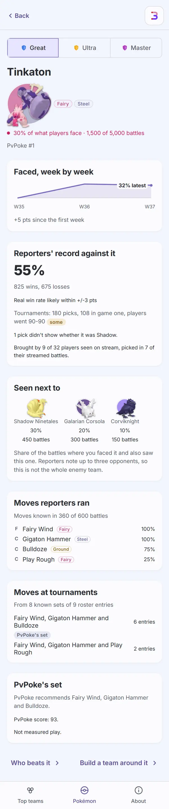 |
| `species-thin`: Shadow Ninetales, one week of data (below `SHARE_MIN`, so the weekly card is left out entirely, not a fallback chart); the record card still shows (55%, battle-level, not moveset-level); "Seen next to" reads "Not enough shared battles yet to see what it is paired with."; "Moves reporters ran" reads "No moves reported yet." (never "NaN%" or a zero share); PvPoke's set still shows | 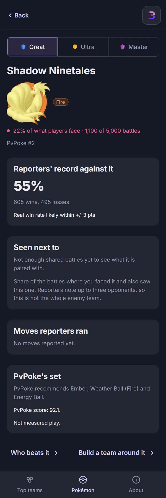 | 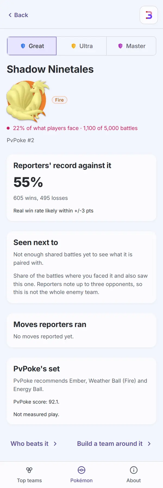 |
| `species-missing`: `missingno`, a well-formed id nothing knows; sub header and league tabs render, then the `Empty`: "No Pokémon by that name in Great League." and "See the Pokémon list ›" | 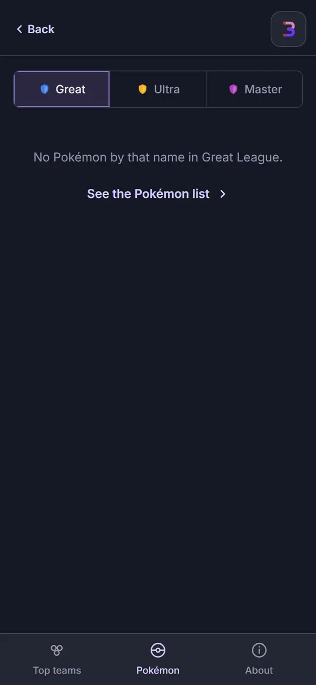 | 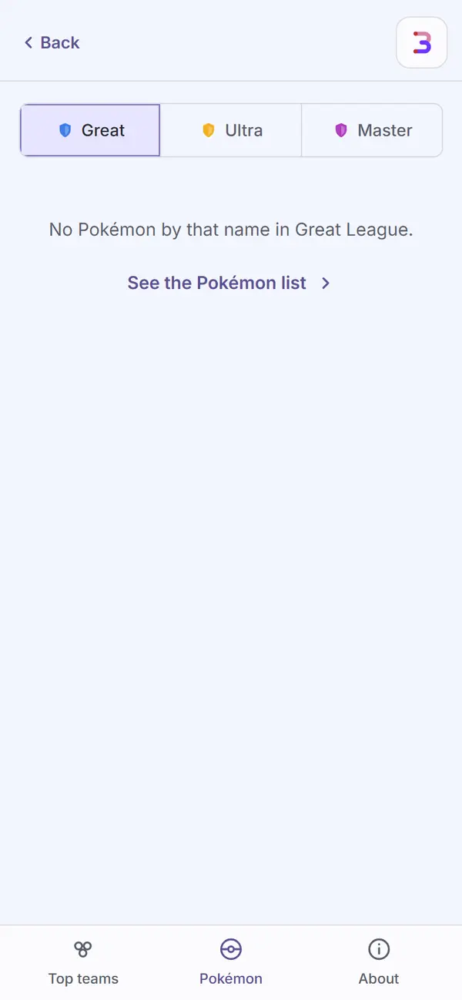 |

Not captured, covered by `apps/meta/test/pokemon.test.tsx` and `species.test.tsx`: the Window and
Source selects open; a row with a zero count reading the muted words rather than a pink "0%"
(ruling, Task 7 review); "Dynamic Punch+" named as its own move, not a stray "+" mark (spec,
`species.test.tsx` line 548); the split-sets share line when movesets disagree; Back landing on
`history.back()` versus the league's Pokémon list depending on `window.history.state?.meta`
(ruling 8; Review Focus 1).

## Automated checks

- [x] `npm run meta:audit` clean for these screens (`pokemon`, `pokemon-tournaments`,
      `pokemon-gbl`, `pokemon-pvpoke`, `pokemon-ranked`, `pokemon-error`,
      `species-tinkaton`, `species-thin`, `species-missing`, all in `AUDIT_ENFORCED`): re-run for
      this record on `1ef56ba` exited 0, 55 captures, zero findings on any enforced name in either
      theme, no NEVER line, no "never captured" line.
- [x] no console errors: the run printed no "Browser errors" section (the deliberate 503 for
      `pokemon-error` is the scoped allowance, not a browser error).
- [x] `npm run lint`, `npm run typecheck`, `npm test`, `npm run check-colors`, `npm run
      check-tokens`: re-run on 2026-09-28 on `1ef56ba`. lint exit 0; typecheck exit 0;
      `npx vitest run --project meta --project web --project ui`: 78 files, 1064 tests passed;
      check-colors exit 0; "check-tokens: ok".

## Aesthetics

- [x] colors from tokens, in their roles: pink only on a measured figure, as text with its bars
      mark, never a pill (`pokemon`, `species-tinkaton`); the confidence and trend tags are the ui
      `Tag`'s own tones (win/loss/warn/neutral), fixed in the Task 9 wave for light-theme contrast
      (`.tag-some` was 4.07:1, `.tag-many` 3.78:1); no red anywhere. `check-colors` clean.
- [x] at most four text levels, one page title: "Pokémon" on the list; on Species there is no
      header title at all (`Header variant="sub"`, ruling 7), the species name is the page's own
      `h2` instead, so there is still exactly one title, just not in the header.
- [x] one filled primary button: none on either page; the list's actions are rows and the "How it
      is ranked" `Term`; Species' two actions are text-style links, not filled buttons
      (`species-tinkaton`).
- [x] chips tapped, tags read: the league tabs act; every `Tag` (confidence, trend, "PvPoke's
      set") is read-only, none wrapped in a button (all captures).
- [x] the right header variant: `Header variant="top"` "Pokémon" with the league tabs
      (`pokemon` and its Source/ranked variants); `Header variant="sub"`, Back, no title, on every
      Species capture.
- [x] rows align; gutters and the 8px base hold: the measured/muted right column holds its
      position whether a row carries a share, a plain sentence, or "Banned at tournaments"
      (`pokemon`, `pokemon-tournaments`); Species' cards share one gutter down the page
      (`species-tinkaton`).
- [x] sprites unchanged: every row and the Species hero show real sprites, none broken (all
      captures).
- [x] at most one line of text before the first result: the blend line is the list's only prose
      line before the rows (`pokemon`); Species' hero MeasuredLine is the one line before the
      first card (`species-tinkaton`, `species-thin`).
- [x] light as readable as dark: nine matched pairs, and the audit's contrast pass is clean in
      both themes (the `.spark-label` fix below was exactly this check, on the weekly chart).

## Functionality

- [x] every "must keep": a ranked list with a measured figure or an honest muted line per row,
      never a fabricated zero (`pokemon`, `pokemon-tournaments`); Source switches between All,
      GBL, Tournaments and PvPoke, each with its own blend line and `Term` (all five list
      captures); Species' hero, weekly trend, record, "Seen next to", moves known and moves at
      tournaments, PvPoke's own set, and both action links (`species-tinkaton`); a thin species
      never claims moves it has none of (`species-thin`); an unknown id is a real Empty, not a
      crash (`species-missing`); a failed fetch says so with Try again (`pokemon-error`).
- [x] every control does what its label says (tests): the league tabs and Window/Source selects
      refetch; "How it is ranked" opens the `Term` (`pokemon-ranked`); Back on Species either pops
      history or goes to the league's Pokémon list depending on how the page was reached (ruling
      8, tested); "Who beats it" and "Build a team around it" are the links their labels say.
- [x] input layout rule: not input screens; the one blend or hero line, then results, matches the
      mobile input layout's spirit even without a text field.
- [x] icon buttons named; focus visible: the pick3 `SiteLink` cross-link in the header, Back named
      "Back", `:focus-visible` app-wide.
- [x] product rules: no new outbound call; meta's CSP unchanged; a projection says "Projected" and
      is never shown as measured (this page has no team projections, but the rule holds for the
      figures it does show: a measured share is always `MeasuredValue`, never invented for a row
      with nothing to divide by). The 300/5/100/2 blend constants and `rank.ts`'s weighting are
      untouched by this piece.
- [x] tests cover the new behavior: `apps/meta/test/pokemon.test.tsx` (41 tests: header, Source,
      the blend line, `MeasuredValue` rows, the muted fallbacks including "Banned at
      tournaments", the trend gate to All/GBL, confidence tags, Loading, ErrorState with retry);
      `apps/meta/test/species.test.tsx` (43: hero, the weekly chart's three-week gate, the record
      card, "Seen next to", "Moves reporters ran" including the "No moves reported yet." and
      "Dynamic Punch+" cases, "Moves at tournaments" with `PvPoke's set`, Back's two branches, not
      found); `headerCopy.test.ts` (18, `blendParts` shared with Top teams); `format.test.ts` (12,
      `spelledName`, `pctFloor`).

## Findings and fixes

| Finding | Fix | Commit |
| --- | --- | --- |
| Task 7 review, Important: a row's headline share rounded under 0.5% down to "0%". | `pctFloor` used consistently; a true zero shows the muted words instead of a pink figure. | in `6bce700..de852db` |
| Task 7 review, Important: zero-denominator row tests had been deleted rather than updated. | Restored, asserting the muted line ("Not faced in this window" / "Not picked in this window"), never a pink "0%". | in `6bce700..de852db` |
| Task 8 review, Important: `THIN_BAND_MAX` (an old rank-band constant) was left behind unused. | Removed. | in `0fd881b..333e0b3` |
| Task 8 review, Important: a split-sets share test had been deleted. | Restored. | in `0fd881b..333e0b3` |
| Task 8, fix round: the hero's title size and hero tests needed adjustment; an `/even/` check and no detail fetch for an unknown id. | Fixed; species-missing now skips the detail fetch once static data says the id is unknown. | `333e0b3` |
| Task 9 audit: confidence tags (`.tag-some` 4.07:1, `.tag-many` 3.78:1 in light). | `ConfidenceTag` is now the ui `Tag` (few neutral, some warn, many win). | `ac8dfec` |
| Task 9 audit: `.spark-label` ("32% latest" on the weekly chart) sat directly on the chart line, "contrast unverified". | The label sits on `--surface` with 4px padding. | `ac8dfec` |
| Task 9, by eye: "PvPoke's set" tag stretched across the whole tournament moves card. | `.pick-moves > .ui-tag { align-self: flex-start }`. | `ac8dfec` |
| Task 9, by eye: Species' "Build a team around it" wrapped onto two lines inside half of `.btn-pair`. | Both actions sit in `.species-actions` (flex, wrap, space-between), fit one row at 390px. | `ac8dfec` |
| Task 9, by eye: a row not faced read "Not faced in this window" then "no result recorded" twice. | The record line now shows only beside a measured figure. | `ac8dfec` |
| Task 9, by eye: trend tags showed under PvPoke ("Nothing measured.") and beside tournament pick shares, where the ladder-only trend has no meaning. | The row shows a trend only under Source All or GBL; `rank.ts`'s own `trend` field is untouched. | `ac8dfec` |
| Task 9, by eye: the trend tag had the same light-theme contrast problem as the confidence tags (uncaptured until a fixture had a `previous` window). | Now the ui `Tag`'s win/loss tones. | `ac8dfec`, `1ef56ba` |
| Task 9: `pokemon-gbl` and `pokemon-error` had no enforced capture (spec States the plan under-listed). | Both added, enforced, all applicable runs. | `1ef56ba` |

## Rulings

From the plan (`rulings.md`):

2. **Spelled names** live in `format.ts`'s `spelledName`; `SpeciesLite.short` is removed, every
   `.short` read becomes `.name`. [Names.]
4. **The one blend line**, `blendParts`, shared with Top teams. [Blend line.]
6. **Pokémon's measured figure is `MeasuredValue`**, its mark the bars (not a dot); the share,
   count and total come from `facedFigure`, null (and a plain muted line) when there is nothing
   to divide by, when the source is PvPoke, or when banned. [Measured figure.]
7. **Species hero**: the name as an `h2` in the page body, sprite 96px, `TypeChips`, one
   `MeasuredLine`, then the small "PvPoke #N" (or "New"); the old "#1 of what players face"
   standing is dropped since the list's order already says it. [Hero.]
8. **Species back**: `history.back()` when `window.history.state?.meta === 1`, otherwise the
   league's Pokémon list via `go()`, which pushes that marker so a later Back can use it.
   [Back.]
9. **The Build lead link**, `#/build?lead=<id>&l=<league>`; Species' own links (Who beats it,
   Build a team around it) are `buildLink`/`counterLink` calls into pick3, not this route itself
   (see Visible changes). [Build lead, see `meta-teams.md`.]

From the ledger:

- Task 7, controller ruling: a zero-count row shows the muted words, never a pink "0%", matching
  how the Species hero already handled it (Findings).
- Task 7, fix round 1, Important: a share that is genuinely nonzero but rounds under half a point
  used to read "0%" with plain `pct`, the same overstatement (the other way) this site exists to
  avoid: it looked like "never faced" when the truth was "faced, just rarely". `pctFloor`
  (`format.ts`) renders such a share as "<1%" instead, on both the Pokémon list's row and the
  Species hero's `MeasuredLine`, so the two never disagree about a small figure. Tested in
  `apps/meta/test/pokemon.test.tsx` ("reads a small share as '<1%', never '0%'", asserting `<1%`
  is on screen and `0%` is not); no capture in this record happens to land a row in that band, so
  the state is proven only by the test (Open items).
- Task 7, minor deferred: the first cold load can fetch teams/meta twice when the epoch window
  moves the "This meta" start; pre-existing, not fixed in this piece.
- Task 8, minor deferred: the hero shows no PvPoke rank for a species PvPoke ranks outside the
  baseline group that nobody has faced (a typed-URL-only path); the hero section wrapper renders
  only in the loaded state.

## Visible changes outside Pokémon and Species

- **`SiteLink`** (Task 1, see `meta-teams.md`): pick3's headers carry the reverse link; neither
  page here changed visibly because of it.
- **The `#/build?lead=<id>&l=<league>` route** (Task 2): Species' "Build a team around it" is the
  consumer, landing in pick3's Build screen with the species pre-picked (not itself captured
  here; the link and its parsing are tested in `apps/web/test/build.test.tsx`).
- **The Seg CSS move** (Task 9, see `meta-about.md`): not used by either page in this record.
- **The retired ASCII rule** (Task 3): the no-em-dash check now covers every capture in this
  record; none of them contain an em dash.

## Open items for Travis

- **A genuinely nonzero share under half a point reads "<1%", never "0%"** (`pctFloor`, Task 7 fix
  round 1), on both the Pokémon list and the Species hero. This is a visible wording choice, not
  just a bug fix: it trades a rounder "0%" for an honest, slightly odd-looking "<1%". No capture
  in this record lands a row in that band (none of the fixture's shares happen to fall under 1%),
  so it is uncaptured; it is tested (`apps/meta/test/pokemon.test.tsx`, "reads a small share as
  '<1%', never '0%'"). Say if this reads right, or if a fixture worth adding to prove it on screen
  is wanted.
- **The trend gate (All and GBL only) is a behavior change**, not a pure visual fix: `rank.ts`
  still computes `trend` for every source, but Pokemon.tsx now only reads it under a ladder
  source. If a tournament trend is wanted later it needs its own `previous` window (Task 9's own
  open item, carried here since it is this page's behavior).
- **The hero drops the "#1 of what players face" standing** (ruling 7) since the list's rank
  order already says it; confirm that reads as enough on the Species page alone, without the
  list beside it.
- **"Dynamic Punch+" keeps its "+"** as PvPoke's own move name (spec-mandated), which can read as
  a typo on first sight; the page does not explain it beyond the move name itself.
- **Not measured on a phone:** the weekly chart's SVG line and the `.spark-label` fix were
  verified in the desktop captures only.

## Sign-off

- [ ] Travis, <date>
