# Audit: Top teams (meta.pick3.gg)

Piece: 5 (meta.pick3.gg). Spec: `docs/superpowers/specs/2026-09-28-design-meta-design.md`. Plan:
`docs/superpowers/plans/2026-09-28-meta.md`, rulings in
`.superpowers/sdd/2026-09-28-meta/rulings.md`. Branch `meta-design` from `dda9103` (= `main`);
Top teams' own build is Task 6 (`7c4327e..79a1d15`), with foundation from Task 1 (SiteLink,
`dda9103..206f379`) and Task 3 (the blend line and row line helpers, `f150ec8..5fa98d1`), and
fixes from the Task 9 audit wave (`333e0b3..1ef56ba`). Ledger:
`.superpowers/sdd/2026-09-28-meta/progress.md`.

Top teams is meta.pick3.gg's board of shared and projected teams for one league: a "This meta"
window, an "All / GBL / Tournaments" Source, one blend line ("PvPoke 5% · Tournaments 10% ·
GBL 86% · How it is ranked"), a "Multi-team only" chip, a native Sort select, and rows that open
into a core's teammates, its full teams and a plain "Matchup score". A projected row (PvPoke's
group, not yet seen in shared battles) carries a `Projected` tag instead of a row line.

Sprites are on in this worktree's game data (PokeAPI HOME renders), so every Pokemon in the
captures below shows its real sprite, not a type-colored initial.

## Screenshots

Dark and light at 390px, one pair per state, full page. All six come from the 2026-09-28
`npm run meta:audit` run on `1ef56ba` (the Task 9 fix wave's HEAD), converted to WebP (600px
wide, quality 72). `great`, `great-open`, `great-sort` and `great-ranked` are the `thick` fixture
(5,000 battles, 30 devices, tournament data, and the one run with a `previous` window, though no
row trend applies to Top teams); `great-empty` only exists on the `empty` run (no shared battles,
projections failed to load) and `great-error` only on the `thin` run (`/api/v1/teams` answers
503).

| State | Dark | Light |
| --- | --- | --- |
| `great`: header "Top teams" with the meta tag and the pick3 mark; league tabs (Great current); Window "This meta", Source "All"; "PvPoke 5% · Tournaments 10% · GBL 86% · How it is ranked"; "1 core, 25 teams", "Multi-team only" (off), "Sort: Ranked"; the core row (Shadow Ninetales, Tinkaton, "600 battles · went 480-120 · 2 teams", score 63) then 24 `Projected` rows, scores in plain ink down to 83, the last row clear of the tab bar | 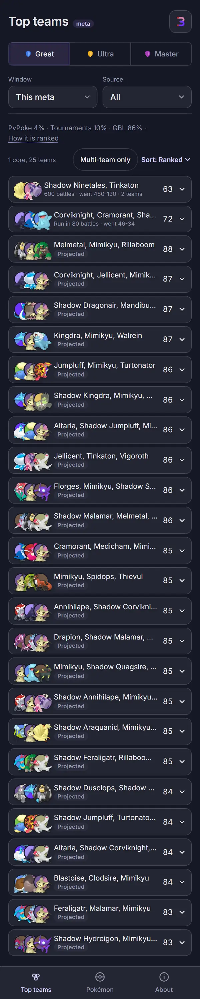 | 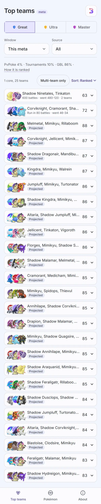 |
| `great-open`: the top three rows open. The core: "Run 400 times and faced 200 times, the team went 480-120 overall", "Seen with" (Galarian Corsola, Corviknight as chips), "Built as" two full-team lines ("Run 300 times and faced 150 times, the team went 360-90 overall", "Faced 150 times, players went 63-87"), each with its own "Open in pick3 ›" action, now a 44px text button; the next row is a full team on its own ("Run 80 times, reporters went 46-34"); the third is `Projected` ("Projected against PvPoke's group, not yet seen in shared battles") | 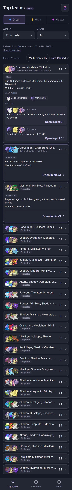 | 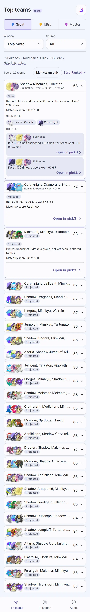 |
| `great-sort`: "Multi-team only" chip on (`aria-pressed="true"`), "Sort: Matchup"; the list re-orders under it (Melmetal/Mimikyu/Rillaboom first at 88), and the core (63) is now last, under its own matchup rank. The chip does not shrink this list (every row here is a team or a core; ruling: the fixture shows no visible drop, noted below) | 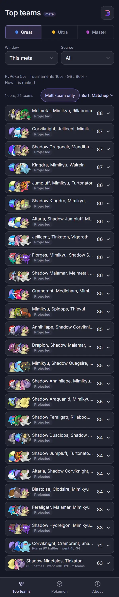 | 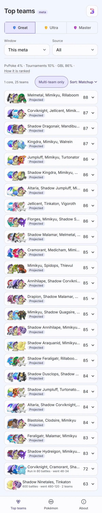 |
| `great-ranked`: "How it is ranked" open as a `Term`, its body: "PvPoke 5%, tournaments 10%, GBL 86%. From 5,000 shared battles by 30 devices and 600 tournament battles from 4 events." then the matchup-score and coverage explainers, above the same list | 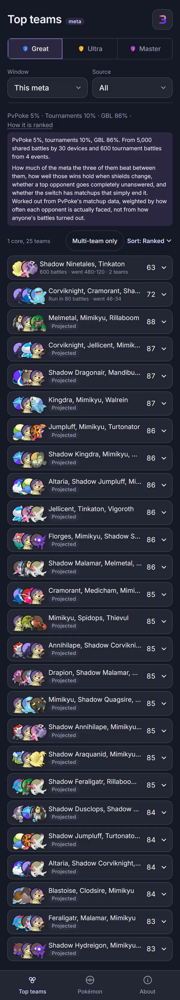 | 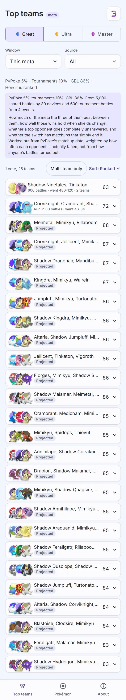 |
| `great-empty`: the empty run (no shared battles, `/baseline` and `/matrix` both 404, so there is no generated row either); "PvPoke 100% · No shared battles yet · How it is ranked"; the `Empty` line "No teams shared in this window yet, and no projections could be loaded." then the Contribute card ("Help fill this in", "0 devices are contributing to this view so far.", "Log battles in pick3") | 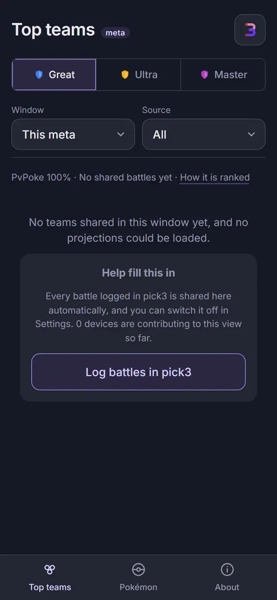 | 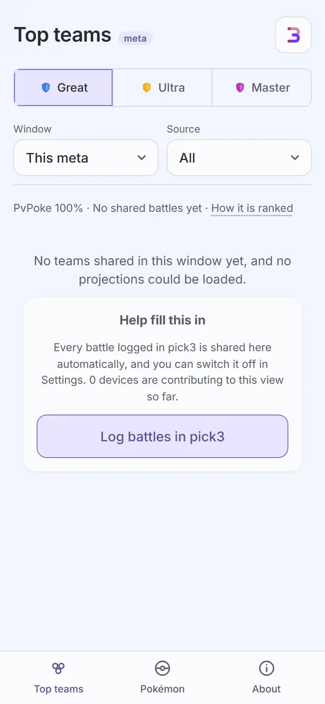 |
| `great-error`: the thin run with `/api/v1/teams` answering 503; only the header, league tabs and the two selects render, then the warn-tinted `ErrorState`: "Could not load the team board." with a secondary "Try again" | 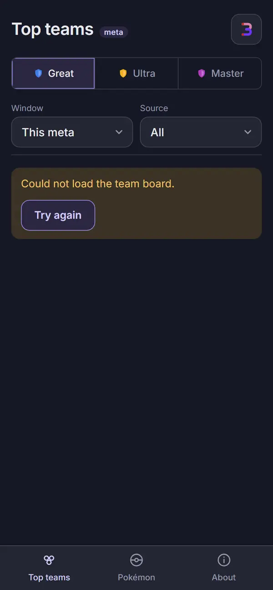 | 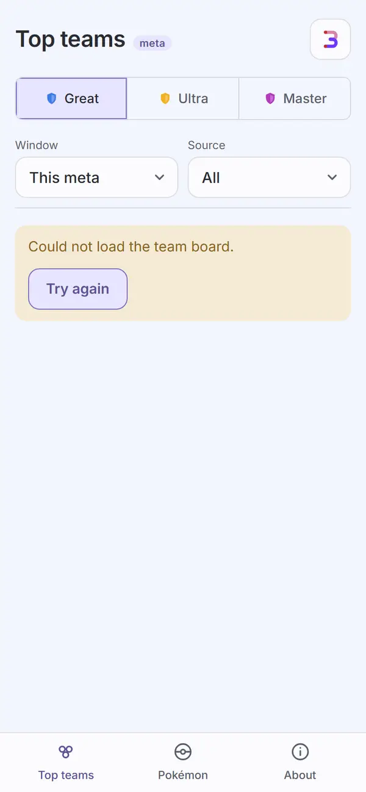 |

Not captured, covered by `apps/meta/test/teams.test.tsx` and `boardView.test.ts`: the Window and
Source selects open (native pickers); a row whose battles ended in no decided result ("no
result", ruling 5); the Sort select's other options; a core seen in more than two teams ("N
teams").

## Automated checks

- [x] `npm run meta:audit` clean for this page's screens (`great`, `great-open`, `great-sort`,
      `great-ranked`, `great-empty`, `great-error`, all in `AUDIT_ENFORCED`): re-run for this
      record on `1ef56ba` exited 0, 55 captures, zero findings on any enforced name in either
      theme, no NEVER line, no "never captured" line.
- [x] no console errors: the run printed no "Browser errors" section (the deliberate 503 for
      `great-error` is let through by the screens script's scoped allowance, not a browser error).
- [x] `npm run lint`, `npm run typecheck`, `npm test`, `npm run check-colors`, `npm run
      check-tokens`: re-run on 2026-09-28 on `1ef56ba`. lint exit 0; typecheck exit 0 (all five
      workspaces); `npx vitest run --project meta --project web --project ui`: 78 files, 1064
      tests passed; check-colors exit 0 (no output); "check-tokens: ok".

## Aesthetics

- [x] colors from tokens, in their roles: violet on what you tap (the league tabs, the Source and
      Window selects, "Multi-team only", "Sort: Ranked", "How it is ranked", "Open in pick3");
      the matchup score is plain ink now (`.row-score`, Task 9 fix, was `--accent` on `--surface`
      at 4.31:1 in light), never violet; no pink (nothing measured on this page) and no red
      (all captures). `check-colors` clean.
- [x] at most four text levels, one page title: "Top teams"; a row's names and its score; the
      subline and tag text; the open panel's small print. The Filters-equivalent here is the
      inline chip and selects, not a sheet.
- [x] one filled primary button: none on the list itself, right since every action is a row or a
      control; the empty board's "Log battles in pick3" and an open row's "Open in pick3" are
      outline buttons, not filled (`great-empty`, `great-open`).
- [x] chips tapped, tags read: the league tabs and "Multi-team only" are the only chips and they
      act (`great-sort` shows the chip pressed and the list re-sorted); `Core`, `Full team` and
      `Projected` are read-only `Tag`s, never buttons (`great-open`).
- [x] the right header variant: `Header variant="top"` "Top teams" with the meta tag and the pick3
      mark, the league tabs under it (all six captures).
- [x] rows align; gutters and the 8px base hold: one gutter from the header to the last row; the
      score column holds its position whether the row shows a subline or `Projected` (`great`).
- [x] sprites unchanged: this worktree's game data ships sprites; every row and the open panel's
      "Seen with" chips show real PokeAPI renders, none broken (all captures).
- [x] at most one line of text before the first result: the blend line is the only prose line
      before the count-and-controls row and the first team row (`great`); the empty board's line
      replaces it as the only line (`great-empty`); the error state has none (`great-error`).
- [x] light as readable as dark: six matched pairs, and the audit's contrast pass is clean in both
      themes.

## Functionality

- [x] every "must keep": a per-league team board blending PvPoke's group, tournament pick share
      and ladder play on one visible line (`great`, `great-ranked`); a core's teammates and its
      full teams, each with its own record and an "Open in pick3" link back to the team builder
      (`great-open`); a projected row when nothing has been seen yet (`great`, `great-empty`);
      "Multi-team only" and Sort (`great-sort`); a failed board says so with Try again
      (`great-error`); an empty board explains why and asks the reader to contribute
      (`great-empty`).
- [x] every control does what its label says (tests): the league tabs switch leagues; Window and
      Source refetch the board; "Multi-team only" filters to cores seen in more than one team,
      pressed state read by the icon's `aria-pressed`; Sort's second option is Matchup
      (`great-sort`, the script's own check); a row opens to its detail, closes on a second tap;
      "How it is ranked" opens the `Term` (`great-ranked`); Try again re-asks the board
      (`great-error`, tested).
- [x] input layout rule: not an input screen; the one prose line, the controls and the rows follow
      the mobile input layout's spirit (nothing needed below the fold) without a text input.
- [x] icon buttons named; focus visible: the header's meta.pick3.gg cross-link ("meta.pick3.gg,
      the community meta" is pick3's own copy; here the header carries the pick3 mark button back
      to pick3.gg) and the app-wide `:focus-visible` ring (tested in `components.test.tsx` for
      `SiteLink`; `app.test.tsx` for tab and select focus).
- [x] product rules: no new outbound call; `apps/meta`'s own CSP is unchanged; nothing here reads
      or writes the collection (meta.pick3.gg never has one). The blend's 300/5/100/2 half-say
      constants and `rank.ts`'s weighting are untouched (constraint, not re-tested here; see
      `packages/engine/test/meta/community.test.ts`, unchanged by this piece).
- [x] tests cover the new behavior: `apps/meta/test/teams.test.tsx` (45 tests: header, tabs,
      Window/Source, the blend line, row open/close, Core/Full team/Projected, Multi-team only,
      Sort, Empty, Loading, ErrorState with retry); `boardView.test.ts` (21: `subLine`'s battle,
      faced-only, run-only and no-result phrasing, the core's team count); `headerCopy.test.ts`
      (18: `blendParts` for every source and the zero case); `route.test.ts` (21, shared with
      Pokémon and Species: hash parsing including the Build lead form).

## Findings and fixes

| Finding | Fix | Commit |
| --- | --- | --- |
| Task 6 review, Important: the `Term` body nested a `
` inside another, invalid markup. | Flattened to sibling paragraphs. | in `d2d4152..79a1d15` |
| Task 6 review, Important: the blend line was missing " · " before "How it is ranked" when the list before it was empty. | `blendParts` always joins with " · ", including before the trailing "How it is ranked". | in `d2d4152..79a1d15` |
| Task 6 review, Important: no test covered the empty board (no teams, no projections). | `great-empty` test and capture added. | in `d2d4152..79a1d15` |
| Task 9 audit: `--accent` used as text on `.row-score` failed 4.31:1 in light. | `.row-score` is now `--text`, a plain number (violet stays for interaction, not a result). | `ac8dfec` |
| Task 9 audit: `a[aria-current="page"]` (the current league tab) failed 4.31:1 in light. | Now `--accent-text`. | `ac8dfec` |
| Task 9 audit: "Open in pick3" was a 98x17 link. | `Button variant="text"`, 44px. | `ac8dfec` |
| Task 9, ruling (plan under-listed the spec): the empty board and a failed board had no enforced capture. | `great-empty` (empty run, projections 404) and `great-error` (thin run, `/api/v1/teams` 503) added, enforced, both themes. | `1ef56ba` |
| Task 9: `sortSecond` did not fail if the Multi-team only chip was missing on a run with battles. | It now throws, and checks `aria-pressed` after the tap. | `1ef56ba` |
| Task 9: `great-open`'s needles did not prove a row had actually opened. | Added "Matchup score" and "Open in pick3" needles, checked on every run. | `1ef56ba` |

## Rulings

From the plan (`rulings.md`):

1. **`SiteLink({ site })`** is the one cross-link component (`packages/ui`); Top teams itself
   carries the reverse link, pick3 to meta.pick3.gg, in its own headers (see Visible changes
   outside Top teams). [Cross-link.]
4. **The one blend line** is `blendParts` in `headerCopy.ts`, joined with " · ", followed by the
   `Term` "How it is ranked"; percentages use the same rounding as today's sentence, so the line
   and the `Term` body never disagree. [Blend line.]
5. **The row line** (`boardView.ts`'s `subLine`): run-and-faced, faced-only, run-only and
   no-result phrasing, each joined with " · "; a core adds its team count; a generated row shows
   no line at all (the `Projected` tag stands in for it). [Row line.]
9. **The Build lead link**, `#/build?lead=<id>&l=<league>`, is not Top teams' own work but is
   reachable from a shared team's "Open in pick3" in a later build; not exercised by this page's
   captures. [Build lead, see Visible changes.]

From the ledger:

- Task 6, review: an empty-board test was plan-mandated but missing; added (Findings).
- Task 9, controller ruling: the spec lists the empty board and a failed board as States the plan
  under-counted; both are now enforced captures (Findings).

## Visible changes outside Top teams

- **`SiteLink({ site: 'meta' | 'pick3' })`** in `packages/ui` (Task 1): an `IconButton` with a
  fixed href, label and glyph. pick3's headers (Teams, Collection, Counters, Your Meta) now carry
  a `site="meta"` button to meta.pick3.gg; meta's own headers (all captures here) carry
  `site="pick3"`, the pick3 mark, back to pick3.gg. Neither page's own screenshots in this record
  changed because of the other side; this is the pairing the spec asked for.
- **The `#/build?lead=<id>&l=<league>` route** (Task 2), parsed into a route, applies a species to
  Build's lead pick and switches league when named. Top teams does not link to it; a shared
  team's own detail page does, in the web app, not shown in these captures.
- **The Seg CSS** (`.seg` rules) moved from `apps/web/src/app.css` into `packages/ui/base.css`
  (Task 9), byte-identical for pick3; About's Appearance card is the only consumer inside
  meta.pick3.gg (see `meta-about.md`). Nothing on Top teams uses a `Seg`.
- **The retired ASCII rule** (Task 3): `assertAscii` became `assertNoEmDash`; Top teams' copy
  (team names, the blend line, row lines) was already plain ASCII in the fixtures, so no visible
  change here, but the rule that would have caught an em dash is now the em-dash rule instead.

## Open items for Travis

- **"Multi-team only" shows no visible change on this fixture's board** (`great-sort`): every row
  in the sample is either a core (kept) or a full team (also kept, since `boardView`'s
  `multiTeamOnly` drops only single-team cores, and this fixture has none). The control works
  (tested); the capture just cannot show it filtering anything out. Say if a fixture that drops a
  row is worth adding for the record alone.
- **The "Projections are unavailable right now" warning** (rows present, but the projection slice
  failed to load) has no capture. It only shows on a non-empty, projectionless board
  (`!empty && board.projectionless`); `great-empty` is the empty case, and no fixture run produces
  the non-empty one. Not a spec-listed state (Task 9's own open item).
- **Names are spelled in full** (Task 3's `spelledName`, e.g. "Shadow Ninetales" rather than a
  short form): confirm this reads right at 390px when three long names share a row title,
  covered by the plan's Review Focus 2 (truncates with an ellipsis, score stays put); not a new
  finding, carried here for sign-off.

## Sign-off

- [ ] Travis, <date>
