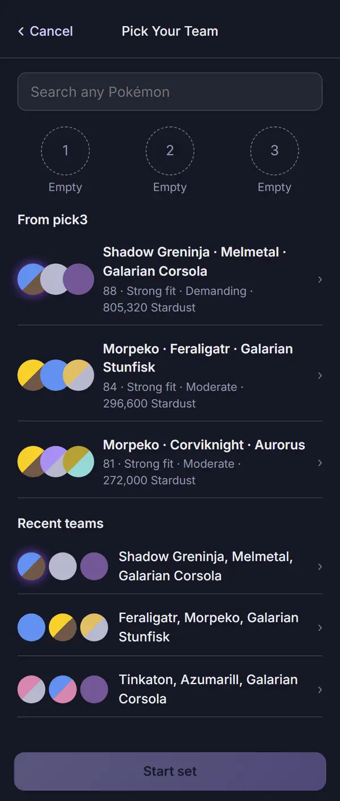
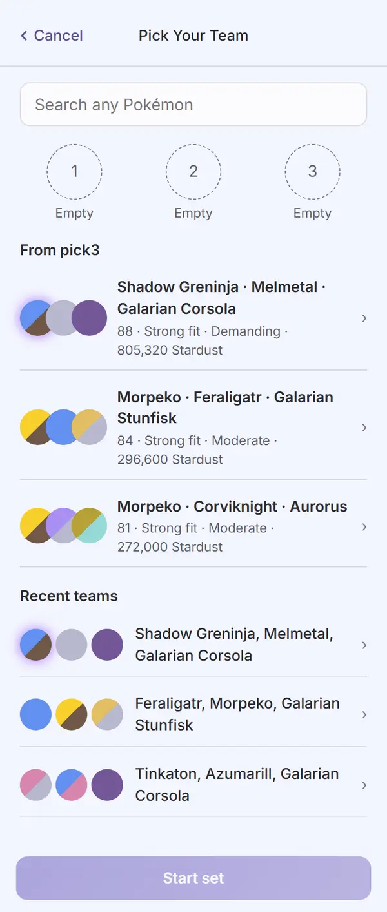
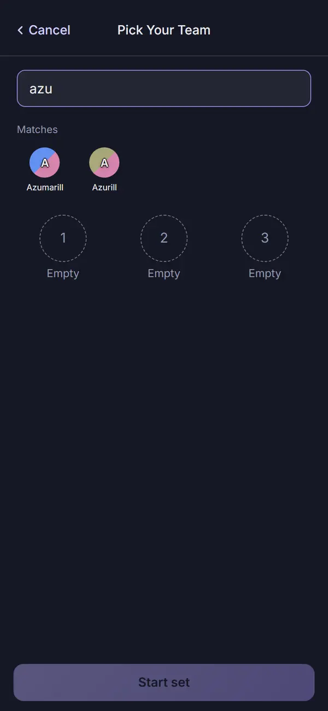
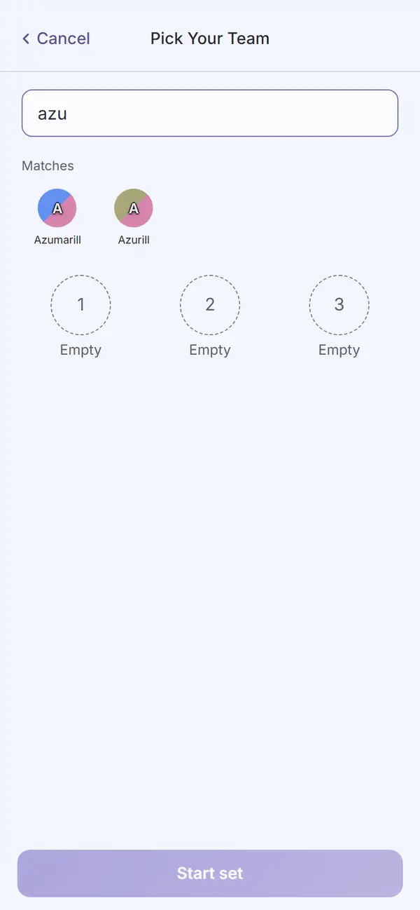

# Audit: New Set

Piece: 3. Inventory entry: `docs/design/inventory/2026-09-22-inventory.md` (New Set is part of the
Log a Battle flow's "start a set" step). Intake entry:
`docs/design/inventory/2026-09-23-design-intake.md`, the confirm-sheet notes carried into piece 3.
Spec: `docs/superpowers/specs/2026-09-26-design-play-design.md`, "New Set is in this piece: 'Let's
include it.'" and the "New Set" section.

A note on sprites: this worktree's game data was built with `PICKTHREE_SKIP_SPRITES=1` (no network
access to PokeAPI during this task), so every capture below shows the type-colored token-letter
fallback instead of a sprite, exactly as on the signed Teams, Build and Team Analysis records. The
live site at pick3.gg builds with sprites and shows those instead; nothing on this branch touched
sprite rendering itself.

## Screenshots

Dark and light at 390px, one pair per state, full-page, converted to WebP (600px wide, quality 72),
from `apps/web/screenshots/<name>-{dark,light}.png` (`npm run web:audit` run, 2026-09-26, on
`7a40b6a`; the final fix wave's runs on `e80cc9c` and `c427979` converted both pairs byte for
byte identical; the run visits Teams first and waits for its recommendation to settle before
shooting New Set, so its "From pick3" rows have real teams to show).

| State | Dark | Light |
| --- | --- | --- |
| `22-new-set`: ready, with a recommendation and recent teams both present. `Header variant="sub"` "Pick Your Team", Cancel; the search "Search any Pokémon"; three empty numbered slots; "From pick3" (three rows, each reading like Teams: "88 · Strong fit · Demanding · 805,320 Stardust", "84 · Strong fit · Moderate · 296,600 Stardust", "81 · Strong fit · Moderate · 272,000 Stardust"); "Recent teams" (three rows, sprites and comma-joined names); "Start set" disabled, full width |  |  |
| `new-set-searching`: "azu" typed. Both "From pick3" and "Recent teams" are hidden; "Matches" shows Azumarill and Azurill directly under the input; the three empty slots sit under that; "Start set" stays disabled |  |  |

Not captured, both string- or data-driven rather than layout differences, and covered by
`apps/web/test/newSet.test.tsx`: "From pick3 empty" (no collection or no recommendation yet, which
`fromPick3.length > 0`'s guard covers whether the recommendation is literally absent or an empty
array); three picks made by hand, with "Start set" enabled (the layout does not change, only the
button's `disabled` state and the slot contents, tested directly).

## Automated checks

- [x] `npm run web:audit` clean for this page's screens (listed in `AUDIT_ENFORCED`), run 2026-09-26
      on `7a40b6a`, and again for the final fix wave on `e80cc9c` and `c427979`: exit 0 each time.
      Zero findings on `22-new-set` and `new-set-searching` in both themes; the final runs' captures
      of both converted byte for byte identical to the images below. 693 findings remain on screens
      not yet redesigned, none failing the run.
- [x] no console errors: the run printed no "Browser errors" section.
- [x] the run's own guards, all passed:
  - `assertTitleCentred` holds on "Pick Your Team" (printed an offset of `-0.0px` in this run,
    within tolerance);
  - the capture waits for a real `.pick3-row` before shooting `22-new-set`, so the "From pick3"
    rows are genuine recommended teams, not a placeholder;
  - `new-set-searching` requires both "From pick3" and "Recent teams" to be absent from the DOM
    while a query is typed, not merely hidden by CSS.
- [x] `npm run lint`, `npm run typecheck`, `npm test`, `npm run check-colors`, `npm run
      check-tokens`, all re-run 2026-09-26 on `7a40b6a` and again on `e80cc9c` and `c427979` for the
      final fix wave: lint exit 0; typecheck exit 0 across every workspace; `npm test` 140 files,
      1295 tests passed on `c427979` (1291 on `e80cc9c`, 1287 on `7a40b6a`); `check-colors` exit 0;
      `check-tokens`: ok. `npm run ui:audit`: "gallery audit: clean in dark and light".

## Aesthetics

- [x] colors from tokens, in their roles: violet marks what you tap (the search's focus ring, each
      row's trailing chevron, "Start set" once enabled); there is no pink (no measured community
      number on this page) and no red (nothing here destroys data). Backed by `check-colors` (clean)
      and zero `web:audit` contrast findings in either theme.
- [x] at most four text levels, one page title, with the same 12px `.meta` supporting-text
      deferral other signed pages carry: "Pick Your Team" is the one title (`Header variant="sub"`);
      "From pick3" and "Recent teams" are section heads; species names and the "Empty"/numbered
      slot labels are body text; each pick3 row's summary line ("88 · Strong fit · Demanding ·
      805,320 Stardust", built by the same `TeamRowSummary` Teams uses) and the recent-team's
      comma-joined names sit at the supporting size.
- [x] one filled primary button: "Start set" is the only `.ui-btn-primary` on the page, in both
      states, disabled until three are picked.
- [x] chips tapped, tags read: nothing on this page is a read-only tag; the only tappable,
      row-shaped controls are the From pick3 and Recent teams rows and the search-result tokens,
      all real buttons/links with a trailing chevron as a visual cue, not a separate control.
- [x] the right header variant: `Header variant="sub"` with Cancel on the left (a labeled Back, not
      the generic "Back" text), in both captures.
- [x] rows align; gutters and the 8px base hold: the "From pick3" rows share `.pick3-row`'s 64px
      min-height and divider rhythm with "Recent teams"' own `.team-pick` rows; both checked by eye
      against each other and against Teams' own collapsed-row rhythm in `22-new-set`, both themes.
- [ ] sprites unchanged: cannot confirm from these captures, for the same reason as the signed
      Teams, Build and Team Analysis records (`PICKTHREE_SKIP_SPRITES=1`). The fallback token
      renders correctly, including the halo/glow styling those pages already carry (see Log a
      Battle's and Your Meta's records for the open item).
- [x] at most one line of text before the first result: the search sits directly under the header
      with no line above it; results (Matches, or the two shortcut lists) sit immediately under it
      with no intervening copy.
- [x] light as readable as dark: both states are matched dark/light pairs; `web:audit`'s per-theme
      contrast pass is clean on both in both themes.

## Functionality

- [x] every "must keep" from the spec's New Set section, item by item: the header labeled Cancel;
      input first (search, then Matches, then the three slots); "From pick3" rows reading like
      Teams (the battle number and fit, via the same `TeamRowSummary` component); tapping a From
      pick3 row fills the three slots and does not start the set (the player can look at the picks,
      clear one, or tap Start set); a Recent teams row does the same (Travis, 2026-09-26, see
      Decisions 4; the spec's "Recent teams as today" is superseded); both lists hidden while
      searching or once a slot is filled; "Start set" as the one primary, disabled
      until three are picked.
- [x] every control does what its label says: typing filters to Matches and hides both shortcut
      lists (tested); tapping a From pick3 row fills the three slots with that team's picks and
      keeps its moves, without calling `startSet` (tested); Start set then starts that team with
      its moves while the slots still hold it, and clearing any slot drops the moves, so a team
      refilled by hand starts without them (tested); tapping a Recent teams row fills the slots
      the same way, and Start set starts it with its moves (tested); Start set is disabled with
      fewer than three picks and starts the set with exactly three.
- [x] back returns to the origin: Cancel calls `back({ screen: 'meta' })`, landing on Your Meta
      whether real history sits behind the page or not. A review finding (see Findings and fixes)
      caught a narrow case where this could fail and fixed it at its root in Log a Battle instead
      of in this page's own code.
- [x] input layout rule: input first, holds. The search sits at the top; Matches sits directly
      under it while searching; the three slots those matches fill sit under that; "From pick3" and
      "Recent teams" are the page's optional shortcuts and hide while searching, per the rule.
      Confirmed by `apps/web/test/newSet.test.tsx`'s DOM-order test and by both captures.
- [x] icon buttons named; focus visible: Cancel is a labeled text control, not a bare icon; each
      From pick3 / Recent teams row and each search result is a named button or link; the shared
      `Button`/`IconButton` focus-visible outline is unchanged.
- [x] product rules: assumptions are not applicable in the Team-Analysis sense (this page only
      starts a set, it does not analyze one); collection stays on the device (no new outbound call:
      the recommendation this page reads was already computed for Teams); sharing copy is not
      applicable (no sharing control on this page).
- [x] tests cover the new behavior: `apps/web/test/newSet.test.tsx` (the sub-page header with
      Cancel returning to Your Meta, input before the slots; starting a set from three picks with
      Start set disabled until then; a From pick3 row reading like Teams with the number and fit;
      a From pick3 tap filling the three slots without starting, then Start set starting it with
      its moves; clearing a slot after that tap dropping the moves; a Recent teams tap filling
      the slots without starting, then Start set starting it with its moves; both lists hidden while
      searching; no From pick3 row with an empty recommendation; the regression test for Cancel
      escaping Log a Battle's own no-set redirect without adding a history entry).

## Findings and fixes

| Finding | Fix | Commit |
| --- | --- | --- |
| Task 6 review, Important: Cancel's `back()` could bounce through Log a Battle's own no-open-set redirect back into New Set instead of reaching Your Meta, in the narrow case of a stale `#/meta/log` history entry (browser back/forward, or a reloaded/shared hash) reached with no set running. Before this task, Cancel was an unconditional `navigate`, which always escaped this loop; switching it to `back()` (needed for the "return to where you came from" rule) removed that escape hatch for this one path. | Fixed at the root rather than in New Set's own code: Log a Battle's redirect now calls `navigate({ screen: 'meta-new' }, { replace: true })`, so it never becomes a "where you came from" entry that a later Cancel could land back on. A new describe block in `newSet.test.tsx` drives a real router through the exact sequence (a stale `#/meta/log` visit with nothing running, then Cancel) and asserts no history entry was added and Cancel reaches `#/meta`. | `22d5080` |
| Task 6 review, Minor: a test named "does not show From pick3 without a recommendation" actually exercised an empty recommendation (`teams: []`), not the literal absence of one. | Renamed to "does not show From pick3 with an empty recommendation"; no behavior change, the assertion was already correct for the branch it exercises (`fromPick3.length > 0`). | `22d5080` |
| Task 7 round 2, seen in the captures (shared with Log a Battle, whose slots use the same rule): opponent slot names ellipsized at 84px instead of wrapping. | `.opp-slot .small` wraps on word breaks with no ellipsis, and this page's slots inherit the fix since they share the class; no capture in this record happens to fill a slot with a long enough name to show the wrap (`new-set-searching`'s Matches are short names), but the shared rule and its test (`apps/web/test/opponentCard.test.tsx`, `logBattle.test.tsx`) cover it. | `7a40b6a` |
| Final review I1: a From pick3 tap called `startSet` at once (the pre-branch behavior), though the spec says tapping one fills the slots; since `startSet` closes the running set, one tap ended the current team with no look at the picks. This record said both ("fills the slots and starts that team"). | The tap fills the three slots with the team's picks and keeps its `TeamRef` (moves included); Start set starts that team, moves and all, while the slots still hold it; clearing any slot drops it, so a team refilled by hand starts without moves. Recent teams stay one tap. Two `newSet.test.tsx` cases (the tap fills three slots without calling `startSet`, then Start set saves the team with its specimens and moves; a cleared slot drops the moves). No capture taps a row, so `22-new-set` and `new-set-searching` show the same states as before. | `8403291` |
| Travis, 2026-09-26, on this record's open item (From pick3 filled, Recent teams started at once): "Let's make the two changes. The two you called are ok." | A Recent teams tap fills the three slots like a From pick3 tap; Start set starts it with its moves and specimens. `newSet.test.tsx`: the tap fills three slots without calling `startSet` or saving, then Start set saves the same team, moves included (RED before). `web:audit` on `c427979`: both captures converted byte for byte identical (no capture taps a row). | `7a1e32b` |

Also seen in the captures during this task, not tied to a named review finding: New Set's "Start
set" button was a small, left-aligned button before this pass; it is now full width, matching every
other redesigned page's primary action (Build's "Analyze this team", Log a Battle's Win/Loss/Tanked
row). Fixed alongside the Task 7 audit pass, commit `307f405`.

## Decisions and rulings (plan `2026-09-26-play.md`, `global-constraints.md`)

1. **Cancel uses `back(...)` with the route New Set was opened from as the fallback (Your Meta).**
   [Cost if wrong: fallback route.] The Task 6 review's Important finding above is the direct cost
   of getting this ruling's implementation detail wrong on the first pass (an unconditional
   `navigate` was safe but did not honor "return to where you came from"; `back()` honors it but
   needed Log a Battle's own redirect fixed alongside it).
2. **From pick3 rows read like Teams**, reusing `TeamRowSummary` rather than a bespoke summary
   line, so the copy can never drift between the two pages. [Cost if wrong: two summary lines to
   keep in sync; this ruling keeps it to one.]
3. **Both shortcut lists (From pick3, Recent teams) hide while searching**, per the mobile input
   rule (results directly under the input, shortcuts last, hidden while searching or picking).
   [Cost if wrong: one condition.]
4. **Both shortcuts fill the slots; only Start set starts a set.** Travis, 2026-09-26, on the open
   item that a From pick3 tap filled while a Recent teams tap started at once: "Let's make the two
   changes. The two you called are ok." A Recent teams tap now fills the three slots with that team,
   moves and specimens kept, like a From pick3 tap, so neither shortcut can close the running set by
   accident. `7a1e32b`.

## Visible changes outside New Set

- **The counter worker's `ingest` now upserts a resent battle** by its `device:id` key
  (`workers/counter/src/index.ts:171`), instead of dropping it. New Set itself never edits a
  battle, but every set it starts eventually gets battles logged and, potentially, corrected
  through Log a Battle's edit mode, which depends on this change.
- **`notify`'s two tones** (info at the foot, no OK, 3 seconds; warning unchanged) do not appear on
  this page (New Set raises no notice of its own), but the shared component they live in is the
  same one every other page uses.
- **The shared `.seg > .on` pressed color** moved from `--accent` to `--accent-text`; this page has
  no `Seg`.
- **`packages/ui`'s `Button` gained `'win' \| 'loss' \| 'warn'` variants and a `pressed` prop.**
  New Set's own primary stays `variant="primary"`; it does not use the outcome variants.
- **The win/loss tint step moved from 8% to 5%** for light-theme contrast; New Set shows neither
  tint.
- **`boardWindow`**, the season/window helper Build already computed inline, is now a shared
  function (`store.tsx:614`) both Build and Log a Battle call. New Set does not call it (it has no
  likely-teammates feature of its own).
- **Log a Battle's own no-open-set redirect now replaces its history entry**
  (`navigate({ screen: 'meta-new' }, { replace: true })`). This is the fix New Set's own review
  finding above required; it is listed here again because the code change itself lives in
  `LogBattle.tsx`, not in this page's file.

## Open items for Travis (not fixed on this branch)

- **The Shadow glow (`.token-shadow-wrap::before`) is still not visible.** Pre-existing, unchanged
  by this branch, the same open item recorded on Team Analysis and Build.
- **New Set's supporting text stays at 12px** (the `.meta` class: the pick3-row summary line, the
  recent-team names), the same deferred app-wide 13px pass other signed pages carry.
- **The fix for Cancel's navigation loop lives outside this page's own file** (`LogBattle.tsx`, not
  `NewSet.tsx`). That is a deliberate root-cause fix rather than a New-Set-local workaround, but it
  means this page's own record depends on another page's code staying correct; flagged here for
  visibility, not as a defect.

## Sign-off

- [x] Travis, 2026-09-26 (reviewed the live pages and the three records on GitHub: "All three look good").
