# Audit: Pokémon detail

Piece: 4, round 2 (the Pokémon detail page, with Collection in `collection.md`). Inventory entry:
`docs/design/inventory/2026-09-22-inventory.md`, page 8 (Collection and Pokémon detail). No
intake entry; the approved renders are the ones from chat on 2026-09-26 (the detail page, the
moves card fix). Spec: `docs/superpowers/specs/2026-09-26-design-rest-of-app-design.md`,
"Decisions" and "Pokémon detail (Specimen)". Plan: `docs/superpowers/plans/2026-09-27-collection.md`.
Branch `rest-of-app`, commits `7f0713b` to `b3c5c12`.

The name shows once, as the page title. Back returns to where you came from. The verdict is a
read-only tag. The fixed Exclude bar is gone: a switch at the end of the page leaves the Pokémon
out of teams. Since 2026-09-27 it goes by what the Pokémon battles as, its best build, not by the
copy: "Use Melmetal in team recommendations", "Covers your 2 Meltan." (see "Exclusion by the
Pokémon as it battles" below). Remove goes through a confirm sheet. The moves card's badges have
their own column.

A note on sprites: this worktree's game data has no sprites, so every Pokémon is a type-colored
initial (and the Best stage card's disc is blank), as on every signed record.

## Screenshots

Dark and light at 390px, one pair per state. All 14 come from the Task 6 `npm run web:audit` run
on 2026-09-27 (the code committed as `101e59f`, `PICK3_BUILD=874d675`), converted to WebP (600px
wide, quality 72). Every detail capture but the confirm and not found is the whole page. The
final review run on `b3c5c12` retook them all; I looked at `05-specimen` and `specimen-evolve`
against these and nothing moved but the scan age ("28 days ago" for "27"), so the signed images
stay. The five pages with the switch (`05-specimen`, `specimen-built`, `specimen-evolve`,
`specimen-excluded`, `specimen-manual`) were re-converted from the 2026-09-27 run for exclusion by
species (the code committed as `c6b4819`, same build id), since the switch's label and line
changed on each.

| State | Dark | Light |
| --- | --- | --- |
| `05-specimen`: Galarian Articuno, Worth building. Back and the cog, no title; the name once; types, CP, level, scan age; the Worth building tag and "Same wins as best IVs"; the facts card; the moves card with TM, HAS IT, TM in their own column and Brave Bird's "Def down"; "Level 6 to 15.5 · includes second move unlock" and three tiles; the no-teams line; the switch on, "Use Galarian Articuno in team recommendations", "Covers your 1 Galarian Articuno."; nothing fixed over the page | 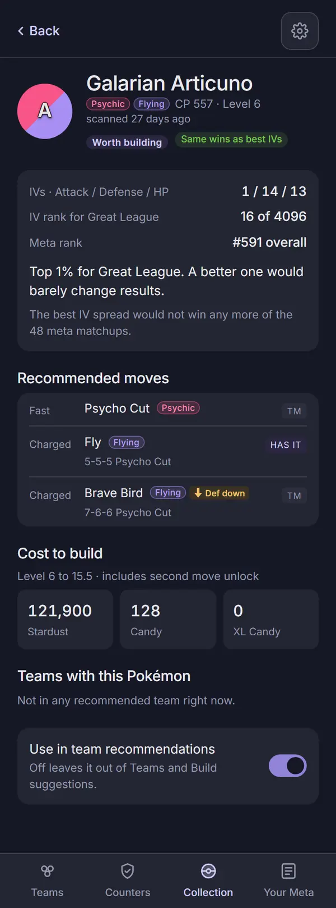 | 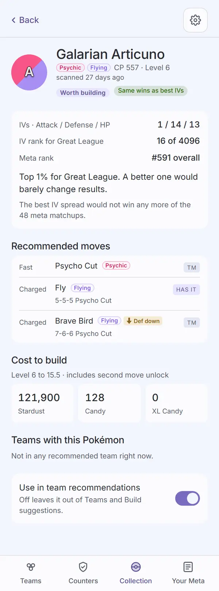 |
| `specimen-built`: a seeded copy at its build level. The Built tag, "Top 1% IVs for Great League, already at level 15.5.", "Already at level 15.5.", "Includes second move unlock.", only the Stardust and Candy tiles (XL Candy was zero) | 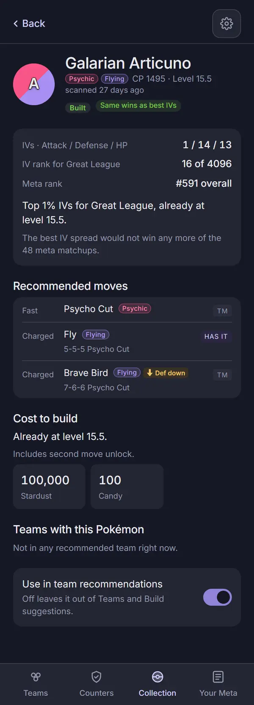 | 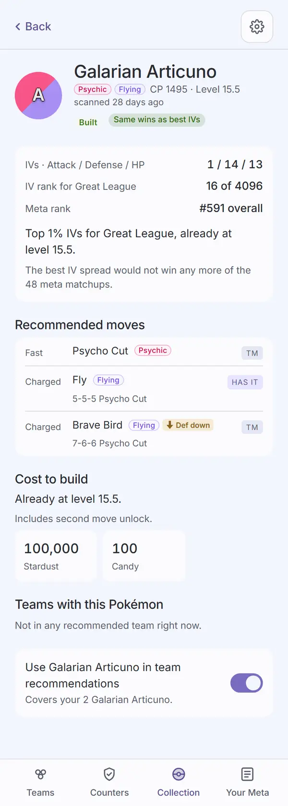 |
| `specimen-evolve`: Meltan. "Meta rank when evolved", the Best stage card ("Evolve to Melmetal before powering up"), ELITE TM in the badge column, the cost line on two lines with the evolve candy, "Plus 1 Elite TM."; the switch names what it battles as, "Use Melmetal in team recommendations", "Covers your 2 Meltan." (the sample's other four Meltan, at levels 22 to 26, have no Great League build as Melmetal: evolved it would be over 1,500 CP, which cannot be powered down, so their only build is Meltan itself) | 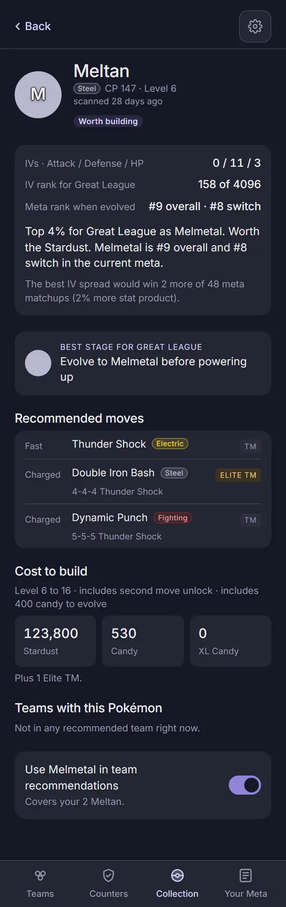 | 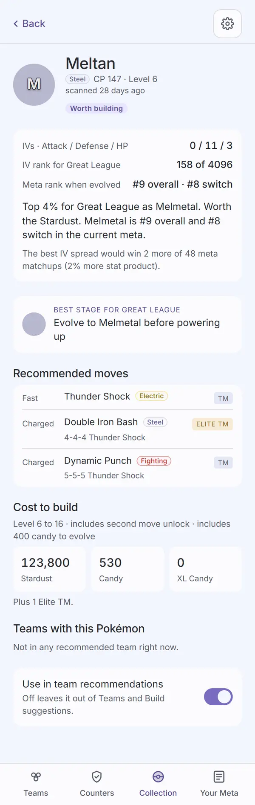 |
| `specimen-excluded`: `05-specimen` with the switch off, which leaves Galarian Articuno out from every copy; nothing else moves | 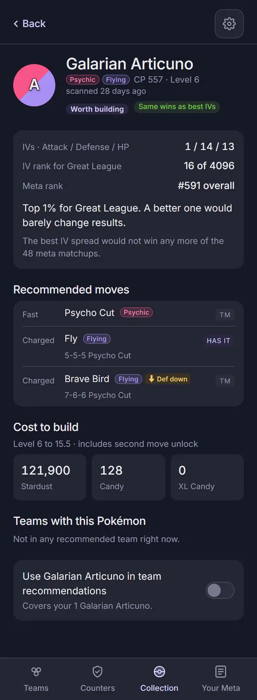 | 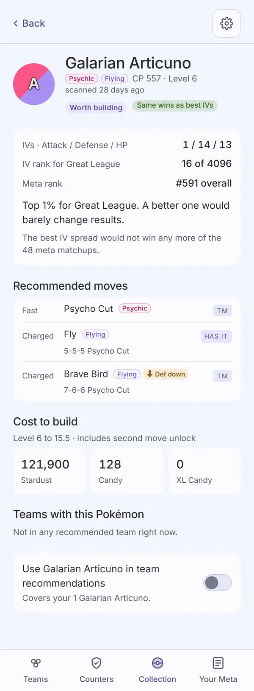 |
| `specimen-manual`: a hand-added Swampert, Wait for better IVs, at its build level: "Already at level 17.5.", the unlock's two tiles, "Plus 1 Elite TM."; "Remove from collection" (red outline) under the switch, in the same card | 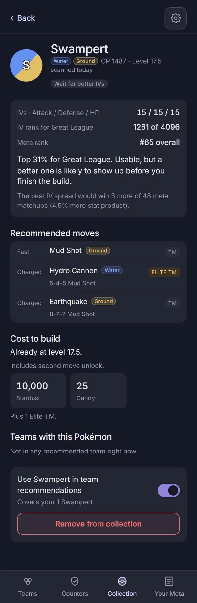 | 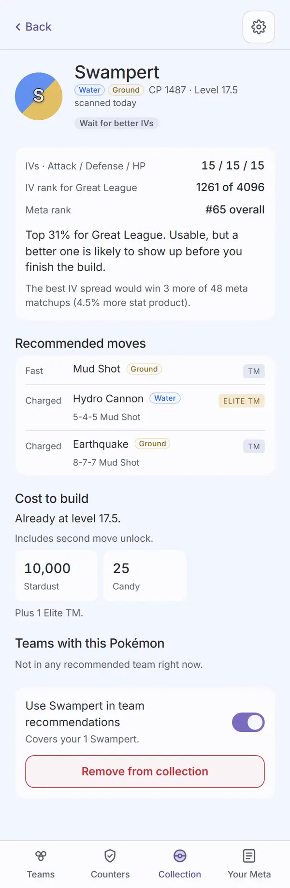 |
| `specimen-remove-confirm`: "Remove this Swampert?", "It leaves your collection on this phone.", Keep it and a red Remove, over the dimmed page | 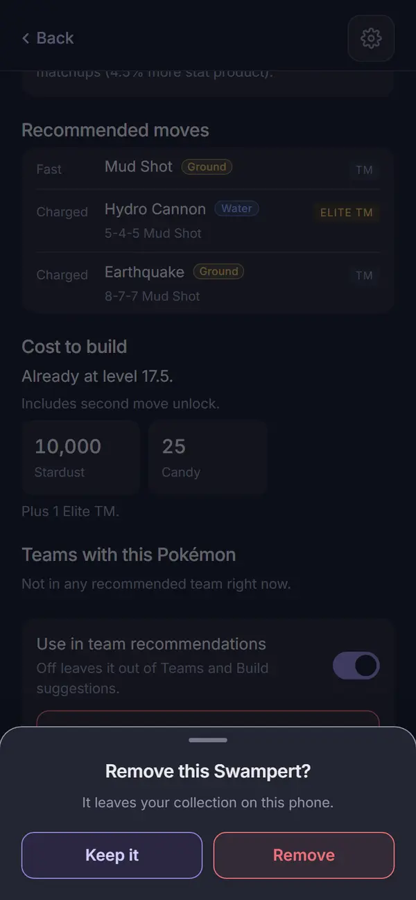 | 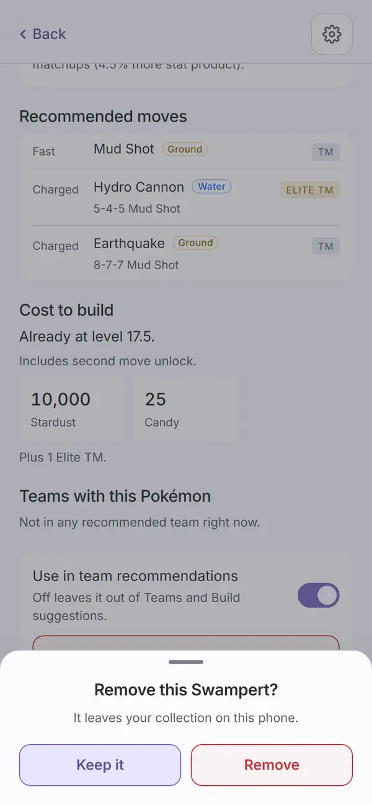 |
| `specimen-not-found`: the sub header and "That Pokémon is not in the current collection." | 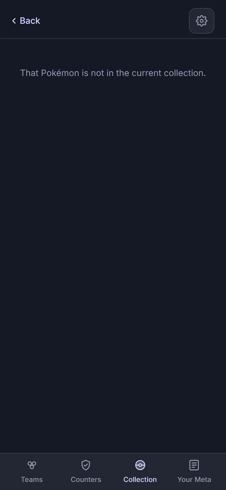 | 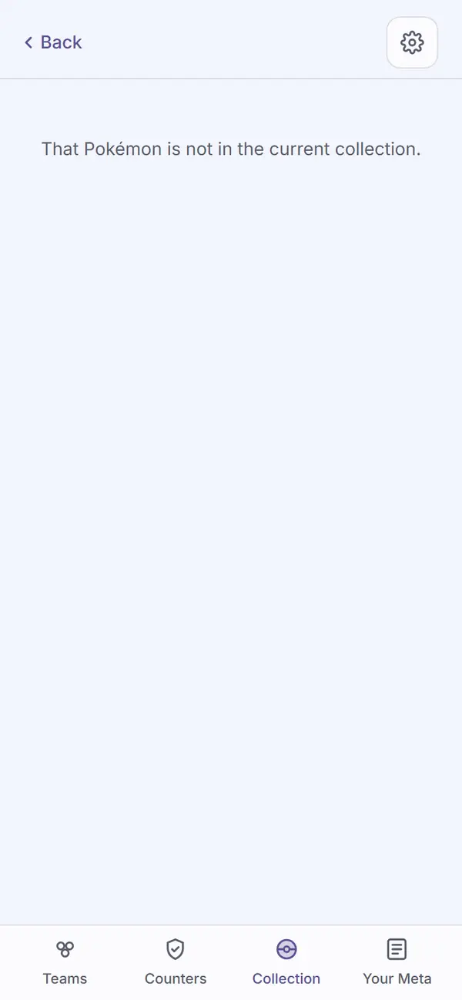 |

The script picks each Pokémon from the judged list by what its page shows, and fails with a
message if the sample has none. The sample has no Built Pokémon, so `specimen-built` writes a copy
of the building one at its build level to the saved collection, asserts the Built tag and the
"Already at level" line, and puts the collection back as it was. `specimen-remove-confirm` cancels
with "Keep it" and asserts the page is still there. Nothing is ever removed.

Not captured, covered by `apps/web/test/specimen.test.tsx`: the page while verdicts load (Review
Focus 5); the verdicts error (`ErrorState` with Collection's copy, no "Judging..."); a fresh load
of the page's link (`Loading` under the sub header until the collection is read, never "not in
the current collection"); Back after Add Pokémon (to where Add was opened from); Back to Counters
and the fallback to Collection; a Pokémon half a level short of its build.

`05-specimen` must show the building Pokémon's cost tiles with no evolution card
(`mustShow: '.scroll:not(:has(.evo)) .stat3'`), and `openSpecimen` marks the page it is leaving
(`data-leaving` on its `.scroll`) and waits for a fresh page's verdict, so no capture can be taken
of the page it just left. Not captured and not tested here: Lucky and Purified in the hero, and a team row (the
sample's Pokémon are in no recommended team).

## Automated checks

- [x] `npm run web:audit` clean for this page's screens (all seven names above in
      `AUDIT_ENFORCED`): the Task 6 run on the `101e59f` code with `PICK3_BUILD=874d675` exited 0
      with zero findings on every enforced name in both themes. No NEVER line; no detail page text
      unmeasured. Re-run for this record on `101e59f`, same build id: exit 0, the same result, 433
      findings on screens not yet redesigned, none failing. Final review run on `b3c5c12`, same
      build id: exit 0, zero findings on every enforced name in both themes, no NEVER line, 433
      findings on screens not yet redesigned, none failing.
- [x] no console errors: neither run printed a "Browser errors" section.
- [x] `npm run lint`, `npm run typecheck`, `npm test`, `npm run check-colors`, `npm run
      check-tokens`: re-run for this record on 2026-09-27 on `101e59f`. lint exit 0; typecheck
      exit 0; 143 files, 1358 tests passed; check-colors exit 0; "check-tokens: ok". `npm run
      ui:audit`: "gallery audit: clean in dark and light" (Task 1, Task 6). Final review, on
      `b3c5c12`: lint exit 0; typecheck exit 0; 143 files, 1363 tests passed; the settings,
      collection and specimen test files 10 times in a row, 54 of 54 each time; check-colors exit
      0; "check-tokens: ok"; ui:audit clean in dark and light.

## Aesthetics

- [x] colors from tokens, in their roles: violet on Back, the cog and the switch when on; red
      only on "Remove from collection" and the confirm's Remove (`specimen-manual`,
      `specimen-remove-confirm`); "Keep it" violet; no pink (all captures). The effect icons now
      use the ui tag recipes (see Findings). `check-colors` clean. Exceptions under Open items:
      the Best stage card's violet head, the light Built tag.
- [x] at most four text levels, one page title: the name (the page's one `h2`, tested); section
      heads and tile figures; body (facts, the verdict sentence, the switch label); supporting
      text (labels, lines, the scan age). The confirm sheet has its own title.
- [x] one filled primary button: none, which is right, since the page's actions are a switch and
      a danger button (all captures). The confirm has Keep it and a danger Remove.
- [x] chips tapped, tags read: no chips on the page; the verdict is a `Tag` in a `.verdict-tag`
      span, not in a button (tested); the move badges are read-only.
- [x] the right header variant: `Header variant="sub"` with "Back" and the cog, no title, on every
      capture including not found (tested: no heading in the header).
- [x] rows align; gutters and the 8px base hold: the facts, moves, cost and switch cards share one
      gutter; each badge sits top-aligned with its move name in its own column, including "HAS
      IT" and "ELITE TM" beside a two-line move (`05-specimen`, `specimen-evolve`); the Best stage
      card has the facts card's radius and padding.
- [ ] sprites unchanged: cannot confirm (no sprite build, see the top). No sprite code changed.
- [x] at most one line of text before the first result: nothing sits between the header and the
      hero (all captures).
- [x] light as readable as dark: seven matched pairs, and the audit's contrast pass is clean in
      both themes. One tag reads weaker in light (Open items).

## Functionality

- [x] every "must keep" from inventory page 8 (the detail half): IVs, "N of 4096", meta rank and
      "when evolved", the verdict sentence and the best-IVs line (`05-specimen`,
      `specimen-evolve`); the best stage (`specimen-evolve`); recommended moves with TM, Elite TM
      and Has it (`05-specimen`, `specimen-evolve`); cost to build (all three cost cases
      captured); the teams it is in (the no-teams line, every capture); exclude, now the switch
      (`specimen-excluded`); Remove for manual entries only (`specimen-manual`; tested absent on a
      scanned one).
- [x] every control does what its label says (tests): the switch flips the battling species in
      `excludedSpecies` in place and back, named for it and described by the copies it covers
      (`excludeSpecies.test.tsx`, `specimen.test.tsx`); Remove opens the confirm, "Keep
      it" changes nothing, and Remove takes it out of state and IndexedDB, then goes back;
      `window.confirm` is never called; the cog opens Settings. A team row still opens its
      analysis (unchanged, not captured).
- [x] back returns to the origin: opened from Counters, Back lands on Counters; opened fresh, it
      falls back to Collection, never off the site (Review Focus 1); after Remove from a page
      opened from Counters, it lands on Counters (Review Focus 3). All tested.
- [ ] input layout rule: not applicable. The page has no text input.
- [x] icon buttons named; focus visible: Back is a labeled text control; the cog is "Settings";
      the switch is named by its label and described by its line; the confirm is an alertdialog
      named by its title and described by its line (tests); the app-wide `:focus-visible` ring.
- [x] product rules: no new outbound call; `connect-src` unchanged; exclusion and removal stay on
      the phone, and "It leaves your collection on this phone." says so. Assumptions: the verdict
      sentence and the best-IVs line, as before.
- [x] tests cover the new behavior: `apps/web/test/specimen.test.tsx` (17 tests: header and one
      name, Back both ways, the tag, the three cost cases, the switch, Remove absent, Keep it,
      Remove from Counters, not found, loading, and from the final review the verdicts error, a
      fresh load of the link, Back after Add Pokémon); `apps/web/test/components.test.tsx` (the
      badge is its own column, the counts line after it on the row); `packages/engine/test/verdicts/worth.test.ts` (Built and its sentence).

## Findings and fixes

| Finding | Fix | Commit |
| --- | --- | --- |
| Travis, on the render: Upper Hand's type and effect tags pushed its badge out of line. | The badge is its own column, top-aligned; the tags wrap under the name. The card loses its top divider. | `5a9215a` |
| Task 3 review: in Team Analysis the moves lost their separation from the text above. | A hairline above the moves in Analysis only; the detail card keeps none (see Visible changes). | `101e59f` |
| Task 5: the plan's "Already at level L." rule hid real cost. The second move unlock (Stardust and Candy) is often due on a Pokémon already at level. | The corrected rule (Ruling 4): the line replaces "Level A to B", any remaining cost still shows, only zero tiles hide. | `0924d7f` |
| Task 5: the engine calls a Pokémon Built within half a level of its build; the page's rule is exact. | Half a level short keeps "Level A to B" and its tiles (tested). The engine is unchanged. | `0924d7f` |
| Task 5 review: the "removed" flag could carry from one detail page to the next without a remount. | `SpecimenScreen` is keyed by the Pokémon's id. | `101e59f` |
| Task 5 review: "Includes second move unlock" had no period. | Added; the test matches the exact text. | `101e59f` |
| Audit: the "Def down" effect icon was 4.42:1 in light (warn on surface), failing on `05-specimen`, `specimen-excluded` and `specimen-built`. | Bad effects use the ui warn tag recipe (warn on its tint); good effects the win recipe, in place of the literal `#7ac74c` (baseline count 2 to 1). | `101e59f` |
| Capture: the Best stage box had a violet outline, but you cannot tap it. | A surface card like the facts card. | `101e59f` |
| Capture: the sample has no Built Pokémon to shoot. | The script seeds one and restores the collection (script only). | `101e59f` |
| Final review: `5a9215a` dropped `.move-line .tm { margin-left: auto; }`, but Build's move picker still puts its badge inside `.move-line`, so the signed picker lost its flush-right TM column. | `.move-opt .move-line .tm { margin-left: auto; }`. `13b-build-moves` checked against its signed images: the TM column is flush right again, both themes. | `b3c5c12` |
| Final review: the badge column narrowed the counts line, so a short count could wrap alone (Team Analysis). | The counts line (`.move-sub`) is a child of the row, after the badge, spanning columns 2 to the end; the row gap is 4px so the spacing is unchanged. Tested (DOM order); checked in `03-team-detail`, `05-specimen` and `specimen-evolve`. | `b3c5c12` |
| Final review: "Judging..." forever when verdicts fail. | `ErrorState` with Collection's copy, and no "Judging..." (tested). | `b3c5c12` |
| Final review: a fresh load of `#/collection/<id>` could say "not in the current collection" before the saved collection was read. | `Loading` ("Loading your collection") under the sub header until `settingsLoaded` (set with the collection) (tested). | `b3c5c12` |
| Final review: Back from a Pokémon just added landed on an empty Add form. | Add Pokémon replaces itself with the new page (`navigate(..., { replace: true })`); a delayed hand-off is cleared if the player leaves first (tested). | `b3c5c12` |
| Final review: `openSpecimen` could resolve on the page it was leaving, and `05-specimen` had no `mustShow`. | See the note under Screenshots (script only). | `b3c5c12` |
| Travis, 2026-09-27: turning off "Use in team recommendations" on a Meltan left Melmetal on his teams. Exclusion was per copy (`excludedSpecimenIds`), so pick3 evolved another Meltan; on the sample, excluding the lead Galarian Stunfisk left "Morpeko · Feraligatr · Galarian Stunfisk" in place, built from another copy. | Exclusion goes by the Pokémon as it battles (Travis, 2026-09-27): the engine skips every build whose `speciesId` is excluded, from any copy; Shadow forms are their own ids. The switch names the verdict build's species and counts every copy with a build of it (the verdict's new `buildSpecies`, all the battling species a copy has a build for in the league); it waits for the verdict and hides for a Pokémon with no build in the league. Legacy per-copy ids with a build in the league convert when verdicts finish; the rest stay legacy. See "Exclusion by the Pokémon as it battles". | `c8d080d`, `c6b4819` |

## Exclusion by the Pokémon as it battles (2026-09-27)

Travis's decisions, applied: exclusion goes by the name shown on a team, not by copy and not by
the whole evolutionary line. Excluding Melmetal drops every build that battles as Melmetal, from
your Meltan and any Melmetal; excluding Umbreon leaves Eevee free to be a Sylveon; Shadow and
normal forms are separate.

- **The switch:** "Use {battling name} in team recommendations", the line "Covers your 6 Meltan
  and 1 Melmetal." (every copy the exclusion removes a build from: copies whose verdict
  `buildSpecies` includes that Pokémon, best build or not, grouped by their own name, largest
  first; one group reads "Covers your 6 Meltan."; an Eevee at its best as Umbreon that can also be
  a Sylveon counts under Sylveon). Before the verdict it shows disabled as "Use in
  team recommendations" with no line; while other verdicts still load it names the Pokémon but
  waits to count and stays disabled. A Pokémon with no build in the league (Not eligible) has no
  switch; a hand-added one keeps its Remove in the same card.
- **Where it shows:** Teams' Filters sheet and Settings > Your data list the excluded Pokémon
  (`teams.md`, `settings.md`); Collection tags their rows (`collection.md`).
- **Old saves:** when verdicts finish, each per-copy id whose copy has a build in the league in play
  converts to that best build's species. An id is dropped only when its copy is gone from the
  collection. An id with no build here (not eligible, banned, over the cap, not judged) stays
  legacy: the engine keeps honoring it, the other copies' switches work, and it converts in a
  league where it has a build. The provider asks for verdicts itself once per league while any
  remain, and a run whose league changed before it finished converts nothing.
- **Checked:** `web:audit` on 2026-09-27 (`c6b4819` code, `PICK3_BUILD=874d675`): exit 0, zero
  findings on every enforced name in both themes, no NEVER line. Re-run after the review fixes
  (the legacy ids kept, `buildSpecies`), same build id: exit 0, the same result; every
  re-converted WebP came out byte-identical, so no image changed. Re-converted captures listed
  under Screenshots; checked by eye in both themes.

## Rulings

From the plan:

1. **`Header variant="sub"` takes an optional title;** without one no heading renders, and the
   page's own heading is the name. [If wrong: a ui API change.]
2. **`VerdictTag`** and its tones, as in `collection.md`. [If wrong: markup and five tones.]
3. **Capture names** as listed above. [If wrong: names.]

From the ledger (controller):

4. **"Already at level L."** shows when there is no evolution and the build level is at or below
   the Pokémon's level. It replaces the "Level A to B" line; any remaining cost still shows (the
   non-zero tiles, "Includes second move unlock.", "Plus N Elite TM."); only zero tiles hide.
   Half a level short keeps "Level A to B" and the tiles. The spec says "no zero tiles", not "no
   cost". [If wrong: a line of copy.]
5. **The light Built tag is parked for Travis,** as in `collection.md`. [If wrong: one tag reads
   faint in light until you rule.]

Made while building:

6. **The name is the global `h2`,** 24px, where the old hero used a 22px div. [If wrong: one
   class to pin it at 22px.]
7. **"Remove from collection" is the ui danger `Button`** (red outline), as Settings' Forget, where
   the spec says "a red text button". [If wrong: the look of one button.]
8. **While verdicts load, the page shows `Loading` with the real counts** and no moves or cost,
   then fills in without a reload. [If wrong: none; the spec asks for it.]
9. **Team Analysis gets a hairline above its moves** while the detail card has none. [If wrong:
   one line in Analysis.]
10. **The Built capture is seeded,** not taken from the sample. A Built Pokémon in the fixture
    would drop the seed, but could move the signed Teams captures. [If wrong: a fixture change
    later.]
11. **`screens.mjs` imports the engine's `cpm.ts`** to work out the seeded copy's CP and HP (Node
    24 strips the types). [If wrong: a copied table in the script.]

## Visible changes outside the detail page

- **The moves card (`MoveRows`) is shared:** the badge column and the missing top divider also
  show in Team Analysis's Pokémon details, which gets its own hairline above the moves
  (Task 6 checked it in `03-team-detail` with Shadow Greninja open; audited clean in both runs).
- **The effect icons** (`.fx-icon`) change on Build and Team Analysis too: bad effects on the warn
  tint, good effects on the win recipe, both the ui tag recipes. Audited clean on every enforced
  Build and Analysis name.
- **`Header variant="sub"` with no title** and **"Built"** (the engine label and sentence, Build's
  order): see `collection.md`.
- **`screens.mjs`:** `17-added` is gone (`specimen-manual` shows the same page), and the seed
  above.
- **Build's move picker badge alignment** (final review): the picker's TM badge is flush right
  again (`.move-opt .move-line .tm`), as signed. Checked, unchanged after the fix:
  `13b-build-moves` in both themes matches its signed images (TM on every row at the right edge,
  counts lines under the names).
- **The counts line spans under the badge column** in `MoveRows`, so in Team Analysis too
  (`03-team-detail`, Shadow Greninja open: "extra damage on 8, resisted by 14" stays on one line;
  audited clean).
- **Add Pokémon replaces itself in history** with the new Pokémon's page, so Back (and Remove's
  back) from that page goes where Add was opened from, not to an empty form.

## Open items for Travis

- **Resolved (Travis, 2026-09-27): the Built tag has a real green pill.** "Built tag on light needs better background." The ui `win` tag now uses two tokens, `--win-tint` (the pill) and `--win-ink` (its text, darkened in light to 4.5:1 on the pill); `specimen-built` re-captured in both themes, audit exit 0.
- **"Remove from collection" is the outlined danger button** (as Settings' Forget), where the spec
  says "a red text button" (`specimen-manual`, Ruling 7).
- **The name is now the 24px page heading** (was 22px) (Ruling 6).
- **The Best stage card's head, "BEST STAGE FOR GREAT LEAGUE", is violet** (the shared `.role`
  label) on a card you cannot tap (`specimen-evolve`).
- **Smaller, deferred during the build:**
  - A failed `removeSpecimen` is not handled (as before this round).
  - `.evo` repeats the `.card` look by hand.
  - (Resolved in the final review: `openSpecimen` no longer reads the page it is leaving, and
    `05-specimen` has a `mustShow`.)

## Sign-off

- [x] Travis, 2026-09-27 (used the live page: "Design looks good"; asked for exclusion by the Pokémon
  as it battles, shipped in `9046dad` and confirmed "That works great"; Remove as the outlined
  danger button is fine; the Built tag pill shipped in `f9313d4`).
