# Audit: Settings

Piece: 4, round 1 (Settings). Inventory entry: `docs/design/inventory/2026-09-22-inventory.md`,
page 9 (Settings sheet). Intake entries: `docs/design/inventory/2026-09-23-design-intake.md`,
"Settings sheet, first pass" and "Settings sub-pages and the confirm sheet, first pass". Spec:
`docs/superpowers/specs/2026-09-26-design-rest-of-app-design.md`, "Decisions" and "Settings".
Plan: `docs/superpowers/plans/2026-09-26-settings.md`. Branch `rest-of-app`, commits
`d00c7a2` to `03158ed`, plus the after-review change below.

Settings is now a hub with four pages (Your data, Community, Appearance, About) on the ui `Sheet`.
Every `window.confirm` in it is a `ConfirmSheet`. The rank band is gone.

A note on sprites: this worktree's game data was built without sprites, so the page behind the
sheet shows the type-colored initials instead, as on every signed record. Settings itself shows no
Pokémon.

A note on the build id: the audit ran with `PICK3_BUILD=874d675` (a production-length id, to test
the About layout), so the hub and About read "build 874d675". The code is `f1d8af4`, and
`8b40f19` for the four About images.

## Screenshots

Dark and light at 390px, one pair per state. All 24 come from the `npm run web:audit` run on
2026-09-27 on the code committed as `f1d8af4`, converted to WebP (600px wide, quality 72) the same
way the Teams and Your Meta images were. Each sheet opens from the Teams header cog. The four
About images (`settings-about`, `settings-about-leaves`) were re-converted from the last
2026-09-27 run on the `8b40f19` code (the ungrouped check run below; its captures are the same),
after the Diagnostics empty line became "No errors recorded."; no other
capture changed.
The `settings-hub-no-collection` pair was re-converted from a third run (2026-09-27, the same
`PICK3_BUILD=874d675`, exit 0, zero findings on the 12, no NEVER line) after the Import card
lost its line when there is no collection.

| State | Dark | Light |
| --- | --- | --- |
| `settings-hub`: the Import card with the one primary, the four rows with live summaries ("148 Pokémon · 13 battles", "Sharing on", "System theme · pictures on", "PvPoke data Sep 10 · build 874d675"), Forget in red, the foot line | 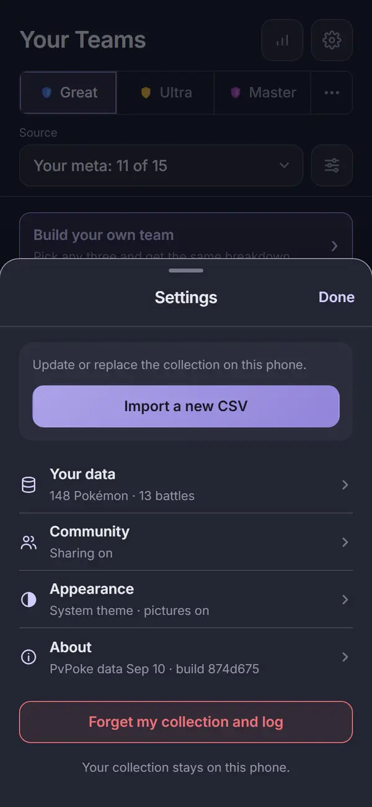 | 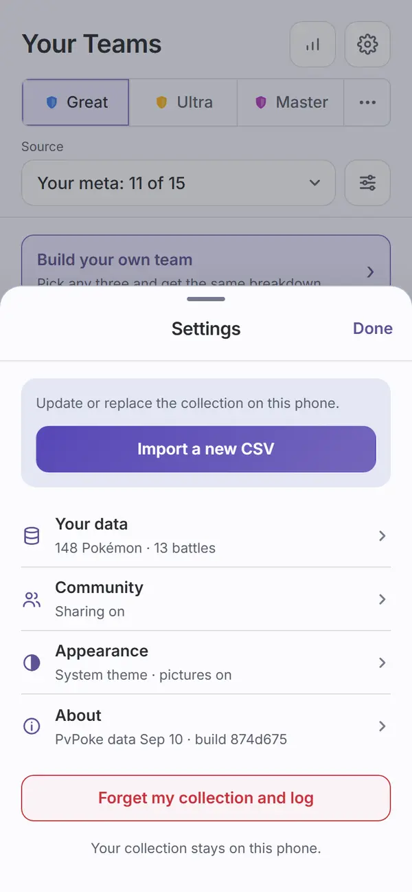 |
| `settings-hub-no-collection`: the Import card as "Import a CSV" alone (no update line), "No collection yet · 0 battles", no Forget |  |  |
| `settings-your-data`: Collection ("148 Pokémon · 90 kinds", "Last import"), Your log (Start fresh, Export log, Import log, "Files stay under your control.") | 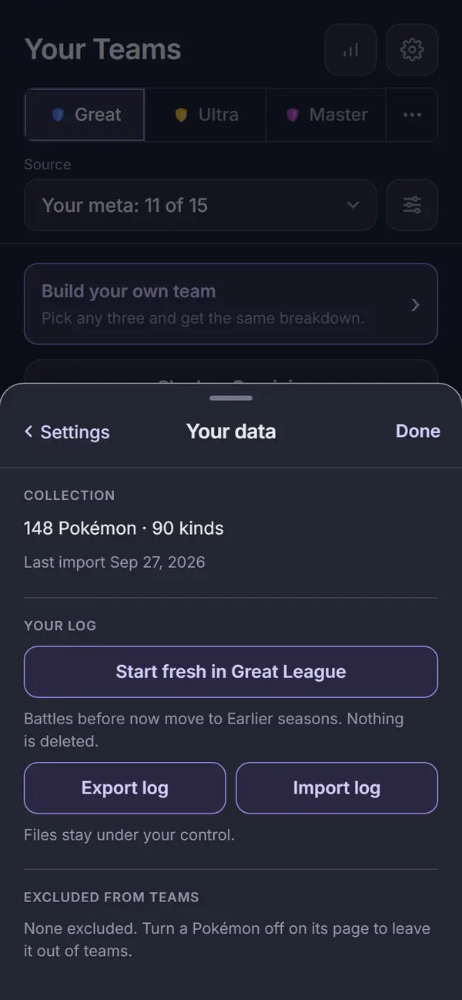 | 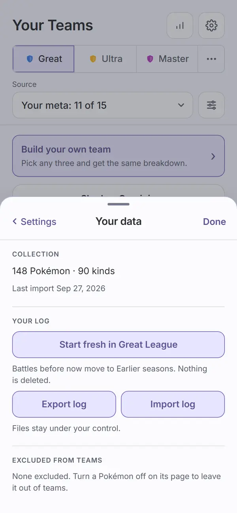 |
| `settings-log-imported`: the Import log result on one line, "Added 0 sets, skipped 4 already here." | 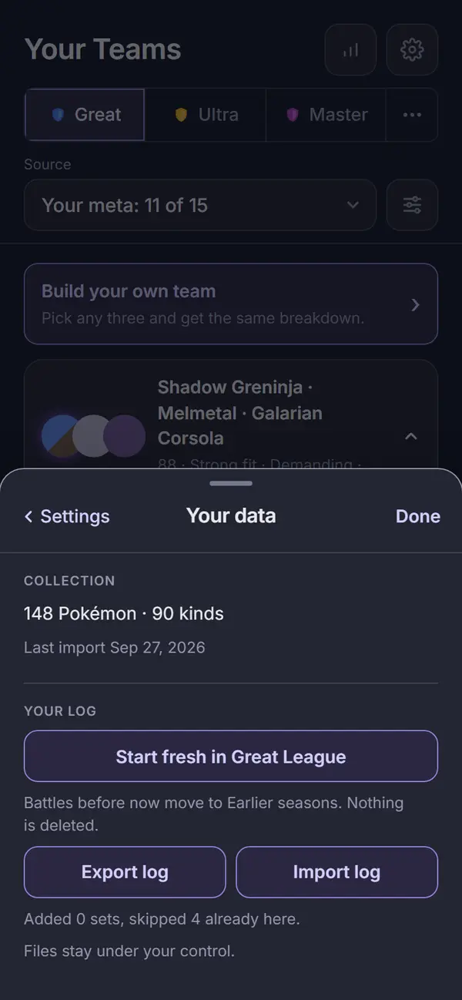 | 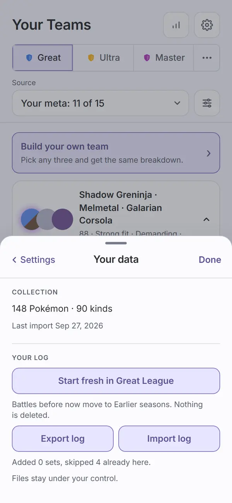 |
| `settings-confirm-fresh`: Start fresh's confirm in the default (violet) tone | 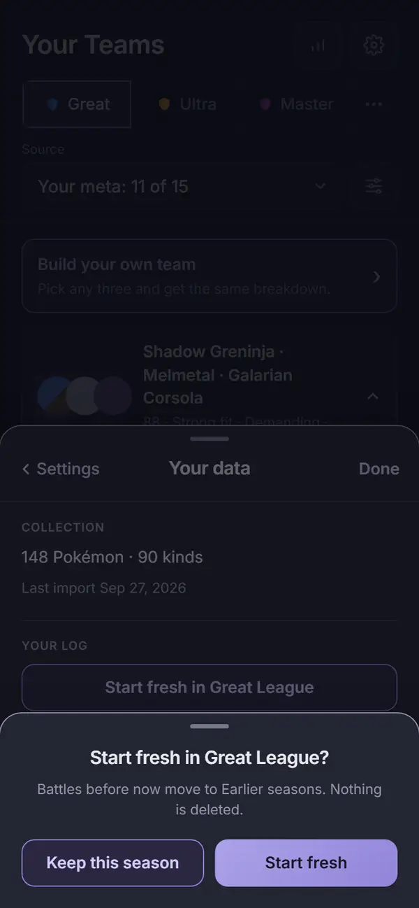 | 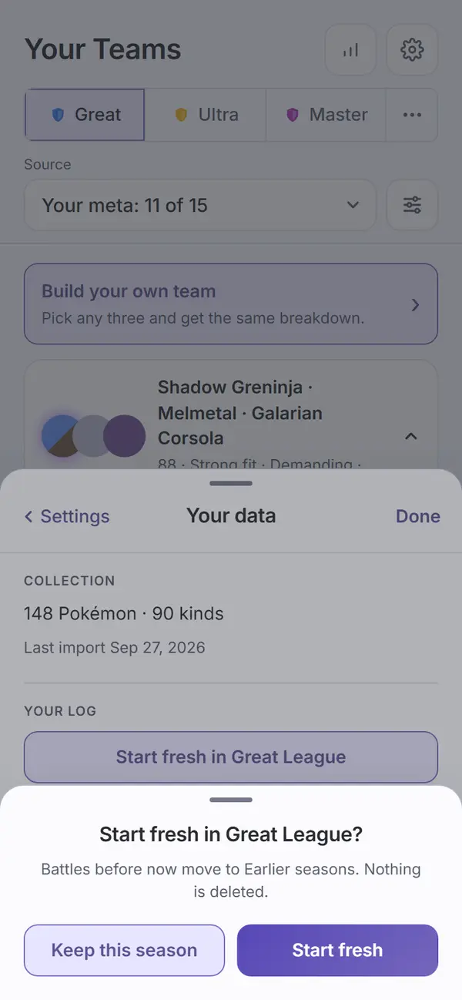 |
| `settings-community`: the Share your battles switch, the neutral line under it, What's sent? closed, Open meta.pick3.gg | 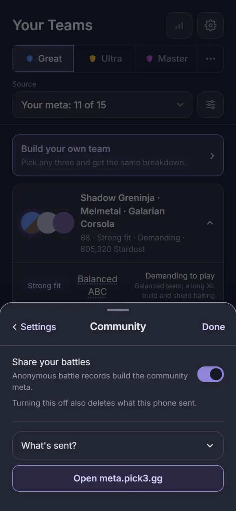 | 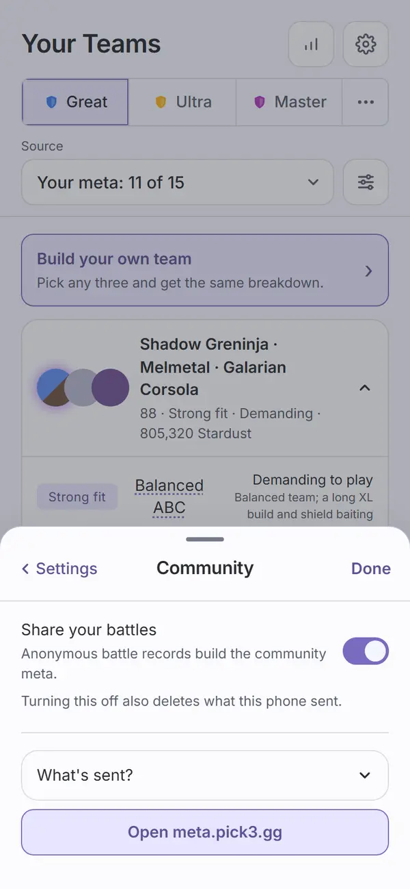 |
| `settings-community-sent`: What's sent? open, "Sent:" and "Never sent:" | 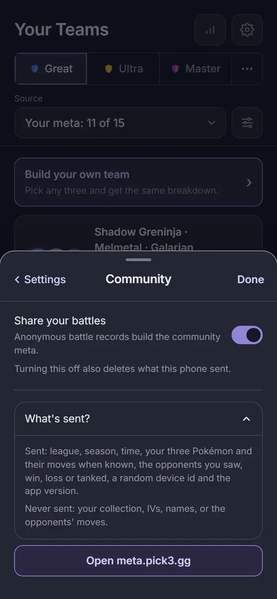 | 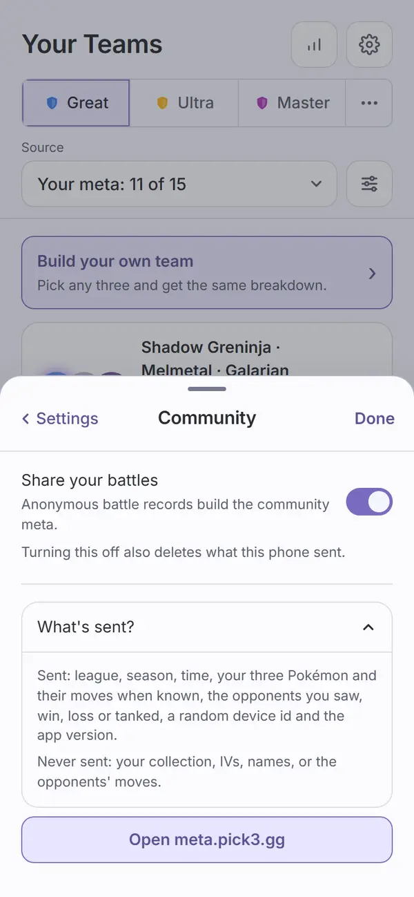 |
| `settings-confirm-sharing`: turning sharing off, danger tone, "Stop and delete" / "Keep sharing" | 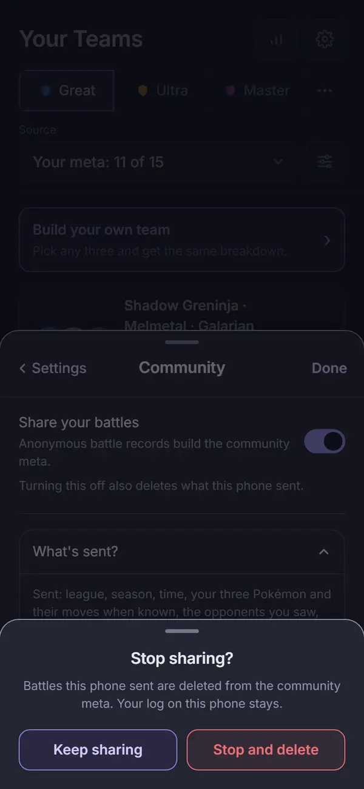 | 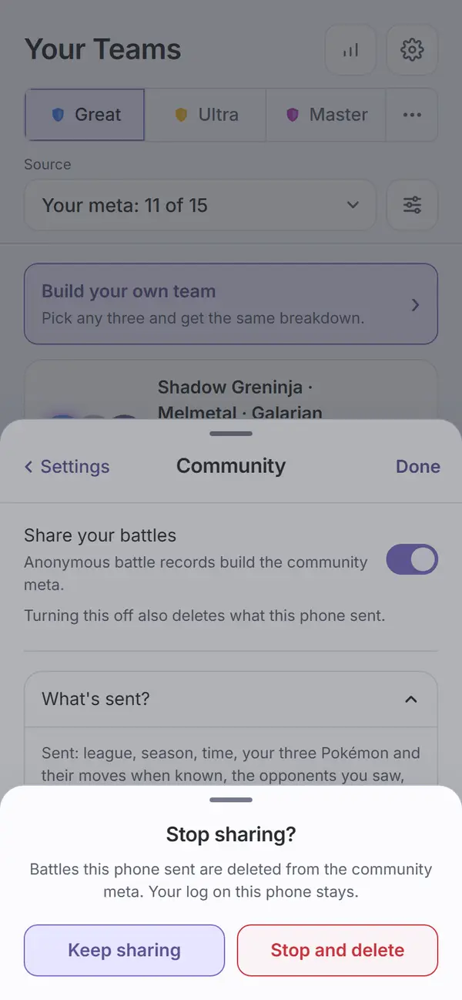 |
| `settings-appearance`: the theme `Seg` (System, Dark, Light) and the Pokémon pictures switch | 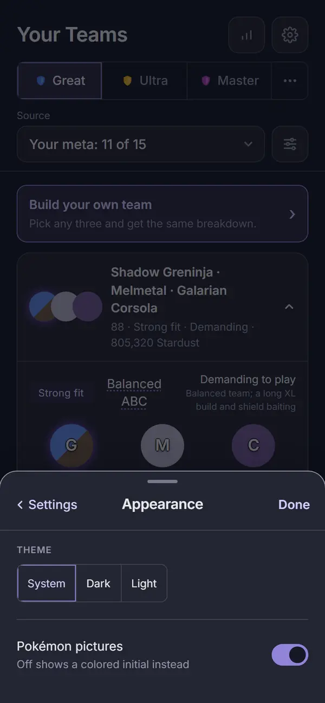 | 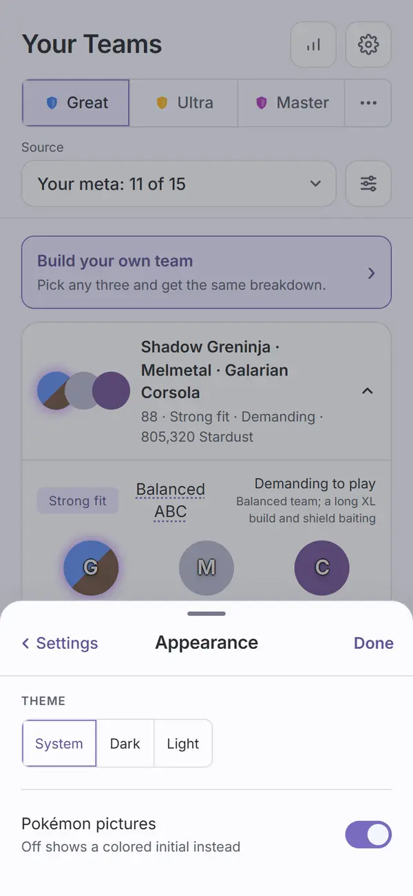 |
| `settings-about`: Game data, App (build and Check for updates), Privacy with What leaves it? closed, Diagnostics (error reports switch, log line, Copy), Credits below the fold | 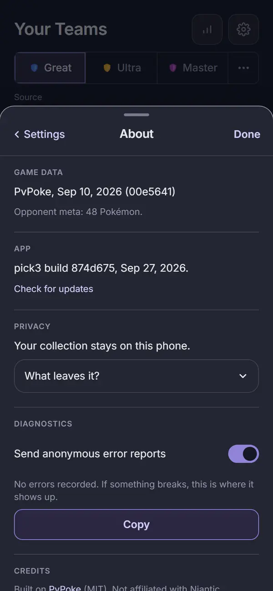 | 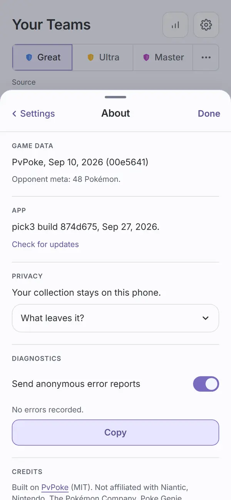 |
| `settings-about-leaves`: scrolled to Privacy, What leaves it? open with its four facts, Diagnostics, Credits and Source | 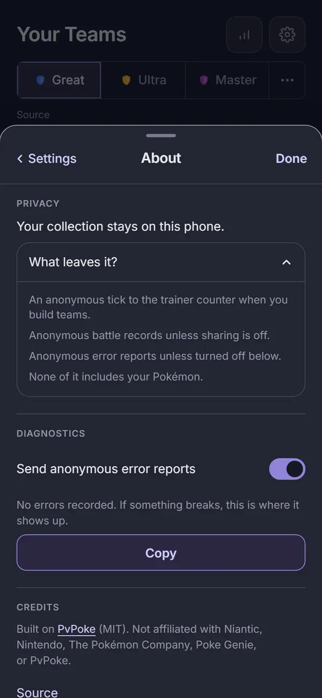 | 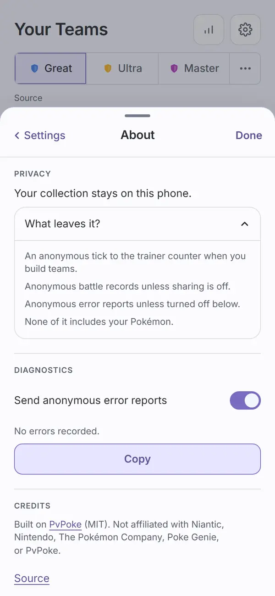 |
| `settings-confirm-forget`: Forget's confirm, danger tone, painted over the Settings sheet | 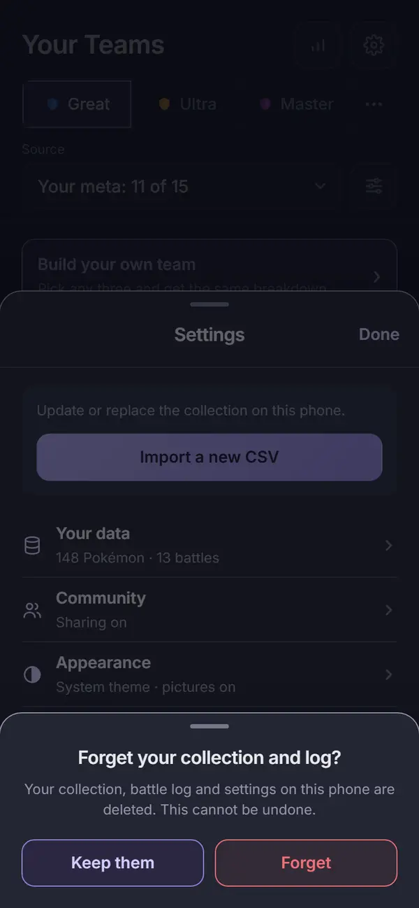 | 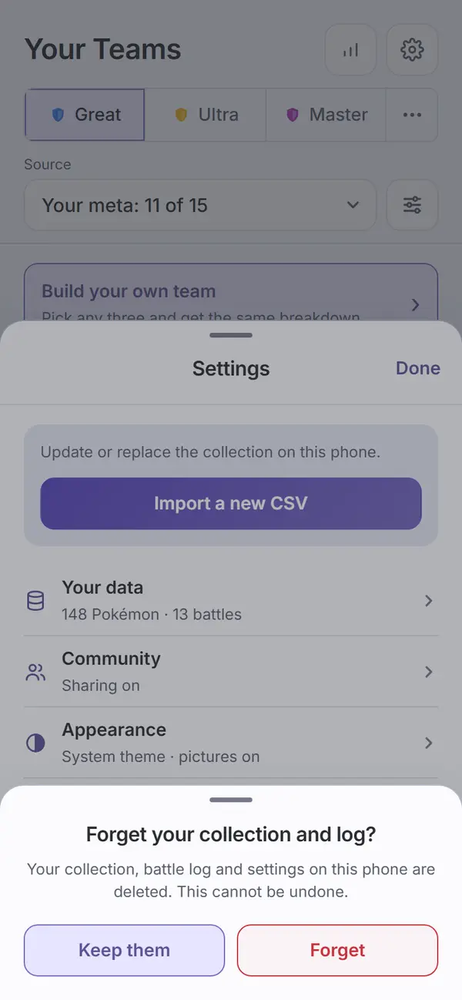 |

The script checks each state as it shoots: the no-collection hub has no danger button; the log
import result matches its sentence; sharing is still on after "Keep sharing"; the hub is still
there after "Keep them"; and before `settings-confirm-forget`, the topmost element at the Settings
sheet's Done button belongs to the confirm or its overlay (the layering check the old `08d` capture
made). Nothing is ever confirmed.

Not captured, covered by `apps/web/test/settings.test.tsx`: Your data with no collection ("No
collection yet" and the Import card); a switch after it flips; the Diagnostics log with errors in
it; the trainer counter (it shows only once a real count arrives, and automation never sends one).

## Automated checks

- [x] `npm run web:audit` clean for this page's screens (all 12 names above in `AUDIT_ENFORCED`):
      run on the `f1d8af4` code with `PICK3_BUILD=874d675`, exit 0, zero findings on the 12 in
      both themes. 618 findings remain on screens not yet redesigned, none failing the run, the
      same count as before this round. The new "Not on screen, unmeasured" list printed four lines
      per theme, all on `settings-about-leaves` (Game data and the App head, scrolled up under the
      header), and each was measured in `settings-about`. No NEVER line. Re-run on `8b40f19`
      (the final review fixes: a NEVER line on an enforced screen now fails, matched per theme
      and per element): exit 0, zero findings on the 12, the same 618 elsewhere, the same four
      lines per theme each "measured in another dark/light capture of settings-about", no NEVER
      line, no "Browser errors". A check run with `settings-about-leaves` taken out of its group
      turned those eight lines into NEVER findings and exited 1; the group was put back.
- [x] no console errors: that run printed no "Browser errors" section.
- [x] `npm run lint`, `npm run typecheck`, `npm test`, `npm run check-colors`, `npm run
      check-tokens`: re-run for this record on 2026-09-27 on `f1d8af4`. lint exit 0; typecheck exit
      0; 140 files, 1322 tests passed; check-colors exit 0; "check-tokens: ok". `npm run ui:audit`
      (the `Switch` in the gallery): "gallery audit: clean in dark and light", from the Task 5 fix
      round. On `8b40f19`: lint, typecheck and check-colors exit 0; web tests 36 files, 389
      passed; `settings.test.tsx` 27 of 27 in 22 runs; `npm run ui:audit` "gallery audit: clean
      in dark and light".

## Aesthetics

- [x] colors from tokens, in their roles: violet for the primary, the secondary buttons, the
      switches when on, the back link and Done; red only on Forget and "Stop and delete", the two
      actions that delete data (`settings-hub`, `settings-confirm-forget`,
      `settings-confirm-sharing`); Start fresh is violet, since it deletes nothing
      (`settings-confirm-fresh`, and a test asserts its confirm button is not danger); the sharing
      warning line is neutral text (`settings-community`, and a test checks that neither it nor any
      ancestor up to the page carries a warn or danger class).
- [x] no pink: nothing in Settings is measured. `check-colors` clean.
- [x] at most four text levels, one page title: the sheet title; section heads (the small
      uppercase labels) and row titles; body text; supporting text (summaries, lines). Seen in
      every capture.
- [x] one filled primary button: "Import a new CSV" / "Import a CSV" on the hub, and no filled
      button on any pushed page (all captures; a test asserts the Import button is
      `ui-btn-primary`). The confirm sheets are their own layer, each with one filled or danger
      confirm.
- [x] chips tapped, tags read: Settings has no tags; the theme `Seg` is the only chip-shaped
      control, and it is tapped (44px tall, `settings-appearance`).
- [x] the right header variant: the ui `Sheet` header, a centered title and Done on the hub,
      "< Settings", the page title and Done on each page (every capture).
- [x] rows align; gutters and the 8px base hold: the hub rows share one icon column and one
      divider each; the pages share one gutter and one block rhythm. One exception is listed
      under Open items (the Open meta.pick3.gg button).
- [ ] sprites unchanged: cannot confirm from these captures (no sprite build, see the note at the
      top). Settings shows no Pokémon; the pictures switch flips `settings.sprites` as before
      (tested).
- [x] at most one line of text before the first result: the hub has one line ("Update or replace
      the collection on this phone.") before the Import button; each page opens on its first
      section.
- [x] light as readable as dark: all 12 states are matched pairs, and the audit's contrast pass is
      clean in both themes.

## Functionality

- [x] every "must keep" from inventory page 9, item by item: Start fresh (confirm, never deletes),
      Export log and Import log as files with the result line (Your data captures); Share your
      battles, where off deletes what this phone sent, and Open meta.pick3.gg (Community
      captures); System, Dark, Light and Pokémon pictures (Appearance); PvPoke date and commit, the
      opponent meta size, the privacy statement, build and Check for updates, the error reports
      switch, Diagnostics with Copy, credits and Source (About captures); the trainer counter,
      last on About (test only, see above); last import (moved to Your data); Import a new CSV
      (now first) and Forget behind a confirm (hub). Moved out by the spec: the league switcher
      (on every screen), team filters and excluded Pokémon (the Teams Filters sheet), the rank
      band (retired).
- [x] every control does what its label says (tests): the Import card closes the sheet and opens
      Import; each row pushes its page and its summary follows the state (Your data sums every
      league's battles); Dark shows pressed at once and the hub reads it after back; the pictures
      and error reports switches flip in place; Forget empties the collection in state and in
      IndexedDB and closes the sheet; Start fresh moves the open set to Earlier seasons and deletes nothing; Stop and
      delete turns sharing off in place and turning it back on needs no confirm; What's sent? and
      What leaves it? open and close; the meta.pick3.gg link goes to https://meta.pick3.gg.
- [x] back returns to the origin: "< Settings" returns to the hub (tested, Appearance); Done and
      Escape close the sheet from any depth, and Escape on a confirm closes only the confirm (the
      ui `Sheet` tests, plus a Settings test for the Forget confirm).
- [ ] input layout rule: not applicable. Settings has no text input.
- [x] icon buttons named; focus visible: each hub row is a button named by its title and described
      by its summary, its icon hidden from screen readers; each switch is named by its label with
      the line as its description; `.settings-row`, `.ui-switch-row` and `.ui-btn` have
      focus-visible rings; after "Keep them" focus is back inside the Settings sheet (tested).
- [x] product rules: no new outbound call; sent records carry `band: null` even when an older save
      holds a band (`store.test.tsx`); `index.html` and its `connect-src` are unchanged; What's
      sent? and What leaves it? say what the send paths send; CLAUDE.md drops "rank band" from the
      record list. Assumptions do not apply (Settings shows no result).
- [x] tests cover the new behavior: `apps/web/test/settings.test.tsx` (27 tests: hub, Your data,
      Community, About, and one that spies on `window.confirm` across Forget, Start fresh and
      sharing and finds it never called; the hub reads "Sharing off" after Stop and delete and
      back; Import log shows the parser's own sentence for a file it cannot take; Forget closes
      the sheet); `packages/ui/test/Controls.test.tsx` (3 `Switch`
      tests); `apps/web/test/metaShare.test.ts` and `store.test.tsx` (`band: null`).

## Findings and fixes

| Finding | Fix | Commit |
| --- | --- | --- |
| Task 1: the brief's `Switch` sample folded the line into the switch's name ("Pokémon pictures Off shows a colored initial instead"). | The label names the switch and the line describes it (`aria-labelledby`, `aria-describedby`), as `ConfirmSheet` does. | `d00c7a2` |
| Task 3 review, Important: the Import card test failed about 6 runs in 40 (the boot redirect raced the tap). | The test waits for the boot route to settle and for the Import route; 40 of 40 runs pass. Test only. | `8a4d9de` |
| Audit: the no-collection hub shot from Counters picked up 84 Counters findings from the page behind the sheet. | The shot is taken from the Teams cog (see Rulings). | `9145484` |
| Audit: the theme `Seg` was 33px tall; Check for updates was 28px tall; Source was 22px tall. | All three are 44px targets. | `9145484` |
| Audit: text cut by the sheet's scroll edge came back "contrast unverified". | The shared audit measures only the visible part (see Visible changes). | `9145484` |
| Capture: on Community, What's sent? sat about 8px low and the meta.pick3.gg label sat low in its button (a page rule landed on them). | Both sit in a block. | `9145484` |
| Capture: the What's sent? and What leaves it? facts ran together. | One fact per line, with a gap. | `9145484` |
| Capture: About showed the build twice, and Check for updates wrapped, 8px off the gutter. | One build line (see Rulings); Check for updates sits under it, on the gutter. | `9145484` |
| Capture: `settings-about-leaves` showed a double divider under the header. | The shot scrolls 1px further. Script only. | `9145484` |
| Task 5 review, Important: the audit change dropped text scrolled wholly out of view without saying so. | It is listed as "Not on screen, unmeasured", with whether another capture of the page measured it. | `f1d8af4` |
| Task 5 review, Minor: the clip ignored which axis scrolls and walked past fixed elements. | Each axis clips on its own; the walk stops at a fixed element. | `f1d8af4` |
| Controller, on the About capture: Copy had no Diagnostics label and was half width; extra space under Check for updates. | A "Diagnostics" head; Copy full width when alone; the App block spaced like the others. | `f1d8af4` |
| Final review, Important: a NEVER line on an enforced screen printed but did not fail, and the measured set merged both themes. | A NEVER line on an enforced screen is a finding (exit 1); the measured set is kept per page and theme. | `8b40f19` |
| Final review: "measured in another capture" matched by tag and first 80 characters, so two elements with the same text could mask each other. | The key is the element's DOM path (from the nearest stable id, or body) plus its text. | `8b40f19` |
| Final review, Minor: the battle count read had no `.catch`; the Diagnostics empty line was longer than the plan's; a stale comment named the Filters sheet; the clip walk did not say what it leaves. | The read records a `settings-count` error; the line is "No errors recorded."; the comment names About; an element that is itself fixed is not clipped, and the absolute case is named in a comment. | `8b40f19` |
| Final review, Minor: test gaps (Sharing off on the hub after Stop and delete; the Import log error sentence; Forget closing the sheet; the neutral line checked one level up; an unrestored `window.confirm` spy). | Each is covered or fixed in `settings.test.tsx`. Test only. | `8b40f19` |

## Rulings

From the plan:

1. **`Switch` is a ui component.** Collection's filters and the detail page need the same row
   next round. [If wrong: a component in ui one screen uses.]
2. **The hub rows stay in the app** (`SettingsRow`). Only Settings uses a drill-in row. [If
   wrong: move it to ui when a second screen needs it.]
3. **Forget is the ui danger `Button`** (red outline), not the spec's plain "red text button".
   [If wrong: the look of one button.]
4. **The Import card's button is the hub's one primary.** [If wrong: which button is filled.]
5. **"N battles" on Your data counts every league.** The hub reads 13 while Teams reads "11 of 15"
   (this season, Great League). [If wrong: one count.]
6. **Capture names** as listed above; `06-sheet` and `08d-leagues-sheet-in-settings` are gone, and
   the layering check moved to `settings-confirm-forget`. [If wrong: names.]
7. **The stored band field stays** in the settings type, marked retired and ignored. [If wrong:
   one unused field; no migration either way.]

Made while building:

8. **A focus check after "Keep them"** on the Forget confirm (not in the plan's test list). [If
   wrong: one assertion to drop.]
9. **The screens run broke between Task 3 and Task 5,** while the old Settings selectors were gone
   and the new captures not yet written. Tests stayed green throughout, and nothing merged in
   between. [If wrong: red screens on three intermediate commits.]
10. **"Built it" read as "Build it"** when you started this round. [If wrong: nothing irreversible
    ran on that reading.]
11. **About shows the build once.** The spec lists "Build 874d675" and Check for updates, but
    Check for updates already says "pick3 build 874d675, Sep 27, 2026.", so the separate line went.
    [If wrong: one line to put back.]
12. **The no-collection hub is shot from the Teams cog, not Counters.** Same hub, but Counters'
    own findings (round 3) would fail a Settings capture. [If wrong: move the shot back once
    Counters passes its audit.]

## Visible changes outside Settings

- **`Switch` in `packages/ui`**, with a gallery section (on with a line, off, disabled).
  The Collection list and the Teams Filters sheet still use the old `.toggle` rows.
- **The rank band is retired.** Records go out with `band: null`; the band control and
  `setShareBand` are gone; a band an older save holds is ignored. The worker is unchanged and
  already accepts no band.
- **CLAUDE.md, two lines:** the battle log rule drops "rank band" from what a record carries, and
  the Screens line describes Settings as "a hub with Your data, Community, Appearance and About
  pages".
- **The shared audit (`scripts/audit.mjs`), used by all three audits.** Text inside a scroll
  container is measured only where it is visible. Text scrolled wholly out of view no longer fails
  as "contrast unverified": it is listed per capture as "Not on screen, unmeasured", saying
  whether another capture of the same page measured it in the same theme (a caller that gives no
  report, like the ui and meta audits, still gets a failing line). On an enforced screen, a NEVER
  line (no capture of its page measured that element in that theme) is a finding and fails the
  run. The match is by element, not by words: the key is the element's DOM path (tag and child
  position at each step, up to the nearest ancestor with a stable id, or body) plus its text, so two
  elements with the same tag and text no longer stand in for each other. When the tree above an
  element changes between captures, its key changes too and it counts as never measured, which
  fails closed. The clip is per axis, stops at a fixed ancestor, and does not clip an element
  that is itself fixed. Not handled, and noted in the code: an absolutely positioned descendant
  whose containing block sits above an overflow ancestor is still clipped by that ancestor (the
  audit measures less of it, never text that is off screen). Counts elsewhere did not move: web
  618, meta 321, ui clean.
- **`screens.mjs`** lost `06-sheet` and the `08d` check with the old sheet, and `shot()` takes a
  `group` so two captures of one page count as one page.

## Open items for Travis

- **Section heads that are not spec copy:** "Collection" and "Your log" (Your data), "Theme"
  (Appearance), "Diagnostics" (About). The first three come from the intake render; "Diagnostics"
  was added so Copy has a label. Keep or drop each.
- **The fact lists are sentences, not the spec's semicolon list.** What leaves it? is four short
  lines; What's sent? is a "Sent:" line and a "Never sent:" line. Same words.
- **Community's Open meta.pick3.gg sits about 16px under the open What's sent? box**, tighter than
  the page's other gaps (`settings-community-sent`).
- **Resolved after the final review (Travis, 2026-09-27):** with no collection, the Import card is
  the button alone; "Update or replace the collection on this phone." shows only when there is a
  collection to update (`settings-hub-no-collection`, tested). CLAUDE.md's Screens line now names
  `settings/` instead of the deleted `Sheet`.
- **Round 3 (Counters) must move `settings-hub-no-collection` back to the Counters no-collection
  cog** (Ruling 12), restoring the check that the Counters cog opens Settings, once Counters
  passes its own audit.
- **Smaller, deferred during the build:**
  - The `Switch` row's gap is 8px; the old `.toggle` rows use 12px.
  - The Your data summary shows no battle count for a moment, until the log is read.
  - The 44px fix for the theme `Seg` applies inside Settings only, not to `.seg` everywhere.
  - Focus return is tested only after "Keep them", not after "Keep sharing" or "Keep this
    season".

## Sign-off

- [ ] Travis, <date>
