# Audit: species page as the collection manager, and Edit

Piece 2 of the species collection manager. Spec:
`docs/superpowers/specs/2026-10-02-species-manager-design.md`. Plan:
`docs/superpowers/plans/2026-10-02-species-manager.md`. Mockups: branch `mock/species-manager`
(four rounds, approved in chat, never merged). Branch `feat/species-manager`.

This record replaces two: the species page's (`species.md`, the page as it was when it only
listed copies) and the Pokémon page's (`pokemon-detail.md`, retired: the page is gone and its
content lives on the species page).

The species page (`#/species/<id>`): a sub header (Back, Settings); the hero; the copy shown,
with pin, edit and remove icons beside its heading, judged as this page's species; Moves (every
move the species can know, the copy's ticked, PvPoke's starred); the evolve and Mega cards; Cost
to build (hidden when nothing is owed); Teams with this Pokémon; Yours (best IV rank first,
three then Show all, a plus to add one); then the meta sections unchanged, the exclusion switch,
Build around it and Who beats it. `?copy=<id>` names the copy shown.

Edit (`#/add?edit=<id>`): the Add form with the species locked, an "Evolved it?" select when it
can evolve, CP, IVs with the calculated level, the moves card taking taps, Mega, and Other
(Lucky, Purified). A save bar (new `packages/ui` component `SaveBar`) appears at the foot once
something differs from what is stored; Back asks before discarding.

## Screenshots

Dark and light at 390px, from the 2026-10-02 `npm run web:audit` run on the code committed as
`7d82788`, converted to WebP (600px wide, quality 72). All numbers come from the synthetic
sample collection and the synthetic community fixture.

| State | Dark | Light |
| --- | --- | --- |
| `species-copy`: a copy of the page's own species, to power up. Heading "Your Galarian Articuno" with pin (filled), edit, remove; facts card with "Galarian Articuno IV rank"; Moves with stars and the legend; Cost to build with tiles; Yours with one row carrying the pin | 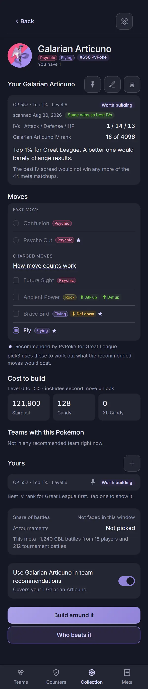 | 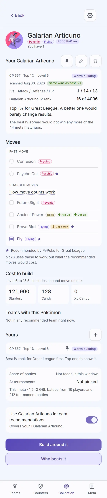 |
| `species-copy-evolve`: Melmetal's page showing a Meltan. "You have 6 Meltan that evolve into it"; "Your Meltan to evolve"; "Melmetal IV rank"; Melmetal's moves, starred set ticked, "A Meltan's moves change when it evolves, so pick3 assumes the starred ones."; "Evolve it to Melmetal"; cost with candy to evolve and Elite TM; Yours: three rows then "Show all 6" | 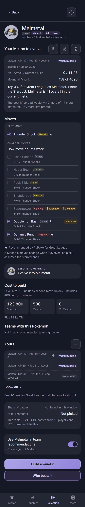 |  |
| `species-copy-built`: a copy already at its build level: Built tag, no "Level A to B" line | 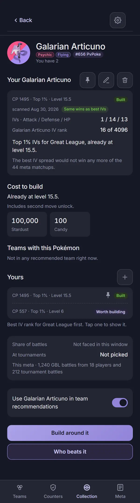 | 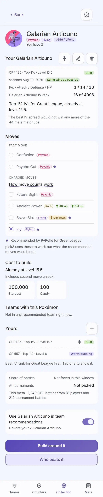 |
| `species-copy-shown`: the second Meltan tapped: shown in place, an empty pin on it, "Shown" on its row, the pin still on the first row | 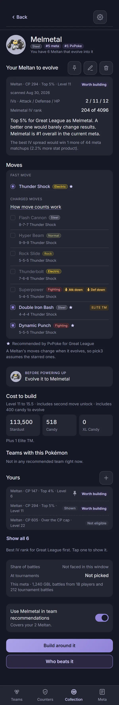 | 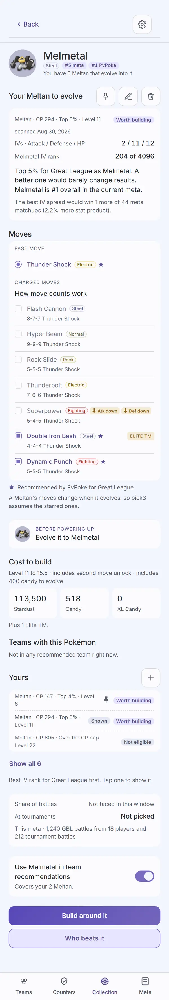 |
| `species-pin-confirm`: "Pin this Meltan for Great League?" with what it overrides | 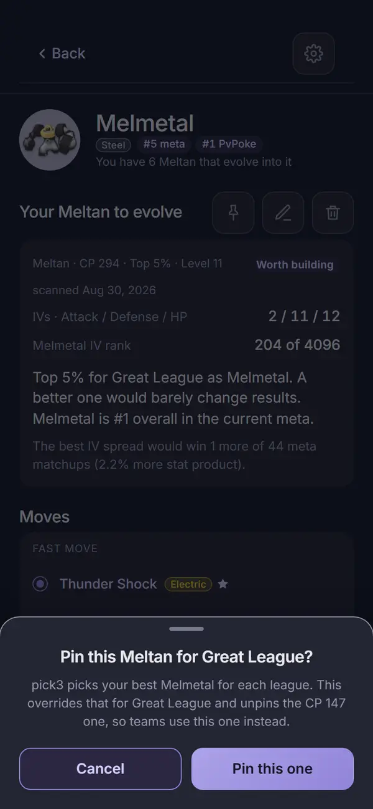 | 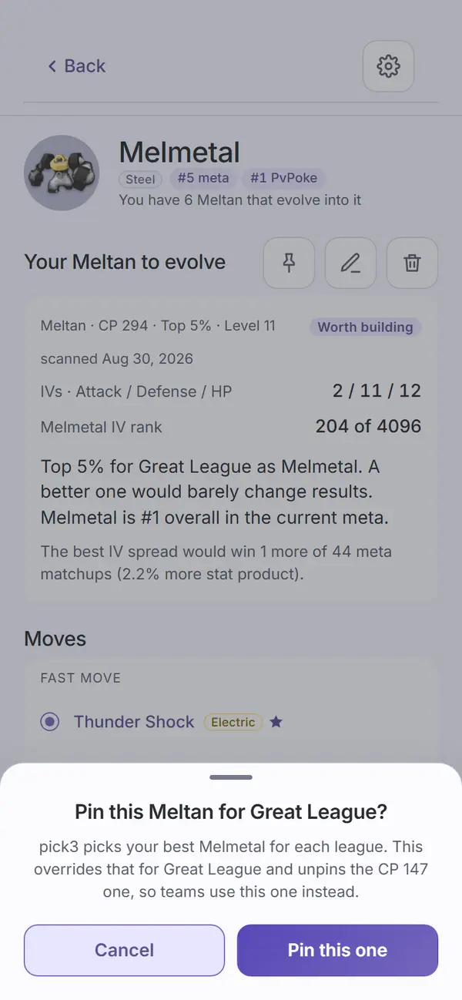 |
| `species-unpin-confirm`: "Unpin this Meltan for Great League?" with what unpinned means | 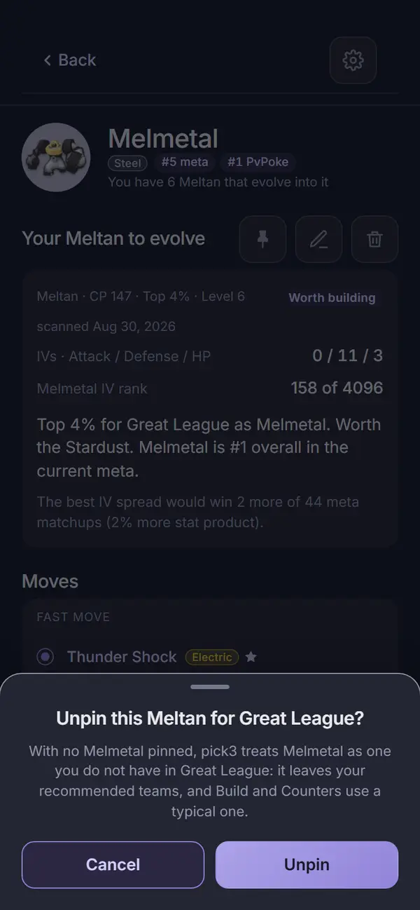 | 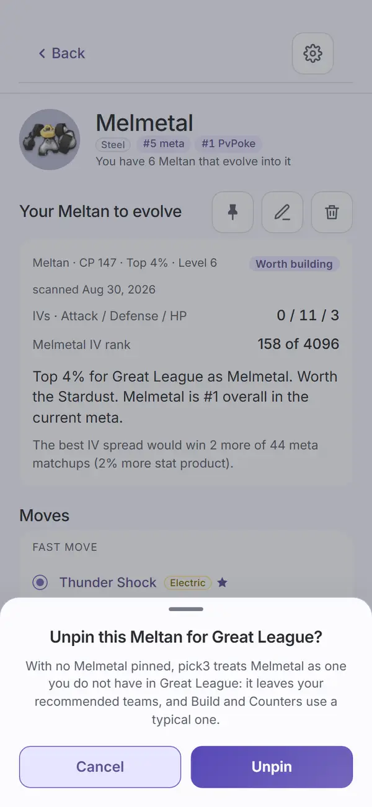 |
| `species-unpinned`: no pin on any row, the card saying "No Melmetal is pinned for Great League, so pick3 treats it as one you do not have." | 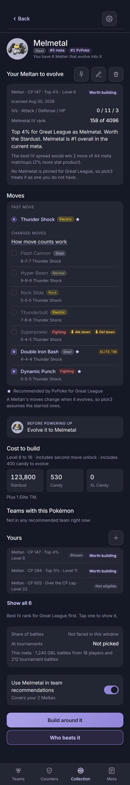 | 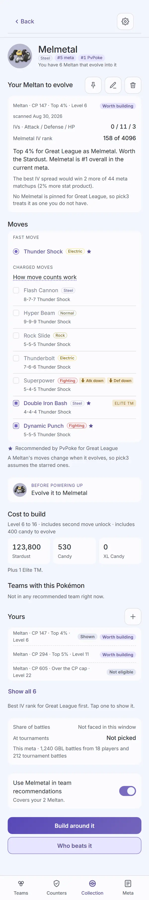 |
| `species-copy-manual`: a Swampert added by hand, landed on from Add | 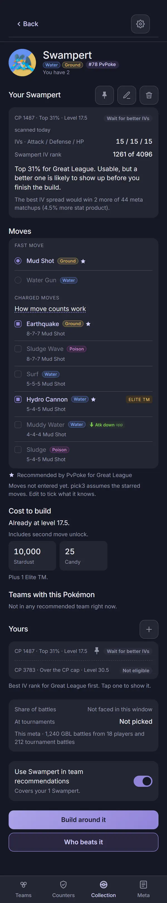 | 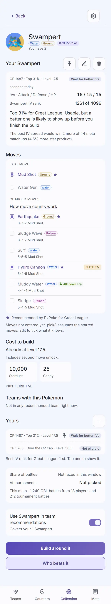 |
| `species-remove-confirm`: "Remove this Swampert?", red Remove, "A new import will not bring it back." | 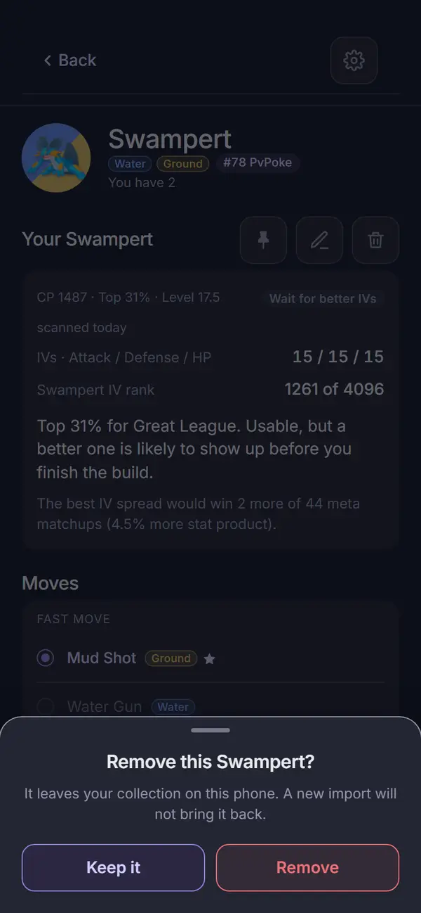 | 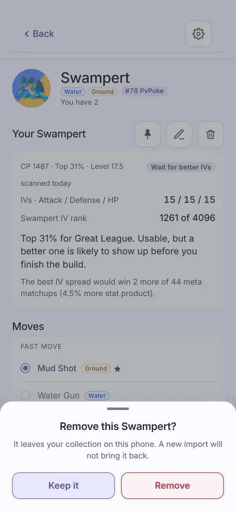 |
| `species-owned`: the meta's highest-ranked Pokémon you own, full page with the meta sections under Yours |  | 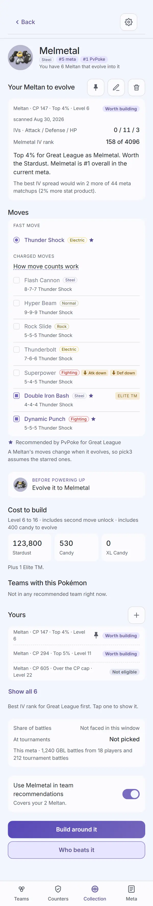 |
| `species-moves`: the Moves card scrolled to | 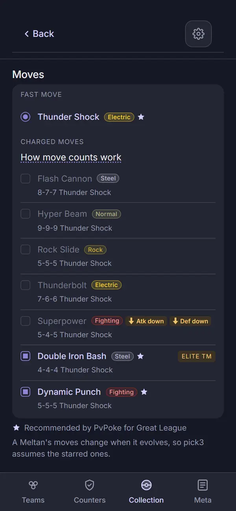 | 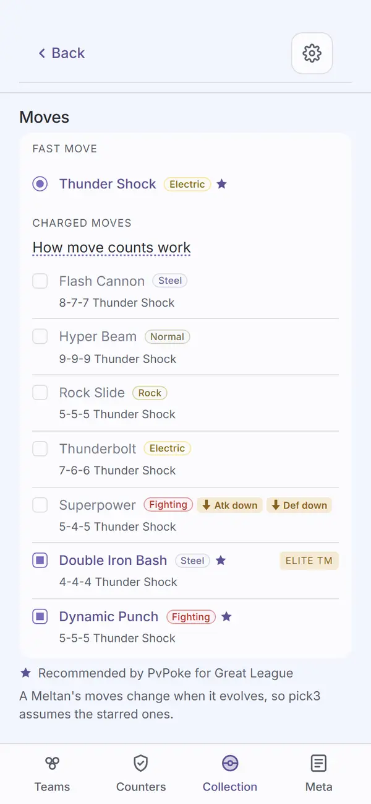 |
| `species-unowned`: not collected: Add one and Recommended moves as before, now with "Teams and counters assume these moves until you add one." | 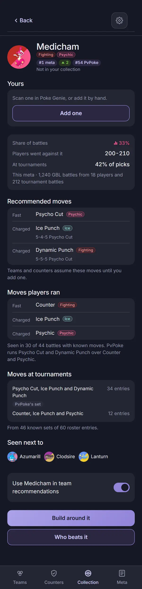 | 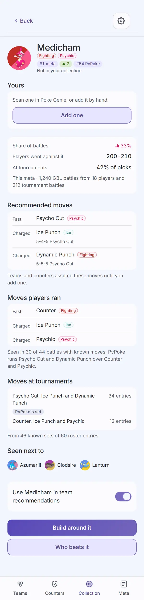 |
| `species-excluded`: the exclusion switch off | 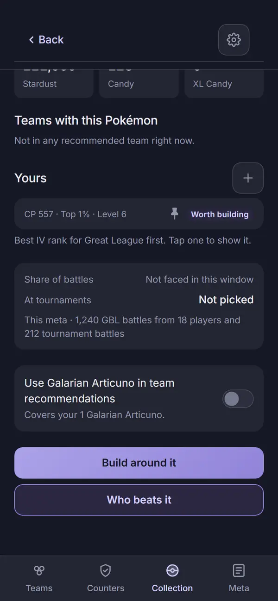 | 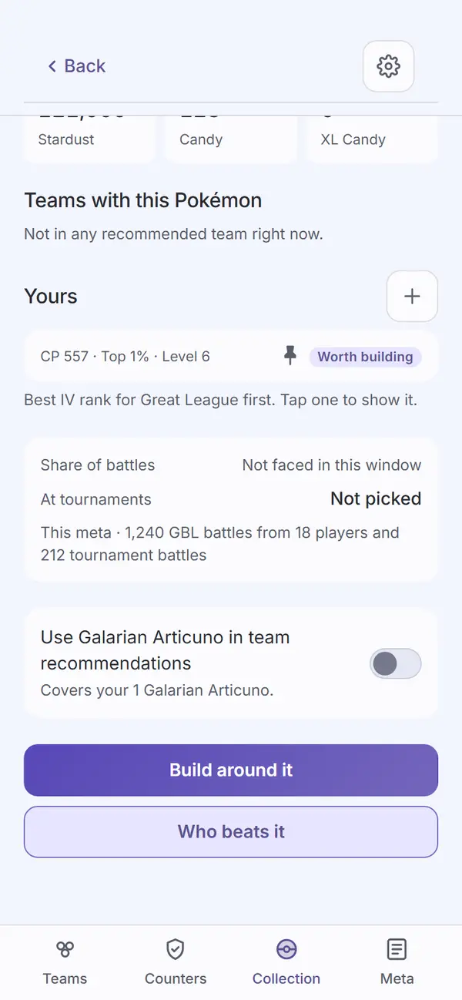 |
| `edit`: Edit, filled in, nothing changed: no save bar | 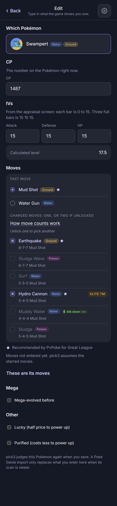 | 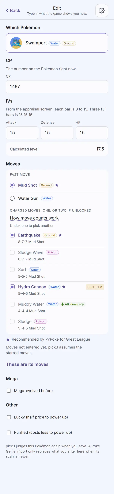 |
| `edit-dirty`: Lucky ticked: the save bar at the foot, clear of the last field | 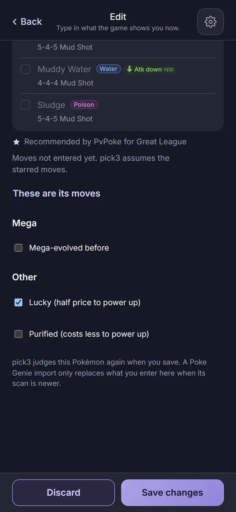 | 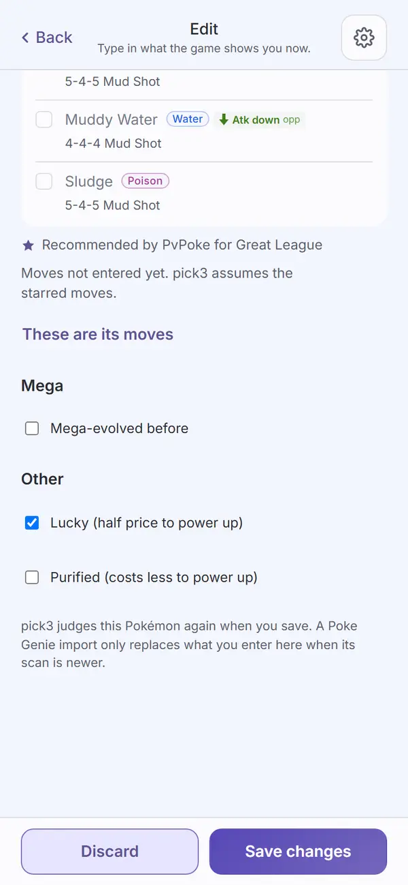 |
| `pokemon-link-not-found`: an old Pokémon link whose Pokémon is gone | 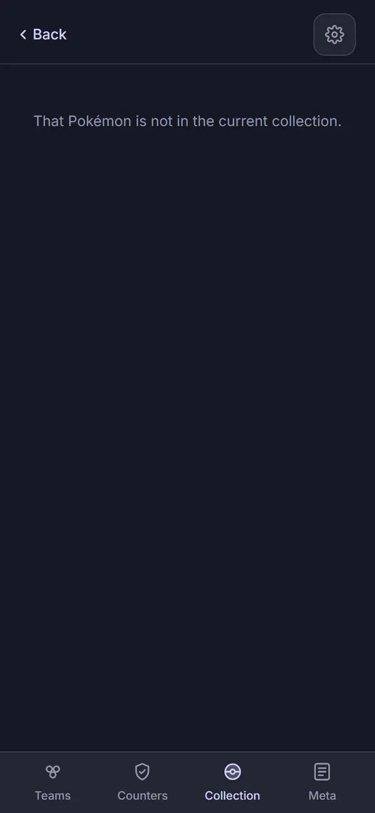 | 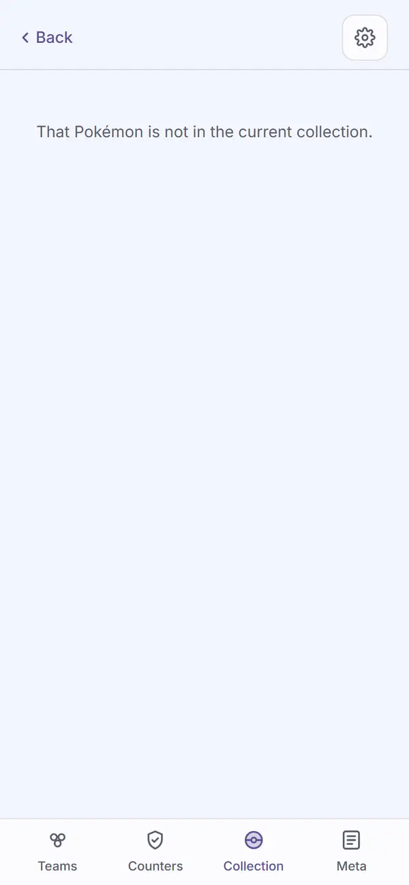 |

Not captured, covered by tests (`speciesPage.test.tsx`, `editPokemon.test.tsx`,
`movesCard.test.tsx`): a species the league does not allow with a copy held; a copy with no IVs;
`?copy=` naming a copy not on the page; "Best as"; "Also your pick for"; the evolve select and
"Evolved from"; moves entered, changed and cleared; Purified; "Discard your changes?"; the
calculated level with no exact match. The evolve flow was also driven by hand in Chrome on the
built app (an Eevee added, evolved to Umbreon in Edit, saved, shown on Umbreon's page).

## Automated checks

- [x] `npm run web:audit`: exit 0 on `7d82788`. Zero findings on every enforced screen in both
      themes, the 13 new ones included (`species-copy`, `species-copy-built`,
      `species-copy-evolve`, `species-excluded`, `species-copy-manual`, `species-copy-shown`,
      `species-pin-confirm`, `species-unpin-confirm`, `species-unpinned`,
      `species-remove-confirm`, `edit`, `edit-dirty`, `pokemon-link-not-found`). 107 findings
      remain on screens not yet redesigned, none failing; no NEVER line.
- [x] no console errors: the run printed no "Browser errors" section.
- [x] `npm run ui:audit`: "gallery audit: clean in dark and light" (the new SaveBar section).
- [x] `npm run lint`, `npm run typecheck`, `npm run check-tokens`, `npm run check-colors`: all
      exit 0. No new color literal.
- [x] `npm test`: all workspaces pass (the counts are in the branch's final report).

## Aesthetics

Awaiting Travis's review.

- [ ] colors from tokens, in their roles (violet interaction, pink measured with its mark,
      outcome colors, red only for destroying data)
- [ ] at most four text levels, one page title
- [ ] one filled primary button
- [ ] chips tapped, tags read
- [ ] the right header variant
- [ ] rows align; gutters and the 8px base hold
- [ ] sprites unchanged
- [ ] at most one line of text before the first result
- [ ] light as readable as dark

## Functionality

Awaiting Travis's review.

- [ ] every item of the spec, item by item
- [ ] every control does what its label says
- [ ] back returns to the origin with filters and scroll
- [ ] input layout rule (Edit): the fields come first, nothing the player needs sits under the
      keyboard except the save bar, which is fixed
- [ ] icon buttons named; focus visible
- [ ] product rules: assumptions shown, collection stays on the device, `connect-src` unchanged,
      sharing copy accurate
- [ ] tests cover the new behavior

## Findings and fixes

| Finding | Fix | Commit |
| --- | --- | --- |
| Driving the built app: the save bar floated 64px above the foot of Edit, with the form showing under it. Edit has no tab bar; the bar was placed for a screen that has one. | The bar sits at the foot by default; `aboveTabs` is for a screen with the tab bar. The capture script checks the bar is at the foot and clear of the last field. | `7d82788` |
| Driving the built app: after evolving an Eevee in Edit, saving went back to Eevee's page, where the Pokémon no longer is. | An evolved Pokémon lands on its new species page with itself shown. | `eb339e4` |
| Seen in a capture: a copy with a charged move known and no fast move showed no move counts. | The counts are shown against PvPoke's fast move, which is what they were figured for. | `eb339e4` |

## Notes for the review (choices made, not in the mocks)

- **Two primary-looking buttons on Edit while dirty?** No: the save bar's Save is the only
  filled button; "These are its moves" and "Clear moves" are text buttons.
- **The read-only moves card uses disabled radio and checkbox rows.** A known move reads at full
  strength, the others dimmed. They take no taps on the species page; Edit is where they do.
- **"Shown" also marks the shown row while the species is unpinned**, since no row carries a pin
  then.
- **The page of a copy's own species never says "evolve"**. A Meltan on Meltan's page is judged
  as Meltan; the row "Best as Melmetal in Great League" leads to the page where it is judged as
  Melmetal. Collection rows open the copy's own species page.
- **The Mega badge** sits at the bottom middle of its token in stacked tokens (asked for during
  this piece, `965c714`), bottom right everywhere else. See `teams-mega-cup` in the run.
- **Saved moves change the cost only.** The sims still run PvPoke's set until piece 3, and the
  copy says so ("pick3 uses these to work out what the recommended moves would cost.").

## Sign-off

- [ ] Travis, awaiting review
