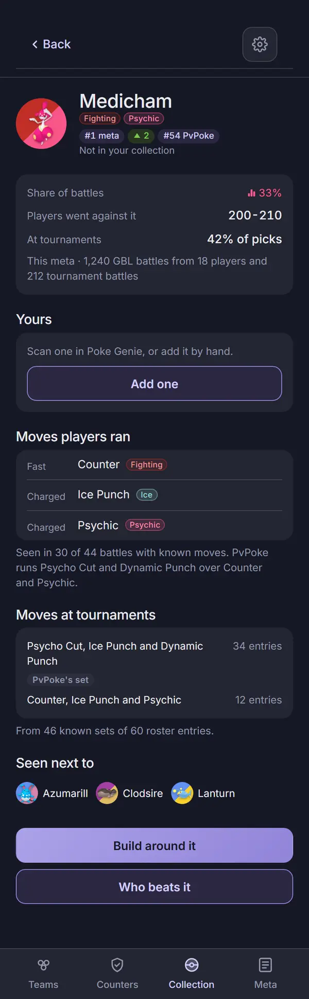
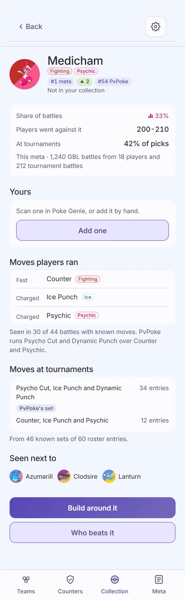
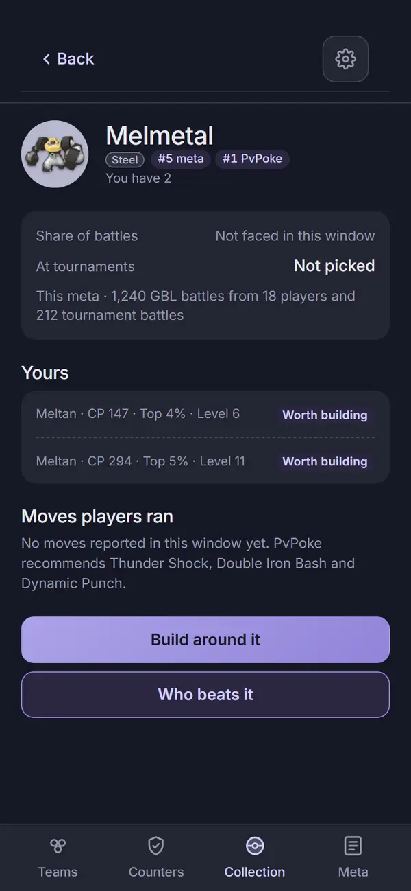
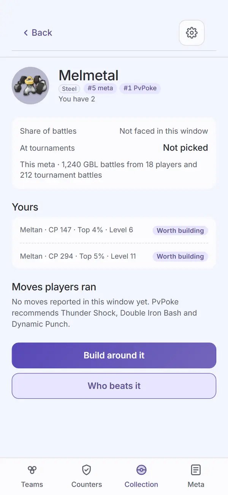

# Audit: Species page

Piece: meta in pick3. The page is new in pick3 (`#/species/<id>`), built on the signed specimen
page's parts (`pokemon-detail.md`) and replacing meta.pick3.gg's Species page (`meta-pokemon.md`).
Spec: `docs/superpowers/specs/2026-09-30-meta-in-pick3-design.md`, "Species page
(`#/species/<id>`)". Plan: `docs/superpowers/plans/2026-09-30-meta-in-pick3.md`, Task 13 (the
page) and Task 15 (this audit). Mockup: `mock/meta-in-pick3`, view `species`. Branch
`meta-in-pick3`.

The page: a sub header (Back, Settings); the hero (64px token, name, type chips, "#N meta" with
its trend tag, "#M PvPoke", then "You have N" or "Not in your collection"); the facts card (Share
of battles in pink with its mark, Players went against it, At tournaments, one source line);
Yours (your copies, best first, or Add one); Moves players ran against PvPoke's set; Moves at
tournaments; Seen next to; Build around it and Who beats it. It reads `/api/v1/meta` and
`/api/v1/species/<id>` for the league and the default window because the player opened it.

## Screenshots

Dark and light at 390px, one pair per state, full page, from the 2026-10-01 `npm run web:audit`
run on the code committed as `eb56ca0` (with this record's `screens.mjs`), converted to WebP
(600px wide, quality 72). The species detail is the new synthetic fixture
`fixtures/community-species-sample.json` (Medicham: 410 sightings, 200-210, two known movesets,
a tournament block with roster sets, three partners); the script answers every other species with
the worker's empty detail (nothing sighted, no moves, no partners, no tournament block).

| State | Dark | Light |
| --- | --- | --- |
| `species-unowned`: `#/species/medicham`, which the sample collection has none of. Medicham, Fighting and Psychic, "#1 meta" with a green "up 2" trend tag, "#54 PvPoke", "Not in your collection"; Share of battles 33% (pink, with the mark), "Players went against it 200-210", "At tournaments 42% of picks", "This meta · 1,240 GBL battles from 18 players and 212 tournament battles"; Yours: "Scan one in Poke Genie, or add it by hand." and Add one (secondary); Moves players ran: Counter, Ice Punch, Psychic, "Seen in 30 of 44 battles with known moves. PvPoke runs Psycho Cut and Dynamic Punch over Counter and Psychic."; Moves at tournaments: two roster sets, PvPoke's tagged, "From 46 known sets of 60 roster entries."; Seen next to Azumarill, Clodsire, Lanturn; Build around it (the one filled button) and Who beats it |  |  |
| `species-owned`: reached from the meta's highest-ranked Pokémon the sample collection has (Collection under Meta rank, its first owned row, then that specimen page's "See Melmetal in the meta"). Melmetal, Steel, "#5 meta", "#1 PvPoke", "You have 2"; "Not faced in this window", "At tournaments Not picked", the source line; Yours: two Meltan rows ("Meltan · CP 147 · Top 4% · Level 6", Worth building), each opening its specimen page; "No moves reported in this window yet. PvPoke recommends Thunder Shock, Double Iron Bash and Dynamic Punch."; no tournament sets and no Seen next to (nothing measured); Build around it and Who beats it |  |  |

The script checks as it shoots: the unowned page reads "Not in your collection" and offers Add
one; the owned page reads "You have N" with its verdict tags in. Who beats it (`#/counters?vs=<id>
&from=1`) is exercised from two other species pages on the way to `23-counters-vs` and
`24-counters-vs-outsider` (see `your-battles.md`), and Counters' Back returns to the species page.

Not captured, covered by `apps/web/test/speciesPage.test.tsx`: banned at tournaments, a species not
allowed in the league ("<Name> is not allowed in <League>."), an unknown id, the failed read
(`ErrorState` with Try again), a league named on an inbound link (`?l=`), and a Shadow copy
counting only for its Shadow form.

## Automated checks

- [x] `npm run web:audit` clean for this page's screens (`species-owned`, `species-unowned`, both
      in `AUDIT_ENFORCED`): the 2026-10-01 run on `eb56ca0` exited 0 with zero findings on both,
      in both themes. The first run found the Seen next to links 28px tall (see Findings); fixed
      in `eb56ca0`. 117 findings remain on screens not yet redesigned, none failing; no NEVER
      line.
- [x] no console errors: the run printed no "Browser errors" section.
- [x] `npm run lint`, `npm run typecheck`, `npx vitest run --project web`, `npm run check-colors`:
      lint exit 0, typecheck exit 0, web 59 files and 748 tests passed, check-colors exit 0.
- [x] fix round (2026-10-01, on `cabef9a` with the fix round's `screens.mjs`): `npm run web:audit` exit 0,
      zero findings on every enforced screen in both themes, no "Browser errors" section, 117
      findings on screens not yet redesigned, no NEVER line; web 59 files and 750 tests passed;
      lint, typecheck and check-colors exit 0.

## Aesthetics

Awaiting Travis's review.

- [ ] colors from tokens, in their roles (violet interaction, pink measured with its mark,
      outcome colors, red only for destroying data)
- [ ] at most four text levels, one page title
- [ ] one filled primary button
- [ ] chips tapped, tags read
- [ ] the right header variant
- [ ] rows align; gutters and the 8px base hold
- [ ] sprites unchanged
- [ ] at most one line of text before the first result
- [ ] light as readable as dark

## Functionality

Awaiting Travis's review.

- [ ] every item of the spec's species page section, item by item
- [ ] every control does what its label says
- [ ] back returns to the origin with filters and scroll
- [ ] input layout rule (input screens only): not applicable, no text input
- [ ] icon buttons named; focus visible
- [ ] product rules: assumptions shown, collection stays on the device, `connect-src` unchanged,
      sharing copy accurate
- [ ] tests cover the new behavior

## Findings and fixes

| Finding | Fix | Commit |
| --- | --- | --- |
| Audit: the Seen next to links (Azumarill, Clodsire, Lanturn) were 28px tall tap targets. | `.sp-mate` is `min-height: var(--tap)`. | `eb56ca0` |
| Seen in the captures: an unowned species had two filled buttons, Add one and Build around it. | Add one is the secondary (outlined) button; Build around it is the page's one primary. `speciesPage.test.tsx` asserts the one primary. | `eb56ca0` |
| Seen in the captures: the Yours card drew a dashed hairline above its first row and a solid one under its last, against the card's own edges. | `.sp-yours` keeps the dashed hairline between rows only. | `eb56ca0` |

## Notes for the review (seen in the captures, not changed)

- **"You have 2" while Collection groups six Meltan:** the page counts copies whose own species
  or verdict build is Melmetal, so the Meltan judged to build as something else (or not at all)
  stay off this page. That is the page's rule, not a bug; say if it reads wrong.
- **"At tournaments Not picked" is set in the large row weight** while "Not faced in this window"
  above it is muted. The two empty states read at different strengths.
- **The trend tag sits between "#1 meta" and "#54 PvPoke"** on the hero; on Collection's rows it
  is followed by the role tag. Both orders are the shared `MetaRankTags`.

## Sign-off

- [ ] Travis, awaiting review
