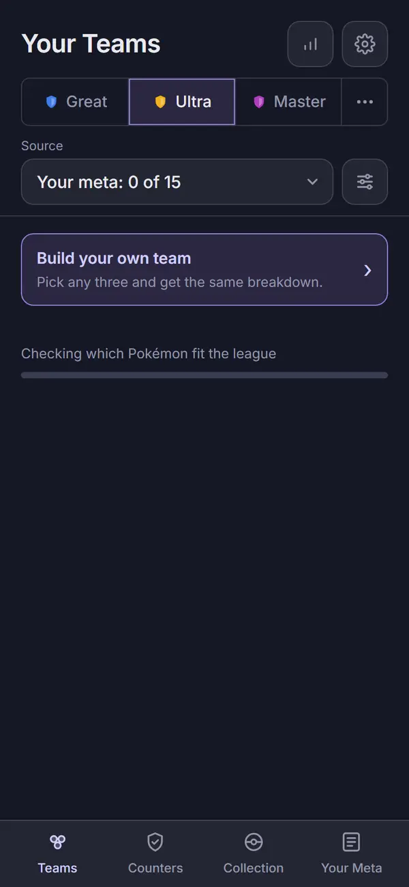
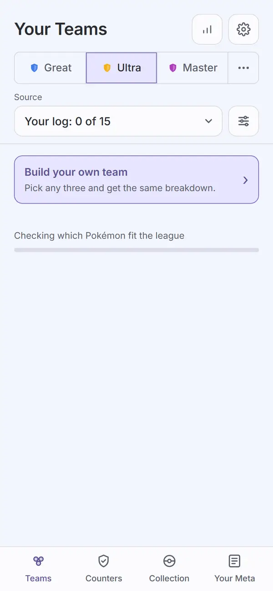
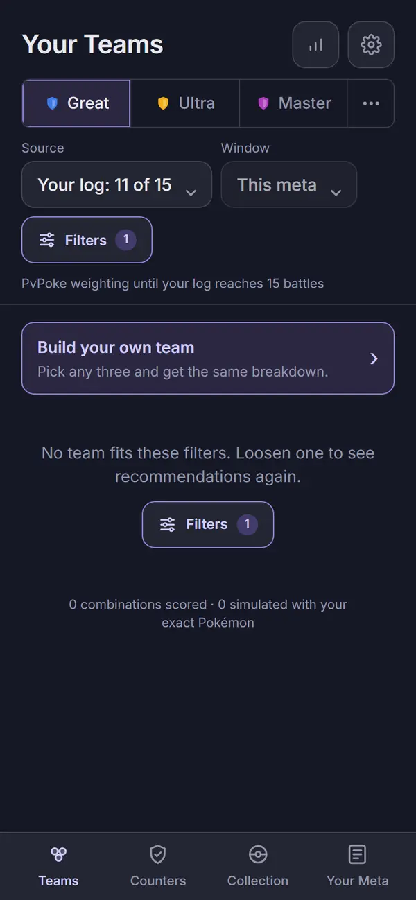
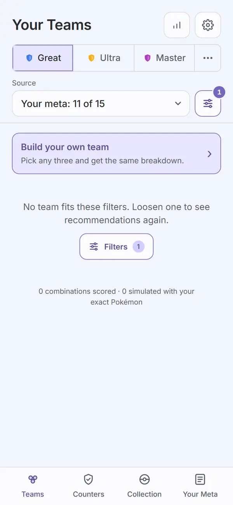

# Audit: Your Teams

Piece: 2. Inventory entry: `docs/design/inventory/2026-09-22-inventory.md`, page 1.
Intake entry: `docs/design/inventory/2026-09-23-design-intake.md`, "Page 1: Your Teams, first
pass", "Page 1: Your Teams, second pass" and "Page 1: direction (Travis, 2026-09-23)".

A note on sprites: this worktree's game data was built with `PICKTHREE_SKIP_SPRITES=1` (no
network access to PokeAPI during this task), so every capture below shows the type-colored
token-letter fallback instead of a sprite. That is a real, shipped state (Settings > Pokémon
pictures off, or a sprite that fails to load), and it is the worst case for contrast, which is
why Task 5 fixed the letters' contrast there. The live site at pick3.gg builds with sprites and
shows those instead; nothing on this branch touched sprite rendering itself.

## Screenshots

Dark and light at 390px, one pair per state. All 18 were regenerated by the controls change's
`npm run web:audit` run (2026-09-25) and converted to WebP (600px wide, quality 72).
Full-page captures show the tab bar at the true bottom of the page (see M2 below).

The controls, as Travis chose them on 2026-09-25 (spec commit `b26b682`): under the league row,
one row holds the Source select, filling the width with its "Source" label above, and the
Filters icon button at its right, bottom-aligned with the select. The active-filter count shows
as a badge on the icon's top-right corner (`teams-empty` shows "1"). Window moved to the top of
the Filters sheet (`teams-filters-sheet`), and there is no summary line under the row: the
Source value says what the list is weighted by, "(offline)" marks a community fallback, and the
progress card counts the log's battles. This replaces the earlier layout: Source and Window
selects side by side, a labeled Filters button under them, and a weighting line. Travis:
"I like showing only the source and the filter icon with the number. That looks the cleanest."

| State | Dark | Light |
| --- | --- | --- |
| `02-teams`: default list, Great League, first team open (full page) |  |  |
| `teams-second-open`: second row opened while the first stays open (full page) |  |  |
| `teams-community`: Source set to GBL, the community ladder (full page) |  |  |
| `19-teams-ultra`: Ultra League selected |  |  |
| `teams-cup`: the Tournament cup, reached through the league row's "..." overflow |  |  |
| `teams-filters-sheet`: the Filters sheet open over the list, Window at its top, disabled because the source is Your log: its value and chevron muted, its label as it was, the Source note under it |  |  |
| `teams-no-collection`: no collection saved yet |  |  |
| `teams-loading`: a run in progress (Ultra, first stage) |  |  |
| `teams-empty`: no team fits the filters (every specimen excluded) |  |  |

How the two new states are captured (`apps/web/scripts/screens.mjs`):

- `teams-loading`: after the Ultra tap, once Ultra's league bundle has landed and the loading
  card shows, the script holds the compute worker at a debugger pause through the worker's CDP
  session, shoots both themes, then lets it go. Automation only; the app has no hook for it.
  The shot fails if the card is gone when it is taken. The worker is paused right at the start
  of the eligibility stage, so the card reads "Checking which Pokémon fit the league" with its
  bar at 0 of N (an empty track). That is the true first frame of a run, not a missing fill.
- `teams-empty`: the script sets `excludedSpecimenIds` to every specimen id in the saved
  settings (IndexedDB), reloads, shoots the Empty card, then writes the saved settings back
  exactly and reloads again.

Not captured: the error state. A recommendation error has no clean trigger in the built app
without a test hook, and none was added. `ErrorState` (the shared component Teams renders on a
failed run) is covered by the gallery's audit (`docs/design/audits/gallery.md`, the
loading/empty/error states). On Teams, `teamsList.test.tsx` covers it: when `host.recommend`
rejects, the `ErrorState` alert shows the run's message and a "Try again" button (secondary, not
filled), and the list has no rows ("shows the error card with its message and a Try again that
runs again"). Try again runs the recommendation again. A changed setting (Source, Window,
Filters) also runs again after a failure ("runs again when a setting changes after a failed
run"), while unchanged settings never retry on their own ("does not run again on its own after
a failed run with unchanged settings"). With a community source, the community read that lands
after the failed run starts makes exactly one follow-up run, then nothing ("with a community
source, a failed run is followed by at most one more, not a loop").

## Automated checks

- [x] `npm run web:audit` clean for this page's screens (listed in `AUDIT_ENFORCED`), re-run
      2026-09-25 after the final fix wave: exit 0. Zero findings on all nine enforced Teams
      screens (`02-teams`, `teams-second-open`, `teams-community`, `19-teams-ultra`,
      `teams-cup`, `teams-filters-sheet`, `teams-no-collection`, `teams-loading`,
      `teams-empty`), in both themes. 1,338 findings remain on screens not yet redesigned (the
      previous record said 1,326; this wave made `20-your-meta` a full-page shot, and the
      difference was not broken down further); the run does not fail on those.
- [x] the run's own guards, added in the final fix wave, all passed in that run:
  - the collapsed row's `.team-summary` has no border (the stray box, I1);
  - Your Meta's first set row (`.team-row`) is `display: grid` (the regression I1 caused);
  - the header's title left edge and last icon button's right edge sit within 1px of the
    league row's edges (the double padding, I2);
  - `teams-loading` still shows its card when each theme's shot is taken.
- [x] no console errors: the run printed no "Browser errors" section.
- [x] `npm run ui:audit` re-run 2026-09-25 for the shared header change: "gallery audit: clean
      in dark and light". The gallery's two top headers now sit on the section's gutter.
- [x] `npm run meta:screens` re-run 2026-09-25 as a smoke check for the `packages/ui/base.css`
      change: exit 0.
- [x] `npm run lint`, `npm run typecheck`, `npm test`, `npm run check-colors`, `npm run
      check-tokens`, all re-run 2026-09-25: lint exit 0; typecheck exit 0 across all seven
      workspaces; `npm test` 127 files, 1,078 tests passed; `check-colors` exit 0 (no literal
      added, baseline untouched); `check-tokens`: ok.

## Aesthetics

- [x] colors from tokens, in their roles (violet interaction, pink measured with its mark,
      outcome colors, red only for destroying data): `check-colors` is clean and `web:audit`
      finds zero contrast findings on the nine screens; Task 5's fixes draw the active tab and
      every ghost button from `--accent-text` and the token-disc letters from the
      `--token-letter` / `--token-halo` pair, all tokens. **Known deviation for sign-off (M3):**
      the progress card's contribution line, "Anonymous logs also improve the live meta.", is
      pink with its dot (ProgressCard renders `contribution` as a `MeasuredLine`), but it is a
      sentence, not measured data. The core-flow spec supplies that exact sentence, and the
      foundation spec meant the slot for a contribution count, so this is a spec-level tension.
      Travis to decide: either the line becomes a measured count (for example "N of your
      battles shared this season"), or ProgressCard gets a plain-text variant for a
      non-measured sentence. No code change in this pass.
- [x] at most four text levels, one page title: one `<h2>` "Your Teams" in every capture,
      including `teams-no-collection`, which now carries the same page head (M1;
      `teamsHeader.test.tsx`'s "keeps the page title, the meta link and Settings above the ways
      in"; `teamsList.test.tsx`'s "has one page title and no Pokémon count in the header"). In
      `teams-filters-sheet` the list's title stays under the sheet's scrim, and the sheet has
      its own title, "Filters". Levels visible across the captures: the page title, card and
      row team names (bold), body and explanation text, and small muted meta text (Stardust
      totals, the Source label) - four.
- [x] one filled primary button: on Teams with a collection there is no filled primary button,
      which is correct because the page's actions are per team, not page-level (`View analysis`
      and `Edit team` are text links inside each row; "Build your own team" is a tinted,
      bordered card, not a filled button). `teams-empty`'s Filters action is an outlined
      button. `teams-no-collection` is the one screen with a true primary action, and it has
      exactly one: "Import a CSV" is the sole filled button among the three choice cards.
- [x] chips tapped, tags read: the fit tag ("Strong fit") and the dotted "Balanced ABC" term are
      read-only labels on every open row, not pressable. `teams-filters-sheet` shows switches
      (No XL, No Shadows, No Elite TM, Budget builds), not chips. No pressable chip row remains
      on the page; the sideways chip row the direction called out for removal is gone,
      replaced by the Filters icon button and its sheet.
- [x] the right header variant: every capture uses the shared `Header variant="top"` (page
      title plus the meta and cog `IconButton`s), including `teams-no-collection`. Teams is,
      for now, the only app page on that variant; Collection, Counters and Your Meta still use
      their own `.page-head` markup until their pieces move them over. In every capture the
      title's left edge and the cog's right edge line up with the league row under them (the
      `screens.mjs` edge guard measures it in `02-teams`).
- [x] rows align; gutters and the 8px base hold: every collapsed row is one card with the
      sprites, names and fit line directly on it, no inner bordered box (checked in all nine
      pairs, and by the `screens.mjs` border guard); the header, league row, the Source and
      filter row, the Build your own team card and the list share one 20px gutter in both
      themes. The filter icon's right edge meets the league row's, and its bottom the Source
      select's. Every select's chevron sits on its box's vertical middle (fixed on this branch,
      see the findings table).
- [ ] sprites unchanged: cannot confirm from these captures. This worktree has no sprite build
      (`PICKTHREE_SKIP_SPRITES=1`), so every Pokémon in every capture is a lettered token disc
      (open rows) or an unlettered disc (collapsed rows, `showInitial={false}`), never a sprite
      image. The token fallback renders correctly with Task 5's fix: the "M" on Melmetal's
      single-type steel disc is clearly legible with its outline in both `teams-cup` captures.
      No CSS or component that draws a sprite changed on this branch.
- [x] at most one line of text before the first result: no supporting line at all between the
      controls and the list on any list state; the Build your own team card comes straight after
      the Source row. The one exception is "No community data for this league", shown only for
      a league without community data. In `teams-no-collection` the one line is "No collection
      yet. Pick a way in." In `teams-filters-sheet` the sheet opens on its title ("Filters")
      and the "Window" field label. While Window does not apply, a one-line note sits under the
      select: "Applies when Source is GBL, Tournaments or All" for PvPoke or Your log (as in the
      capture), or "No community data for this league" for a league without community data
      (`filters.test.tsx` covers both). The disabled select shows its value and chevron muted
      (the shared `.select-wrap select:disabled` rule), its label unchanged.
- [x] light as readable as dark: every state above is a matched dark/light pair; `web:audit`'s
      per-theme contrast pass is clean on all nine in both themes.

## Functionality

- [x] every "must keep" from the inventory entry, item by item:
  - Recommendations run on device, re-run automatically whenever the filter key changes, and
    show staged progress: `Teams.tsx`'s effect re-runs `runRecommend()` whenever
    `filterKey(settings, logVersion, community)` goes stale; `teamsList.test.tsx`'s "reopens
    only the first row when a fresh recommendation replaces the list" proves a settings change
    triggers a second `host.recommend()` call. Staged progress is now captured in
    `teams-loading` (the eligibility stage, "Checking which Pokémon fit the league").
  - Each card's fit, structure, difficulty and why, three Pokémon with roles, explanation, and
    cost: visible on the open row in `02-teams`, `teams-second-open` and `teams-community`
    (full page, nothing painted over them now that the tab bar sits at the bottom), and the
    upper part of it in the viewport shots `19-teams-ultra` and `teams-cup` (fit tag, dotted
    structure term, "Demanding to play" with its why, Lead / Safe Switch / Closer, the
    explanation paragraph, and the Stardust / Candy / XL Candy / Elite TM cost line).
  - Edit and analysis as separate actions: "View analysis" and "Edit team" are two separate text
    links inside every open row; `teamsList.test.tsx`'s "View analysis and Edit team go to their
    places without toggling the row" confirms each does only its own job.
  - The footer counts: "N combinations scored · M simulated with your exact Pokémon" is present
    on every list state with a result (`teams-empty` reads "0 combinations scored · 0
    simulated"); `teamsList.test.tsx`'s "keeps the footer counts".
  - Sprites only: see the "sprites unchanged" note above; there is no other Pokémon artwork.
- [x] every control does what its label says: league tabs switch league (`19-teams-ultra`), the
      "..." overflow opens the cup list and selects Tournament (`teams-cup`), Filters opens the
      sheet and Done closes it (`teams-filters-sheet`; `teamsHeader.test.tsx`'s "names the
      filter count on the icon and opens the Filters sheet"), the Source select switches the
      weighting (`teams-community` reads "GBL"), Window in the Filters sheet writes the window
      for a community source and is disabled with the matching note otherwise
      (`filters.test.tsx`), the
      filter icon and the Empty card's Filters action carry the active count ("1",
      `teams-empty`), Settings opens the settings sheet with or without a
      collection (`teamsHeader.test.tsx`), Build your own team is a link to Build. After a
      failed run, the error card's Try again runs again, and Source, Window and Filters still
      run the recommendation when they change (`teamsList.test.tsx`, the error-state tests).
- [x] back returns to the origin with filters and scroll, for the Teams side: open rows live in
      `useSticky('teams.open')`, keyed by the recommendation object, and scroll in
      `useScrollMemory('teams.scroll')`, so leaving Teams (View analysis, another tab) and
      coming back keeps both for the session. `teamsList.test.tsx`'s "keeps the rows the player
      opened and closed across leaving Teams and coming back" and "keeps a closed first row
      closed while a new run is pending". Filters and source are settings, so they persist
      anyway. Analysis's own history-back lands with the Analysis plan.
- input layout rule: not applicable, Teams has no text input.
- [x] icon buttons named; focus visible: both header icon buttons carry a `label` ("meta.pick3.gg,
      the community meta", "Settings"), and the filter icon is named "Filters", or "Filters, N
      on" with its count (`Controls.test.tsx`, `teamsHeader.test.tsx`); the shared `IconButton`/`Button` components carry the
      same focus-visible outline audited on other pages (gallery record).
- [x] product rules: assumptions shown (the footer counts; the Source value names the weighting,
      with "(offline)" on a community fallback);
      collection stays on the device (Teams makes no request that carries collection data; the
      community-source read is the existing league-only board fetch); `connect-src` unchanged
      (no CSP edit on this branch); sharing copy accurate ("Anonymous logs also improve the
      live meta." shows only when sharing is on - `teamsList.test.tsx`'s "shows"/"hides the
      contribution line" pair; its pink is the M3 deviation above).
- [x] tests cover the new behavior: `apps/web/test/teamsList.test.tsx`,
      `apps/web/test/teamsHeader.test.tsx`, `apps/web/test/teamComponents.test.tsx`,
      `apps/web/test/filters.test.tsx` and `packages/engine/test/compareTeamScores.test.ts`.
- [x] the new behaviors:
  - Battle-strength order: `compareTeamScores` (`packages/engine/src/recommend.ts`) sorts by
    `battle` first, `total` breaking ties, replacing a `total`-only sort (commit `b6333af`,
    tested in `packages/engine/test/compareTeamScores.test.ts`, 3 cases). Ruled intended in
    Task 1: under battle-first order, `diversify()` keeps the stronger of two near-duplicate
    trios, so one recommended team changes in the PvPoke baseline snapshot
    (greninja_shadow/melmetal/corsola_galarian at battle 88.3 replaces the clodsire variant at
    85), and the analyze snapshot that reads `teams[0]` moved with it. That is the effect of
    sorting by battle strength, not a tie-break or an order change.
  - First row open, open state per session: `teamsList.test.tsx`'s "shows every team as a row,
    the first one open", "reopens only the first row when a fresh recommendation replaces the
    list" and the two I3 tests above; visible in `02-teams` (first row open, rest closed) and
    `teams-second-open` (first row stays open while the second opens).
  - Filters count: `filterCount()` (`Teams.tsx`) counts the four moved switches, a non-empty
    exclude list, a non-"Any" team style, and a Window other than This meta while a community
    source is picked (a hidden choice always shows on the badge; Window does not apply to PvPoke
    or Your log, so it does not count then). `teamsHeader.test.tsx`'s "counts the moved filters,
    a non-empty exclude list and a non-Any team style" and "counts a window other than This meta
    only while a community source is picked". `teams-empty` shows it on screen: the badge "1"
    (the exclude list) on the filter icon, and "Filters 1" on the Empty action.
  - Progress card rules: `02-teams`, `teams-second-open` and `teams-community` show the "Make
    these teams personal 11 / 15" card with its contribution line, matching
    `teamsList.test.tsx`'s "shows the progress card under 15 logged battles" and "shows the
    contribution line ... when battle sharing is on". Hiding the card at 15 or more battles, and
    hiding the contribution line when sharing is off, are confirmed only by the two matching
    tests; no captured state reaches 15 logged battles.

## Findings and fixes

| Finding | Fix | Commit |
| --- | --- | --- |
| `.tab.on` (active tab bar item): `--accent` on `--bg` measured 4.31:1 in light, short of 4.5:1. Present on every enforced light screenshot, and flagged on `teams-no-collection`. | `.tab.on` draws from `var(--accent-text)` instead of `var(--accent)`. | `9a2117a` |
| `.btn-ghost` (the Filters sheet's Done button): same 4.31:1 in light. | `.btn-ghost` draws from `var(--accent-text)`. | `9a2117a` |
| axe left `.team-why` and the Filters sheet's `.meta` / `.muted.small` as "contrast unverified - partially obscured", even though the same opaque ground painted under every line. | `scripts/audit.mjs`: for an `elmPartiallyObscuring` node, cut each line's stack at the first opaque background; if every line's upper layers are identical, flat, opaque and free of blend/opacity/text-shadow, composite and measure the real contrast instead of leaving it unverified. | `9a2117a` |
| Sprite-less token-disc letters (white on a type-colored disc) measured as low as 2.51:1 (white on Melmetal's steel gray); axe left them "contrast unverified" (single letters read as "too short", and a dead `.token-shadow-wrap::before` sat in the Shadow-token stack). | Ruling: option A. New shared `--token-letter` / `--token-halo` tokens; `.token` gets a 1px four-direction stroke plus a soft drop shadow from `--token-halo`; two-type discs (a CSS gradient axe cannot measure) get `data-audit-contrast="static"` plus a unit test in `packages/ui/test/contrast.test.ts`; a new `packages/ui/test/SpeciesToken.test.tsx` checks the marker. | `3240be0` |
| Review round 1 (5 items): the contrast test compared the letter against the raw type color instead of its own text-shadow outline; only one stroke direction was asserted; `--token-letter` / `--token-halo` were duplicated per theme block instead of shared; the audit's own self-measuring path (composited-contrast) had no regression test; an `AUDIT_ENFORCED` screen could be silently dropped from capture without failing the run. | Contrast test now composites `letter` over `outline` over the type color; asserts all four stroke directions; both tokens moved to the shared `:root` block; `scripts/ui-audit.mjs` gained a self-check fixture (`#fail`/`#pass`) that must report exactly one measured finding; `screens.mjs` tracks every shot taken and fails the run if an `AUDIT_ENFORCED` name was never captured. | `06b626f` |
| I1: every Teams row drew a bordered box inside its card. `TeamRowSummary` used `.team-row`, the class Your Meta's set list already used, so both rules applied to both elements. It also broke Your Meta (outside Teams): the new rule's `display: flex` turned the set rows' grid into a flex line, pulling the battle count and W-L record against the sprites. Never shipped. | The summary's classes are now `.team-summary*` (test id `team-summary-names`), the weighting line `.teams-weighting` (the line itself was later removed by the controls change); Your Meta's `.team-row` untouched. `screens.mjs` throws if the summary has a border or a set row is not a grid, and `20-your-meta` is now a full-page shot so the set list is in the capture. | `004bdf3` |
| I2: the top header was padded twice. `.ui-top` padded itself (safe-area inset plus 20px, a gutter each side) inside `.page-head`, which already pads, so the title and icon buttons sat 40px from the edges against the league row's 20px, and on an installed iPhone the notch inset counted twice. The gallery had the same double inset. | `.ui-top` has no padding of its own (`packages/ui/base.css`); the head container owns the gutter and safe-area inset, stated in `Header.tsx`'s doc comment and the base.css comment (meta's head must pad the same way when it adopts the top variant). `screens.mjs` throws if the title or last icon button is off the league row's edges by more than 1px. The guard measures `.league-row` (falling back to `.league-switcher`), because the "..." overflow sits beside the radiogroup, not inside it. | `59ac5d2` |
| I3: open rows and scroll reset every time the player came back to Teams, and the effect on `recommendedWith` reopened the first row the moment a new run started. | Open rows in `useSticky('teams.open')` keyed by the recommendation object (a new list resets only at `rec-done`), the effect deleted, `useScrollMemory('teams.scroll')` added. Tests: remount keeps rows; a pending run keeps a closed first row closed; the fresh-list test still passes. | `87fe093` |
| I4: the spec's loading and empty states were not captured or audited. | `teams-loading` and `teams-empty` captures added to `screens.mjs` and `AUDIT_ENFORCED` (how, above). Error is not captured (why, above). | `5025582` |
| M1: Teams without a collection had no title and no way to Settings. | The same page head with `Header variant="top"` renders above `NoCollection`, without the league or controls rows; new test in `teamsHeader.test.tsx`. | `54884a2` |
| M2: full-page captures painted the fixed tab bar across the first open row, over its explanation. | Full-page shots pass `captureBeyondViewport: false`, so Chrome sizes the viewport to the page and the bar lands at the bottom. Capture only; the DOM checks are unchanged. | `5025582` |
| M4, M5: `GLOSSARY['line']` duplicated `'ABB line'` with no reader; a test matched `/mimikyu/` only through the id fallback. | Entry deleted; `/mimikyu/i`. | `f14451f` |
| I5: this record ticked items the captures or code contradicted. | Rewritten from the fix wave's fresh run and captures. | `c71df52` |
| Re-review N1: after a failed run the error card was a dead end. The Teams effect was gated on `!recommendError`, so Source, Window and Filters changed their settings but never ran again until a league switch or a reload, and the card had no retry. | The error card has a "Try again" button (`runRecommend`; `rec-start` clears the error), and the effect runs when the error is set only if the key is stale, so a changed setting runs again and unchanged settings never loop. Four tests, including the community-source case (one follow-up run, then none). Test hygiene (N3): the list tests unstub globals in an `afterEach`. | `60d1121`, `b256663`, `45fd024` |
| Every select's chevron sat 8px below its box's vertical middle, in both apps (visible in every earlier capture). Root cause: `Chevron` turns itself with an inline `transform: rotate(90deg)`, which replaced `.select-wrap svg`'s `translateY(-50%)` centering in `packages/ui/base.css`. | The chevron is centered with `top: 0; bottom: 0; margin: auto 0` (no transform to collide with), and the select is a block so its wrap is exactly its height. `ui:audit` now fails if any gallery select's chevron center is more than 1px off the select's center (it reported 8.0px before the fix). Checked in `teams-filters-sheet` and meta.pick3.gg's Window and Source selects. | `514e550` |
| Controls redesign (Travis, 2026-09-25, spec `b26b682`): Source and Window side by side, a labeled Filters button under them and a weighting line took four lines of controls. | One row: Source filling the width and `FilterButton`'s new icon-only form with a count badge (`91b4e00`, `92c0889`); Window at the top of the Filters sheet, disabled with a note when it does not apply (`e6520b9`); a non-default Window counts on the badge while a community source is picked (`f72891c`). The badge hangs over the button's corner on purpose, so `scripts/audit.mjs`'s clipping check now skips overflow that a descendant marked `data-audit-overhang` alone explains; anything wider still reports. | `91b4e00`, `92c0889`, `e6520b9`, `f72891c` |
| Controls review: the Window note read "Applies when Source is GBL, Tournaments or All" even when a community source was picked and the league had no community data; the "has community data" rule was written out twice (Teams, Filters); the disabled Window select used the browser's own greyed look. | A league without data now reads "No community data for this league" (`filters.test.tsx`, both notes); `hasCommunityData` in `apps/web/src/state/facing.ts` serves both screens (with the unknown-league rule and its comment, three unit tests); `packages/ui/base.css` gains `.select-wrap select:disabled` (value in `--muted`, chevron in `--faint`, opacity kept at 1 so the label and field stay put), shown in the gallery. | `aecbd2e`, `7f04f12`, `7513306` |

Visible changes outside Teams, from this branch:
- Every select's chevron, in both apps (meta.pick3.gg's Window and Source included), moves up
  8px to its box's vertical middle.
- `packages/ui` gains `FilterButton`'s icon-only form; the labeled form (the Empty card's action)
  is unchanged.
- Every disabled select, in both apps, shows its value muted and its chevron faint, instead of
  the browser's own disabled look.
- The active tab-bar item (icon and label) moves from `--accent` to `--accent-text` on every
  screen in the app: paler in dark, darker in light.
- Every `.btn-ghost` gets the same `--accent-text` shift: the sheet Done buttons (Filters and
  Settings), the UpdateStatus links in the Settings sheet, the order and result rows, the set
  Done button. The update toast's button is `.update-toast button`, not `.btn-ghost`, and is
  unchanged.
- Every sprite-less token letter in `apps/web` gains a thin dark outline and a soft drop shadow
  in place of the old faint shadow. The base rule also applies in `apps/meta`, but meta never
  shows a letter (`SpeciesToken`'s `showInitial` defaults to off and no meta call site turns it
  on), so nothing visible changes there. Tokens that show a
  sprite are unchanged.
- The gallery's top headers lose their double inset: they now sit on the section's gutter
  (`packages/ui/screenshots/gallery-*.png` from the `ui:audit` re-run).
- Your Meta's set rows are unchanged from main: the I1 regression never shipped, and the
  `screens.mjs` grid guard now holds them.

## Sign-off

- [ ] Travis, <date>
