# Audit: Your Teams

Piece: 2. Inventory entry: `docs/design/inventory/2026-09-22-inventory.md`, page 1.
Intake entry: `docs/design/inventory/2026-09-23-design-intake.md`, "Page 1: Your Teams, first
pass", "Page 1: Your Teams, second pass" and "Page 1: direction (Travis, 2026-09-23)".

A note on sprites: this worktree's game data was built with `PICKTHREE_SKIP_SPRITES=1` (no
network access to PokeAPI during this task), so every capture below shows the type-colored
token-letter fallback instead of a sprite. That is a real, shipped state (Settings > Pokémon
pictures off, or a sprite that fails to load), and it is the worst case for contrast, which is
why Task 5 fixed the letters' contrast there. The live site at pick3.gg builds with sprites and
shows those instead; nothing in Tasks 1-6 touched sprite rendering itself.

## Screenshots

Dark and light at 390px, one pair per state.

| State | Dark | Light |
| --- | --- | --- |
| `02-teams`: default list, Great League, first team open | 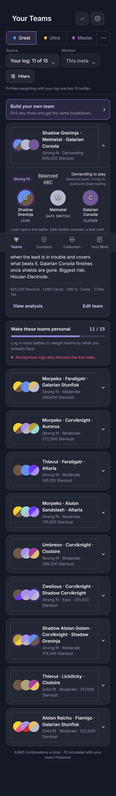 | 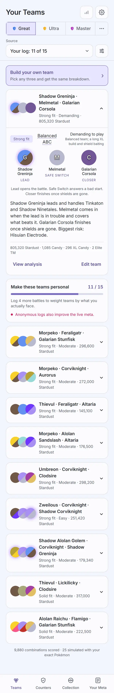 |
| `teams-second-open`: second row opened while the first stays open | 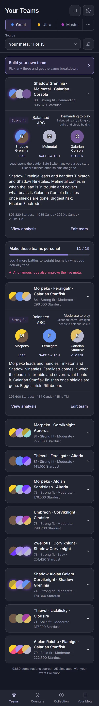 | 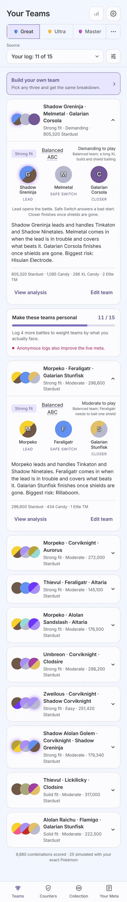 |
| `teams-community`: Source set to GBL (community ladder) | 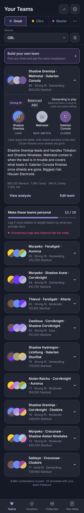 | 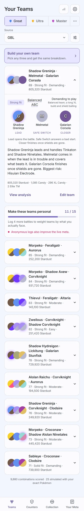 |
| `19-teams-ultra`: Ultra League selected | 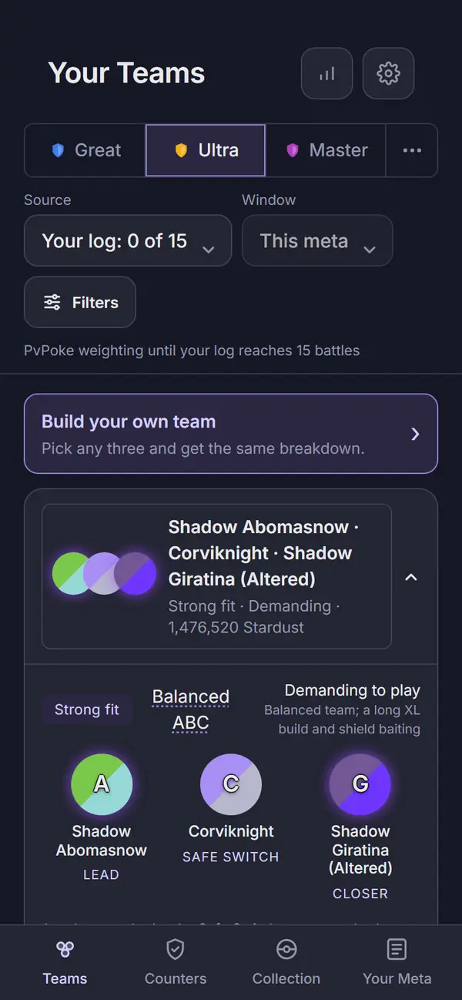 | 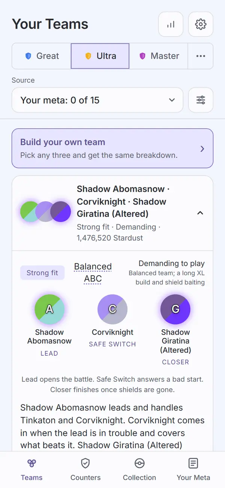 |
| `teams-cup`: the Tournament cup, reached through the league row's "..." overflow | 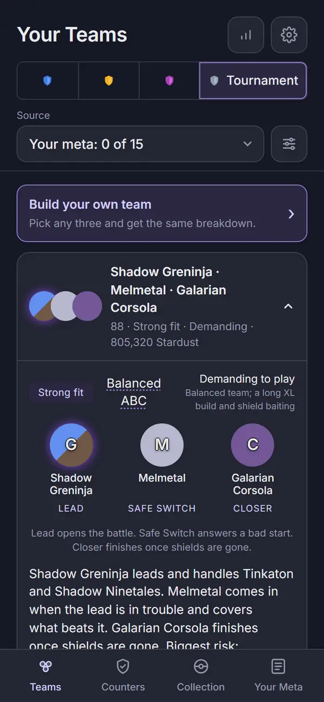 | 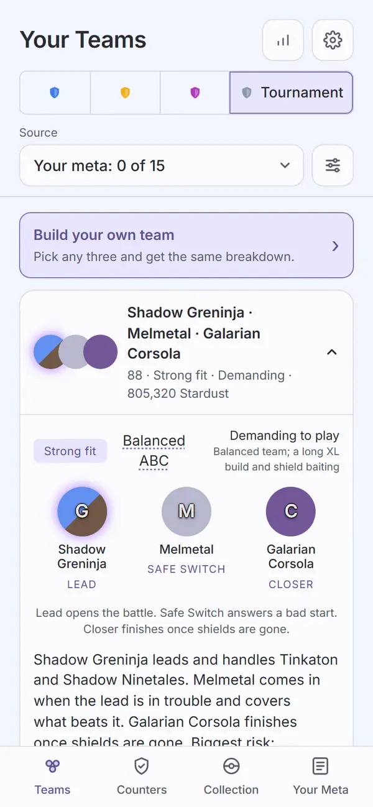 |
| `teams-filters-sheet`: the Filters sheet open over the list | 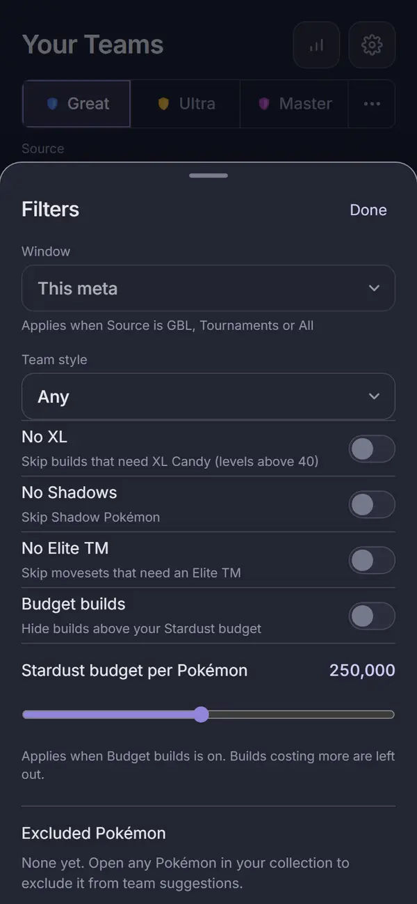 | 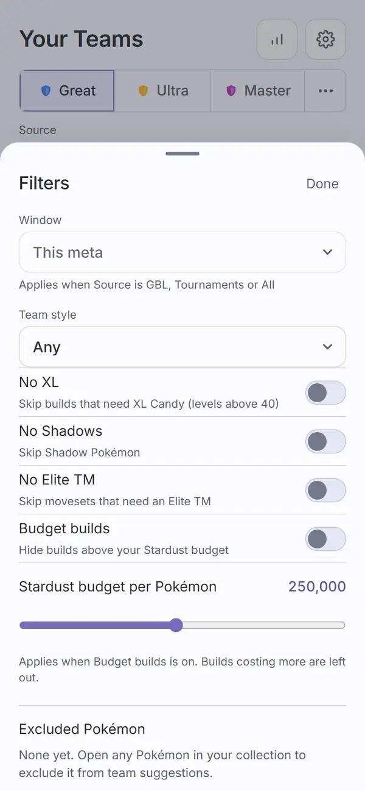 |
| `teams-no-collection`: no collection saved yet | 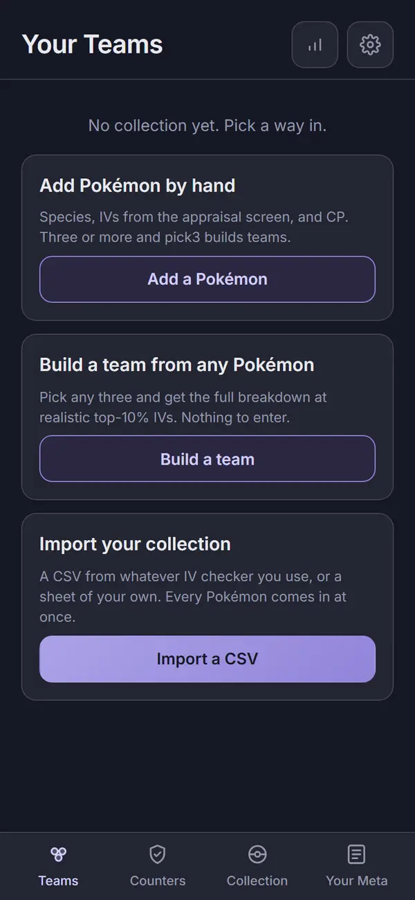 | 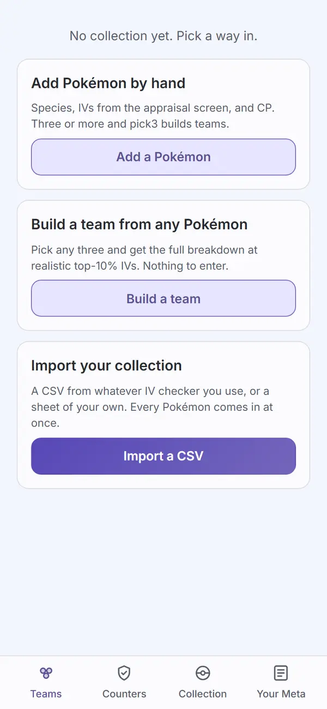 |

## Automated checks

- [x] `npm run web:audit` clean for this page's screens (listed in `AUDIT_ENFORCED`), re-run
      2026-09-25: exit 0. Zero findings on all seven enforced Teams screens
      (`02-teams`, `teams-second-open`, `teams-community`, `19-teams-ultra`, `teams-cup`,
      `teams-filters-sheet`, `teams-no-collection`), in both themes. 1,326 findings remain on
      screens not yet redesigned; the run does not fail on those. All 14 captures
      (`apps/web/screenshots/`) were freshly regenerated by this run before conversion.
- [x] no console errors: the run printed no "Browser errors" section.
- [x] `npm run lint`, `npm run typecheck`, `npm test`, `npm run check-colors`, `npm run
      check-tokens`, all re-run 2026-09-25: lint exit 0; typecheck exit 0 across all seven
      workspaces; `npm test` 127 files, 1,063 tests passed; `check-colors` exit 0 (no literal
      added by this task, baseline untouched); `check-tokens`: ok.

## Aesthetics

- [x] colors from tokens, in their roles (violet interaction, pink measured with its mark,
      outcome colors, red only for destroying data): `check-colors` is clean and `web:audit`
      finds zero contrast findings on the seven screens; Task 5's fixes draw the active tab and
      every ghost button from `--accent-text` and the token-disc letters from the new
      `--token-letter` / `--token-halo` pair, all tokens.
- [x] at most four text levels, one page title: one `<h2>` "Your Teams" per screenshot
      (`teamsList.test.tsx`, "has one page title and no Pokémon count in the header"). Levels
      visible across the captures: the page title, card/row team names (bold), body and
      explanation text, and small muted meta text (Stardust totals, the weighting line) - four,
      holding on every state.
- [x] one filled primary button: on Teams with a collection there is no filled primary button,
      which is correct because the page's actions are per team, not page-level (`View analysis`
      and `Edit team` are text links inside each row; "Build your own team" is a tinted,
      bordered card, not a filled button - visible on every list state). `teams-no-collection`
      is the one screen with a true primary action, and it has exactly one: "Import a CSV" is
      the sole filled, gradient button among the three choice cards.
- [x] chips tapped, tags read: the fit tag ("Strong fit") and the dotted "Balanced ABC" term are
      read-only labels on every open row, not pressable. `teams-filters-sheet` shows switches
      (No XL, No Shadows, No Elite TM, Budget builds), not chips. No pressable chip row remains
      on the page itself; the sideways chip row the direction called out for removal is gone,
      replaced by the single Filters button and sheet.
- [x] the right header variant: every capture uses the shared top-level header (page title plus
      the meta and cog `IconButton`s), the same variant as Collection and Counters.
- [x] rows align; gutters and the 8px base hold: list-row margins, card padding and the sheet's
      row spacing are consistent across all seven captures in both themes.
- [ ] sprites unchanged: cannot confirm from these captures. This worktree has no sprite build
      (`PICKTHREE_SKIP_SPRITES=1`), so every Pokémon in every capture is a lettered token disc,
      never a sprite image. What the captures do confirm is that the token fallback itself
      renders correctly with Task 5's fix: the "M" on Melmetal's single-type steel disc, faint
      before (2.51:1, called out in the Task 5 report), is now clearly legible with its dark
      outline in both `teams-cup-dark.webp` and `teams-cup-light.webp`. No CSS or component that
      draws a sprite changed in Tasks 1-6.
- [x] at most one line of text before the first result: exactly one supporting line between the
      Filters button and the first card on every state - "PvPoke weighting until your log
      reaches 15 battles" (`02-teams`, `teams-second-open`, `19-teams-ultra`, `teams-cup`) or
      "This meta · GBL weighting" (`teams-community`) - and the sheet's own subhead in
      `teams-filters-sheet`.
- [x] light as readable as dark: every state above is a matched dark/light pair; `web:audit`'s
      per-theme contrast pass is clean on all seven in both themes.

## Functionality

- [x] every "must keep" from the inventory entry, item by item:
  - Recommendations run on device, re-run automatically whenever the filter key changes, and
    show staged progress: `Teams.tsx`'s effect re-runs `runRecommend()` whenever
    `filterKey(settings, logVersion, community)` goes stale; `teamsList.test.tsx`'s "reopens
    only the first row when a fresh recommendation replaces the list" proves a settings change
    triggers a second `host.recommend()` call. Staged progress (eligibility, candidates, trios,
    simulate, score) is transient and does not appear in any of the seven captured states, so
    this is confirmed by code and test, not by a screenshot.
  - Each card's fit, structure, difficulty and why, three Pokémon with roles, explanation, and
    cost: visible on the open row in `02-teams`, `teams-second-open`, `teams-community`,
    `teams-cup` and `19-teams-ultra` (fit tag, dotted structure term, "Demanding to play" / why,
    Lead / Safe Switch / Closer with roles, the explanation paragraph, and the Stardust / Candy /
    XL Candy / Elite TM cost line).
  - Edit and analysis as separate actions: "View analysis" and "Edit team" are two separate text
    links inside every open row; `teamsList.test.tsx`'s "View analysis and Edit team go to their
    places without toggling the row" confirms each does only its own job.
  - The footer counts: "N combinations scored · M simulated with your exact Pokémon" is present
    on every screen that has a collection; `teamsList.test.tsx`'s "keeps the footer counts".
  - Sprites only: see the "sprites unchanged" note above; there is no other Pokémon artwork.
- [x] every control does what its label says: league tabs switch league (`19-teams-ultra`), the
      "..." overflow opens the cup list and selects Tournament (`teams-cup`), Filters opens the
      sheet and Done closes it (`teams-filters-sheet`), the Source select changes the weighting
      line (`teams-community`), Build your own team is a link to Build.
- [ ] back returns to the origin with filters and scroll: not exercised by this task's captures
      or by `teamsList.test.tsx` / `teamsHeader.test.tsx`; leaving unticked, no evidence either
      way from Task 6.
- input layout rule: not applicable, Teams has no text input.
- [x] icon buttons named; focus visible: both header icon buttons carry a `label` ("meta.pick3.gg,
      the community meta", "Settings"), the shared `IconButton`/`Button` components carry the
      same focus-visible outline audited on other pages (gallery record).
- [x] product rules: assumptions shown (the footer counts and the one-line weighting summary);
      collection stays on the device (Teams makes no request that carries collection data; the
      community-source read is the existing league-only board fetch); `connect-src` unchanged
      (no CSP edit in this task); sharing copy accurate ("Anonymous logs also improve the live
      meta." shows only when sharing is on -
      `teamsList.test.tsx`'s "shows"/"hides the contribution line" pair).
- [x] tests cover the new behavior: `apps/web/test/teamsList.test.tsx`,
      `apps/web/test/teamsHeader.test.tsx`, `apps/web/test/filters.test.tsx` and
      `packages/engine/test/compareTeamScores.test.ts` cover this task's area.
- [x] the new behaviors:
  - Battle-strength order: `compareTeamScores` (`packages/engine/src/recommend.ts`) sorts by
    `battle` first, `total` breaking ties, replacing a `total`-only sort (commit `b6333af`,
    tested in `packages/engine/test/compareTeamScores.test.ts`, 3 cases). One near-duplicate team
    in the PvPoke baseline snapshot changed order as a result; that is the intended effect of the
    new tie-break, not a regression.
  - First row open: `teamsList.test.tsx`'s "shows every team as a row, the first one open" and
    "reopens only the first row when a fresh recommendation replaces the list" - visible directly
    in `02-teams` (first row open, rest closed) and `teams-second-open` (first row stays open
    while the second opens).
  - Filters count: `filterCount()` (`Teams.tsx`) counts the four moved switches, a non-empty
    exclude list and a non-"Any" team style; `teamsHeader.test.tsx`'s "counts the moved filters, a
    non-empty exclude list and a non-Any team style". None of the seven captures has an active
    filter, so the button reads plain "Filters" in every screenshot rather than "Filters (N)";
    the count itself is confirmed by test, not by a capture.
  - Progress card rules: `02-teams`, `teams-second-open` and `teams-community` all show the "Make
    these teams personal 11 / 15" card with its contribution line, matching
    `teamsList.test.tsx`'s "shows the progress card under 15 logged battles" and "shows the
    contribution line ... when battle sharing is on". Hiding the card at 15 or more battles, and
    hiding the contribution line when sharing is off, are confirmed only by
    `teamsList.test.tsx`'s two matching tests; no captured state reaches 15 logged battles.

## Findings and fixes

| Finding | Fix | Commit |
| --- | --- | --- |
| `.tab.on` (active tab bar item): `--accent` on `--bg` measured 4.31:1 in light, short of 4.5:1. Present on every enforced light screenshot, and flagged on `teams-no-collection`. | `.tab.on` draws from `var(--accent-text)` instead of `var(--accent)`. | `9a2117a` |
| `.btn-ghost` (the Filters sheet's Done button): same 4.31:1 in light. | `.btn-ghost` draws from `var(--accent-text)`. | `9a2117a` |
| axe left `.team-why` and the Filters sheet's `.meta` / `.muted.small` as "contrast unverified - partially obscured", even though the same opaque ground painted under every line. | `scripts/audit.mjs`: for an `elmPartiallyObscuring` node, cut each line's stack at the first opaque background; if every line's upper layers are identical, flat, opaque and free of blend/opacity/text-shadow, composite and measure the real contrast instead of leaving it unverified. | `9a2117a` |
| Sprite-less token-disc letters (white on a type-colored disc) measured as low as 2.51:1 (white on Melmetal's steel gray); axe left them "contrast unverified" (single letters read as "too short", and a dead `.token-shadow-wrap::before` sat in the Shadow-token stack). | Ruling: option A. New shared `--token-letter` / `--token-halo` tokens; `.token` gets a 1px four-direction stroke plus a soft drop shadow from `--token-halo`; two-type discs (a CSS gradient axe cannot measure) get `data-audit-contrast="static"` plus a unit test in `packages/ui/test/contrast.test.ts`; a new `packages/ui/test/SpeciesToken.test.tsx` checks the marker. | `3240be0` |
| Review round 1 (5 items): the contrast test compared the letter against the raw type color instead of its own text-shadow outline; only one stroke direction was asserted; `--token-letter` / `--token-halo` were duplicated per theme block instead of shared; the audit's own self-measuring path (composited-contrast) had no regression test; an `AUDIT_ENFORCED` screen could be silently dropped from capture without failing the run. | Contrast test now composites `letter` over `outline` over the type color; asserts all four stroke directions; both tokens moved to the shared `:root` block; `scripts/ui-audit.mjs` gained a self-check fixture (`#fail`/`#pass`) that must report exactly one measured finding; `screens.mjs` tracks every shot taken and fails the run if an `AUDIT_ENFORCED` name was never captured. | `06b626f` |

Visible changes outside Teams, from this pass:
- The active tab-bar item (icon and label) moves from `--accent` to `--accent-text` on every
  screen in the app: paler in dark, darker in light.
- Every `.btn-ghost` (sheet Done buttons, the update toast's action, the order and result rows,
  the set Done button) gets the same `--accent-text` shift.
- Every sprite-less token letter, in both `apps/web` and `apps/meta`, gains a thin dark outline
  and a soft drop shadow in place of the old faint shadow. Tokens that show a sprite are
  unchanged.

## Sign-off

- [ ] Travis, <date>
