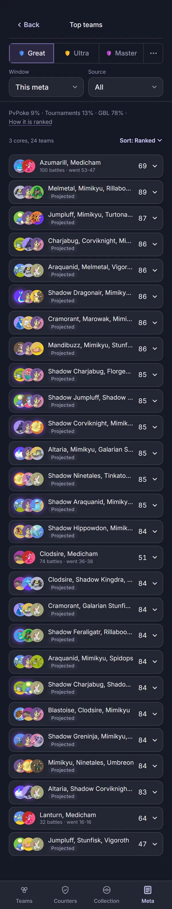
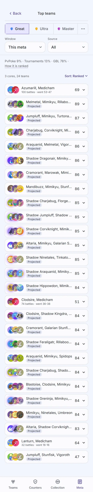
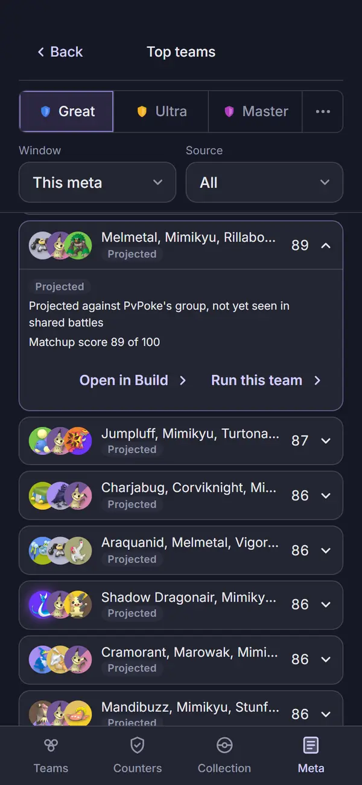
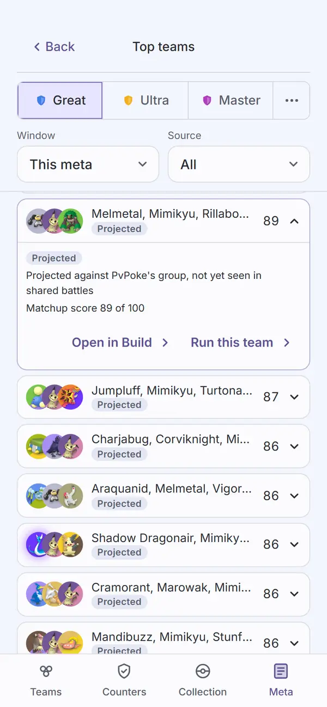

# Audit: Top teams

Piece: meta in pick3. The board is meta.pick3.gg's signed Top teams (`meta-teams.md`, signed
2026-09-28), ported into pick3 at `#/meta/teams`. Spec:
`docs/superpowers/specs/2026-09-30-meta-in-pick3-design.md`, "Top teams (`#/meta/teams`)". Plan:
`docs/superpowers/plans/2026-09-30-meta-in-pick3.md`, Task 9 (the board), Task 10 (Run this
team) and Task 15 (this audit). Branch `meta-in-pick3`.

Changes from the signed board, as the spec lists them: pick3's page head and sub header ("Back" to
Meta, the title "Top teams"), the shared league switcher, "Open in pick3" is now "Open in Build"
(in-app), and every open complete team adds "Run this team" (`#/meta/new?team=...`). Window and
Source selects, the blend line with "How it is ranked", Multi-team only and Sort are the signed
board's.

## Screenshots

Dark and light at 390px, one pair per state, from the 2026-10-01 `npm run web:audit` run on the
code committed as `eb56ca0` (with this record's `screens.mjs`), converted to WebP (600px wide,
quality 72). The board reads the synthetic `fixtures/community-teams-sample.json` (three cores,
Azumarill + Medicham, Clodsire + Medicham, Lanturn + Medicham, no complete team) and
`fixtures/community-meta-sample.json` (1,240 GBL battles, 212 tournament battles), plus the baked
generated teams from the data build, so every complete team on this board is Projected.

| State | Dark | Light |
| --- | --- | --- |
| `meta-teams`: reached from the landing's "Explore teams". Back and "Top teams" (title centred, checked by the script); Great current; Window "This meta", Source "All"; "PvPoke 9% · Tournaments 13% · GBL 78% · How it is ranked"; "3 cores, 24 teams" and "Sort: Ranked" (no Multi-team only chip: no core here was seen in two or more teams); the Azumarill + Medicham core ("100 battles · went 53-47", 69) then the Projected teams by matchup score, down to the last row clear of the tab bar; full page |  |  |
| `meta-teams-open`: the first complete team open (the script opens rows in order, shutting each core again, until a row has its actions), scrolled under the page head. Melmetal, Mimikyu, Rillaboom: the `Projected` tag, "Projected against PvPoke's group, not yet seen in shared battles", "Matchup score 89 of 100", then "Open in Build ›" and "Run this team ›" side by side |  |  |

Not captured: a core open ("Seen with", "Built as" with its own Open in Build); "How it is ranked"
open; Multi-team only on; the Window and Source pickers (native); the board's own failed state
("Could not load the team board."). The signed `meta-teams.md` captured each of these on
meta.pick3.gg, and `apps/web/test/topTeams.test.tsx` and `topTeamsBoard.test.tsx` cover them in
pick3, Run this team's prefill included.

## Automated checks

- [x] `npm run web:audit` clean for this page's screens (`meta-teams`, `meta-teams-open`, both in
      `AUDIT_ENFORCED`): the 2026-10-01 run on `eb56ca0` exited 0 with zero findings on both, in
      both themes, on the first run and after. 117 findings remain on screens not yet
      redesigned, none failing; no NEVER line.
- [x] no console errors: the run printed no "Browser errors" section.
- [x] `npm run lint`, `npm run typecheck`, `npx vitest run --project web`, `npm run check-colors`:
      lint exit 0, typecheck exit 0, web 59 files and 748 tests passed, check-colors exit 0.
- [x] the script's own checks: the header title is centred (0.0px off), and the open row offers
      "Run this team".

## Aesthetics

Awaiting Travis's review.

- [ ] colors from tokens, in their roles (violet interaction, pink measured with its mark,
      outcome colors, red only for destroying data)
- [ ] at most four text levels, one page title
- [ ] one filled primary button
- [ ] chips tapped, tags read
- [ ] the right header variant
- [ ] rows align; gutters and the 8px base hold
- [ ] sprites unchanged
- [ ] at most one line of text before the first result
- [ ] light as readable as dark

## Functionality

Awaiting Travis's review.

- [ ] every "must keep" from the signed `meta-teams.md`, and the spec's two changes (Open in
      Build, Run this team)
- [ ] every control does what its label says
- [ ] back returns to the origin with filters and scroll
- [ ] input layout rule (input screens only): not applicable, no text input
- [ ] icon buttons named; focus visible
- [ ] product rules: assumptions shown, collection stays on the device, `connect-src` unchanged,
      sharing copy accurate
- [ ] tests cover the new behavior

## Findings and fixes

| Finding | Fix | Commit |
| --- | --- | --- |
| None from the audit on this page. | | |

## Notes for the review (seen in the captures, not changed)

- **The sub header has no Settings cog**, where Your battles and the species page carry one. The
  signed board had the pick3 mark there instead; the port dropped it and added nothing.
- **A Projected row says "Projected" twice when open:** the head's row line and the kind tag in
  the body. The signed board did the same.
- **Three long names truncate in the head** ("Melmetal, Mimikyu, Rillabo..."), as on the signed
  board; the open row and the head's accessible name carry them in full.

## Sign-off

- [ ] Travis, awaiting review
