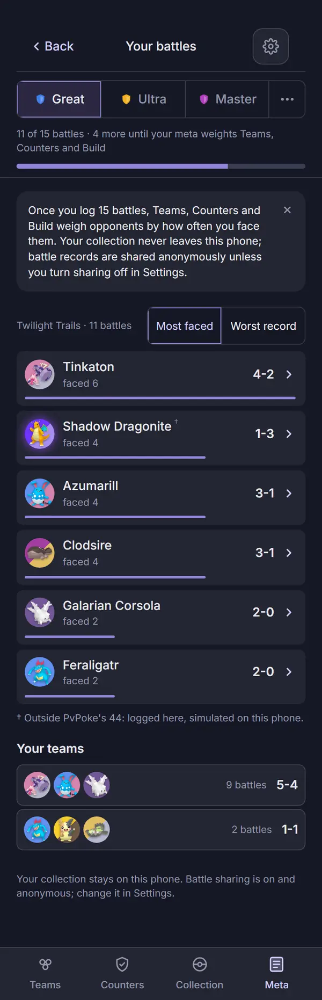
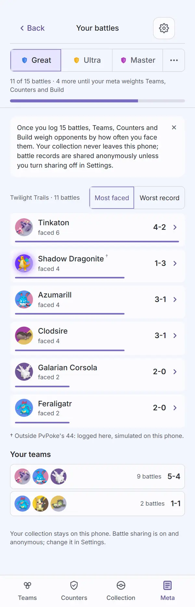
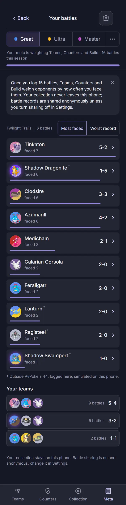
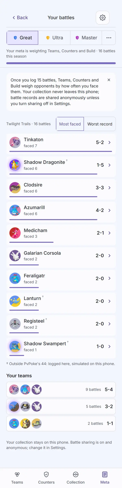

# Audit: Your battles

Piece: meta in pick3. The page is the signed Your Meta (`your-meta.md`, signed 2026-09-26) minus
what moved to the Meta landing (the current team card and the contribution line), at
`#/meta/battles`. Spec: `docs/superpowers/specs/2026-09-30-meta-in-pick3-design.md`, "Your battles
(`#/meta/battles`)". Plan: `docs/superpowers/plans/2026-09-30-meta-in-pick3.md`, Task 7 (the page)
and Task 15 (this audit). Branch `meta-in-pick3`.

What it carries: the sub header ("Back" to Meta, "Your battles", Settings), the league switcher,
the 15-battle progress line in the page head, the explainer, the full faced list (Most faced /
Worst record) with the outsider legend, Your teams, Earlier seasons or runs, the stale-season
card, and the sharing footer. A faced row now opens that species' page (`#/species/<id>`), not
Counters; the species page's "Who beats it" is the way on to Counters.

The two captures here are the signed `20-your-meta` and `your-meta-active` at the new route:
`20-your-meta` became `your-battles`, `your-meta-active` became `your-battles-active`. Both stay
enforced. The signed record's images keep their old names for that record.

## Screenshots

Dark and light at 390px, one pair per state, full page, from the 2026-10-01 `npm run web:audit`
run on the code committed as `eb56ca0` (with this record's `screens.mjs`), converted to WebP
(600px wide, quality 72). The log is the sample import's battle log
(`fixtures/battle-log-sample.json`).

| State | Dark | Light |
| --- | --- | --- |
| `your-battles`: reached from the landing's "View your battle history". Back, "Your battles" (centred), Settings; Great current; "11 of 15 battles · 4 more until your meta weights Teams, Counters and Build" with its bar; the explainer with its dismiss; "Twilight Trails · 11 battles" beside Most faced / Worst record; six faced rows (Tinkaton 4-2, Shadow Dragonite 1-3 with the dagger, Azumarill, Clodsire, Galarian Corsola, Feraligatr) each with its frequency bar; the legend "Outside PvPoke's 44: logged here, simulated on this phone."; Your teams (two rows, "9 battles 5-4", "2 battles 1-1"); the sharing-on footer |  |  |
| `your-battles-active`: six battles seeded into the running set (one tanked), 16 this season. "Your meta is weighting Teams, Counters and Build · 16 battles this season" with a full bar; "Twilight Trails · 16 battles"; the faced list grown to ten rows, four with the dagger (Shadow Dragonite, Lanturn, Registeel, Shadow Swampert) and one legend line; a third Your teams row (the running team, "5 battles 3-2") |  |  |

The script checks as it shoots: the progress bar is in the page head (and reads 100 in the active
state), the title is centred, a Your teams row is still a grid (the old Teams class collision), a
faced row links to `#/species/<id>`, and that page's Who beats it carries the Counters back mark
(`from=1`). `23-counters-vs` and `24-counters-vs-outsider` are now reached that way: faced row,
species page, Who beats it; Counters' Back returns to the species page, and its Back to Your
battles. The seeded set is written back afterward, as before.

Not captured, covered by `apps/web/test/yourMetaScreen.test.tsx`: Worst record picked, Earlier
seasons open, the stale season card and its `ConfirmSheet`, sharing off in the footer, the
explainer dismissed, the Source state line with no bar.

## Automated checks

- [x] `npm run web:audit` clean for this page's screens (`your-battles`, `your-battles-active`,
      both in `AUDIT_ENFORCED` in place of `20-your-meta` and `your-meta-active`): the 2026-10-01
      run on `eb56ca0` exited 0 with zero findings on both, in both themes, on the first run and
      after. 117 findings remain on screens not yet redesigned, none failing; no NEVER line.
- [x] no console errors: the run printed no "Browser errors" section.
- [x] `npm run lint`, `npm run typecheck`, `npx vitest run --project web`, `npm run check-colors`:
      lint exit 0, typecheck exit 0, web 59 files and 748 tests passed, check-colors exit 0.

## Aesthetics

Awaiting Travis's review.

- [ ] colors from tokens, in their roles (violet interaction, pink measured with its mark,
      outcome colors, red only for destroying data)
- [ ] at most four text levels, one page title
- [ ] one filled primary button
- [ ] chips tapped, tags read
- [ ] the right header variant
- [ ] rows align; gutters and the 8px base hold
- [ ] sprites unchanged
- [ ] at most one line of text before the first result
- [ ] light as readable as dark

## Functionality

Awaiting Travis's review.

- [ ] every "must keep" from the signed `your-meta.md` that stayed on this page, item by item
- [ ] every control does what its label says
- [ ] back returns to the origin with filters and scroll
- [ ] input layout rule (input screens only): not applicable, no text input
- [ ] icon buttons named; focus visible
- [ ] product rules: assumptions shown, collection stays on the device, `connect-src` unchanged,
      sharing copy accurate
- [ ] tests cover the new behavior

## Findings and fixes

| Finding | Fix | Commit |
| --- | --- | --- |
| None from the audit on this page. | | |

## Notes for the review (seen in the captures, not changed)

- **No page has the result strip any more.** The signed Your Meta's "Tap a result to fix it"
  chips opened a battle for editing; neither this page nor the landing renders them
  (`ResultStrip` and `CurrentTeam` in `components/meta/LogPieces.tsx` are unused). The edit view
  still works by its route, which is how `log-battle-edit` is captured now. The spec moved the
  current team card to the landing without naming the strip, so this is a call for Travis: put
  the strip back on the landing's Current team, or drop the edit path.
- **The page has no primary button.** "Log a battle" moved to the landing; that is the spec's
  split, noted because the signed record counted one primary.

## Sign-off

- [ ] Travis, awaiting review
