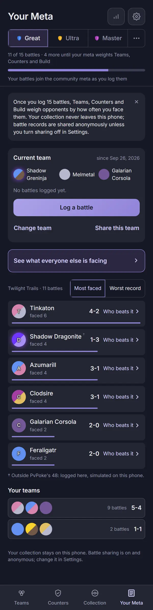
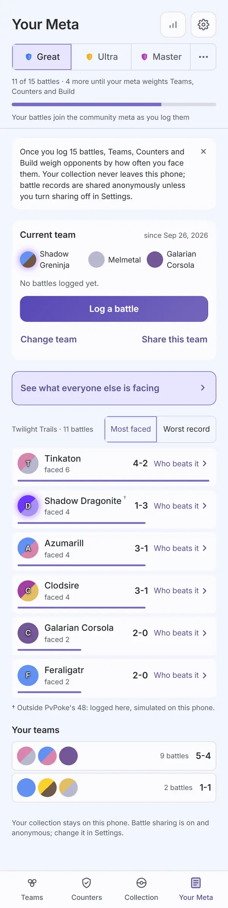
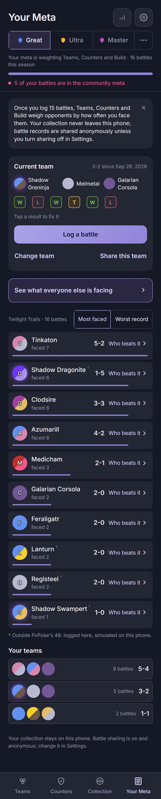
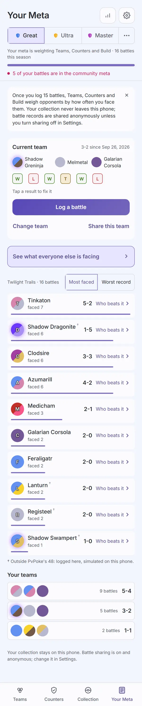

# Audit: Your Meta

Piece: 3. Inventory entry: `docs/design/inventory/2026-09-22-inventory.md`, page 4 (Your Meta).
Intake entry: `docs/design/inventory/2026-09-23-design-intake.md`, "Page 4: Your Meta, first pass"
and design 5 ("Feedback: result colors, saved feedback"). Spec:
`docs/superpowers/specs/2026-09-26-design-play-design.md`, "Your Meta" section, built against the
render Travis approved in chat 2026-09-26 (DOM surgery on the live page, `yourmeta-mock.png`).

A note on sprites: this worktree's game data was built with `PICKTHREE_SKIP_SPRITES=1` (no network
access to PokeAPI during this task), so every capture below shows the type-colored token-letter
fallback instead of a sprite, exactly as on the signed Teams, Build and Team Analysis records. That
is a real, shipped state (Settings > Pokémon pictures off, or a sprite that fails to load), and it
is the worst case for contrast. The live site at pick3.gg builds with sprites and shows those
instead; nothing on this branch touched sprite rendering itself.

## Screenshots

Dark and light at 390px, one pair per state, full-page, converted to WebP (600px wide, quality 72)
the same way the Teams, Build and Team Analysis images were, from
`apps/web/screenshots/<name>-{dark,light}.png` (`npm run web:audit` run, 2026-09-26, on
`7a40b6a`; the final fix wave's run on `e80cc9c` converted both pairs byte for byte identical;
`your-meta-active` was re-converted from the run on `c427979` for the amber T chip, and
`20-your-meta`, which shows no result strip, converted identical).

| State | Dark | Light |
| --- | --- | --- |
| `20-your-meta`: under 15 battles. "11 of 15 battles · 4 more until your meta weights Teams, Counters and Build" with the bar; "Your battles join the community meta as you log them" (zero sent, sharing on); the explainer card; Current team with "No battles logged yet." and no result strip; Log a battle, Change team, Share this team; the meta.pick3.gg link-out; the faced list (Most faced, Twilight Trails · 11 battles) with Shadow Dragonite carrying the outsider mark and its legend line; Your teams; the footer |  |  |
| `your-meta-active`: 15 or more (16 this season, six battles seeded into the running set, one tanked). "Your meta is weighting Teams, Counters and Build · 16 battles this season" with a full bar; the pink `MeasuredLine` "5 of your battles are in the community meta"; the record "3-2" (tanked left out) and a six-chip W/L/T/... result strip under the three Pokémon (T in the Tanked amber), "Tap a result to fix it"; the faced list grown to ten rows with four outsider-marked species (Shadow Dragonite, Lanturn, Registeel, Shadow Swampert) and one legend line; a third "Your teams" row |  |  |

Not captured, all string- or state-driven rather than layout differences, and covered by
`apps/web/test/yourMetaScreen.test.tsx`: sharing off (plain "Sharing is off" text with a Settings
button, no pink); a nonzero contribution count with sharing on is what's captured, zero-sent is a
plain-text variant of the same line; the Source state line with no bar (Teams source is not the
log); "Worst record" as the picked `Seg` (the heading follows the switch, tested directly); an
empty faced list; Earlier seasons expanded and the stale season card's `ConfirmSheet` ("Start
fresh?"); no team running (the "Pick your team" primary replaces "Log a battle"); the explainer
dismissed (session-sticky, as before). The result chip's own edit destination is Log a Battle's
`log-battle-edit` capture, not re-shot here.

## Automated checks

- [x] `npm run web:audit` clean for this page's screens (listed in `AUDIT_ENFORCED`), run 2026-09-26
      on `7a40b6a`, and again for the final fix wave on `e80cc9c` and `c427979`: exit 0 each time.
      Zero findings on `20-your-meta` and `your-meta-active` in both themes. 693 findings remain on
      screens not yet redesigned, none failing the run.
- [x] no console errors: the run printed no "Browser errors" section.
- [x] `npm run lint`, `npm run typecheck`, `npm test`, `npm run check-colors`, `npm run
      check-tokens`, all re-run 2026-09-26 on `7a40b6a` and again on `e80cc9c` and `c427979` for the
      final fix wave: lint exit 0; typecheck exit 0 across every workspace; `npm test` 140 files,
      1295 tests passed on `c427979` (1291 on `e80cc9c`, 1287 on `7a40b6a`); `check-colors` exit 0;
      `check-tokens`: ok. `npm run ui:audit`: "gallery audit: clean in dark and light" (the shared
      `Button` win/loss/warn variants Log a Battle added, and the `.seg` fix this page's own review
      moved to the source, both live in the gallery).
- [x] the capture script's own restore check: the running set the script seeds for
      `your-meta-active` (six battles, one tanked, `sharedAt` stamped) is written back to its
      original state afterward; the difference is visible across this record's own images and Log a
      Battle's: the current team reads "3-2" here and "0 logged with this team" once Log a Battle's
      own captures run next, confirming the seed did not leak forward.

## Aesthetics

- [x] colors from tokens, in their roles: violet marks what you tap (the primary "Log a battle" /
      "Pick your team" button, "See what everyone else is facing", the `Seg`'s pressed label, the
      league switcher); pink is the one measured line, "N of your battles are in the community
      meta", with its dot, never a pill (`your-meta-active`); the result chips use the colors of Log
      a Battle's result buttons: W and L the outcome tokens (win green, loss red-pink), T the Tanked
      button's amber (`--warn-tint` fill, `--warn` border and letter, the same tokens as
      `.ui-btn-warn`; Travis, 2026-09-26, see Decisions 6), seen in `your-meta-active`; nothing on
      the page is red (Start fresh keeps `ConfirmSheet`'s default tone, no danger button, confirmed
      by the test asserting no `.ui-btn-danger` and that `window.confirm` is never called). Backed
      by `check-colors` (clean) and zero `web:audit` contrast findings in either theme.
- [x] at most four text levels, one page title, with the same 12px `.meta` supporting-text
      deferral Build and Team Analysis carry (see Open items): "Your Meta" is the one title
      (`Header variant="top"`, matching Teams' pattern); "Current team" and "Your teams" are
      section heads; species names, the record and result-chip labels are body text; "faced N",
      timestamps, the season/count line, the footer and the outsider legend are supporting text at
      `.meta`'s 12px, the same size the signed Teams/Build/Team Analysis pages still carry; the
      outsider dagger and its aria-hidden mark are the smallest, label-level text.
- [x] one filled primary button: exactly one `.ui-btn-primary` node in both the has-a-team and
      no-team cases (`yourMetaScreen.test.tsx`, "has one primary action..."); "Log a battle" in
      both captures here, Change team / Share this team as `variant="text"`.
- [x] chips tapped, tags read: the result chips and the `Seg` are the page's only tappable,
      chip-shaped controls, both named buttons; the outsider dagger is a read-only, aria-hidden
      mark with one legend line, never a pressable filter.
- [x] the right header variant: `Header variant="top"` with the full `LeagueSwitcher` and two
      `IconButton`s (meta.pick3.gg, Settings), matching Teams' own header pattern, in both captures.
- [x] rows align; gutters and the 8px base hold: the current-team card, the faced rows and the
      "Your teams" rows share one 20px gutter and card surface; the frequency bar is its own thin
      row inside each `.faced-row`, not a background overlay, checked by eye in both states and
      both themes.
- [ ] sprites unchanged: cannot confirm from these captures, for the same reason as the signed
      Teams, Build and Team Analysis records (`PICKTHREE_SKIP_SPRITES=1`, no sprite build on this
      worktree). The token fallback renders correctly and shares the same halo/glow styling those
      pages already carry, including the still-not-fully-visible Shadow glow open item recorded
      there (unchanged by this task).
- [x] at most one line of text before the first result, read as this dashboard page's own version
      of the rule: the progress line and the contribution line are themselves the spec's first two
      pieces of content (Ruling order: progress once, then contribution, then the dismissible
      explainer, then the current-team card), not a wall of unrelated copy stacked above it; the
      explainer is one dismissible card, not repeated text.
- [x] light as readable as dark: both states are matched dark/light pairs; `web:audit`'s per-theme
      contrast pass is clean on both in both themes; `apps/web/test/contrast.test.ts` (renamed from
      `resultChips.test.ts` in the review fix round, since it now also covers the shared `Seg`)
      checks every result-chip letter and the `Seg`'s pressed label at 4.5:1 in dark, light
      (system) and light (picked).

## Functionality

- [x] every "must keep" from the inventory/spec entry, item by item: the progress line said once
      (`ProgressLine`, tested for both the under-15 and 15-or-more cases, each asserted to appear
      exactly once on the page); the contribution line's three variants (measured count, zero-sent
      plain text, sharing-off plain text with a Settings button); the record in wins-losses only,
      tanked excluded from the record but still shown as its own chip in the strip (a set with a
      tanked battle reads "2-1", not "2-1-1", tested directly); a result chip opens that battle for
      editing; "Log a battle" as the one primary, Change team / Share this team as text buttons;
      the link out to meta.pick3.gg; the faced list's `Seg` naming the list with no duplicate
      heading, the season/count line beside it, the thin in-row frequency bar, "Who beats it ›" to
      Counters, the outsider mark and its single legend line; Your teams and Earlier seasons; the
      stale season card's Start fresh through `ConfirmSheet`; the footer's sharing copy in both
      states.
- [x] every control does what its label says: a result chip's `aria-label` ("Win against Azumarill,
      Medicham", or "Tanked, <time>" with no opponents) and its navigation to
      `{ screen: 'meta-log', edit: { set, battle } }` (`#/meta/log/<set>/<battle>`) is asserted
      directly; the `Seg` switches the sort and its own heading follows it (a regression test for
      the pre-existing "Most faced" bug, which no longer sticks when Worst record is picked); "Who
      beats it" carries the real Counters `href`; Start fresh opens the `alertdialog`, never calls
      `window.confirm`, and moves battles to Earlier seasons without deleting anything.
- [x] back returns to the origin: Your Meta is a tab-bar destination rather than a page reached by
      "Back", so this bullet applies to the one route it opens: a result chip's edit route lands
      back on `#/meta` after Save changes or Back (edit mode has Back, not Cancel), per Log a
      Battle's own back rule (its record covers the test for that return).
- [ ] input layout rule: not applicable. Your Meta has no text input.
- [x] icon buttons named; focus visible: the meta.pick3.gg and Settings `IconButton`s carry their
      labels (matching Teams); the explainer's dismiss is 44×44; each result chip and the `Seg`'s
      options are named buttons, not bare icons; the shared `Button`/`IconButton` focus-visible
      outline is the one already audited elsewhere, unchanged here.
- [x] product rules: assumptions are not applicable in the Team-Analysis sense (this page shows
      logged fact, not a simulated result) but every number on it (the count, the record, faced
      counts) is a plain count over the stored log, nothing invented; collection stays on the
      device (no new outbound call: the contribution and progress lines read the local log only,
      and the page makes no request of its own); the footer's sharing copy matches the spec's
      sharing-on and sharing-off text exactly, checked byte for byte in the review.
- [x] tests cover the new behavior: `apps/web/test/yourMetaScreen.test.tsx` (18 tests: the progress
      line said once in both states with `role="progressbar"` values, the Source state line with no
      bar, the pink count with its tanked/unsent/other-league exclusions, the zero-sent and
      sharing-off plain-text variants, the tanked-excluded record, result-chip names and their
      navigation, the one primary with the two text buttons, "Pick your team" as the primary with no
      team, the list heading following the `Seg` with the season/count line, the thin frequency bar,
      "Who beats it" and its `href`, the outsider mark and legend (mutually exclusive between the
      current list and Earlier seasons, and never marked before the meta group loads), the explainer
      copy and its dismissal, both footer variants, Start fresh through the `alertdialog`, the
      one-line link out, and the header `IconButton`s), plus `apps/web/test/contrast.test.ts` (31
      cases in all: this page's 12 are each result-chip letter, W, L and T, at 4.5:1 in all three
      theme blocks, plus the T chip painting exactly `.ui-btn-warn`'s fill and ink in the same three
      blocks (7.75:1 dark, 4.57:1 light); 6 are the shared `Seg`'s pressed label on `--bg` and
      `--surface`; the other 13 are Log a Battle's shield grid, its twelve cell cases and the axis
      numbers) and `apps/web/src/state/contribution.ts`'s own `apps/web/test/contribution.test.ts`
      (`contributedCount`: stamped and not tanked, across every league, zero for nothing sent).

## Findings and fixes

| Finding | Fix | Commit |
| --- | --- | --- |
| Task 5 review, Important (controller-mandated): the shared `.seg > .on` pressed-state contrast fix landed as a page-scoped override (`.ym-list-head .seg > .on`) instead of a fix to the one shared rule every `Seg` in the app inherits, so the Settings sheet's rank-band and Appearance switches kept the same 4.10:1 light-theme failure this task was told to close everywhere. | The shared rule at `apps/web/src/app.css:366` now reads `color: var(--accent-text)`; the page-scoped override is gone (the page-scoped 44px/10px-padding sizing rule stays, since that part is layout, not color). `apps/web/test/contrast.test.ts` gained a "Seg pressed label contrast" case covering both the Your Meta sort and the Settings sheet's own Segs in all three theme blocks; the Settings sheet was also checked by eye in a scratch build. | `a5f99e3` |
| Task 5 review, Minor: two unrelated `linear-gradient` blocks (`.landing-you`, `.mp-card`) were reformatted by a Prettier pass with no value change, and the report's file-level summary overstated that `.action-row` also got a page-scoped rule. | The two gradient blocks are back on one line each (`git diff` confirms neither rule's value moved); the report line is corrected. | `a5f99e3` |
| Task 7, seen in the captures (not caught by axe): "Shadow Dragonite" and "Shadow Swampert" wrapped to two lines where the approved render keeps them on one line, and `tabular-nums` on the record spaced "1 - 5" wide without aligning anything, since each row is its own grid. | Dropped `tabular-nums` and added `nowrap` on the name, so both names fit on one line, matching the render; visible in `your-meta-active`, both themes. | `307f405` |
| Task 7, round 2: the app's confirmation toasts (including this page's own "Link copied" from Share this team) sat at the top with an OK button and read as a warning. | Moved to the shared `NoticeToast` fix (see Log a Battle's record for the full change): info notices now render at the page's foot, one tap to dismiss, no OK, 3 seconds; warnings are unchanged. Not re-captured on this page (no Share tap in the capture flow) but exercised by `apps/web/test/noticeToast.test.tsx` and the app-wide caller check in the Task 7 review. | `7a40b6a` |
| Final review M6: the result chips were said to use the outcome tokens "exactly as Log a Battle's result buttons do", but the T chip is gray where Tanked is amber; "Save changes or Cancel" (edit mode has Back); `contrast.test.ts` called "9 tests" when it has 28 cases. | The Aesthetics line says W and L match and T is gray, with the gray-versus-amber choice added to Open items for Travis; "Save changes or Back"; the tests line counts the 28 cases (this page's 9 chip cases, 6 `Seg` cases, 13 for Log a Battle's grid). | this record's commit |
| Final review I2: this record said the signed Team Analysis record "still describes" the old top toast; it never described that notice. | Reworded: that record does not record the change; it now has an "After sign-off" row (and Teams one for the update toast's button). | this record's commit |
| Travis, 2026-09-26, on this record's open item (the T chip gray, the Tanked button amber): "Let's make the two changes. The two you called are ok." | `.result-chip.tanked > span` uses `--warn-tint`, `--warn` and `--warn` (the `.ui-btn-warn` tokens) in place of `--surface2`, `--divider` and `--muted`. `contrast.test.ts` checks that the chip paints the button's fill and ink, at 4.5:1 or better, in dark and both light blocks (RED before). `web:audit` on `c427979`: exit 0, zero findings; `your-meta-active` re-converted, the T chip amber in both themes (looked at both). | `e17886a` |

## Decisions and rulings (plan `2026-09-26-play.md`, `global-constraints.md`)

1. **Contribution count (Ruling 4):** battles across all sets with `sharedAt` and not tanked, every
   league. `contribution.ts`'s `contributedCount(storage.loadAllSets())`. [Cost if wrong: one
   count.]
2. **Your Meta's explainer copy (Ruling 5):** the exact sentence in `global-constraints.md`, checked
   byte for byte in the Task 5 review. [Cost if wrong: copy.]
3. **Saved toast copy (Ruling 6):** "Win logged · N with this team" (Loss, Tanked likewise) is Log a
   Battle's own toast; this page's part of the loop is the result chip that opens the edit that
   produces it. [Cost if wrong: copy, owned by Log a Battle's record.]
4. **Review focus 3 (sharing off):** no board read is a Log a Battle concern, but this page's own
   contribution line correctly reads "Sharing is off" with a Settings control, never pink, when
   sharing is off. Tested directly.
5. **Review focus 4 (a result chip in a closed set or an earlier season):** the edit route it opens
   searches every set by id (Log a Battle's own `editBattle` lookup), so a chip for a battle in a
   closed set or an earlier season still finds and saves it and returns here. Covered by
   `apps/web/test/store.test.tsx`'s closed-set `editBattle` case.
6. **The T chip is Log a Battle's Tanked amber.** Travis, 2026-09-26, on the open item that the T
   chip was gray while the Tanked button is amber: "Let's make the two changes. The two you called
   are ok." The chip paints with `.ui-btn-warn`'s tokens, a `--warn-tint` fill with a `--warn`
   border and letter, so a tanked battle reads in the color of the button it was logged with. Tokens
   only. `e17886a`.

## Visible changes outside Your Meta

- **The counter worker's `ingest` now upserts a resent battle** by its `device:id` key
  (`workers/counter/src/index.ts:171`, `ON CONFLICT(key) DO UPDATE SET opponents = ..., result =
  ..., tanked = ..., received = ...`) instead of silently dropping it. Every fixed result this
  page's chips produce depends on that change, even though it lives outside this page's own files.
- **`notify`'s two tones:** info renders at the page's foot, one `.notice-tap` to dismiss, no OK,
  3 seconds; warning is unchanged (top, OK, `role="alert"`, 8 seconds). This page's own "Link
  copied" (Share this team) is one of the app's info callers.
- **The shared `.seg > .on` pressed color** moved from `--accent` to `--accent-text` at its one
  shared rule (`app.css:366`), fixed here first and reaching every `Seg` in the app, including the
  Settings sheet's rank-band and Appearance switches.
- **`packages/ui`'s `Button` gained `'win' | 'loss' | 'warn'` variants and a `pressed` prop**
  (`packages/ui/base.css:454-479`). This page does not use them directly; the "Tap a result to fix
  it" edit path lands on Log a Battle, whose result buttons are built from them.
- **The win/loss tint step moved from 8% to 5%** for light-theme contrast; the same tint colors
  this page's own W/L/T result chips.
- **`boardWindow`** (`store.tsx:614`), the season/window helper Build already used, is now shared
  with Log a Battle's likely-teammates read. This page's progress and contribution lines use their
  own, separate season logic and are unaffected.
- **Log a Battle's own no-open-set redirect now replaces its history entry**
  (`navigate({ screen: 'meta-new' }, { replace: true })`) instead of pushing one. Every path from
  this page's own "Log a battle" button opens Log a Battle with a set already running, so this
  fixes only a defensive path (a stale `#/meta/log` reached by browser back/forward), not the
  normal click-through from here.

## Open items for Travis (not fixed on this branch)

- **The Shadow glow (`.token-shadow-wrap::before`) is still not visible.** Pre-existing, unchanged
  by this branch, the same open item recorded on Team Analysis and Build.
- **Your Meta's supporting text stays at 12px** (the `.meta` class: faced counts, timestamps, the
  season/count line, the footer, the outsider legend), the same deferred app-wide 13px pass Build
  and Team Analysis carry. It moves in one pass later, not page by page.
- **Four species carry the outsider mark in the seeded state** (Shadow Dragonite, Lanturn,
  Registeel, Shadow Swampert), not just the two Log a Battle's own fixture names; this is real,
  data-driven output from the synthetic battle-log fixture against this league's pinned meta group,
  not a bug, but worth a look at sign-off since it may surprise.
- **The shared confirmation-toast change (info at the foot, no OK, 3 seconds) is a behavior change
  on a page other than this one's own capture set can show:** this page's "Link copied" notice now
  behaves the same way Log a Battle's saved notice does, but no capture here shows it landing. The
  signed Team Analysis record never described its own "Link copied" notice, so it does not record
  the change; see its "After sign-off" row (and Teams' for the update toast's button).

## Sign-off

- [ ] Travis, <date>
