# pick3 design inventory, 2026-09-22

Inventory pass over 10 pages of pick3 (apps/web), one page at a time, before any redesign.
Each entry is grounded in the screen code, not only the screenshot. Redesign comes later.

---

## Page 1 of 10: Your Teams

### 1. Page name

Your Teams (`apps/web/src/screens/Teams.tsx`, route `#/teams`).

### 2. Screenshots

- 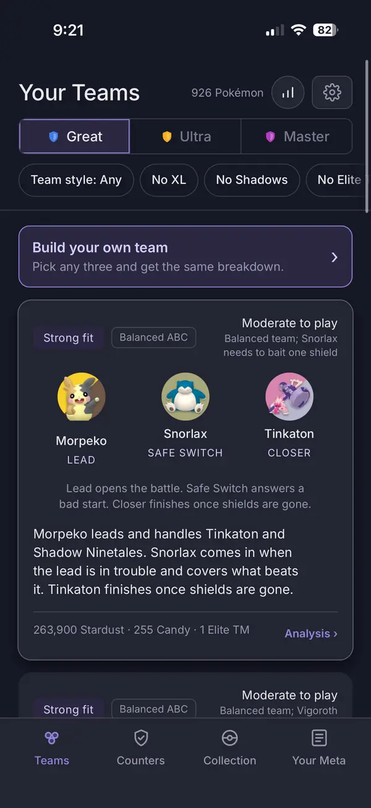
- 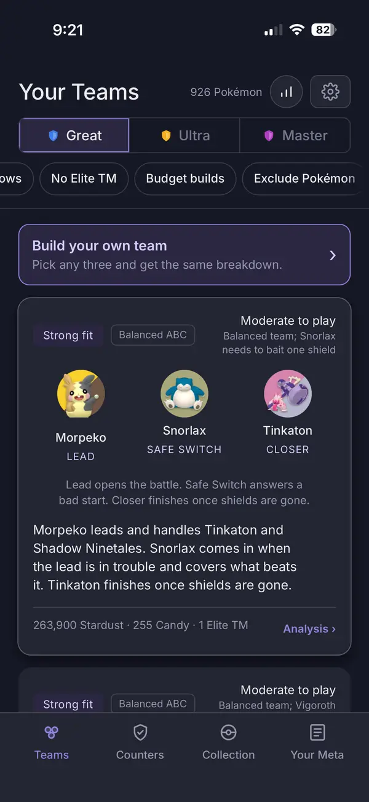
- Reference, not a pick3 screen: 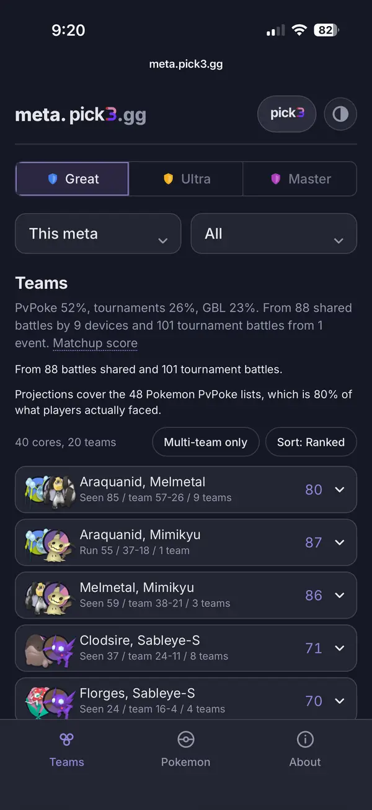.
  Included because the Window select ("This meta") and Source select ("All") on the meta site
  are coming to this screen. This is what started the cohesion work.

### 3. Purpose

Show the best three-Pokemon teams the player can build from their own collection for the
league in play, ranked, with what each Pokemon does and what it costs to build.

### 4. How users arrive

- On boot, when a collection is saved and the URL has no screen, the app goes here
  (`store.tsx`, the welcome to teams redirect). For returning players this is the home screen.
- The Teams tab (bottom bar). The tab also stays lit on Build, Team Detail and custom teams.
- Report's "See teams" button after an import, and Import's finish button.
- Back from Build, and back from Team Detail for a recommended team.
- The `back()` fallback when there is no history.

### 5. Available actions

- **League switcher** (shared `@pickthree/ui` LeagueSwitcher): sets `settings.league`,
  reloads the league bundle and re-runs recommendations. It lists every league except
  `special` ones, so the Tournament cup should appear alongside Great, Ultra and Master
  (it did not on Travis's phone; see findings below).
- **Header count** "926 Pokemon": static, the number of recognized Pokemon in the import.
- **Meta button** (bar-chart glyph): a plain link out to meta.pick3.gg.
- **Cog**: opens the Settings sheet.
- **Chip row**, which scrolls sideways, 7 chips:
  - Team style: tapping cycles Any > Balanced > ABB line > Any. The current value is only
    shown in the label.
  - No XL, No Shadows, No Elite TM, Budget builds: toggle filters.
  - Exclude Pokemon (plus a count): opens the Settings sheet, not a picker.
  - Your log: "N of 15" or "N battles": goes to Your Meta. It shows as on at 15 or more
    battles, the point where the log starts weighting recommendations. It is off-screen to
    the right by default.
  - Any filter change changes `filterKey`, and the screen re-runs the recommendation.
- **Build your own team** row: goes to Build with empty slots.
- **Team card, tapping the body**: loads the three specimens into the Build slots and goes to
  Build (for editing).
- **Team card, "Analysis >"**: goes to Team Detail (`#/team/<id>`, a deep-linkable hash).
- Bottom tab bar: Teams, Counters, Collection, Your Meta.

### 6. What must remain

- Recommendations run on device, re-run automatically whenever the filter key changes, and
  show staged progress (eligibility, candidates, trios, simulate, score).
- Each card shows: fit (Strong, Solid, Situational, Weak), structure (ABB line or Balanced
  ABC), difficulty and why, three Pokemon with roles (Lead, Safe Switch, Closer), a
  one-paragraph explanation, and cost (Stardust, Candy, XL, Elite TM).
- The two actions on each card go to different places: editing (Build) and analysis (Team
  Detail). Team Detail's hash URL is linkable.
- The footer line "N combinations scored, M simulated with your exact Pokemon" is part of
  the "results carry their assumptions" rule.
- Sprites are the only artwork, and there is a type-colored fallback when sprites are off.
- Coming soon (a separate session): the chip row slims to **Source, Window, Team style**.
  No XL, No Shadows, No Elite TM, Budget and Exclude move to the Settings sheet behind a
  "Filters: N" chip. Source and Window mirror the meta site's two selects. Do not polish the
  current seven chips.
- Travis's direction (2026-09-22): **remove the sideways-scrolling pill row altogether**,
  and give the filters a better home. The design pass should decide where that is (a
  Settings sheet section is the current plan, not a settled answer).

### 7. What you like

- The card has a clear top-down structure: verdict tags, then three sprites with names and
  roles, then plain-English sentences, then cost, then Analysis.
- The role labels plus the one-time role legend on the first card teach PvP terms on first
  use, which the product rules require.
- The explanation is plain, specific prose ("Snorlax comes in when the lead is in trouble").
- The league segmented control and the tab bar already match the meta site. The shared UI
  package is working here.
- "Build your own team" is visible without scrolling but kept apart from the recommendations.

### 8. What you dislike

- **Tapping a card opens Build, not Analysis.** Most people will tap the card expecting
  details. The small "Analysis >" is the real detail link and is easy to miss.
- **Header buttons don't match:** the meta button is a circle and the cog is a rounded
  square, side by side.
- **Sprite rows are uneven:** in the first card, Morpeko's name and role sit lower than
  Snorlax's and Tinkaton's.
- **The difficulty block is cramped:** a right-aligned title plus two lines of reason text
  sit next to the tags and compete with them. The two tag styles also differ (a filled "Strong
  fit" next to an outlined "Balanced ABC").
- **The chip row hides things:** 7 chips, and only about 4 fit on screen. There is no hint
  that the row scrolls. The Your log chip, which matters, is last and off-screen. Team style
  is a cycle chip with no preview of the next value.
- **"Exclude Pokemon" looks like a filter but opens Settings.**
- **Words that aren't explained:** ABC and ABB aren't explained here, "Strong fit" isn't
  explained either, and the "926 Pokemon" count doesn't do much.
- **Card spacing:** the first card has a highlighted border. Otherwise every card is
  identical and dense, so a long list reads as a wall.
- **The two sites spell Pokemon differently:** web says "Pokémon", meta says "Pokemon".
  Decided: "Pokémon" on both (see decisions below).
- **Meta reference:** the two selects have no visible labels ("This meta" and "All" don't say
  they are Window and Source), and the source copy says the battle counts twice.

### 9. Important states

- **No collection:** `NoCollection` shows three choice cards (add by hand, build from any
  Pokemon, import).
- **Boot loading:** a progress bar labeled "boot".
- **Recommending:** a staged progress bar with a label per stage.
- **Error:** an `.error` block with the message.
- **Empty after filtering:** "No team fits these filters. Loosen one to see recommendations
  again."
- **Populated:** cards, with the first one highlighted and carrying the role legend.
- **Stale:** a filter or log change triggers a silent re-run. Old cards stay up until the new
  result arrives.
- **Chip states:** off or on. The Your log chip is on only at 15 or more battles.
- **Sheet open:** the tab bar highlight clears.

### 10. Usage frequency

Core daily screen. It is the home screen for anyone with a collection, and the main thing
the product delivers.

### Decisions and findings (page 1)

- **Spelling: "Pokémon"** everywhere, both the web app and the meta site (Travis,
  2026-09-22). The meta site's plain "Pokemon" is what needs to change. This overrides the
  strict-ASCII line in the brief for this one word.
- **League switcher has to scale.** The live `leagues.json` already ships four leagues
  (great, ultra, master, championshipseries), but the phone showed three. It may be a stale
  PWA bundle or clipping; not investigated. Either way, a full-width three-part segmented
  control will not hold Tournament plus future cups. The design pass needs a switcher that
  handles more leagues cleanly, shared by web and meta through `@pickthree/ui`.
- **Idea (Travis): show only the leagues live in the game right now**, which is usually three
  at a time. That keeps the switcher at three slots. The cost is preparation: a player can't
  build for next week's cup or for a league that isn't running. Notes for the design pass:
  - The live set isn't always Great, Ultra, Master. Go Battle League often runs a cup or two
    alongside Great, so the three labels would change week to week.
  - The app has no rotation schedule today. `seasons.json` holds season starts only, so this
    needs a hand-kept (or fetched) weekly league schedule, like `epochs.json` on meta.
  - One way to keep preparation: live leagues in the switcher, with a "More leagues" way into
    the rest. The option is recorded here, not decided.

---

## Page 2 of 10: Build Your Team

### 1. Page name

Build Your Team (`apps/web/src/screens/Build.tsx`, route `#/build`). Move picker sheet:
`components/MovePicker.tsx`. Suggestions: `components/TeammateSuggestions.tsx`.

### 2. Screenshots

- 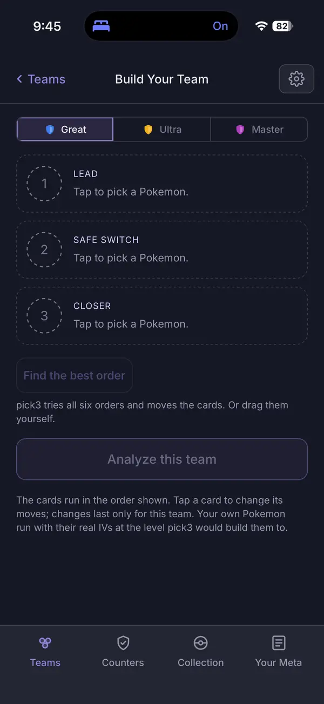
- 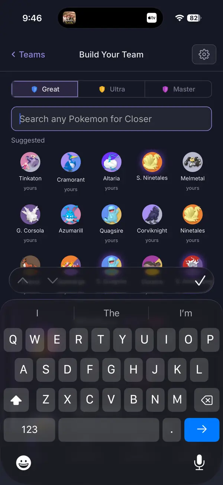
- 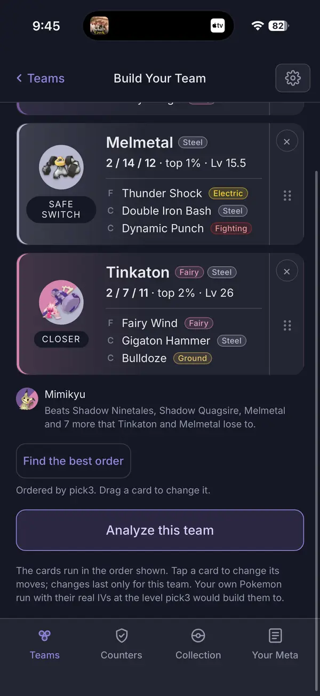

### 3. Purpose

Put together any three Pokemon (your own or any species), set their order and moves, then
analyze the team. It is also where a recommended team goes to be edited.

### 4. How users arrive

- Teams: tapping a team card (loads it) or "Build your own team" (empty slots).
- Team Detail: its edit action (loads that team); back from a custom team's analysis.
- Counters: tapping a counter puts it in the Lead slot ("Build a team around it").
- Your Meta: loads a team from the log into the slots.
- Shared team links: the buttons on SharedTeam.
- No collection: the "Build a team" choice card.
- Deep link `#/build`. The Teams tab stays lit here.

### 5. Available actions

- **Back "< Teams"**: always goes to Teams, not browser back.
- **Cog**: Settings sheet.
- **League switcher** (compact): changes league for the analysis and move pools.
- **Empty slot** (Lead, Safe Switch, Closer): opens the search at the top of the screen for
  that slot and focuses it.
- **Search**: typed text matches your collection first ("yours" tag, best specimen per
  species), then every species. Uses the in-game search grammar (`parseQuery`). Empty search
  shows Suggested: recent opponents from your battle log, filled out with the league's top
  meta picks, your own specimen where you have one. Tapping a result fills the slot and closes
  the search. Tapping away (blur) or Escape closes it.
- **Filled card, tap**: opens the move sheet (fast and charged move picker). Changes apply to
  this team only; a "moves changed" tag shows on the card.
- **X**: empties the slot.
- **Grip** (six dots): drag to reorder. Order is the battle order.
- **Suggest teammates** (only with 1 or 2 slots filled): fills the empty slots from the
  matchup matrix; alternate cores show as chips; each fill has a one-line reason.
- **Find the best order** (needs all 3): simulates all six orders and moves the cards.
- **Analyze this team** (needs all 3): runs the analysis, then goes to the custom team
  analysis (`#/custom`).

### 6. What must remain

- Three ordered slots with fixed roles: Lead, Safe Switch, Closer.
- Mix of your specimens (real IVs, built to pick3's recommended level) and any species
  (top-10% IVs assumed, stated on the card).
- Card content: sprite, role, name, types, IVs, IV rank percent, level, "from your X" when
  it evolves, the three moves with F or C and type chips.
- Per-team move overrides that do not touch the collection.
- Search input at the top, results under it, slots under that (the mobile input rule).
- Suggested picks when the search is empty: recent opponents plus top meta.
- Suggest teammates is reason-only, no score; the verdict belongs to Analyze.

### 7. What you like

- **The filled cards** (Travis): a lot of information that reads well, and the type-colored
  fade down the left edge looks good. Keep this card; it is a candidate component for the
  design system (a "Pokemon card" with role, stats, moves).
- **Suggested picks in the search** (Travis): recent opponents and top meta picks before you
  type anything.
- The empty slots are clear: dashed outline, number, role, "Tap to pick a Pokemon."
- Remove and drag sit in their own column, apart from the tap-to-edit body.

### 8. What you dislike

- **"Find the best order" is out of place** (Travis). It is a half-width ghost button with
  its own help line, sitting between the cards and the main button, disabled until the team
  is full.
- **You lose track while picking** (Travis). The search opens above the cards, the keyboard
  covers the lower half, and the slots are pushed out of view. The only hint of which slot
  you are filling is the placeholder text, which disappears as you type.
- The suggestion grid rows do not line up: names sit at different heights depending on the
  sprite (same issue as Morpeko on page 1), and "yours" makes some cells taller.
- Tapping a card opens moves, which is only explained in the long footer paragraph.
- The footer paragraph is dense and repeats what the controls should say themselves.
- The teammate reason row (Mimikyu) stays after the team is full, with nothing tying it to
  its slot.
- A different header style from Teams: back link plus centered title here, big left title
  there. Both carry the same cog in a rounded square.
- Spelling: this screen writes "Pokemon" in the placeholder, empty slot text and footer.
  Per the page 1 decision it becomes "Pokémon".

### 9. Important states

- **Empty**: three dashed slots; Find the best order and Analyze disabled.
- **Picking**: search open with Suggested grid; "Matches" once typing; "Nothing matches."
- **Picking, no collection**: note that only species are offered.
- **Verdicts loading**: progress bar under the search (it needs verdicts to rank your own).
- **Partly filled**: Suggest teammates appears; "Looking..." while it runs; suggestion
  chips and reasons after; suggestion error.
- **Full**: Find the best order and Analyze enabled.
- **Finding order**: "Finding the best order..."; then "Ordered by pick3. Drag a card to
  change it."
- **Dragging**: lifted card, drop target highlight.
- **Move sheet open**: overlay; loading the move pool shows a progress bar.
- **Analyzing**: progress bar and "Analyzing..."; analyze error block.
- **Species pick**: "Not yours; top-10% IVs assumed" in place of IVs.

### 10. Usage frequency

Frequent workflow. The second most used screen: every edit of a recommended team and every
custom team passes through it.

### Decisions and findings (page 2)

- The filled Pokemon card and the suggested-picks grid are keepers; redesign around them.
- Find the best order needs a better home, and slot context must survive the search and
  keyboard. Both are for the design pass.

---

## Page 3 of 10: Team Analysis

### 1. Page name

Team Analysis (`apps/web/src/screens/TeamDetail.tsx`). Routes: `#/team/<id>` for a
recommended team, `#/custom` for a hand-built or shared one.

### 2. Screenshots

A custom team (the "< Build" back link and the rating card only show for custom teams). The
screenshots skip some of the page; the gaps are filled from the code below.

- 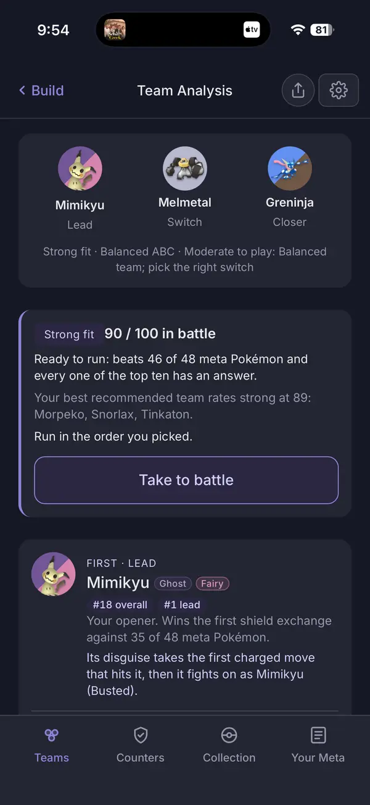
- 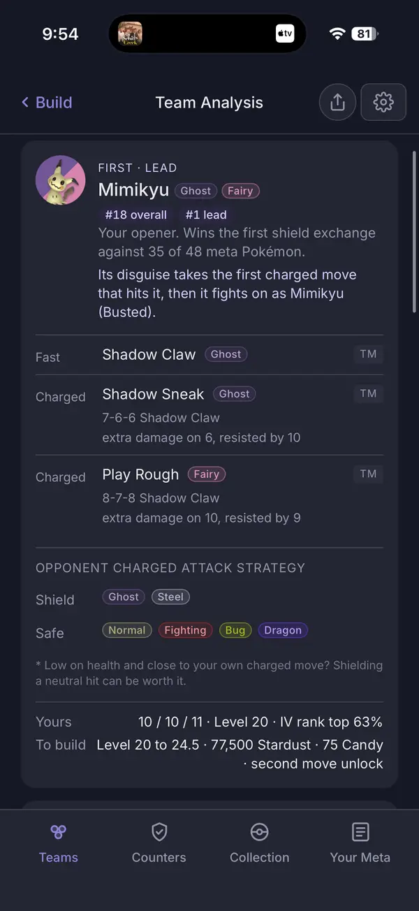
- 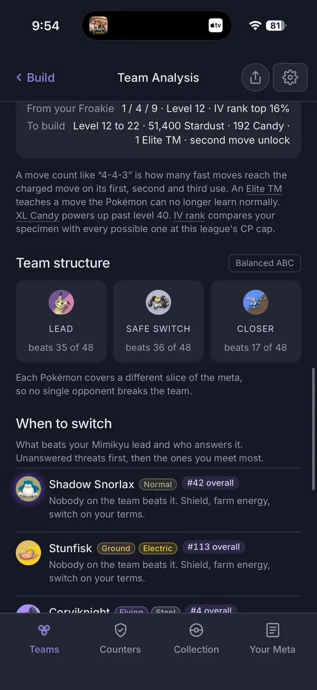
- 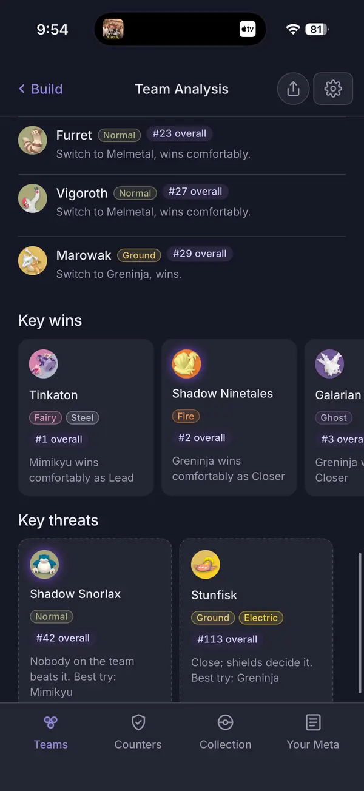
- 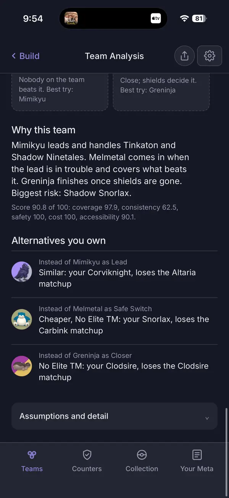

### 3. Purpose

Explain one team in full: how good it is, how each Pokemon plays, when to switch, what it
beats and loses to, what it costs to build, and what you could use instead. Then start
playing it (Take to battle).

### 4. How users arrive

- Teams: "Analysis >" on a team card (`#/team/<id>`).
- Build: "Analyze this team" (`#/custom`).
- A shared team link, through SharedTeam (analyzed as custom).
- A deep link to either route.

### 5. Available actions

- **Back "< Build"**: always loads this team into Build and goes there, even when you came
  from Teams. It is the edit path, not a real back. (Only the "team not found" state goes
  back to Teams.)
- **Share** (circle icon): makes a link with species and moves only (no IVs, no collection)
  and opens the share sheet or copies it, with a toast.
- **Cog**: Settings.
- **Take to battle**: makes this the team Your Meta logs against and opens Log a Battle. If
  a different team is running, a native `confirm()` asks to switch. If it's the same team,
  it just opens the log. On recommended teams it sits in the top strip; on custom teams it
  sits in the rating card.
- **"+N more"** on the Safe type chips: shows all resistances.
- **Glossary terms** (dotted underline: Elite TM, XL Candy, IV rank, back line, shield):
  tap for the definition.
- **Key wins, Key threats**: cards that scroll sideways.
- **Assumptions and detail**: expands shields per role, the opponent meta and date,
  opponent weights (Your Meta), IVs, level cap, the full matchup grid (W, L, ~ against the
  top 12; "Show all N meta Pokemon") and the total build cost.

### 6. What must remain

- All of the content. Travis: this is the best page, and players say so. The information
  stays.
- Per-Pokemon detail: role and order, types, meta rank tags, what the role does, form notes
  (Mimikyu Busted), moves with move counts ("7-6-6") and extra damage or resisted counts,
  TM or Elite TM badges, what to shield and what's safe, keep-shield advice, your IVs, level,
  IV rank, and the cost to build.
- Custom team rating card: fit and battle score, why, how it compares with your best
  recommended team, the order result, moves you chose, assumed IVs for species you don't
  own, and the PvPoke-unranked note.
- Two team shapes: Balanced ABC (three "beats N of 48" tiles) and ABB line (the lead's
  counters plus a back-line panel). The ABB layout is not in these screenshots.
- When to switch, Key wins, Key threats, Why this team plus the score breakdown,
  Alternatives you own.
- The Assumptions block (product rule: every result carries its assumptions).
- Share sends species and moves only.

### 7. What you like

- The depth and plain language: "Switch to Melmetal, wins comfortably," "Nobody on the team
  beats it. Shield, farm energy, switch on your terms."
- The Pokemon card: moves with counts and extra damage, shield and safe types, build cost.
- Glossary terms inline, with tap-to-define.
- Team structure tiles give a quick read of how the team splits the meta.
- Alternatives you own, as "instead of X as Role," is very actionable.
- Advanced detail (the matchup grid) is tucked away under Assumptions.

### 8. What you dislike

- **It's a lot** (Travis). About a dozen sections in one long scroll, with no summary or
  jump-to, and no sense of what matters most. The page needs layering, not cutting.
- **Things repeat:** fit shows in the strip summary and again in the rating card; the
  structure shows in the strip and again as the Team structure tag; Shadow Snorlax and
  Stunfisk appear under both When to switch and Key threats.
- **Two scores:** "90 / 100 in battle" at the top and "Score 90.8 of 100" under Why this
  team are different measures, and "your best recommended team rates strong at 89" sits
  next to them.
- **Role names vary:** "Switch" in the strip, "Safe Switch" in tiles and cards, and the
  cards add "First · Lead".
- **The back link says Build** even when you came from Teams, and it loads the team into
  Build. Good as an edit path, but surprising as back.
- **Share and cog don't match** (circle vs rounded square), same as page 1.
- **The rating card header crowds:** the "Strong fit" tag sits flush against "90 / 100 in
  battle."
- **Sideways scroll** on Key wins and Key threats (the third card is cut off). This is the
  same pattern Travis wants gone from the Teams chips.
- **The move-count explanation comes after all three cards.** You read "7-6-6" three times
  before it's explained.
- **This Pokemon card is a different component from Build's card,** which holds the same
  data (IVs, rank, level, moves). It's a candidate for one shared card with levels of detail.
- **Take to battle moves:** it sits in the strip on recommended teams and in the rating card
  on custom teams.
- The Assumptions chevron is a text character and renders small.
- The shadow sprite's purple glow (Shadow Snorlax, Shadow Ninetales) isn't explained
  anywhere.

### 9. Important states

- **Recommended team:** strip with Take to battle, no rating card.
- **Custom team:** rating card; variations for shared link, species you don't own
  ("assumed IVs"), chosen moves, PvPoke-unranked picks, and six orders tried vs "Run in the
  order you picked."
- **Team not found:** "This team is not in the current results. Filters may have changed."
  or "No hand-built team yet," each with a button back.
- **ABB line vs Balanced ABC** structure blocks.
- **Empty sections:** no lead threats, no key threats (with the caveat line), no
  alternatives.
- **Safe chips** collapsed or expanded; **Assumptions** closed or open; **matchup grid** at
  12 or all.
- **Take to battle:** confirm dialog when switching a running team.
- **Share:** copied toast, or a failure toast with the URL.

### 10. Usage frequency

Frequent and central. Players come here for every team they consider, and it is the page
people praise.

### Decisions and findings (page 3)

- Keep all of the information; the design job is hierarchy and layering (summary first,
  detail on demand), not cutting.
- Candidate shared component: one Pokemon card used by Build and Analysis, with a compact
  and a full level.
- Back to Build is intentional (Travis): read a suggested team's analysis, then tweak it in
  Build. The flow stays; the design pass should make the control read as "edit this team"
  rather than a back link, so it isn't surprising when you came from Teams.
- ABB line vs Balanced ABC: Travis sees little difference on the page beyond the Pokemon.
  The code swaps only the Team structure block (lead counters plus back line vs three
  tiles). Treat it as a minor variant of one section, not a separate layout.

---

## Page 4 of 10: Your Meta

### 1. Page name

Your Meta (`apps/web/src/screens/YourMeta.tsx`, route `#/meta`).

### 2. Screenshots

- 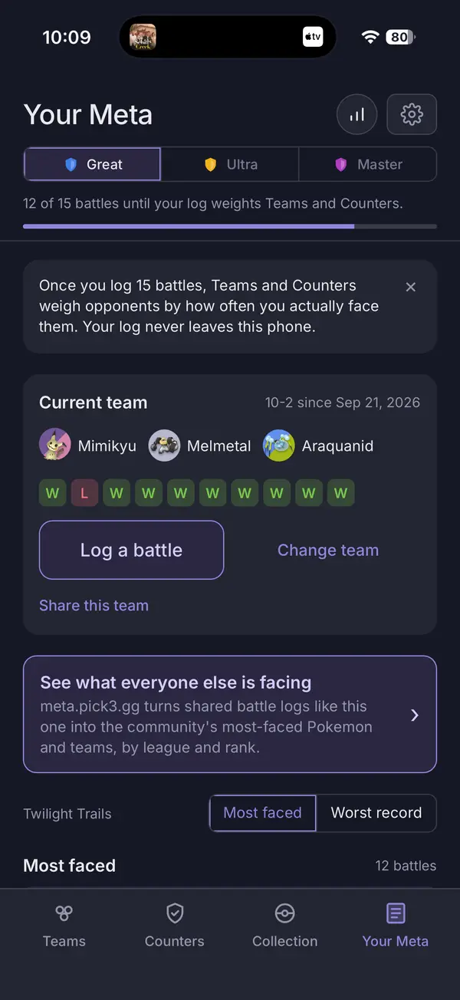
- 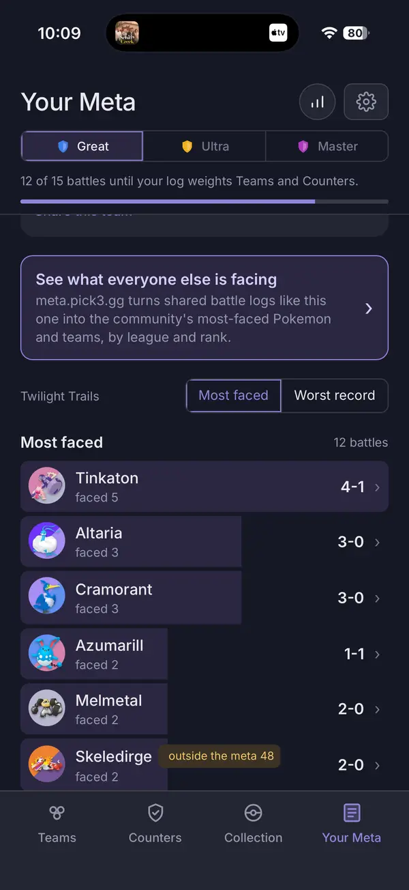
- 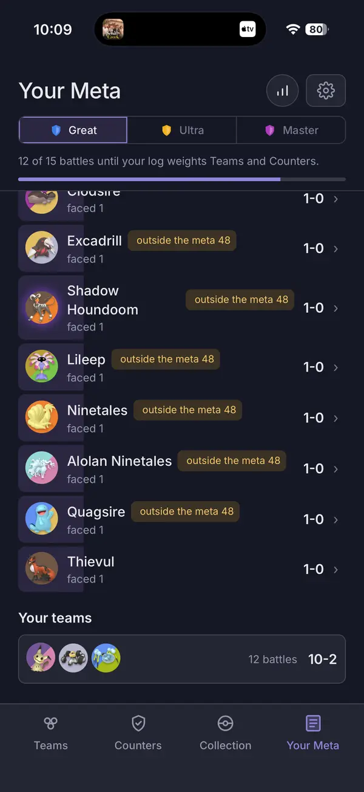

### 3. Purpose

Travis: the launchpad for recording the player's own meta, the first place they see the
results, and how close they are to contributing. In code terms: pick the team you are
running, log battles, see who you face most and your record against each, and track
progress toward 15 battles, when the log starts weighting Teams and Counters.

### 4. How users arrive

- The Your Meta tab.
- Teams: the "Your log" chip.
- Back from Log a Battle, from New Set (and New Set's finish), and from the Counters "Who
  beats X" view.
- Team Analysis "Take to battle" skips this page and opens Log a Battle; back from there
  lands here.

### 5. Available actions

- **League switcher** (compact): each league has its own log.
- **Meta button**: meta.pick3.gg. **Cog**: Settings.
- **Explainer X**: dismisses the 15-battle explainer for good (sticky local setting).
- **Current team card**:
  - Log a battle: opens Log a Battle (`#/meta-log`).
  - Change team: opens New Set (`#/meta-new`) to pick another three.
  - Share this team: species-only link (no moves here, unlike Analysis), share sheet or copy.
- **No team card** (when none is running): Pick your team, which opens New Set.
- **See what everyone else is facing**: link out to meta.pick3.gg.
- **Most faced / Worst record**: sorts the species list (sticky).
- **Species row**: opens Counters as "Who beats X" for that opponent.
- **Your teams row**: loads that team into Build.
- **Earlier seasons**: expands earlier season buckets, each with its own lists.
- **Start fresh** (only when the season list looks stale): a confirm, then battles before now
  move to Earlier seasons; nothing is deleted.

### 6. What must remain

- Per-league logs. The season is the bucket (Twilight Trails), and earlier seasons are kept
  apart, never deleted.
- The 15-battle threshold and progress, and the three header states: counting up, "Weighting
  Teams and Counters by N battles," and "switched off in Settings."
- The current team with its record since it started and the last 10 results (W, L, T for
  tanked; tanked battles don't count).
- Most faced with faced count and record, and the flag for species outside PvPoke's meta
  group, which is what the log adds that PvPoke can't.
- Rows lead to counters for that opponent.
- A way in to the community meta.
- Privacy rules: the collection never leaves the phone; battle records are shared
  anonymously unless switched off (see the finding below).

### 7. What you like

- The progress bar toward 15 in the header: clear goal, always visible.
- The current team card is a tight summary: team, record, result strip, then the main
  action.
- The W/L chip strip reads at a glance.
- Faced rows with a share bar behind them: frequency is visible without a chart.
- "Outside the meta" shows why logging matters.
- Season buckets keep old metas from muddying the current one.

### 8. What you dislike

- **The share bars look like broken, clipped cards.** The bar is the row background, so
  shorter bars read as cards cut off on the right, and the name and record float over two
  backgrounds.
- **"outside the meta 48" is loud and repeated** on most rows in amber, and the 48 is
  unexplained. One legend or a quieter mark would do.
- **The section title says "Most faced" when sorted by Worst record.** The heading doesn't
  follow the sort (a small bug).
- **Three button styles in one card:** Log a battle (bordered), Change team (text), Share
  this team (link).
- **Contributing isn't shown.** Travis calls this page "how close we are to contributing,"
  but the only progress here is toward weighting your own Teams and Counters. Nothing says
  whether your battles are being shared to the community meta, or how many have been.
- **The explainer says "Your log never leaves this phone."** Sharing is on by default and
  sends anonymous battle records to meta.pick3.gg. The full log does stay on the phone, but
  a player reading this would think nothing is sent. This needs a copy fix, and it's a trust
  issue.
- **Stale copy:** "by league and rank" (the rank band was retired on meta for Source), and
  "Pokemon" spelling.
- Rows go to Counters, which only the chevron hints at.
- The season label ("Twilight Trails") is small grey text beside the sort control; it's
  easy to miss that the list is season-scoped.
- The same header button mismatch as pages 1 and 3 (circle meta button, square cog).

### 9. Important states

- **Log off in Settings:** header says so, no bar.
- **Under 15:** "N of 15" plus bar. **15 or more:** "Weighting Teams and Counters by N
  battles," no bar.
- **Explainer:** shown until dismissed.
- **No team running:** "No team picked" card. **Team running:** Current team card; no
  battles yet shows "No battles logged yet."
- **Empty lists:** "Nothing logged yet." / "No sets yet."
- **Sort:** Most faced or Worst record.
- **Earlier seasons:** absent, collapsed, or expanded.
- **Stale season list:** warning card with Start fresh.

### 10. Usage frequency

Core during play sessions. A player logging battles comes back here between every battle
or set; others visit occasionally.

### Decisions and findings (page 4)

- Privacy copy conflict: "Your log never leaves this phone" vs sharing on by default. Needs
  a wording fix regardless of redesign.
- Heading does not follow the Worst record sort: a small bug, fix whenever.

---

## Page 5 of 10: Log a Battle

### 1. Page name

Log a Battle (`apps/web/src/screens/LogBattle.tsx`, route `#/meta-log`). In-battle card:
`components/OpponentCard.tsx`.

### 2. Screenshots

- 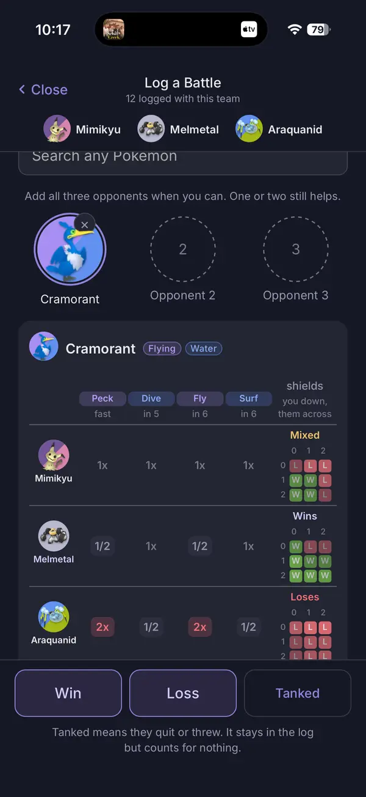

### 3. Purpose

Two jobs on one screen:

1. **In battle:** add the opponent you are facing and see their likely moves, how each move
   lands on each of your three, and a shield grid with a one-word verdict per Pokemon.
   Travis: "This page has single handedly raised my battle win rate"; it makes shield
   decisions easier.
2. **After battle:** record the opponents (up to three) and the result, which feeds Your
   Meta and, past 15 battles, Teams and Counters.

### 4. How users arrive

- Your Meta: "Log a battle" on the Current team card.
- Team Analysis: "Take to battle" (starts the set if needed, then opens this page).
- With no team running, the page redirects to New Set.

How Travis uses it (2026-09-22):

- **Desktop companion:** Your Meta and this page open on a desktop, battling on the phone.
- **From memory:** fills it in on the phone right after the battle. Hard to remember what he
  saw, and sometimes he never sees all three.
- He can't yet battle and fill it in on the same phone at the same time.

### 5. Available actions

- **Close**: back to Your Meta. No cog; no tab bar (a focused flow screen).
- **Team strip** in the header: your three, read-only.
- **Search** ("Search any Pokemon"): empty shows Recent (recent opponents, filled from top
  meta); typing shows Matches, recent first. Capped at 30 ("Keep typing to narrow it down").
- **Tapping a result**: adds it to the next open slot (max 3, no duplicates) and selects it.
  On touch the keyboard drops so the card is in view; on desktop the cursor stays in search
  for the next opponent.
- **Opponent slot**: selects it (switches the card); X removes it.
- **In-battle card**: the opponent's likely moves (fast, then charged with "in N" fast moves
  to reach), type effectiveness per move on each of your three (1/4 to 4x), a 3x3 shield
  grid (your shields down, theirs across) with W or L shaded by margin, and a verdict: Wins,
  Loses, or Mixed. Cached per opponent for the visit.
- **Win / Loss / Tanked** (a fixed bar at the bottom): saves the battle, clears the slots, and
  stays here for the next one. Tanked is kept but counts for nothing.

### 6. What must remain

- The in-battle card and everything in it. It's the most valuable thing in the app for
  playing, by Travis's own results.
- Fast opponent entry: Recent before typing, recent-first matches, one tap to add, keyboard
  handling per device.
- Partial logs: zero to three opponents are all valid ("One or two still helps").
- Save and stay: the next battle is seconds away.
- The result bar reachable without scrolling.
- Desktop works (fine-pointer focus handling is already in the code).

### 7. What you like

- The in-battle card: the best-in-class idea here. Moves with counts, effectiveness, shield
  grid, one-word verdict.
- The shield grid's shading by margin (a coin flip looks paler than a blowout).
- The team strip in the header keeps context while you look at the opponent.
- Save-and-stay flow with the result buttons always reachable.
- Honest note: "PvPoke does not rank it, so its moves are a guess."

### 8. What you dislike

- **Hard to use mid-battle on the same phone** (Travis). Switching apps during a battle is
  the blocker, not the UI alone. Worth designing for the two ways he actually uses it: a
  desktop layout (card large, beside the search) and a fast after-battle entry.
- **Remembering opponents after a battle is hard** (Travis). The page can't help with what
  you never saw, but Recent could lean harder on likely picks: common teammates of the first
  opponent you add, from the community board.
- **Win and Loss look the same:** two identical purple-bordered buttons. The result is the
  one irreversible tap, and there is **no undo, no edit, no delete** for a logged battle in
  the code. A mis-tap stays in the log. The only feedback is the slots clearing and the
  count going up by one.
- **The table is dense on a phone:** move headers, "shields / you down, them across," and
  the 3x3 grid squeeze into one row per Pokemon. "Mixed" means "read the grid," and the grid
  axis labels are small.
- The search scrolls up under the header once the card is open (the screenshot shows it
  half hidden).
- "Search any Pokemon" spelling.
- The Tanked explanation line always shows under the buttons.

### 9. Important states

- **No team running:** redirects to New Set.
- **Empty:** search, the hint line, three dashed opponent slots, no card.
- **Searching:** Recent / Matches, "Nothing matches.", "Keep typing to narrow it down."
- **One to three opponents:** the selected slot is highlighted; the card shows the selected
  one.
- **Card loading:** "Simulating..."
- **Card:** Wins / Loses / Mixed per Pokemon; your IVs vs PvPoke IVs; unranked opponent
  note.
- **Saving:** buttons disabled.
- **After save:** cleared, count goes up.

### 10. Usage frequency

Core during play: once per battle for players who log, and during the battle for
companion-screen players. The highest-value screen for playing well.

### Decisions and findings (page 5)

- Two usage modes to design for: a desktop companion (large screen, beside the game) and
  quick after-battle entry on the phone.
- No undo, edit or delete for a logged battle. Worth a fix regardless of redesign.
- Open question: logs live in each device's IndexedDB, so a desktop log and a phone log are
  separate logs and don't sync.
- Travis logs on both desktop and phone, never the same battle twice. For the community
  meta that's fine, since the records are aggregated. Two side effects to keep in mind (not
  asks): each device's Your Meta shows only its own share of battles (record, most faced,
  progress to 15, and the Teams and Counters weighting), and the meta site's device count
  sees one player as two devices.

---

## Page 6 of 10: Who Beats X (Counters, one opponent)

### 1. Page name

Who Beats <Pokemon> (`apps/web/src/screens/Counters.tsx` with `vs` set; route
`#/counters?vs=<id>` plus an optional `&l=<league>`). The same screen without `vs` is the
Counters tab (whole meta).

### 2. Screenshots

- 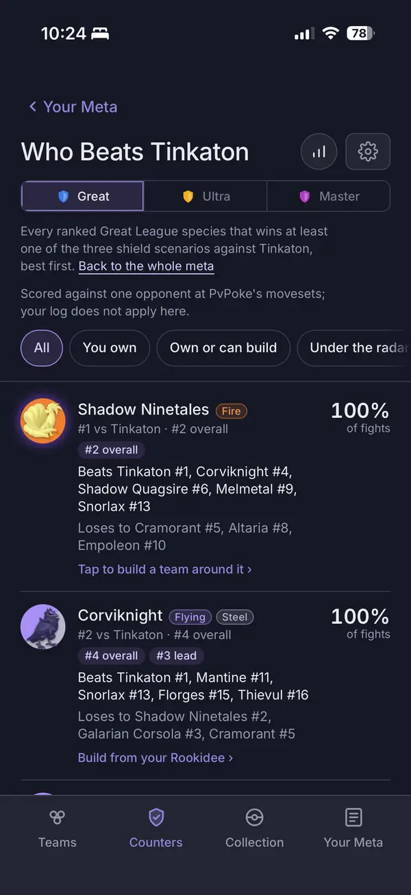

### 3. Purpose

Show how to beat one opponent you keep meeting: every ranked species that wins at least one
of the three shield scenarios against it, best first, marked by whether you own it or can
build it. From there, build a team around a counter.

### 4. How users arrive

- Your Meta: tapping a Most faced row.
- meta.pick3.gg: `countersLink` on the Species page opens this with the league set, and the
  app switches league to match.
- A deep link. The Counters tab without `vs` shows the whole-meta version.

### 5. Available actions

- **"< Your Meta"**: back to Your Meta, always (even when you came from meta.pick3.gg).
- **"Back to the whole meta"** (inline link in the description): drops `vs` and shows the
  whole-meta Counters.
- **League switcher**, **meta button**, **cog**.
- **Chips** (sideways scroll): All, You own, Own or can build (both only with a collection),
  Under the radar (re-sorts by the gap between strength and rank). Not remembered between
  visits.
- **Row**, which goes different places depending on ownership:
  - You own one > opens the Specimen page for your Pokemon.
  - Build from your X > opens the Specimen page for your pre-evolution (the screenshot's
    "Build from your Rookidee").
  - Not owned: "Tap to build a team around it" puts it in Build's Lead slot.
- **Import your collection** link (no collection only).

### 6. What must remain

- A counter list for any single opponent, simulated on device (the top 300 when the species
  needs it).
- Per row: rank vs this opponent, overall rank, types, meta tags, who else it beats and loses
  to (with ranks), ownership, and the percentage.
- Ownership filters, and the path from a counter to your specimen or to Build.
- Honesty lines: "Scored against one opponent at PvPoke's movesets; your log does not apply
  here," and the unranked-species empty state.
- Links from meta.pick3.gg land here in the right league.

### 7. What you like

- A direct answer to "I keep losing to X."
- Beats and Loses lines with ranks: each counter's wider value is visible, not just this one
  matchup.
- Ownership is shown in the row's call to action ("Build from your Rookidee").
- The honesty line about what the score covers.

### 8. What you dislike

- **Rank shown twice:** "#1 vs Tinkaton · #2 overall" and then a "#2 overall" pill right
  under it.
- **"100% of fights" isn't clear,** and it doesn't separate the top rows. "Fights" means the
  three shield scenarios, which the page never says next to the number.
- **The same-looking row goes three different places:** your specimen, your pre-evolution's
  specimen, or Build. "Build from your Rookidee" opens the Rookidee's page, not Build.
- **Two backs:** "< Your Meta" at the top and "Back to the whole meta" inside the
  description.
- **The tab bar jumps to Counters** though you came from Your Meta. Where you are and how you
  got there disagree.
- **Two paragraphs of description** before any result; the league switcher and chips push
  the first counter well down.
- **Sideways chip row again** ("Under the radar" cut off), and Under the radar is explained
  only on the whole-meta version.
- **A third header style:** back link above a big title. Page 1 has a big title with no back,
  and Build/Analysis have a back link with a centered title.
- Filters reset on every visit.

### 9. Important states

- **Loading:** progress bar ("Scoring every species against the meta," or "Simulating the top
  300 species against it on this phone").
- **Populated:** rows best first; Under the radar re-sorts them.
- **No collection:** the ownership chips are hidden, and an Import link shows.
- **Empty:** "Nothing here yet. Try another filter." or, for an unranked opponent, "PvPoke
  does not rank X in <league>, so pick3 has no moveset to simulate it with."
- **Arriving with a league in the link:** league switches before scoring.
- **Whole-meta mode** (no `vs`): a different title, the "vs N meta Pokemon" count, a
  different description, and "of meta" percentages.

### 10. Usage frequency

Occasional, triggered by a pattern: after a run of losses to the same opponent, or from a
community-meta species page.

### Decisions and findings (page 6)

- Same screen as the Counters tab, which is inventoried as page 7.

---

## Page 7 of 10: Counters (whole meta)

### 1. Page name

Counters (`apps/web/src/screens/Counters.tsx` without `vs`; route `#/counters`). Same screen
and code as page 6; only the differences and additions are listed here.

### 2. Screenshots

- 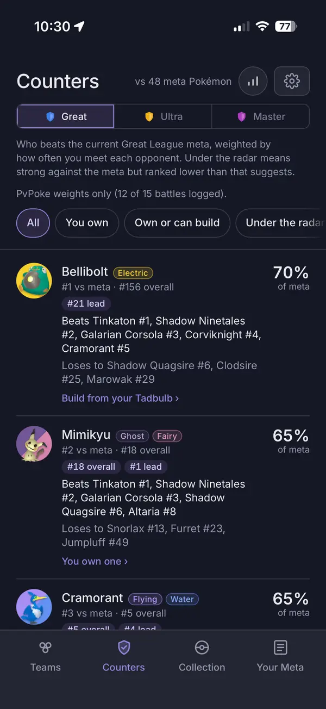

### 3. Purpose

Find the species that beat the current meta as a whole, weighted by how often you meet each
opponent (your log, once it counts), and flag which ones you own or can build. Under the
radar surfaces strong picks that PvPoke ranks low.

### 4. How users arrive

- The Counters tab.
- Who Beats X: "Back to the whole meta."
- A deep link to `#/counters`.

### 5. Available actions

The same as page 6, minus the back links. Different here:

- The header shows "vs 48 meta Pokemon."
- The weighting line reads "PvPoke weights only (12 of 15 battles logged)" until the log
  counts, then names your log.
- **Tapping a counter you own or can build opens its Specimen page, whose back link always
  says "< Collection" and goes to Collection** (`Specimen.tsx` hard-codes it). The tab bar
  also switches to Collection. Travis: "once you click into a counter its back is to
  collection." The same happens from Who Beats X.

### 6. What must remain

Everything on page 6, plus the facing weight line, since it's the one place the Your Meta
log's effect on results is stated.

### 7. What you like

- Bellibolt at #1 vs meta but #156 overall is exactly the insight this page exists for.
- The ownership call to action ("Build from your Tadbulb >", "You own one >").

### 8. What you dislike

- **Back from a counter's detail lands in Collection,** not Counters. You lose your place and
  the tab changes under you. The same pattern shows up on pages 3 and 6: back links are
  hard-coded destinations, not real back.
- **The two modes look like two versions of a page** (Travis: "Almost seems like we have two
  different versions of this"). They share code but differ in title placement, description,
  percent label ("of meta" vs "of fights") and back links.
- **The rank repeats when the species is ranked:** "#18 overall" in the line and as a pill
  (Mimikyu). Bellibolt shows just the lead pill, so rows are uneven.
- **The description takes three lines,** the weighting line a fourth, and the sideways pills
  come before the first result.
- The same sideways pill row as Teams and Who Beats X.

### 9. Important states

Page 6's states apply. Weighting: PvPoke only (under 15, or log off) vs your log.

### 10. Usage frequency

Occasional: when planning a new team or looking for an off-meta pick.

### Decisions and findings (page 7)

- Counters and Who Beats X should read as one screen in two modes: the same header, the same
  row, and a clear "vs whole meta / vs one Pokemon" switch.
- Back navigation is hard-coded per screen (Specimen goes to Collection, Analysis to Build,
  Who Beats to Your Meta). The design system needs a rule for back: return where you came
  from, and use a separate, labeled control for "go edit" style jumps.

---

## Page 8 of 10: Collection (and Pokemon detail)

### 1. Page name

Collection (`apps/web/src/screens/Collection.tsx`, route `#/collection`) and the Pokemon
detail it opens (`screens/Specimen.tsx`, route `#/collection/<id>`).

### 2. Screenshots

- 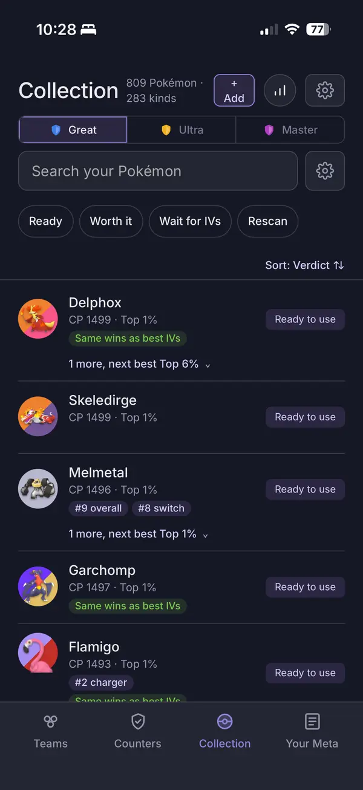
- 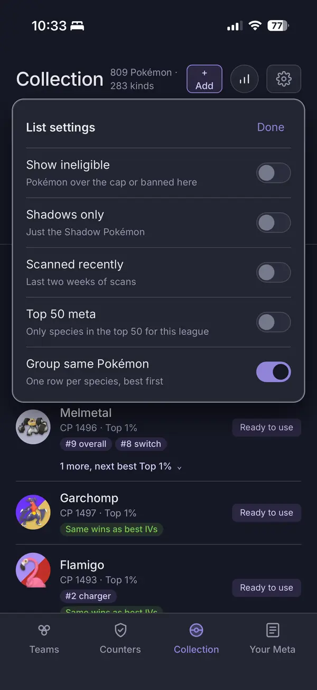
- 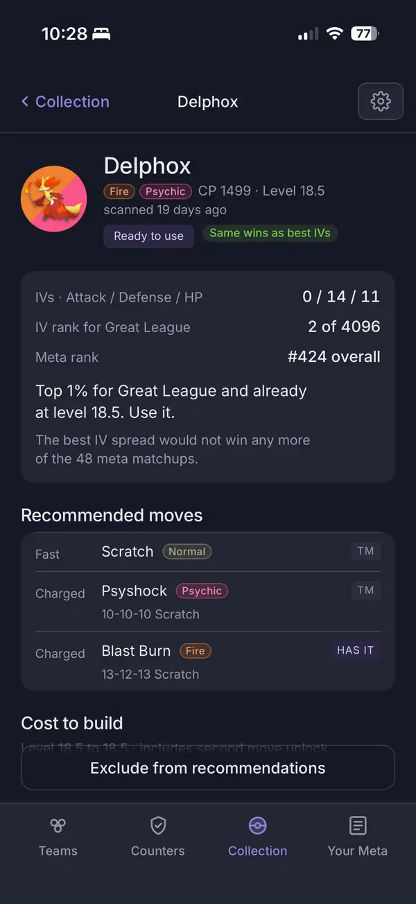

### 3. Purpose

See every Pokemon you imported, judged for the league in play: which are ready to use, which
are worth building, which should wait for better IVs, and which need a rescan. Open one for
its full verdict, moves and cost, and the recommended teams it's in.

### 4. How users arrive

- The Collection tab. The tab stays lit on the detail page and on Add Pokemon.
- Back from Add Pokemon and from Import (when a collection exists).
- Back from any Pokemon detail page, whatever opened it (Counters, Who Beats X, a
  collection row).
- Pokemon detail is also reached from Counters and Who Beats X rows ("You own one >",
  "Build from your X >").

### 5. Available actions

**Collection**

- **+ Add**: opens Add Pokemon (manual entry).
- **Meta button**, **cog** (app Settings), **league switcher** (verdicts are per league).
- **Search** (sticky bar, clear X): in-game search grammar over names, types and moves.
- **List settings** (a second cog, beside the search): a popover with toggles for Show
  ineligible, Shadows only, Scanned recently (two weeks), Top 50 meta, and Group same Pokemon
  (on by default). The cog shows as active when any are on; "N filters on" under it reopens
  the popover.
- **Verdict pills**: Ready, Worth it, Wait for IVs, Rescan. Multi-select; none means all.
  Short labels on purpose so all four fit without scrolling.
- **Sort** (tap to cycle): Verdict > IV rank > Meta rank > Name.
- **Row**: opens Pokemon detail.
- **"N more, next best Top X%"**: expands the other copies of that species (CP, rank, level,
  Lucky); each opens its own detail.
- Everything is remembered: search, pills, toggles, sort, open groups, scroll position.

**Pokemon detail**

- **"< Collection"**: always goes to Collection (see page 7).
- **Cog**: Settings.
- **Recommended teams row**: opens that team's analysis.
- **Exclude from recommendations** (fixed at the bottom): toggles; the label flips to
  "Include in recommendations again."
- **Remove from collection**: only for Pokemon added by hand, with a confirm.

### 6. What must remain

- Verdicts per league: Ready to use, Worth building, Wait for better IVs, Needs rescan, Not
  eligible (hidden unless asked).
- Per row: sprite, name, Shadow and Banned flags, CP, IV rank, meta rank tags, the "Same wins
  as best IVs" tag, verdict chip.
- Grouping by species with best first and the next-best preview.
- Search grammar, filters and sort, all remembered.
- Detail: IVs, IV rank "N of 4096", meta rank (when evolved), the verdict sentence and the
  best-IVs line, best evolution stage, recommended moves (TM / Elite TM / Has it), cost to
  build, teams it's in, exclude, and remove for manual entries.

### 7. What you like

- **The List settings popover already does what Teams needs:** secondary filters behind
  one control, an "N filters on" hint, and short visible pills for the main split. It's the
  best candidate pattern for the Teams filter move.
- The four verdict pills fit without scrolling (a deliberate choice in the code).
- "Same wins as best IVs" is a sharp, useful signal.
- Grouping with "1 more, next best Top 6%" keeps an 800-Pokemon list scannable.
- Remembered state and scroll position.
- The detail page's verdict sentence: "Top 1% for Great League and already at level 18.5.
  Use it."

### 8. What you dislike

- **Two filter controls stacked** (Travis): the header cog (app Settings) sits directly above
  the list-settings cog (list filters). They use the same icon for two different things, one
  above the other.
- **A crowded header:** title, a two-line "809 Pokemon · 283 kinds", a "+ Add" button that
  wraps to two lines and uses a third button style, then the meta button and cog.
- **Three filter layers before the list:** the list-settings popover, the verdict pills,
  and the sort cycler, plus the "N filters on" hint.
- **Sort is a cycle control again** (like Team style on Teams), with no way to see the
  options.
- **Detail: the fixed Exclude button covers content.** The Cost to build line shows through
  behind it.
- **Detail: "Ready to use" and "Use it" next to "#424 overall."** The verdict is about IVs and
  level, not whether the species is good in the meta. The words suggest both.
- **Detail: "Level 18.5 to 18.5"** reads oddly when nothing needs powering up.
- **Detail: the name appears twice** (header title and big name).
- **Detail: back is always Collection,** even when you came from Counters (page 7).
- Every verdict chip is the same purple, so the verdict colors don't help scanning in a
  mostly "Ready" list.

### 9. Important states

- **No collection:** `NoCollection` choice cards.
- **Judging:** progress bar; rows show "..." and "Ranking..."; error: "Could not judge this
  collection," and the list still works.
- **Empty after filters:** "Nothing matches. Try another name or clear a filter."
- **Grouped vs flat;** group expanded ("Hide the others").
- **Row variants:** Shadow, Banned (dimmed), IVs unknown, Over the CP cap, Lucky.
- **Popover** open or closed; the cog is active when filters are on.
- **Detail:** not found; judging; evolves ("Best stage for Great League: Evolve to X");
  excluded; manual entry (Remove); no teams ("Not in any recommended team right now").

### 10. Usage frequency

Occasional to regular: after each import, and when deciding what to power up. The detail
page is visited from here and from Counters.

### Decisions and findings (page 8)

- The Collection List settings popover is the lead pattern for the Teams filter move (page
  1): short visible pills for the main choice, everything else behind one control with a
  count.
- The design system needs one icon for app Settings and a different one for list filters
  (for example, a filter or sliders icon), never two cogs.
- "Ready to use" wording vs meta strength: decide whether the verdict should mention meta
  rank, or be renamed so it doesn't read as "good in the meta."

---

## Page 9 of 10: Settings sheet

### 1. Page name

Settings (`apps/web/src/screens/Sheet.tsx`), a bottom sheet over whatever screen is open.
Not a route.

### 2. Screenshots

- 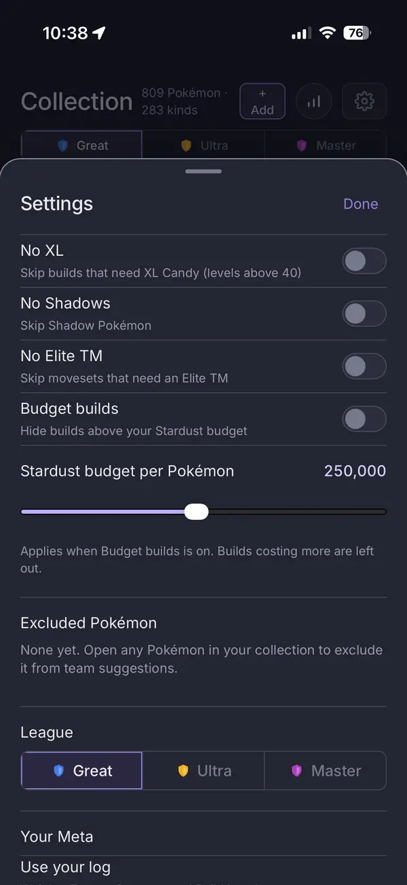
- 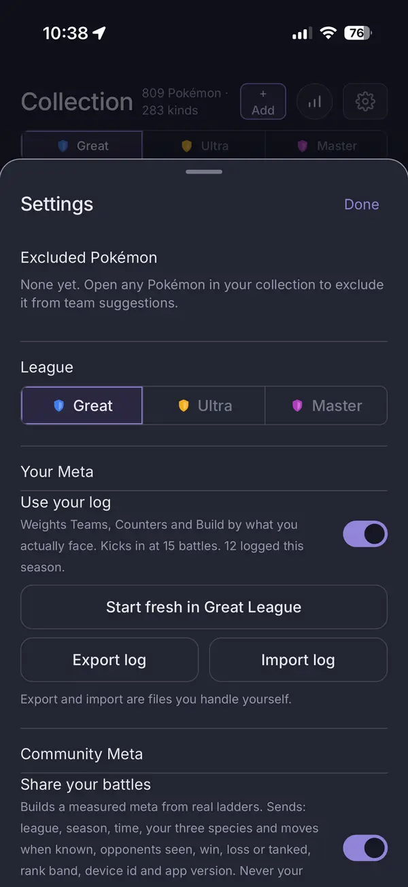
- 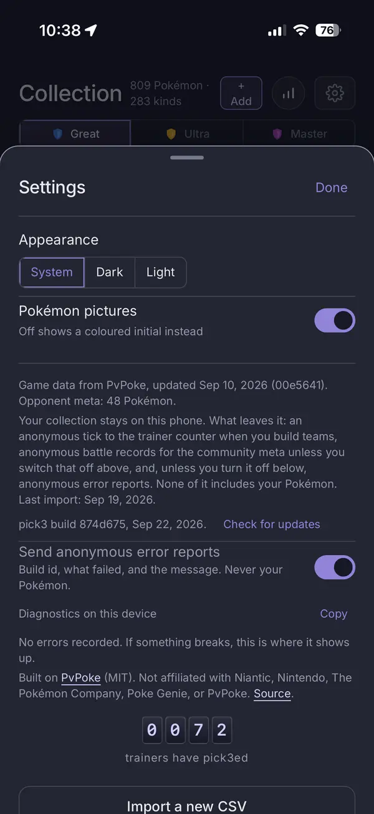

### 3. Purpose

Everything that isn't a screen: team filters, exclusions, league, the Your Meta log (use,
start fresh, export and import), community sharing and rank band, appearance, privacy and
data facts, updates, diagnostics, credits, re-import, and forget.

### 4. How users arrive

- The cog on every tab screen and most sub-screens (`HeadCog` / `Header`). The same sheet
  opens everywhere, whatever the context.
- Teams: the "Exclude Pokemon" chip opens it.
- Opening it clears the tab bar highlight.

### 5. Available actions

In order, top to bottom:

1. **Team filters**: No XL, No Shadows, No Elite TM, Budget builds (the same four as the Teams
   chips; either place changes both). **Stardust budget per Pokemon** slider, which only
   applies when Budget builds is on.
2. **Excluded Pokemon**: chips with X to include again. Adding happens only on a Pokemon's
   detail page.
3. **League**: the same switcher as on the screens.
4. **Your Meta**: Use your log (toggle, with the count this season); Start fresh in <league>
   (confirm); Export log (file download); Import log (file picker, with a result note).
5. **Community Meta**: Share your battles (toggle; off also deletes what this phone sent);
   **rank band** (Not set plus the bands); Open meta.pick3.gg.
6. **Appearance**: System, Dark, Light; Pokemon pictures toggle.
7. **About**: PvPoke data date and commit, meta size, the privacy statement, last import,
   build id and **Check for updates**, **Send anonymous error reports** toggle, **Diagnostics**
   (Copy), credits and Source link, the trainer counter.
8. **Import a new CSV** (goes to Import). **Forget my collection and log** (confirm; wipes
   the collection, log and settings on this device).
- **Done** or tapping the overlay closes it.

### 6. What must remain

- Every setting and fact listed above; the privacy statement and the sharing toggle are
  product rules.
- Sharing off deletes what this phone sent.
- Export and import of the log as files the player handles.
- Start fresh never deletes.
- The trainer counter (a small bit of community delight).
- Coming (separate session): the Teams filter chips move here behind a "Filters: N" chip.
  Page 8's List settings popover is a competing pattern to consider.

### 7. What you like

- **The privacy statement is accurate and plain:** "Your collection stays on this phone. What
  leaves it..." It's the right source for fixing the Your Meta explainer (page 4).
- Every toggle has a one-line description of what it does.
- "Share your battles" lists exactly what is sent and never sent.
- The trainer counter odometer.

### 8. What you dislike

- **One long drawer for everything.** About nine topics (filters, exclusions, league, log,
  community, appearance, about, diagnostics, data management) in one scroll with no grouping
  beyond thin dividers. Section titles ("Your Meta," "League") look the same as the rows
  under them.
- **The same sheet in every context:** team filters sit at the top even when it's opened
  from Collection or Log a Battle.
- **Things are controlled in two places:** team filters are in the Teams chips and here, and
  the league is on every screen and here.
- **The budget slider** is always active and only says in the fine print that it needs
  Budget builds on.
- **Excluded Pokemon can only be removed here** and only added on a detail page; neither
  place points to the other beyond the empty-state hint.
- **The rank band is still collected** ("for the meta by ladder level"), but the meta site
  retired the rank band filter for Source (page 1). Is it still needed? (See question.)
- **Import a new CSV is buried** at the very bottom, below credits. Re-import is a common
  action for regular users.
- The error reports toggle uses a bigger, different layout from the other toggles.
- Dense grey fine print in the About block.
- "coloured" (British) vs "colored" elsewhere.

### 9. Important states

- Filters on or off; budget value.
- Excluded: none ("None yet...") or chips.
- Log toggle on or off; log import result note.
- Sharing on or off; band Not set or chosen.
- Theme System, Dark or Light; pictures on or off.
- Update check result; error reports on or off; diagnostics empty ("No errors recorded") or
  listed.
- No collection: "Import a CSV," no Forget button.
- Confirm dialogs: Start fresh, Forget.

### 10. Usage frequency

Settings page: occasional. The filter toggles are the exception, used whenever team
recommendations need narrowing.

### Decisions and findings (page 9)

- Candidate structure for the design pass: split into groups (Team filters, Your data,
  Community, Appearance, About), and put screen-specific filters in their screen's own
  control (as Collection does) rather than at the top of the global sheet.
- Open question: is the rank band still needed now that meta.pick3.gg uses Source?
- Travis (2026-09-22): "a lot of redundancy in here and a ton of text walls." Specifics from
  the code:
  - **Redundant:** the team filters (also Teams chips), the league (also on every screen),
    Start fresh (also on Your Meta when the season list is stale), Open meta.pick3.gg (also the
    meta button on every screen and the Your Meta card), and the privacy facts, which are
    described three times: the Share toggle's description, the About paragraph, and the error
    reports description.
  - **Text walls:** the Share your battles description (about 50 words), the About privacy
    paragraph (about 60), the data line, credits, the diagnostics empty state, the export note,
    and the budget note. Most could be a short line plus "What's sent?" on tap.

---

## Page 10 of 10: meta.pick3.gg Teams

### 1. Page name

Teams on meta.pick3.gg (`apps/meta/src/screens/Teams.tsx`; header, league switcher and
selects in `apps/meta/src/App.tsx`). The other tabs are Pokemon and About, plus a Species
drill-in.

### 2. Screenshots

- 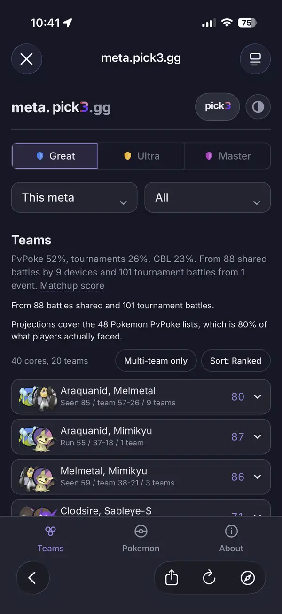 (inside the in-app browser, opened from pick3)
- 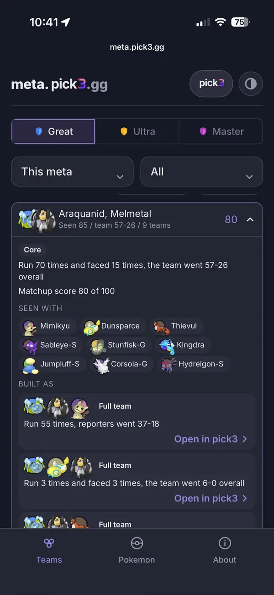

### 3. Purpose

Show the community's teams for a league: cores (pairs) and complete teams, ranked by a
blend of PvPoke's curated meta, tournament pick share and shared ladder battles, with a
matchup score worked out on device. From any team, open it in pick3.

### 4. How users arrive

- pick3: the meta button on every screen, the "See what everyone else is facing" card on
  Your Meta, and "Open meta.pick3.gg" in Settings.
- Directly (a separate site, same visual family).
- pick3's Suggest teammates reads the same board in the background (not this page).

### 5. Available actions

- **pick3 pill**: goes back to the app. **Theme button** (half circle): cycles the theme.
- **League switcher** (shared `@pickthree/ui`).
- **Window select** ("This meta," 30 days, 7 days) and **Source select** (All, PvPoke prior,
  Ladder, Tournament). Both have hidden labels and write to the URL.
- **Matchup score** (dotted term): tap for the explainer.
- **Multi-team only** (shown only when a core appears in two or more teams) and **Sort:
  Ranked** (tap to cycle).
- **Row**: expands to show the Core or Team tag, a record sentence, the matchup score, "Seen
  with" chips (the likely thirds), and "Built as": complete teams with their record and
  **Open in pick3 >**, which opens the team in the app's shared-team flow.
- Tab bar: Teams, Pokemon, About.

### 6. What must remain

- The blend rules (CLAUDE.md): PvPoke, tournaments and ladder on a stated, visible weight;
  never present a projection as measured; never hide measured numbers for being small.
- The per-row record and the source it came from; projected rows labeled "Projected."
- Window and Source controls and URL state.
- Projection coverage honesty ("covers 80% of what players actually faced") when it's under
  95%.
- The PvPoke commit mismatch warning.
- Open in pick3.

### 7. What you like

- The collapsed row is compact: overlapping sprites, the pair's names, one stats line, the
  score, a chevron.
- The expanded row answers "what goes with this?" (Seen with) and "how was it actually
  built?" (Built as), and links straight into pick3.
- The shared league switcher and tab bar style already tie the two sites together.
- Two selects side by side are cleaner than a pill row, and they're the model Teams in pick3
  is adopting.

### 8. What you dislike

- **The word wall between the dropdowns and the first team** (Travis: "No one is looking for
  all that text"). Up to four blocks before the first row: the source split sentence (with
  battle and device counts), the Matchup score term, a second sentence repeating the battle
  counts ("From 88 battles shared and 101 tournament battles"), and the projection coverage
  line.
- **The counts are said twice** back to back (the first two blocks).
- **The dropdowns have no labels:** "This meta" and "All" don't say Window and Source.
- **The row stats line is hard to read:** "Seen 85 / team 57-26 / 9 teams" vs "Run 55 / 37-18
  / 1 team." The slashes, "Seen" vs "Run," and "team" doing two jobs make it cryptic. The
  expanded sentence ("Run 70 times and faced 15 times, the team went 57-26 overall") is
  clearer.
- **It doesn't feel like pick3** (Travis: it needs a cohesive feel even though it's the other
  half). Specifics:
  - A wordmark header ("meta.pick3.gg") that pick3 itself doesn't have.
  - The cross-links look different: pick3's meta button is a bar-chart circle, meta's link
    back is a "pick3" text pill.
  - The theme toggle sits in the header here but in Settings in pick3.
  - Tabs: Teams, Pokemon, About vs pick3's Teams, Counters, Collection, Your Meta. There are
    two different "Teams" tabs meaning different things.
  - Team rows are different components: meta's collapsible list rows vs pick3's big team
    cards.
  - The score is a bare purple number here, a "Strong fit" tag in pick3.
- "Pokemon" (ASCII) everywhere on meta; the decision is "Pokémon" (page 1).
- Sort is a cycle control again.

### 9. Important states

- **Loading** ("Loading"), **error** ("Could not load the shared teams").
- **Empty:** no teams in the window, with a "Help fill this in" card (the device count, "Log
  battles in pick3").
- **Projectionless:** rows ordered by record.
- **Commit mismatch** warning.
- **Source = All** adds the source split line; other sources don't.
- **Row** collapsed or expanded; Core vs complete Team; Projected rows.
- **Multi-team only** hidden when it would do nothing.

### 10. Usage frequency

Occasional to regular, for players who follow the meta: checking what people run, and
before a season or event. It's also the page that shows sharing's payoff.

### Decisions and findings (page 10)

- The text between the controls and the first row collapses to at most one short line, with
  the source split and counts behind a tap (the same rule as page 9).
- The two sites share one design system: the same header pattern, the same cross-link
  treatment both ways, the same team or core row family, and the same labeled selects.
  Different jobs, one family.
- "Help fill this in" (the device count) is the meta side's answer to "contributing"
  (page 4). pick3 has nothing matching it.

---

## Page 11 (extra): meta.pick3.gg Pokemon and Species

### 1. Page name

Pokemon ("What you face," `apps/meta/src/screens/Pokemon.tsx`) and the Species drill-in
(`apps/meta/src/screens/Species.tsx`).

### 2. Screenshots

- 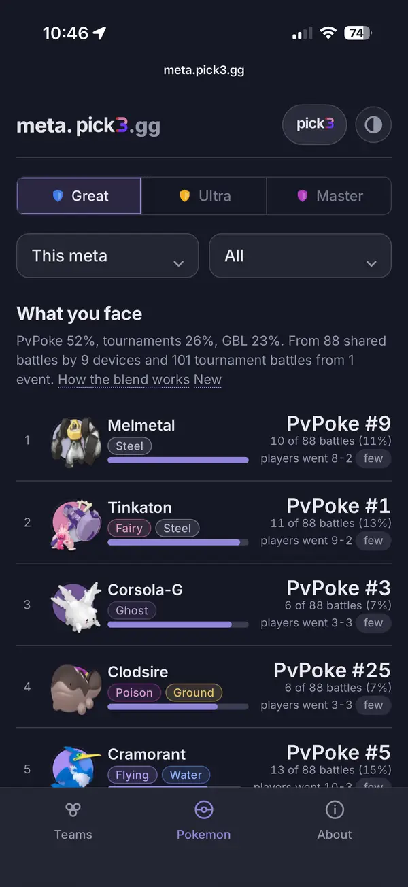
- 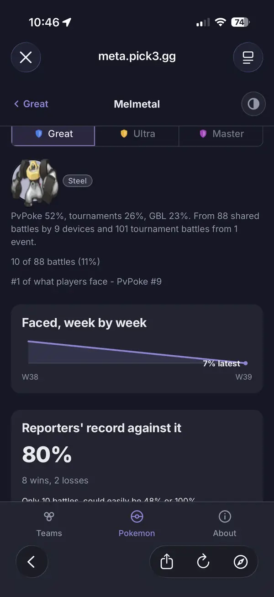
- 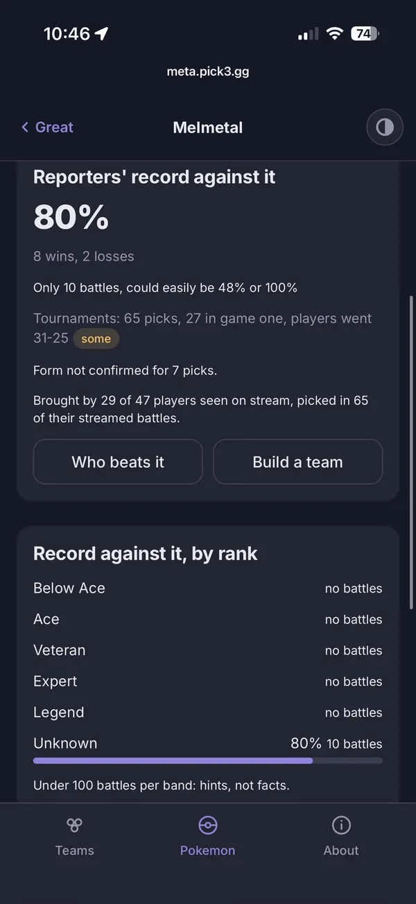
- 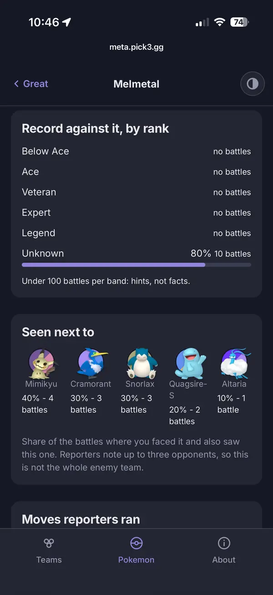
- 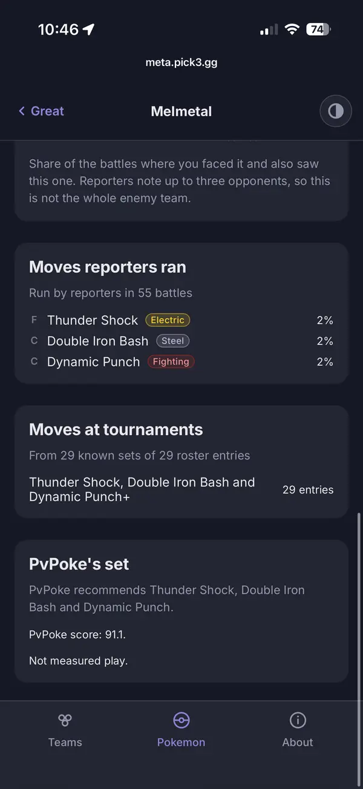

### 3. Purpose

**Pokemon:** which species players actually face in a league, ranked by the blended
weight, with PvPoke's rank beside it and the players' record against each.
**Species:** everything known about one opponent: share and rank, weekly trend, the record
against it (ladder and tournaments), record by rank band, what it's seen next to, the moves
people run, the moves at tournaments, and PvPoke's set. Links into pick3 for counters and
team building.

### 4. How users arrive

- The Pokemon tab. Species comes from a list row or a "Seen next to" sprite.
- From pick3, only through the meta site's own entry points (see page 10).

### 5. Available actions

- **Pokemon:** the same header, league, Window and Source as Teams; "How the blend works" and
  "New" terms (tap to explain); a row opens Species.
- **Species:** "< Great" back to the list; theme; league switcher; **Who beats it** (opens
  pick3 Who Beats X in this league, page 6); **Build a team** (opens pick3 Build, but **the
  link carries no species**, so Build opens empty or with whatever was there before);
  "Seen next to" sprites open their Species page.

### 6. What must remain

- The blend rules and honesty lines: "Only 10 battles, could easily be 48% or 100%," the
  confidence tags ("few," "some"), "Under 100 battles per band: hints, not facts," "Not
  measured play."
- Measured share next to PvPoke's rank, never replacing it silently.
- Tournament rows separate from ladder, with the banned state (recent commits).
- Week-by-week trend, seen-next-to, moves run, PvPoke's set.
- Links into pick3 counters (with league).

### 7. What you like

- "Seen next to" is exactly what Log a Battle users need when they couldn't see all three
  (page 5).
- Honest uncertainty in plain words ("could easily be 48% or 100%").
- A clean card per question on Species, each with a plain-language title ("Reporters' record
  against it," "Seen next to," "Moves reporters ran").
- The share bar under each list row.

### 8. What you dislike

- **The biggest number on each list row is PvPoke's rank** ("PvPoke #9"), not what players
  face. The measured share is small grey text. The list is ordered by the blend, so the
  emphasis fights the order (Melmetal is 1st but shows "#9").
- **The same blend sentence and word wall as page 10,** repeated on Species above the chart.
- **Record against it, by rank:** five rows of "no battles" and one "Unknown." This is the
  retired rank band still showing on meta (see page 9's rank band question).
- **"Moves reporters ran" shows 2% for each move out of 55 battles.** It looks wrong for a
  set run in every battle. Needs a check.
- **Build a team doesn't carry the species** into pick3.
- **Species top is thin:** a lonely sprite and a type chip under a header that holds the
  name, then the blend paragraph.
- **Three naming styles across the product:** "Quagsire-S" / "Corsola-G" on meta, "S.
  Quagsire" / "G. Corsola" in pick3's grids, "Shadow Quagsire" / "Galarian Corsola" in pick3
  prose. "Quagsire-S" also wraps badly.
- "Dynamic Punch+" (an unexplained plus); "Form not confirmed for 7 picks" is unclear.
- The weekly chart with two points and an overlapping "7% latest" label.

### 9. Important states

- Loading, error, empty (the "Help fill this in" contribute card).
- Confidence tags per row: few, some, (none).
- Species: no reporters ("Nobody who shares battles has run it in this window"), tournament
  source, banned ("Banned" only), form not confirmed, and a PvPoke commit mismatch.
- Source select changes which cards and numbers appear.

### 10. Usage frequency

Occasional; the Species page is the deep-dive before or after meeting something often.

### Decisions and findings (page 11)

- Build a team should carry the species into pick3 (a small fix).
- The moves percent needs a check.
- One naming style for forms across both sites.

---

## Architecture question raised during the inventory (Travis, 2026-09-22)

> "The more and more I work with this split app I'm struggling with it being two different
> things. Meta seems just like part of what we offer. I could see this collapsing into the my
> meta section and just being called meta. Then the visuals we see in the individual pokemon
> move over to the collection side. Not sure because it's definitely two things where
> collection is what you have where meta is more like the Pokedex and what you could have but
> may not."

Recorded as an open question for the synthesis and design phase, not decided. Inputs from
the inventory:

- **The product already has two lenses.** "Mine" (Collection, Your Meta log, your teams) and
  "Everyone's" (community meta, Counters, Who Beats X, species facts). Travis's framing,
  Collection = what you have and Meta = the Pokedex of what you could have, maps onto those
  lenses.
- **Overlaps today:** Your Meta's Most faced vs meta's What you face; pick3 Who Beats X vs
  meta Species "Who beats it"; pick3 Pokemon detail vs meta Species (both are a page about one
  species, from different sides); Your Meta's "See what everyone else is facing" and the meta
  button are the only bridges.
- **Constraints to weigh:** meta.pick3.gg is a public, shareable site that works without the
  app (links, search, people who never import); the collection must never leave the phone,
  and the CSP `connect-src` stays tight (the app already reads the board and could read more);
  the two deploy separately (GitHub Pages vs the counter worker).
- **A middle path to consider:** one app shell and one design system, with the meta content
  as a "Meta" section inside pick3 (Your Meta and community meta side by side), while
  meta.pick3.gg stays as the public, read-only face of the same screens.

This becomes a brainstorming decision (superpowers:brainstorming) before any redesign that
depends on it, especially navigation and the tab bar.
